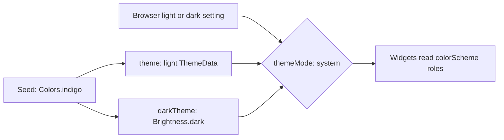

## Bạn cần biết trước

- [[frontend.l2.theme-and-color-scheme]] — bạn biết `colorSchemeSeed` sinh ra một color scheme gồm các vai trò có tên, và widget nào đọc các vai trò đó thì đi theo theme.
- [[frontend.l2.routes-with-go-router]] — bạn biết ở stage-2 `DonHangApp` dựng `MaterialApp.router`, nhận router từ `routerProvider`.

## Tình huống

Đã khuya, và laptop của bạn đang để giao diện tối. Bạn mở DonHang.App ở `http://localhost:8081`. Danh sách sản phẩm hiện ra trên một trang gần như đen, chữ sáng màu, nút làm mới màu chàm đậm, hợp với phần còn lại của màn hình. Không ai trong team chọn một màu tối nào cho app, và app cũng không có nút chuyển sáng hay tối. Ở stage-1 bạn đã thấy mọi màu đều đến từ một hạt màu và một theme. Vậy app lấy đâu ra cả một bộ màu thứ hai, và làm sao nó biết lúc nào thì dùng?

## Khái niệm cốt lõi

- **dark mode** (Theme thứ hai nền tối, giữ nguyên các vai trò màu nhưng đổi giá trị; thường theo cài đặt của máy) — một theme thứ hai nền tối, giữ nguyên các vai trò màu nhưng mang giá trị khác, thường được chọn bằng cách đi theo cài đặt của thiết bị.
- `darkTheme` — tham số của `MaterialApp`, nằm cạnh `theme`, giữ `ThemeData` dành cho dark mode.
- `Brightness.dark` — giá trị bạn truyền làm `brightness` cho `ThemeData`, để color scheme sinh từ hạt màu là bản tối.
- `themeMode` — tham số của `MaterialApp` chọn giữa `theme` và `darkTheme`: `ThemeMode.system` đi theo thiết bị hoặc trình duyệt, còn `ThemeMode.light` và `ThemeMode.dark` luôn dùng một trong hai.

## Cơ chế hoạt động



Bắt đầu từ bên trái. Trong tình huống trên, `main.dart` dựng hai object `ThemeData` từ cùng một hạt màu chàm. Cái đầu là theme sáng bạn đã biết từ stage-1. Cái thứ hai thêm `brightness: Brightness.dark`, và Flutter sinh một color scheme tối từ cùng hạt màu đó. Không màu tối nào được chọn bằng tay: bộ sinh màu quyết định mọi giá trị.

Hai color scheme có cùng các vai trò, chỉ khác giá trị. Ở bản sáng, `surface` gần như trắng, còn `onSurface`, màu cho chữ nằm trên nó, gần như đen. Ở bản tối, `surface` gần như đen và `onSurface` sáng màu. `primary` đổi từ màu chàm đậm sang chàm sáng, để vẫn dễ đọc trên trang tối. Không phải vai trò nào cũng sáng lên: `primaryContainer`, màu nền của nút làm mới, đổi từ tím nhạt sang chàm đậm.

Tiếp theo, `MaterialApp` phải chọn một bản. Đó là việc của `themeMode`. DonHang.App không đặt nó, nên giữ mặc định `ThemeMode.system`. Trong trình duyệt, cài đặt system là lựa chọn sáng hay tối của trang, do trình duyệt đặt, thường lấy từ giao diện của thiết bị. Laptop của bạn nói tối, nên `MaterialApp` dùng `darkTheme`, và khi cài đặt đổi, app đổi theo.

Cuối cùng là các widget. Chúng không bao giờ hỏi đang ở chế độ nào. Chúng đọc `Theme.of(context).colorScheme` như trước, và nhận color scheme mà `MaterialApp` đã chọn. Code gọi tên vai trò không cần sửa gì cho dark mode. Chỉ màu viết cứng, như `Colors.red` ở stage-1, là giữ nguyên trên cả hai nền.

Câu hỏi ban đầu đã có lời đáp: một hạt màu, hai theme được sinh ra, và `themeMode` mặc định đi theo thiết bị.

## Trong hệ thống Đơn Hàng

App, trong `DonHang.App/lib/main.dart`:

```dart file=DonHang.App/lib/main.dart tag=stage-2 lines=18-37
// lesson: frontend.l2.routes-with-go-router
// lesson: frontend.l2.dark-mode
// lesson: frontend.l2.localizing-with-arb
// The router decides which screen shows; both themes grow from one seed;
// the text comes from the ARB file of the browser's language.
class DonHangApp extends ConsumerWidget {
  const DonHangApp({super.key});

  @override
  Widget build(BuildContext context, WidgetRef ref) {
    return MaterialApp.router(
      routerConfig: ref.watch(routerProvider),
      onGenerateTitle: (context) => AppLocalizations.of(context).appTitle,
      theme: ThemeData(colorSchemeSeed: Colors.indigo),
      darkTheme: ThemeData(colorSchemeSeed: Colors.indigo, brightness: Brightness.dark),
      localizationsDelegates: AppLocalizations.localizationsDelegates,
      supportedLocales: AppLocalizations.supportedLocales,
    );
  }
}
```

Nhìn dòng 31 và 32. Hạt màu được viết hai lần, mỗi theme một lần, và điểm khác duy nhất là `brightness: Brightness.dark`. Một tham số đó là toàn bộ thiết kế tối của app. Các dòng còn lại chọn màn hình và ngôn ngữ của chữ, không liên quan ở đây. Dòng cuối của comment nói về nơi cất các đoạn chữ đã dịch, được bàn trong [[frontend.l2.localizing-with-arb]].

Thứ vắng mặt cũng đáng chú ý: không có dòng `themeMode:`. Bỏ nó đi nghĩa là `ThemeMode.system`, nên quyền chọn thuộc về trình duyệt. Ở stage-2 cũng không màn hình nào trong `DonHang.App/lib` viết một màu như `Colors.red`. Chẳng hạn, form đặt đơn hiện lỗi từ server bằng `Theme.of(context).colorScheme.error`, nên ở dark mode dòng đó nhận `error` của color scheme tối, một màu đỏ sáng hơn, làm ra cho trang tối.

## Người mới hay nghĩ rằng…

- **"Dark mode là đảo ngược mọi màu của theme sáng."** → Thực ra color scheme tối được sinh riêng từ cùng hạt màu và giữ nguyên mục đích của từng vai trò. Đảo ngược `primary` sáng, một màu chàm đậm, sẽ ra màu vàng kaki, còn `primary` tối lại là màu chàm sáng. Bạn sẽ nhận ra khi màu nhấn ở dark mode vẫn trông cùng một thương hiệu, chỉ sáng hơn.
- **"Không có nút chuyển trong app thì app luôn sáng."** → Thực ra `themeMode` mặc định là `ThemeMode.system`, nên app có `darkTheme` sẽ đi theo thiết bị hoặc trình duyệt mà chẳng cần nút nào. Bạn sẽ nhận ra khi DonHang.App tối đi ngay lúc laptop của bạn tối, dù không ai làm nút chuyển.
- **"Mỗi màu trong app phải viết hai lần, mỗi chế độ một lần."** → Thực ra chỉ có hạt màu xuất hiện hai lần, trong `main.dart`. Màn hình gọi tên vai trò một lần, và mỗi vai trò đều có giá trị ở cả hai color scheme. Bạn sẽ nhận ra khi dòng lỗi của form đặt đơn đổi màu ở dark mode, dù code của nó chỉ gọi `error` một lần.

## Thử ngay (3 phút)

1. Khi hệ thống Đơn Hàng đang chạy trên máy bạn (`scripts/up.sh` từ thư mục gốc của repository), mở `http://localhost:8081` bằng Chrome và nhìn danh sách sản phẩm. Nếu thiết bị đang để giao diện tối, hãy chuyển sang sáng trước, để trang bắt đầu ở bản sáng.
2. Chuyển sang tối: đổi giao diện của thiết bị sang tối, hoặc dùng DevTools, bảng công cụ có sẵn trong Chrome để xem xét một trang. Mở nó bằng `F12`, bấm `Ctrl+Shift+P`, gõ `dark` và chọn `Emulate CSS prefers-color-scheme: dark`. Lệnh này khiến Chrome báo cho trang rằng lựa chọn đang là tối, như thể thiết bị vừa chuyển.
3. Nhìn lại danh sách sản phẩm, không tải lại trang.

Kết quả mong đợi: sau bước 2, trang chuyển gần như đen, tên và giá sản phẩm chuyển sang màu sáng, còn nút làm mới ở góc dưới bên phải đổi từ tím nhạt sang chàm đậm. Bố cục và nội dung chữ giữ nguyên.

Bạn sẽ thêm hay sửa gì trong `main.dart` để DonHang.App luôn sáng, bất kể trình duyệt nói gì?

<details><summary>Gợi ý đáp án</summary>

Bạn thêm một tham số vào `MaterialApp.router`, `themeMode: ThemeMode.light`, cạnh dòng 31 và 32. Khi đó `MaterialApp` luôn dùng `theme` và bỏ qua `darkTheme`. Xóa dòng 32 cũng được, vì không có `darkTheme` thì app chỉ còn theme sáng để dùng.

</details>

## Liên hệ

- [[frontend.l2.theme-and-color-scheme]] — xây tiếp trên bài đó: cùng một hạt màu giờ sinh ra hai color scheme, và gọi tên vai trò là điều giúp màn hình đi theo được cả hai.
- [[frontend.l2.routes-with-go-router]] — cùng một chỗ trong code: `MaterialApp.router` nhận router và cả hai theme cạnh nhau.
- [[frontend.l2.localizing-with-arb]] — cùng khuôn mẫu cho chữ: `MaterialApp` đi theo ngôn ngữ của trình duyệt giống như đi theo cài đặt sáng hay tối của nó.

## Tóm tắt 5 dòng

1. Dark mode là một theme thứ hai có cùng các vai trò màu nhưng khác giá trị, sinh từ cùng một hạt màu.
2. DonHang.App truyền `darkTheme` cạnh `theme`, cả hai từ hạt màu chàm. Bản tối thêm `brightness: Brightness.dark`.
3. `themeMode` chọn theme. DonHang.App giữ mặc định `ThemeMode.system`, đi theo cài đặt của thiết bị hoặc trình duyệt.
4. Ở dark mode, `surface` thành tối và `onSurface` thành sáng, nên code gọi tên vai trò không cần sửa.
5. Widget đọc `Theme.of(context).colorScheme` đổi theo chế độ, còn màu viết cứng như `Colors.red` giữ nguyên.
