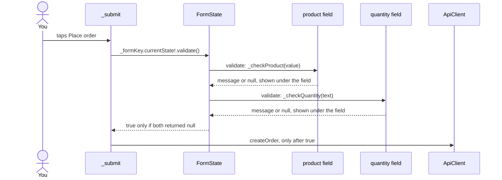

## Before you start

- [[frontend.l2.text-editing-controller]] — you know that a `TextEditingController` kept by the `State` holds a field's text across rebuilds, and should be disposed.
- [[frontend.l2.localizing-with-arb]] — you know that a screen reads every visible text by key through `AppLocalizations.of(context)`.
- [[frontend.l2.futureprovider-and-asyncvalue]] — you know that `productsProvider` loads the product list once and `AsyncValue.when` builds the loading, error or data case.

## The situation

At stage-2 the order screen is no longer one fixed button. You choose a product from a list and type a quantity, then tap "Place order". Now picture a customer who taps it without choosing a product, or types `0`, or types `two`. Sending that to `DonHang.Api` costs a request and a wait for an answer the app could give at once, and `two` is not even a number the app could put in the request. The screen has two fields of different kinds, each with its own rule. How does one tap check both fields and show each problem under the field it belongs to?

## Core concepts

- `Form` — a widget that groups the input fields below it in the widget tree so they can be checked together; its state object is a `FormState`.
- `GlobalKey<FormState>` — a key given to the `Form`, so code outside the fields, such as the button's handler, can reach that `FormState` through `currentState`.
- `TextFormField` and `DropdownButtonFormField` — a text field and a drop-down list, each wrapped as a form field, which a `Form` can check and which shows its own error message.
- validator — a function a form field is given; it receives the field's current value and returns an error message, or `null` when the value is fine.
- `validate()` — the method of `FormState` that runs the validator of every field in the form, makes each field show its own result, and returns `true` only if none failed.

## How it works



In the situation above, both fields sit inside one `Form`, and the screen holds a `GlobalKey<FormState>` that it gave to that `Form`. The key is what lets `_submit`, which is not inside any field, reach the form: `_formKey.currentState` returns the `FormState` of the `Form` that carries the key. The `!` after it tells Dart the value is not `null`; if it were, Dart would throw an error on that line.

When you tap "Place order", `_submit` calls `validate()` on that state. The form walks through its fields. Each field calls its validator with the value it holds now: the product field passes the chosen `Product`, or `null` when nothing is chosen, and the quantity field passes the text in its controller. A validator answers with a message such as "Choose a product.", or with `null`. The form does not choose any words itself: whatever string comes back is exactly what the field shows under itself.

Each field stores its own result and rebuilds itself to show it, the same way a `TextField` redraws from its controller without your `setState`. Once every field has answered, `validate()` returns `true` if all of them returned `null`, and `false` otherwise.

`_submit` reads that answer first. On `false` it returns at once: the button is not switched to its sending state, no request goes out, and the customer sees one message under each field that failed. Only on `true` does it go on to `ApiClient.createOrder`, the app's method that sends the order to `DonHang.Api`.

## In the Đơn Hàng system

The form, in `DonHang.App/lib/screens/create_order_screen.dart`:

```dart file=DonHang.App/lib/screens/create_order_screen.dart tag=stage-2 lines=86-110
  Widget _form(BuildContext context, List<Product> products) {
    final l10n = AppLocalizations.of(context);
    return Form(
      key: _formKey,
      child: ListView(
        padding: const EdgeInsets.all(16),
        children: [
          DropdownButtonFormField<Product>(
            initialValue: _product,
            decoration: InputDecoration(labelText: l10n.productLabel),
            items: [for (final p in products) DropdownMenuItem(value: p, child: Text(p.name))],
            onChanged: (product) => _product = product,
            validator: _checkProduct,
          ),
          TextFormField(
            controller: _quantityController,
            decoration: InputDecoration(labelText: l10n.quantityLabel),
            keyboardType: TextInputType.number,
            validator: _checkQuantity,
          ),
          const SizedBox(height: 16),
          if (_serverError != null)
            Text(_serverError!, style: TextStyle(color: Theme.of(context).colorScheme.error)),
          const SizedBox(height: 8),
          FilledButton(onPressed: _sending ? null : _submit, child: Text(l10n.submitOrder)),
```

`Form(key: _formKey, …)` is the `Form` the key points at; the key itself is a field of the `State`, `final _formKey = GlobalKey<FormState>();`, made once. The drop-down gets one item per product from the list that `productsProvider` loaded: `build` shows this form only in the `data` case of `.when`. The quantity field uses `_quantityController`, which starts with `'1'` and, unlike stage-1's `LoginScreen`, is disposed in the `State`'s `dispose`. The two `_serverError` lines belong to the next lesson.

The validators and the start of `_submit`:

```dart file=DonHang.App/lib/screens/create_order_screen.dart tag=stage-2 lines=35-59
  String? _checkProduct(Product? product) =>
      product == null ? AppLocalizations.of(context).productRequired : null;

  String? _checkQuantity(String? text) {
    final quantity = int.tryParse(text ?? '');
    return quantity == null || quantity < 1 ? AppLocalizations.of(context).quantityInvalid : null;
  }

  // lesson: frontend.l2.form-validation
  // lesson: frontend.l2.server-errors-in-forms
  // validate() runs every validator first; only a valid form is sent. When
  // the API still says no, its `detail` is shown and every field keeps what
  // the customer entered, so one value can be fixed and the order sent again.
  Future<void> _submit() async {
    if (!_formKey.currentState!.validate()) return;
    setState(() {
      _sending = true;
      _serverError = null;
    });
    try {
      final product = _product!;
      final quantity = int.parse(_quantityController.text);
      final order = await ref.read(apiClientProvider).createOrder([
        OrderItemRequest(productId: product.id, quantity: quantity, unitPriceVnd: product.priceVnd),
      ]);
```

Both validators return `String?`. `_checkProduct` returns the `productRequired` message when nothing is chosen. `_checkQuantity` uses `int.tryParse`, which gives `null` for text that is not a whole number, such as `two`, `1.5` or an empty field, so one test covers "not a number" and "below 1". Both messages come from `AppLocalizations`, so a Vietnamese browser sees "Hãy chọn một sản phẩm." and "Nhập một số nguyên từ 1 trở lên.". Line 49, `if (!_formKey.currentState!.validate()) return;`, is the gate: when `validate()` returns `false`, nothing below it runs, so `createOrder` is never called with `0` or an empty choice. The next line sets `_sending`, the flag that disables the button while the order is sent; the lines after it build the request, which this lesson does not need.

## Beginners often think…

- **"A validator returns true or false, and the form decides which message to show."** → Actually a validator returns the message itself, or `null` for a good value; its type is `String? Function(T? value)`. The form has no messages of its own, so the text under each field is exactly the string its validator returned. You notice this when you look for where "Enter a whole number, 1 or more." comes from: it is `_checkQuantity`'s return value, read from the ARB file.
- **"Putting fields inside a Form checks them automatically, so the submit button can send right away."** → Actually in `CreateOrderScreen` the `Form` only groups the fields: nothing runs a validator until `_submit` calls `validate()`, and nothing stops the request except the `return` on line 49. You notice this when you type `0` into the quantity: no message appears until you tap "Place order".
- **"Each field needs its own setState to show its error message."** → Actually `validate()` has each field store its result and rebuild itself, so the screen's code calls no `setState` for the messages. You notice this when you read `_submit`: on a failed check it returns before its first `setState`, yet both messages appear.

## Try it (3 minutes)

1. With the system running (`scripts/up.sh`), open `localhost:8081` in Chrome and click the sign-in icon at the top right, then the `Sign in with Keycloak` button (`Đăng nhập bằng Keycloak` in a Vietnamese browser). On the page that opens (Keycloak, the lab's sign-in server), sign in as `anh.tran@example.com` with the password `donhang-dev-password`.
2. Back on the product list, click the cart icon at the top right to open the order screen.
3. Leave the product empty, replace the quantity `1` with `0`, and click "Place order" ("Gửi đơn" in a Vietnamese browser).

Expected result: "Choose a product." appears under the product field and "Enter a whole number, 1 or more." under the quantity (in a Vietnamese browser, "Hãy chọn một sản phẩm." and "Nhập một số nguyên từ 1 trở lên."). The screen stays where it is, and no order is placed.

Suppose line 49 were deleted. What would happen when you click "Place order" with the product still empty?

<details><summary>Suggested answer</summary>

No validator would run, so no message would appear under either field. `_submit` would go on to `_product!`, and with no product chosen `_product` is `null`, so that `!` would throw. `ApiClient.createOrder` would not be called either way, but for the wrong reason: the check was meant to stop the request with a message, not with an error.

</details>

## Connections

- [[frontend.l2.text-editing-controller]] — the quantity field keeps its text in a controller, and here the `State` also disposes it.
- [[frontend.l2.localizing-with-arb]] — the validators' messages are ARB entries like any other text on the screen.
- [[backend.l1.validating-input]] — the same idea on the server: check the input and answer with a message before anything is saved.
- [[frontend.l2.server-errors-in-forms]] — the next step: the API still checks the order, and its `400` is shown in the same form.

## Five-line summary

1. A `Form` checks all its fields in one call: `validate()` runs each validator, shows each message under its field, and reports success.
2. A `GlobalKey<FormState>`, made once in the `State`, lets the submit handler reach the form through `currentState`.
3. A validator receives the field's current value and returns an error message, or `null` when the value is fine.
4. `CreateOrderScreen` rejects an empty product choice and any quantity that is not a whole number of at least 1, with messages from `AppLocalizations`.
5. `_submit` returns when `validate()` is `false`, so `ApiClient.createOrder` runs only for a form whose validators all passed.
