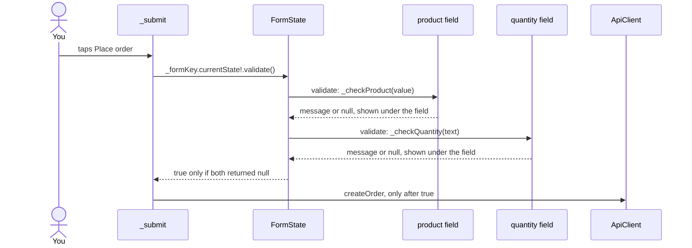

## Bạn cần biết trước

- [[frontend.l2.text-editing-controller]] — bạn biết rằng một `TextEditingController` do `State` giữ sẽ giữ chữ của ô nhập qua các lần build lại, và cần được dispose.
- [[frontend.l2.localizing-with-arb]] — bạn biết rằng màn hình đọc mọi chữ hiện ra theo khóa, qua `AppLocalizations.of(context)`.
- [[frontend.l2.futureprovider-and-asyncvalue]] — bạn biết rằng `productsProvider` tải danh sách sản phẩm một lần, và `AsyncValue.when` dựng trường hợp loading, error hoặc data.

## Tình huống

Ở stage-2, màn hình đặt hàng không còn là một nút cố định. Bạn chọn sản phẩm trong một danh sách, gõ số lượng, rồi bấm "Place order". Giờ hãy hình dung một khách bấm nút mà chưa chọn sản phẩm, hoặc gõ `0`, hoặc gõ `two`. Gửi những thứ đó tới `DonHang.Api` là tốn một request và một lần chờ để nhận câu trả lời mà app lẽ ra nói được ngay. Còn `two` thậm chí không phải con số để app đưa vào request. Màn hình có hai ô thuộc hai loại khác nhau, mỗi ô một quy tắc. Làm sao một lần bấm kiểm tra được cả hai ô, và hiện từng vấn đề ngay dưới ô của nó?

## Khái niệm cốt lõi

- `Form` — widget gom các ô nhập nằm bên dưới nó trong widget tree để kiểm tra chung một lượt. Object state của nó là một `FormState`.
- `GlobalKey<FormState>` — một key trao cho `Form`, nhờ đó code nằm ngoài các ô, như hàm xử lý của nút bấm, chạm được tới `FormState` đó qua `currentState`.
- `TextFormField` và `DropdownButtonFormField` — một ô nhập chữ và một danh sách thả xuống, mỗi cái được bọc thành một ô của form. `Form` kiểm tra được chúng, và mỗi ô tự hiện câu báo lỗi của riêng nó.
- validator — hàm mà một ô trong form được trao. Nó nhận giá trị hiện tại của ô và trả về câu báo lỗi, hoặc `null` khi giá trị ổn.
- `validate()` — method của `FormState`, chạy validator của mọi ô trong form, cho từng ô hiện kết quả của mình, và chỉ trả về `true` khi không ô nào hỏng.

## Cơ chế hoạt động



Trong tình huống trên, cả hai ô nằm trong cùng một `Form`, và màn hình giữ một `GlobalKey<FormState>` mà nó đã trao cho `Form` đó. Chính key này cho phép `_submit`, vốn không nằm trong ô nào, chạm tới form: `_formKey.currentState` trả về `FormState` của `Form` đang mang key. Dấu `!` phía sau báo với Dart rằng giá trị không phải `null`. Nếu nó là `null`, Dart sẽ ném lỗi ngay ở dòng đó.

Khi bạn bấm "Place order", `_submit` gọi `validate()` trên state đó. Form đi qua lần lượt các ô của nó. Mỗi ô gọi validator của mình với giá trị nó đang giữ: ô sản phẩm truyền `Product` đã chọn, hoặc `null` khi chưa chọn gì, còn ô số lượng truyền chữ trong controller của nó. Validator trả lời bằng một câu như "Choose a product.", hoặc bằng `null`. Form không tự chọn chữ nào: chuỗi nào được trả về thì ô hiện đúng chuỗi đó ngay bên dưới.

Mỗi ô tự lưu kết quả và tự build lại để hiện nó, giống cách một `TextField` vẽ lại theo controller mà không cần `setState` của bạn. Khi mọi ô đã trả lời, `validate()` trả về `true` nếu tất cả đều trả `null`, và `false` trong trường hợp còn lại.

`_submit` đọc câu trả lời đó trước tiên. Gặp `false`, nó trả về ngay: nút không chuyển sang trạng thái đang gửi, không request nào đi ra, và khách thấy một câu báo lỗi dưới mỗi ô không qua. Chỉ khi gặp `true` nó mới đi tiếp tới `ApiClient.createOrder`, method của app gửi đơn tới `DonHang.Api`.

## Trong hệ thống Đơn Hàng

Form, trong `DonHang.App/lib/screens/create_order_screen.dart`:

```dart file=DonHang.App/lib/screens/create_order_screen.dart tag=stage-2 lines=86-110
  Widget _form(BuildContext context, List<Product> products) {
    final l10n = AppLocalizations.of(context);
    return Form(
      key: _formKey,
      child: ListView(
        padding: const EdgeInsets.all(16),
        children: [
          DropdownButtonFormField<Product>(
            initialValue: _product,
            decoration: InputDecoration(labelText: l10n.productLabel),
            items: [for (final p in products) DropdownMenuItem(value: p, child: Text(p.name))],
            onChanged: (product) => _product = product,
            validator: _checkProduct,
          ),
          TextFormField(
            controller: _quantityController,
            decoration: InputDecoration(labelText: l10n.quantityLabel),
            keyboardType: TextInputType.number,
            validator: _checkQuantity,
          ),
          const SizedBox(height: 16),
          if (_serverError != null)
            Text(_serverError!, style: TextStyle(color: Theme.of(context).colorScheme.error)),
          const SizedBox(height: 8),
          FilledButton(onPressed: _sending ? null : _submit, child: Text(l10n.submitOrder)),
```

`Form(key: _formKey, …)` là `Form` mà key trỏ tới. Bản thân key là một field của `State`, `final _formKey = GlobalKey<FormState>();`, chỉ tạo một lần. Danh sách thả xuống có một mục cho mỗi sản phẩm trong danh sách mà `productsProvider` đã tải: `build` chỉ hiện form này ở trường hợp `data` của `.when`. Ô số lượng dùng `_quantityController`, bắt đầu với `'1'` và, khác với `LoginScreen` ở stage-1, được dispose trong `dispose` của `State`. Hai dòng `_serverError` thuộc về bài sau.

Các validator và phần đầu của `_submit`:

```dart file=DonHang.App/lib/screens/create_order_screen.dart tag=stage-2 lines=35-59
  String? _checkProduct(Product? product) =>
      product == null ? AppLocalizations.of(context).productRequired : null;

  String? _checkQuantity(String? text) {
    final quantity = int.tryParse(text ?? '');
    return quantity == null || quantity < 1 ? AppLocalizations.of(context).quantityInvalid : null;
  }

  // lesson: frontend.l2.form-validation
  // lesson: frontend.l2.server-errors-in-forms
  // validate() runs every validator first; only a valid form is sent. When
  // the API still says no, its `detail` is shown and every field keeps what
  // the customer entered, so one value can be fixed and the order sent again.
  Future<void> _submit() async {
    if (!_formKey.currentState!.validate()) return;
    setState(() {
      _sending = true;
      _serverError = null;
    });
    try {
      final product = _product!;
      final quantity = int.parse(_quantityController.text);
      final order = await ref.read(apiClientProvider).createOrder([
        OrderItemRequest(productId: product.id, quantity: quantity, unitPriceVnd: product.priceVnd),
      ]);
```

Cả hai validator đều trả về `String?`. `_checkProduct` trả về câu `productRequired` khi chưa chọn gì. `_checkQuantity` dùng `int.tryParse`, hàm này cho `null` với chữ không phải số nguyên, như `two`, `1.5` hay ô trống, nên chỉ một phép thử là bao cả "không phải số" lẫn "nhỏ hơn 1". Cả hai câu đều lấy từ `AppLocalizations`, nên trình duyệt tiếng Việt thấy "Hãy chọn một sản phẩm." và "Nhập một số nguyên từ 1 trở lên.". Dòng 49, `if (!_formKey.currentState!.validate()) return;`, là cửa chặn: khi `validate()` trả về `false`, không dòng nào bên dưới chạy, nên `createOrder` không bao giờ được gọi với `0` hay với lựa chọn trống. Dòng kế tiếp đặt `_sending`, cờ làm nút bị vô hiệu trong lúc gửi đơn. Các dòng sau đó dựng request, phần bài này không cần tới.

## Người mới hay nghĩ rằng…

- **"Validator trả về true hoặc false, còn form quyết định hiện câu báo lỗi nào."** → Thực ra validator trả về chính câu báo lỗi, hoặc `null` khi giá trị tốt, vì kiểu của nó là `String? Function(T? value)`. Form không có câu báo lỗi nào của riêng nó, nên chữ dưới mỗi ô chính là chuỗi mà validator của ô đó trả về. Bạn sẽ nhận ra khi đi tìm câu "Enter a whole number, 1 or more." đến từ đâu: đó là giá trị trả về của `_checkQuantity`, đọc từ ARB file.
- **"Đặt các ô vào trong một Form là chúng tự được kiểm tra, nên nút gửi cứ thế gửi luôn."** → Thực ra trong `CreateOrderScreen`, `Form` chỉ gom các ô lại: không validator nào chạy cho tới khi `_submit` gọi `validate()`, và không gì chặn request ngoài lệnh `return` ở dòng 49. Bạn sẽ nhận ra khi gõ `0` vào ô số lượng: chưa có câu báo lỗi nào hiện ra cho tới khi bạn bấm "Place order".
- **"Mỗi ô cần một setState riêng để hiện câu báo lỗi của nó."** → Thực ra `validate()` cho từng ô tự lưu kết quả và tự build lại, nên code của màn hình không gọi `setState` nào cho các câu báo lỗi. Bạn sẽ nhận ra khi đọc `_submit`: kiểm tra hỏng thì nó trả về trước cả lời gọi `setState` đầu tiên, vậy mà cả hai câu báo lỗi vẫn hiện.

## Thử ngay (3 phút)

1. Khi hệ thống đang chạy (`scripts/up.sh`), mở `localhost:8081` trong Chrome và bấm biểu tượng đăng nhập ở góc trên bên phải, rồi bấm nút `Sign in with Keycloak` (`Đăng nhập bằng Keycloak` nếu trình duyệt dùng tiếng Việt). Ở trang vừa mở ra (Keycloak, server đăng nhập của lab), đăng nhập bằng `anh.tran@example.com` với mật khẩu `donhang-dev-password`.
2. Về lại danh sách sản phẩm, bấm biểu tượng giỏ hàng ở góc trên bên phải để mở màn hình đặt hàng.
3. Để trống ô sản phẩm, thay số lượng `1` bằng `0`, rồi bấm "Place order" ("Gửi đơn" nếu trình duyệt dùng tiếng Việt).

Kết quả mong đợi: "Choose a product." hiện dưới ô sản phẩm và "Enter a whole number, 1 or more." hiện dưới ô số lượng (trên trình duyệt tiếng Việt là "Hãy chọn một sản phẩm." và "Nhập một số nguyên từ 1 trở lên."). Màn hình đứng yên, và không đơn nào được đặt.

Giả sử xóa dòng 49. Chuyện gì sẽ xảy ra khi bạn bấm "Place order" mà ô sản phẩm vẫn trống?

<details><summary>Gợi ý đáp án</summary>

Không validator nào chạy, nên không câu báo lỗi nào hiện dưới hai ô. `_submit` sẽ đi tiếp tới `_product!`, và vì chưa chọn sản phẩm nên `_product` là `null`, dấu `!` đó sẽ ném lỗi. Đằng nào `ApiClient.createOrder` cũng không được gọi, nhưng vì một lý do sai: phép kiểm tra lẽ ra phải chặn request bằng một câu báo lỗi, chứ không phải bằng một lỗi của chương trình.

</details>

## Liên hệ

- [[frontend.l2.text-editing-controller]] — ô số lượng giữ chữ của nó trong một controller, và ở đây `State` còn dispose controller đó.
- [[frontend.l2.localizing-with-arb]] — các câu báo lỗi của validator là những mục trong ARB file, như mọi chữ khác trên màn hình.
- [[backend.l1.validating-input]] — cùng ý tưởng ở phía server: kiểm tra dữ liệu vào và trả lời bằng một câu báo lỗi trước khi lưu bất cứ thứ gì.
- [[frontend.l2.server-errors-in-forms]] — bước tiếp theo: API vẫn kiểm tra đơn, và lỗi `400` của nó được hiện ngay trong form này.

## Tóm tắt 5 dòng

1. Một `Form` kiểm tra mọi ô của nó trong một lời gọi: `validate()` chạy từng validator, hiện từng câu báo lỗi dưới ô của nó, và báo kết quả.
2. Một `GlobalKey<FormState>`, tạo một lần trong `State`, cho hàm xử lý nút gửi chạm tới form qua `currentState`.
3. Validator nhận giá trị hiện tại của ô và trả về câu báo lỗi, hoặc `null` khi giá trị ổn.
4. `CreateOrderScreen` từ chối khi chưa chọn sản phẩm và khi số lượng không phải số nguyên từ 1 trở lên, với câu báo lỗi lấy từ `AppLocalizations`.
5. `_submit` trả về khi `validate()` là `false`, nên `ApiClient.createOrder` chỉ chạy cho form mà mọi validator đều đã qua.
