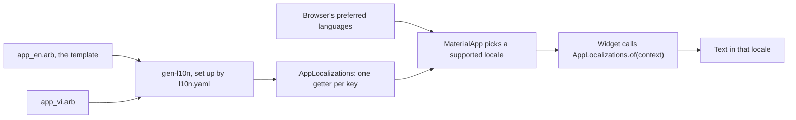

## Before you start

- [[frontend.l1.buildcontext]] — you know that `Navigator.of(context)` finds what an ancestor provides by looking up the tree from the widget's position.
- [[frontend.l2.routes-with-go-router]] — you know that `DonHangApp` returns `MaterialApp.router`, the widget at the top of every screen of the app.

## The situation

At stage-1, every label and message on DonHang.App's screens is typed into a widget: `const Text('Sign in')` on the sign-in screen, `Text('No products yet.')` on the product list. The screens speak English, yet the shop's name `Đơn Hàng` and the price sign `đ` are Vietnamese. The team now wants each customer to read the app in Vietnamese or in English. The first idea on the table is a Vietnamese copy of every screen. That doubles the screens, and every later fix would have to be made twice. How can one screen show its text in whichever language the customer reads?

## Core concepts

- **internationalization** — building the app so that no text shown to the user is written into a widget: each message has a key, and the text for the current language is looked up by that key when the widget builds. It is often shortened to i18n.
- **locale** — a language, optionally with a region, such as `vi` or `en_US`; DonHang.App picks one locale and shows every message in it.
- **ARB file** — a JSON file that maps keys to the messages of one language; DonHang.App has `app_en.arb` and `app_vi.arb`, with the same keys.
- template — the ARB file that declares every key, here `app_en.arb`; each other ARB file translates those keys.
- `gen-l10n` — Flutter's tool that reads the ARB files, as `l10n.yaml` tells it, and generates a class, `AppLocalizations`, with one getter per key.

## How it works



In the situation above, the words were part of the widgets, so the only way to change the language was to change the widget. With i18n the widget holds a key instead. Read the diagram in two halves: what happens before the app runs, and what happens when a screen builds.

Before the app runs, `gen-l10n` reads `l10n.yaml`, which names the folder of ARB files, `lib/l10n`, and the template, `app_en.arb`. Both files map the same keys to text: `"signIn": "Sign in"` in one, `"signIn": "Đăng nhập"` in the other. From them the tool generates `AppLocalizations`, with one getter per key, such as `signIn`. A screen writes `l10n.signIn`, where `l10n` is the object `AppLocalizations.of(context)` returns, not a string. Mistype it as `l10n.signin` and there is no such getter, so the app does not compile, instead of showing a blank label.

When the app starts, `MaterialApp` receives two lists from the generated class. `localizationsDelegates` holds the objects that load the messages for a locale. `supportedLocales` holds the locales that have an ARB file, `en` and `vi`, which `gen-l10n` lists in alphabetical order. `MaterialApp` compares the browser's preferred languages, in the user's order, with `supportedLocales` and picks the closest match; with Vietnamese at the top of the list it picks `vi`. If none matches, as with a browser set to French only, it falls back to the first entry of `supportedLocales`, English.

Then each widget calls `AppLocalizations.of(context)`. Like `Navigator.of(context)`, the call looks up the tree and finds the messages `MaterialApp` loaded for that locale. That answers the question: the screen names keys, and the locale chooses the text.

## In the Đơn Hàng system

The start of the template, `DonHang.App/lib/l10n/app_en.arb`:

```json file=DonHang.App/lib/l10n/app_en.arb tag=stage-2 lines=1-14
{
  "@@locale": "en",
  "appTitle": "Đơn Hàng",
  "@appTitle": { "description": "The app's name, in the title bar and the browser tab." },
  "signIn": "Sign in",
  "signOut": "Sign out",
  "signInWithKeycloak": "Sign in with Keycloak",
  "signInExplanation": "You sign in on Keycloak's page, then come back here.",
  "signingIn": "Signing you in…",
  "signInFailed": "Sign-in did not finish.",
  "tryAgain": "Try again",
  "reload": "Reload",
  "productsLoadError": "Could not load products.",
  "noProducts": "No products yet.",
```

Every line whose key does not start with `@` is one message, such as `appTitle` on line 3 and `signIn` on line 5: a key on the left, English text on the right. `@@locale` says which language the file holds. A key starting with `@`, such as `@appTitle`, is not a message: it describes the message with the same name for whoever translates it. `app_vi.arb` has the same keys with Vietnamese text, such as `"noProducts": "Chưa có sản phẩm nào."`; `appTitle` is `Đơn Hàng` in both files.

`DonHangApp` in `DonHang.App/lib/main.dart`:

```dart file=DonHang.App/lib/main.dart tag=stage-2 lines=26-36
  @override
  Widget build(BuildContext context, WidgetRef ref) {
    return MaterialApp.router(
      routerConfig: ref.watch(routerProvider),
      onGenerateTitle: (context) => AppLocalizations.of(context).appTitle,
      theme: ThemeData(colorSchemeSeed: Colors.indigo),
      darkTheme: ThemeData(colorSchemeSeed: Colors.indigo, brightness: Brightness.dark),
      localizationsDelegates: AppLocalizations.localizationsDelegates,
      supportedLocales: AppLocalizations.supportedLocales,
    );
  }
```

Ignore `theme` and `darkTheme`; other lessons cover them. Lines 33 and 34 hand `MaterialApp.router` the two lists from the generated class, so no locale is written by hand. Line 30 replaces stage-1's fixed `title: 'Đơn Hàng'`. It is a function because the messages are only found below `MaterialApp`, and the context it receives is one that can reach them. Every screen then starts its `build` with `final l10n = AppLocalizations.of(context);`, and at stage-2 no screen in `DonHang.App/lib` passes a string literal to `Text`.

## Beginners often think…

- **"Translating an app means keeping a second copy of every screen in the other language."** → Actually one screen reads all its text by key, and only the ARB files differ per language. The layout and the logic exist once. You notice this when a layout fix in `LoginScreen` shows up in both languages at once.
- **"The app shows the language of the developer's machine, since that is where it was built."** → Actually every ARB file is compiled into the app, and the locale is chosen from the customer's browser languages while the app runs. You notice this when the same build at `http://localhost:8081` shows Vietnamese in one browser and English in another.

## Try it (3 minutes)

1. With the Đơn Hàng system running on your machine (`scripts/up.sh` from the repository root), open `http://localhost:8081/login` in Chrome (the sign-in screen shows whether or not you signed in earlier). Read the bar at the top of the sign-in screen and the button. If they are already in Vietnamese, Vietnamese comes before English in your list: in step 2, move English to the top instead, and expect the English text.
2. In Chrome's settings, under Languages, put Vietnamese at the top of your preferred languages (add it first if it is missing).
3. Reload the page.

Expected result: with English first, the bar at the top says `Sign in` and the button `Sign in with Keycloak`. With Vietnamese first, it says `Đăng nhập` and the button `Đăng nhập bằng Keycloak`. Put your languages back afterwards.

What would the page show for a preferred-language list holding only French?

<details><summary>Suggested answer</summary>

English. French is not in `supportedLocales`, so no preferred language matches, and `MaterialApp` falls back to the first entry of `supportedLocales`, which is `en`.

</details>

## Connections

- [[frontend.l1.buildcontext]] — the same lookup: `AppLocalizations.of(context)` finds the messages up the tree the way `Navigator.of(context)` finds the navigator.
- [[frontend.l2.routes-with-go-router]] — where the setup lives: the same `MaterialApp.router` that takes the router also takes the delegates and the supported locales.
- [[frontend.l2.messages-with-values]] — the next step: messages with a value inside them, such as a product's price.
- [[frontend.l2.form-validation]] — builds on this: the order form's error messages come from `AppLocalizations` too.

## Five-line summary

1. With i18n, a widget holds a key, and the text for the current locale is looked up by that key when it builds.
2. DonHang.App keeps one ARB file per language, `app_en.arb` and `app_vi.arb`, with the same keys; `app_en.arb` is the template.
3. `gen-l10n`, set up by `l10n.yaml`, generates `AppLocalizations` with one getter per key, so a mistyped key fails to compile.
4. `MaterialApp` gets `localizationsDelegates` and `supportedLocales` from that class; a widget reads its text with `AppLocalizations.of(context)`.
5. The app picks the supported locale that best matches the browser's preferred languages, and falls back to English, the first supported locale.
