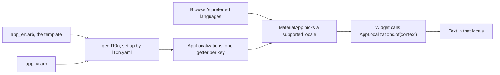

## Bạn cần biết trước

- [[frontend.l1.buildcontext]] — bạn biết `Navigator.of(context)` tìm thứ mà một widget tổ tiên cung cấp bằng cách tra ngược lên cây, bắt đầu từ vị trí của widget.
- [[frontend.l2.routes-with-go-router]] — bạn biết `DonHangApp` trả về `MaterialApp.router`, widget nằm trên cùng của mọi màn hình trong app.

## Tình huống

Ở stage-1, mọi nhãn và thông báo trên các màn hình của DonHang.App đều được gõ thẳng vào widget: `const Text('Sign in')` trên màn hình đăng nhập, `Text('No products yet.')` trên danh sách sản phẩm. Màn hình nói tiếng Anh, trong khi tên shop `Đơn Hàng` và ký hiệu giá `đ` lại là tiếng Việt. Giờ team muốn mỗi khách đọc app bằng tiếng Việt hoặc tiếng Anh. Ý đầu tiên được đưa ra là làm thêm một bản tiếng Việt cho mỗi màn hình. Như vậy số màn hình tăng gấp đôi, và mỗi lần sửa sau này phải làm hai lần. Làm sao để một màn hình hiện chữ bằng đúng ngôn ngữ khách đọc?

## Khái niệm cốt lõi

- **quốc tế hóa** (internationalization) — xây app sao cho không chữ nào hiện cho người dùng bị viết cứng trong widget: mỗi câu chữ có một khóa, và chữ của ngôn ngữ hiện tại được tra theo khóa đó khi widget build. Từ này thường được viết tắt là i18n.
- **locale** (một ngôn ngữ, có thể kèm vùng, như vi hay en_US; quyết định app dùng chữ và định dạng số nào) — một ngôn ngữ, có thể kèm vùng, như `vi` hay `en_US`. DonHang.App chọn một locale và hiện mọi câu chữ theo locale đó.
- **ARB file** (file JSON chứa các câu chữ của một ngôn ngữ theo khóa; gen-l10n của Flutter sinh class Dart từ bộ file này) — file JSON ánh xạ khóa sang câu chữ của một ngôn ngữ. DonHang.App có `app_en.arb` và `app_vi.arb`, cùng một bộ khóa.
- template — ARB file khai báo mọi khóa, ở đây là `app_en.arb`. Các ARB file khác dịch những khóa đó.
- `gen-l10n` — công cụ của Flutter đọc các ARB file theo chỉ dẫn trong `l10n.yaml`, rồi sinh ra một class là `AppLocalizations`, mỗi khóa một getter.

## Cơ chế hoạt động



Trong tình huống trên, chữ là một phần của widget, nên muốn đổi ngôn ngữ thì chỉ có cách sửa widget. Với i18n, widget chỉ giữ một khóa. Hãy đọc sơ đồ thành hai nửa: những gì xảy ra trước khi app chạy, và những gì xảy ra khi một màn hình build.

Trước khi app chạy, `gen-l10n` đọc `l10n.yaml`, file này chỉ ra thư mục chứa ARB file là `lib/l10n` và template là `app_en.arb`. Hai file ánh xạ cùng các khóa sang chữ: `"signIn": "Sign in"` ở file này, `"signIn": "Đăng nhập"` ở file kia. Từ đó công cụ sinh ra `AppLocalizations`, mỗi khóa một getter, chẳng hạn `signIn`. Màn hình viết `l10n.signIn` chứ không viết một chuỗi, trong đó `l10n` là object mà `AppLocalizations.of(context)` trả về. Gõ nhầm thành `l10n.signin` thì không có getter nào như vậy, nên app không compile được, thay vì hiện ra một nhãn trống.

Khi app khởi động, `MaterialApp` nhận hai danh sách từ class được sinh ra. `localizationsDelegates` chứa các object nạp câu chữ cho một locale. `supportedLocales` chứa các locale có ARB file, là `en` và `vi`, được `gen-l10n` xếp theo thứ tự bảng chữ cái. `MaterialApp` so các ngôn ngữ ưu tiên của trình duyệt, theo thứ tự người dùng đặt, với `supportedLocales` và chọn locale khớp nhất. Tiếng Việt đứng đầu danh sách thì nó chọn `vi`. Nếu không có gì khớp, như trình duyệt chỉ đặt tiếng Pháp, nó lấy phần tử đầu của `supportedLocales`, tức tiếng Anh.

Sau đó mỗi widget gọi `AppLocalizations.of(context)`. Giống `Navigator.of(context)`, lời gọi này tra ngược lên cây và tìm thấy câu chữ mà `MaterialApp` đã nạp cho locale đó. Đó là câu trả lời cho câu hỏi ban đầu: màn hình chỉ nêu khóa, còn locale chọn chữ.

## Trong hệ thống Đơn Hàng

Phần đầu của template, `DonHang.App/lib/l10n/app_en.arb`:

```json file=DonHang.App/lib/l10n/app_en.arb tag=stage-2 lines=1-14
{
  "@@locale": "en",
  "appTitle": "Đơn Hàng",
  "@appTitle": { "description": "The app's name, in the title bar and the browser tab." },
  "signIn": "Sign in",
  "signOut": "Sign out",
  "signInWithKeycloak": "Sign in with Keycloak",
  "signInExplanation": "You sign in on Keycloak's page, then come back here.",
  "signingIn": "Signing you in…",
  "signInFailed": "Sign-in did not finish.",
  "tryAgain": "Try again",
  "reload": "Reload",
  "productsLoadError": "Could not load products.",
  "noProducts": "No products yet.",
```

Mỗi dòng có khóa không bắt đầu bằng `@` là một câu chữ, chẳng hạn `appTitle` ở dòng 3 và `signIn` ở dòng 5: khóa bên trái, chữ tiếng Anh bên phải. `@@locale` cho biết file chứa ngôn ngữ nào. Khóa bắt đầu bằng `@`, như `@appTitle`, không phải câu chữ: nó mô tả câu chữ cùng tên cho người dịch. `app_vi.arb` có đúng các khóa đó với chữ tiếng Việt, chẳng hạn `"noProducts": "Chưa có sản phẩm nào."`. `appTitle` là `Đơn Hàng` ở cả hai file.

`DonHangApp` trong `DonHang.App/lib/main.dart`:

```dart file=DonHang.App/lib/main.dart tag=stage-2 lines=26-36
  @override
  Widget build(BuildContext context, WidgetRef ref) {
    return MaterialApp.router(
      routerConfig: ref.watch(routerProvider),
      onGenerateTitle: (context) => AppLocalizations.of(context).appTitle,
      theme: ThemeData(colorSchemeSeed: Colors.indigo),
      darkTheme: ThemeData(colorSchemeSeed: Colors.indigo, brightness: Brightness.dark),
      localizationsDelegates: AppLocalizations.localizationsDelegates,
      supportedLocales: AppLocalizations.supportedLocales,
    );
  }
```

Tạm bỏ qua `theme` và `darkTheme`, các bài khác sẽ nói tới. Dòng 33 và 34 đưa cho `MaterialApp.router` hai danh sách lấy từ class được sinh ra, nên không locale nào phải viết tay. Dòng 30 thay cho `title: 'Đơn Hàng'` cố định của stage-1. Nó là một hàm vì câu chữ chỉ tìm được ở bên dưới `MaterialApp`, và context mà hàm nhận là context tới được chỗ đó. Mọi màn hình sau đó mở đầu `build` bằng `final l10n = AppLocalizations.of(context);`, và ở stage-2 không màn hình nào trong `DonHang.App/lib` truyền chuỗi viết sẵn vào `Text`.

## Người mới hay nghĩ rằng…

- **"Dịch một app nghĩa là giữ thêm một bản sao của mỗi màn hình bằng ngôn ngữ kia."** → Thực ra một màn hình đọc toàn bộ chữ của nó theo khóa, chỉ các ARB file là khác nhau theo ngôn ngữ. Bố cục và logic chỉ có một bản. Bạn sẽ nhận ra khi sửa bố cục trong `LoginScreen` thì cả hai ngôn ngữ cùng đổi theo.
- **"App hiện ngôn ngữ của máy developer, vì app được build ở đó."** → Thực ra mọi ARB file đều được compile vào app, và locale được chọn từ các ngôn ngữ của trình duyệt của khách trong lúc app chạy. Bạn sẽ nhận ra khi cùng một bản build ở `http://localhost:8081` hiện tiếng Việt ở trình duyệt này và tiếng Anh ở trình duyệt khác.

## Thử ngay (3 phút)

1. Với hệ thống Đơn Hàng đang chạy trên máy (`scripts/up.sh` từ thư mục gốc của repo), mở `http://localhost:8081/login` bằng Chrome (màn hình đăng nhập vẫn hiện dù trước đó bạn đã đăng nhập hay chưa). Đọc thanh trên cùng của màn hình đăng nhập và nút bấm. Nếu chúng đã là tiếng Việt, tức tiếng Việt đang đứng trước tiếng Anh trong danh sách: ở bước 2, hãy đưa tiếng Anh lên đầu, và chờ thấy chữ tiếng Anh.
2. Trong phần cài đặt của Chrome, mục Languages, đưa tiếng Việt lên đầu danh sách ngôn ngữ ưu tiên (thêm vào trước nếu chưa có).
3. Tải lại trang.

Kết quả mong đợi: khi tiếng Anh đứng đầu, thanh trên cùng ghi `Sign in` và nút ghi `Sign in with Keycloak`. Khi tiếng Việt đứng đầu, thanh ghi `Đăng nhập` và nút ghi `Đăng nhập bằng Keycloak`. Làm xong thì trả lại thứ tự ngôn ngữ như cũ.

Nếu danh sách ngôn ngữ ưu tiên chỉ có tiếng Pháp, trang sẽ hiện gì?

<details><summary>Gợi ý đáp án</summary>

Tiếng Anh. Tiếng Pháp không có trong `supportedLocales`, nên không ngôn ngữ ưu tiên nào khớp, và `MaterialApp` lấy phần tử đầu của `supportedLocales`, tức `en`.

</details>

## Liên hệ

- [[frontend.l1.buildcontext]] — cùng một kiểu tra cứu: `AppLocalizations.of(context)` tìm câu chữ ngược lên cây giống cách `Navigator.of(context)` tìm navigator.
- [[frontend.l2.routes-with-go-router]] — nơi đặt phần cấu hình: chính `MaterialApp.router` nhận router cũng nhận các delegate và các locale được hỗ trợ.
- [[frontend.l2.messages-with-values]] — bước tiếp theo: câu chữ có giá trị bên trong, như giá của một sản phẩm.
- [[frontend.l2.form-validation]] — xây trên bài này: thông báo lỗi của form đặt hàng cũng lấy từ `AppLocalizations`.

## Tóm tắt 5 dòng

1. Với i18n, widget giữ một khóa, và chữ của locale hiện tại được tra theo khóa đó khi widget build.
2. DonHang.App giữ mỗi ngôn ngữ một ARB file, `app_en.arb` và `app_vi.arb`, cùng bộ khóa. `app_en.arb` là template.
3. `gen-l10n`, cấu hình bởi `l10n.yaml`, sinh `AppLocalizations` với mỗi khóa một getter, nên gõ nhầm khóa là không compile được.
4. `MaterialApp` lấy `localizationsDelegates` và `supportedLocales` từ class đó. Widget đọc chữ bằng `AppLocalizations.of(context)`.
5. App chọn locale được hỗ trợ khớp nhất với các ngôn ngữ ưu tiên của trình duyệt, không khớp thì lấy tiếng Anh, locale đầu tiên.
