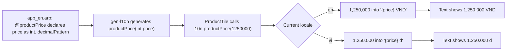

## Before you start

- [[frontend.l2.localizing-with-arb]] — you know that each message has a key in `app_en.arb` and `app_vi.arb`, and that a widget reads it through `AppLocalizations.of(context)`.

## The situation

At stage-1, `ProductTile` shows a price with `Text('${product.priceVnd} đ')`. The keyboard costs `1250000 đ`: seven digits in a row that you have to count. Its screen reader label is `'${product.name}, ${product.priceVnd} đồng'`, so an English reader hears a Vietnamese word. Stage-2 moved every fixed text into ARB files, but these two are not fixed: each is a sentence with a number from the API inside it. How do you translate a sentence that holds a value, and write that value the way each language writes numbers?

## Core concepts

- placeholder — a name in braces inside a message, such as `{price}`, that marks where a value goes in that language's sentence.
- `@` entry — the entry named after a message with `@` in front, such as `@productPrice`, where the template declares each placeholder with its type.
- number format — a named way to write a number, such as `decimalPattern`, that groups the digits by the rules of the current locale.
- message method — what `gen-l10n` generates instead of a getter when a message has placeholders: a method that takes the values, such as `productPrice(int price)`.

## How it works



In the situation above, the widget glued the price into a string, so the widget decided both where the number goes and how its digits look. Stage-2 hands both jobs away. Follow the diagram from the ARB file.

A message that holds a value is still one entry. `app_en.arb` has `"productPrice": "{price} VND"` and `app_vi.arb` has `"productPrice": "{price} đ"`. Each language writes the whole phrase and puts `{price}` where its own sentence needs it.

The alternative is to translate only the unit as its own message and join it to the number with `+` in the widget. The code then fixes the English order for every language, and the translator receives `VND` or `dong` with no sentence around it. One message per whole sentence avoids both.

The template declares each placeholder in the message's `@` entry: its name, its type and, here, a number format. From that, `gen-l10n` turns the getter into a method, `productPrice(int price)`. A screen must pass an `int`; passing a string fails to compile.

When the method runs, the generated code formats the number with the current locale's rules, because the placeholder names `decimalPattern`. In English `1250000` becomes `1,250,000`; in Vietnamese it becomes `1.250.000`. Then the formatted number goes into that language's message. That answers the question: the translator owns the sentence, and the locale decides how the number is written.

## In the Đơn Hàng system

The two messages with values in `DonHang.App/lib/l10n/app_en.arb`:

```json file=DonHang.App/lib/l10n/app_en.arb tag=stage-2 lines=16-30
  "productPrice": "{price} VND",
  "@productPrice": {
    "description": "A product's price in Vietnamese dong.",
    "placeholders": {
      "price": { "type": "int", "format": "decimalPattern" }
    }
  },
  "productSemanticsLabel": "{name}, {price} dong",
  "@productSemanticsLabel": {
    "description": "What a screen reader says for one product: its name, then its price.",
    "placeholders": {
      "name": { "type": "String" },
      "price": { "type": "int", "format": "decimalPattern" }
    }
  },
```

Look at `placeholders` in each `@` entry. `price` is an `int` with the format `decimalPattern`; `name` is a `String`, put into the sentence as it is. The `description` tells a translator what the value is. `app_vi.arb` repeats no declaration: it only has `"productPrice": "{price} đ"` and `"productSemanticsLabel": "{name}, {price} đồng"`. So the generated methods are `productPrice(int price)` and `productSemanticsLabel(String name, int price)` in both languages.

`ProductTile`'s `build` in `DonHang.App/lib/widgets/product_tile.dart`:

```dart file=DonHang.App/lib/widgets/product_tile.dart tag=stage-2 lines=19-38
  Widget build(BuildContext context) {
    final l10n = AppLocalizations.of(context);
    return Semantics(
      label: l10n.productSemanticsLabel(product.name, product.priceVnd),
      button: onTap != null,
      excludeSemantics: true,
      child: InkWell(
        onTap: onTap,
        child: ConstrainedBox(
          constraints: const BoxConstraints(minHeight: 48),
          child: Padding(
            padding: const EdgeInsets.all(12),
            child: Row(
              children: [
                Expanded(child: Text(product.name)),
                Text(l10n.productPrice(product.priceVnd)),
              ],
            ),
          ),
        ),
```

The `Text(l10n.productPrice(...))` line is the visible price, and the `label:` line is the `Semantics` label; both pass the same `product.priceVnd` to a message method. The label is text too, so it is translated like the rest: a screen reader says `Bàn phím cơ, 1,250,000 dong` in English and `Bàn phím cơ, 1.250.000 đồng` in Vietnamese. The product name comes from the API and stays as it is in both.

## Beginners often think…

- **"Translating each piece and joining them with + gives the same sentence as translating it whole."** → Actually joining fixes the order of the pieces in code, and the translator sees fragments with no sentence to fit them into. A language that needs the value somewhere else cannot move it without a code change. You notice this when a translator asks what a lone word such as `dong` belongs to.
- **"Vietnamese and English write large numbers the same way, so a price needs no formatting."** → Actually English groups the thousands with commas, `1,250,000`, and Vietnamese with dots, `1.250.000`. An unformatted `1250000` suits neither. You notice this when stage-1's `1250000 đ` makes you count the digits to know the price.

## Try it (3 minutes)

1. With the Đơn Hàng system running on your machine (`scripts/up.sh` from the repository root), open `http://localhost:8081` in Chrome with English at the top of your preferred languages, and read the price of `Bàn phím cơ`.
2. In Chrome's settings, under Languages, put Vietnamese at the top, then reload the page.

Expected result: in English the price reads `1,250,000 VND`; after the reload it reads `1.250.000 đ`. Same number, same `ProductTile`, a different message and a different grouping. Put your languages back afterwards.

A teammate proposes to build the label as `product.name + ', ' + l10n.productPrice(product.priceVnd)`. What would that lose?

<details><summary>Suggested answer</summary>

The comma and the order of name and price would be fixed in code for every language, and the screen reader would say `VND` where the label now says `dong`. With `productSemanticsLabel`, each ARB file writes the whole sentence and can place `{name}` and `{price}` wherever its language needs them.

</details>

## Connections

- [[frontend.l2.localizing-with-arb]] — the base this lesson extends: messages by key in ARB files, read through `AppLocalizations.of(context)`; here a message also takes values.
- [[frontend.l1.accessibility-basics]] — the same `Semantics` label from that lesson, now a translated message instead of a Vietnamese string.
- [[frontend.l2.form-validation]] — the next place messages meet code: the order form's error texts come from `AppLocalizations`.

## Five-line summary

1. A message that contains a value is one ARB entry with a placeholder, so each language puts the value where its sentence needs it.
2. Joining translated pieces with `+` fixes the English order and gives translators fragments; one message per whole sentence avoids both.
3. The template's `@` entry declares each placeholder and its type, and `gen-l10n` generates a method such as `productPrice(int price)`.
4. An `int` placeholder with `decimalPattern` is formatted by the locale's rules: `1,250,000` in English, `1.250.000` in Vietnamese.
5. `ProductTile` builds its price and its `Semantics` label from these messages, so a screen reader hears the price in the user's language.
