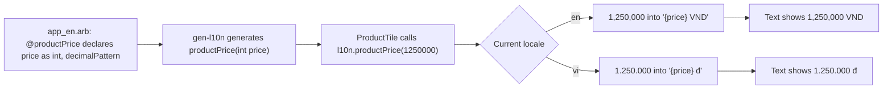

## Bạn cần biết trước

- [[frontend.l2.localizing-with-arb]] — bạn biết mỗi câu chữ có một khóa trong `app_en.arb` và `app_vi.arb`, và widget đọc nó qua `AppLocalizations.of(context)`.

## Tình huống

Ở stage-1, `ProductTile` hiện giá bằng `Text('${product.priceVnd} đ')`. Bàn phím có giá `1250000 đ`: bảy chữ số liền nhau mà bạn phải ngồi đếm. Nhãn cho screen reader của nó là `'${product.name}, ${product.priceVnd} đồng'`, nên người đọc tiếng Anh nghe thấy một từ tiếng Việt. Stage-2 đã chuyển mọi chữ cố định vào ARB file, nhưng hai chỗ này không cố định: mỗi chỗ là một câu có con số từ API nằm bên trong. Làm sao dịch một câu chứa giá trị, và viết giá trị đó theo đúng cách mỗi ngôn ngữ viết số?

## Khái niệm cốt lõi

- placeholder — một cái tên đặt trong ngoặc nhọn bên trong câu chữ, như `{price}`, đánh dấu chỗ giá trị được đặt vào trong câu của ngôn ngữ đó.
- mục `@` — mục mang tên của câu chữ với `@` ở trước, như `@productPrice`, nơi template khai báo từng placeholder cùng kiểu của nó.
- định dạng số — kiểu viết số được đặt tên, như `decimalPattern`, nhóm các chữ số theo quy tắc của locale hiện tại.
- method câu chữ — thứ `gen-l10n` sinh ra thay cho getter khi câu chữ có placeholder: một method nhận các giá trị, như `productPrice(int price)`.

## Cơ chế hoạt động



Trong tình huống trên, widget gắn giá vào một chuỗi, nên chính widget quyết định cả chỗ đặt con số lẫn hình dạng các chữ số. Stage-2 giao cả hai việc đó đi nơi khác. Hãy theo sơ đồ, bắt đầu từ ARB file.

Một câu chữ chứa giá trị vẫn chỉ là một mục. `app_en.arb` có `"productPrice": "{price} VND"` và `app_vi.arb` có `"productPrice": "{price} đ"`. Mỗi ngôn ngữ viết trọn cả cụm và đặt `{price}` vào chỗ câu của nó cần.

Cách làm khác là chỉ dịch đơn vị thành một câu chữ riêng rồi nối nó với con số bằng `+` trong widget. Khi đó code cố định thứ tự của tiếng Anh cho mọi ngôn ngữ, còn người dịch nhận `VND` hay `dong` mà không có câu nào bao quanh. Mỗi câu trọn vẹn là một câu chữ thì tránh được cả hai chuyện đó.

Template khai báo từng placeholder trong mục `@` của câu chữ: tên, kiểu và, ở đây, một định dạng số. Từ đó `gen-l10n` biến getter thành method `productPrice(int price)`. Màn hình phải truyền vào một `int`. Truyền một chuỗi thì không compile được.

Khi method chạy, code được sinh ra định dạng con số theo quy tắc của locale hiện tại, vì placeholder có nêu `decimalPattern`. Trong tiếng Anh, `1250000` thành `1,250,000`. Trong tiếng Việt, nó thành `1.250.000`. Sau đó con số đã định dạng được đặt vào câu của ngôn ngữ đó. Đó là câu trả lời: người dịch làm chủ câu, còn locale quyết định con số được viết thế nào.

## Trong hệ thống Đơn Hàng

Hai câu chữ có giá trị trong `DonHang.App/lib/l10n/app_en.arb`:

```json file=DonHang.App/lib/l10n/app_en.arb tag=stage-2 lines=16-30
  "productPrice": "{price} VND",
  "@productPrice": {
    "description": "A product's price in Vietnamese dong.",
    "placeholders": {
      "price": { "type": "int", "format": "decimalPattern" }
    }
  },
  "productSemanticsLabel": "{name}, {price} dong",
  "@productSemanticsLabel": {
    "description": "What a screen reader says for one product: its name, then its price.",
    "placeholders": {
      "name": { "type": "String" },
      "price": { "type": "int", "format": "decimalPattern" }
    }
  },
```

Hãy nhìn `placeholders` trong mỗi mục `@`. `price` là `int` với định dạng `decimalPattern`. `name` là `String`, được đặt vào câu nguyên như vậy. `description` cho người dịch biết giá trị đó là gì. `app_vi.arb` không lặp lại phần khai báo nào: nó chỉ có `"productPrice": "{price} đ"` và `"productSemanticsLabel": "{name}, {price} đồng"`. Vì thế các method được sinh ra là `productPrice(int price)` và `productSemanticsLabel(String name, int price)` ở cả hai ngôn ngữ.

`build` của `ProductTile` trong `DonHang.App/lib/widgets/product_tile.dart`:

```dart file=DonHang.App/lib/widgets/product_tile.dart tag=stage-2 lines=19-38
  Widget build(BuildContext context) {
    final l10n = AppLocalizations.of(context);
    return Semantics(
      label: l10n.productSemanticsLabel(product.name, product.priceVnd),
      button: onTap != null,
      excludeSemantics: true,
      child: InkWell(
        onTap: onTap,
        child: ConstrainedBox(
          constraints: const BoxConstraints(minHeight: 48),
          child: Padding(
            padding: const EdgeInsets.all(12),
            child: Row(
              children: [
                Expanded(child: Text(product.name)),
                Text(l10n.productPrice(product.priceVnd)),
              ],
            ),
          ),
        ),
```

Dòng `Text(l10n.productPrice(...))` là giá hiện ra, còn dòng `label:` là nhãn `Semantics`. Cả hai truyền cùng `product.priceVnd` vào một method câu chữ. Nhãn cũng là chữ, nên nó được dịch như mọi chữ khác: screen reader đọc `Bàn phím cơ, 1,250,000 dong` bằng tiếng Anh và `Bàn phím cơ, 1.250.000 đồng` bằng tiếng Việt. Tên sản phẩm đến từ API và giữ nguyên ở cả hai.

## Người mới hay nghĩ rằng…

- **"Dịch từng mẩu rồi nối chúng bằng + thì ra cùng một câu như dịch cả câu."** → Thực ra nối lại là cố định thứ tự các mẩu trong code, còn người dịch chỉ thấy những mảnh rời không có câu nào để ghép vào. Ngôn ngữ nào cần đặt giá trị ở chỗ khác thì không dời được nếu không sửa code. Bạn sẽ nhận ra khi người dịch hỏi một từ đứng lẻ như `dong` thuộc về câu nào.
- **"Tiếng Việt và tiếng Anh viết số lớn giống nhau, nên giá không cần định dạng."** → Thực ra tiếng Anh nhóm hàng nghìn bằng dấu phẩy, `1,250,000`, còn tiếng Việt bằng dấu chấm, `1.250.000`. Một con số `1250000` chưa định dạng thì không hợp với bên nào. Bạn sẽ nhận ra khi `1250000 đ` của stage-1 bắt bạn đếm chữ số mới biết giá.

## Thử ngay (3 phút)

1. Với hệ thống Đơn Hàng đang chạy trên máy (`scripts/up.sh` từ thư mục gốc của repo), mở `http://localhost:8081` bằng Chrome, với tiếng Anh ở đầu danh sách ngôn ngữ ưu tiên, rồi đọc giá của `Bàn phím cơ`.
2. Trong phần cài đặt của Chrome, mục Languages, đưa tiếng Việt lên đầu, rồi tải lại trang.

Kết quả mong đợi: bằng tiếng Anh giá hiện `1,250,000 VND`. Sau khi tải lại, giá hiện `1.250.000 đ`. Cùng một con số, cùng một `ProductTile`, nhưng khác câu chữ và khác cách nhóm số. Làm xong thì trả lại thứ tự ngôn ngữ như cũ.

Một đồng đội đề xuất dựng nhãn bằng `product.name + ', ' + l10n.productPrice(product.priceVnd)`. Cách đó làm mất gì?

<details><summary>Gợi ý đáp án</summary>

Dấu phẩy và thứ tự tên với giá sẽ bị cố định trong code cho mọi ngôn ngữ, và screen reader sẽ đọc `VND` ở chỗ nhãn hiện đang đọc `dong`. Với `productSemanticsLabel`, mỗi ARB file viết trọn cả câu và đặt được `{name}` với `{price}` vào bất cứ chỗ nào ngôn ngữ của nó cần.

</details>

## Liên hệ

- [[frontend.l2.localizing-with-arb]] — nền mà bài này mở rộng: câu chữ theo khóa trong ARB file, đọc qua `AppLocalizations.of(context)`. Ở đây câu chữ còn nhận thêm giá trị.
- [[frontend.l1.accessibility-basics]] — cùng nhãn `Semantics` của bài đó, giờ là một câu chữ đã dịch thay vì một chuỗi tiếng Việt.
- [[frontend.l2.form-validation]] — chỗ tiếp theo câu chữ gặp code: các thông báo lỗi của form đặt hàng lấy từ `AppLocalizations`.

## Tóm tắt 5 dòng

1. Câu chữ chứa giá trị là một mục ARB có placeholder, nên mỗi ngôn ngữ đặt giá trị vào đúng chỗ câu của nó cần.
2. Nối các mẩu đã dịch bằng `+` sẽ cố định thứ tự tiếng Anh và đưa cho người dịch những mảnh rời. Mỗi câu trọn vẹn một câu chữ thì tránh được cả hai.
3. Mục `@` của template khai báo từng placeholder và kiểu của nó, và `gen-l10n` sinh ra method như `productPrice(int price)`.
4. Placeholder `int` với `decimalPattern` được định dạng theo quy tắc của locale: `1,250,000` trong tiếng Anh, `1.250.000` trong tiếng Việt.
5. `ProductTile` dựng cả giá lẫn nhãn `Semantics` từ các câu chữ này, nên screen reader đọc giá bằng ngôn ngữ của người dùng.
