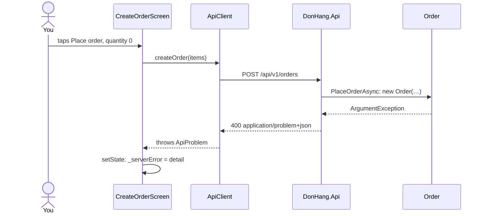

## Before you start

- [[frontend.l2.form-validation]] — you know that `CreateOrderScreen` runs its validators through `validate()` and calls `ApiClient.createOrder` only when they all pass.
- [[frontend.l2.overriding-providers-in-tests]] — you know that a widget test can replace what a provider gives with `ProviderScope(overrides: […])`, so no server is needed.
- [[backend.l2.problem-types]] — you know the Problem Details fields: `type` identifies the problem, `title` summarises it, `detail` explains this occurrence.
- [[backend.l1.validating-input]] — you know that `DonHang.Api` checks a request in application code and answers `400` with a `detail` before saving anything.

## The situation

At stage-2 the order form refuses a quantity of `0` before anything is sent. Yet the `Order` constructor in `DonHang.Domain` still throws when an item's quantity is below 1, and a teammate asks whether that check is now dead code. Then you notice the opposite gap: the form passes, the order goes out, and the API answers with something other than `201`. The customer has chosen a product and typed a quantity. What should they see, and what should happen to what they entered?

## Core concepts

- server-side check — a rule `DonHang.Api` applies to every request it receives, whoever sent it; here, the `Order` constructor refusing a quantity below 1.
- `ApiProblem` — a Dart class in `api_client.dart` that holds the `status`, `type`, `title` and `detail` of a Problem Details response; `createOrder` throws one for any answer other than `201`.
- `_serverError` — a field of the order screen's `State` that holds the `detail` of the last refusal, or `null` when there is none to show.
- `RejectingApiClient` — a fake `ApiClient` in the widget test whose `createOrder` always throws a `400` `ApiProblem`, so the screen's error path runs without a server.

## How it works



The diagram follows a quantity of `0` as if the form's quantity check were missing, the case the widget test below fakes.

The form's validators run inside the app, so they protect only requests that the app sends. Anyone signed in as a customer can send the same `POST /api/v1/orders` with `curl` (a command-line program that sends one HTTP request) or another program, and none of the app's checks run then. That is why the server-side check stays. `OrderService.PlaceOrderAsync` calls `new Order(…)`, which at stage-2 throws `ArgumentException` for a quantity below 1. The API's exception-handling middleware has answered any `ArgumentException` with `400` since stage-1, with the exception's message as `detail`; before this check existed, the database's `CHECK` refused the same quantity and the middleware answered a generic `500`. The form's check only saves the customer a request and a wait.

The body reaches `ApiClient.createOrder` as a response with status `400`. Before stage-2, `createOrder` threw a plain `Exception` with only the status code; now it reads the body into an `ApiProblem`, so the screen gets the server's own words in `detail`.

`_submit` catches it with `on ApiProblem catch (problem)` and calls `setState` to put `problem.detail` into `_serverError`. The rebuild draws that text above the "Place order" button in the theme's error color. Nothing else changes: the product stays chosen and `_quantityController`, the `TextEditingController` holding the quantity field's text, keeps it, so the customer fixes one value and taps again.

From the stage-2 app this path is hard to reach on purpose, because the form already stops a quantity below 1. A widget test reaches it with a fake instead.

## In the Đơn Hàng system

`ApiProblem`, in `DonHang.App/lib/api_client.dart`. Just above it, `createOrder` ends with `throw ApiProblem.fromResponse(response);` for any status other than `201`:

```dart file=DonHang.App/lib/api_client.dart tag=stage-2 lines=71-92
// lesson: frontend.l2.server-errors-in-forms
// An RFC 9457 Problem Details body (application/problem+json) as a Dart
// object. A response with no such body, such as a bare 401 or 403, still
// becomes one, with the status code as its detail.
class ApiProblem implements Exception {
  final int status;
  final String type;
  final String title;
  final String detail;

  ApiProblem({required this.status, required this.type, required this.title, required this.detail});

  factory ApiProblem.fromResponse(http.Response response) {
    final body = _jsonObjectOrEmpty(response.body);
    return ApiProblem(
      status: response.statusCode,
      // No `type` means "about:blank": nothing more specific than the status.
      type: body['type'] as String? ?? 'about:blank',
      title: body['title'] as String? ?? 'HTTP ${response.statusCode}',
      detail: body['detail'] as String? ?? body['title'] as String? ?? 'HTTP ${response.statusCode}',
    );
  }
```

`fromResponse` reads the four fields from the JSON body. A missing `type` becomes `about:blank`, as the Problem Details rules say. A body that is empty or not a JSON object still gives an `ApiProblem`, with `HTTP 401` or similar as its `detail`. For the quantity rule, the real API answers `{"title":"Invalid request","status":400,"detail":"every item needs a quantity of at least 1"}`, with no `type`.

The first test in `DonHang.App/test/create_order_screen_test.dart`:

```dart file=DonHang.App/test/create_order_screen_test.dart tag=stage-2 lines=30-54
  testWidgets('shows the API detail and keeps what was typed', (tester) async {
    await tester.pumpWidget(ProviderScope(
      overrides: [
        apiClientProvider.overrideWithValue(RejectingApiClient()),
        productsProvider.overrideWith((ref) async => [Product(id: 1, name: 'Bàn phím cơ', priceVnd: 1250000)]),
      ],
      child: const MaterialApp(
        locale: Locale('en'),
        localizationsDelegates: AppLocalizations.localizationsDelegates,
        supportedLocales: AppLocalizations.supportedLocales,
        home: CreateOrderScreen(),
      ),
    ));
    await tester.pump();

    await tester.tap(find.byType(DropdownButtonFormField<Product>));
    await tester.pumpAndSettle();
    await tester.tap(find.text('Bàn phím cơ').last);
    await tester.pumpAndSettle();
    await tester.enterText(find.byType(TextFormField), '2');
    await tester.tap(find.text('Place order'));
    await tester.pumpAndSettle();

    expect(find.text('every item needs a quantity of at least 1'), findsOneWidget);
    expect(find.widgetWithText(TextFormField, '2'), findsOneWidget);
```

`apiClientProvider.overrideWithValue(RejectingApiClient())` puts the fake where the real client would be, so `_submit` gets a `400` `ApiProblem` with the API's quantity message. `productsProvider.overrideWith` gives it a function that returns one product instead of loading the list. The locale is fixed to English so the test can find the button by its text `Place order`. The test opens the drop-down, taps the product's entry in the list, types `2`, a quantity the validator accepts, and taps the button, so the fake refuses a valid form the way the API refuses a quantity of `0`; `pumpAndSettle` lets every resulting rebuild finish. The first `expect` finds the detail on screen, and the second finds a `TextFormField` that still holds `2`.

## Beginners often think…

- **"If the form passes its validators, the server will accept the order."** → Actually the validators check only what the app knows; the API decides, and it can still refuse. You notice this when you leave the order screen open long enough for your access token to expire: the form passes, the API answers `401` with an empty body, and `HTTP 401` appears above the button.
- **"Once the app validates input, the API can skip its own checks."** → Actually the API is the one place every order passes through, and many callers never run the app's code. You notice this when a `POST /api/v1/orders` sent with `curl` and a quantity of `0` gets `400` with `every item needs a quantity of at least 1`: only the server-side check stood in the way.
- **"After a failed request the form should be cleared so the customer starts again."** → Actually the `detail` usually points at one value, and clearing makes the customer redo everything, including values that were fine. `_submit` touches only `_serverError`, never the controller or the chosen product. You notice this when you run the widget test: its second `expect` checks exactly that the quantity is still `2`.

## Try it (3 minutes)

1. From the `DonHang.App` folder, run `flutter test test/create_order_screen_test.dart`. Docker does not have to be running.
2. In `lib/screens/create_order_screen.dart`, line 62, replace `setState(() => _serverError = problem.detail)` with `setState(() { _serverError = problem.detail; _quantityController.clear(); })`. Run the same command again, then undo the change with `git checkout -- lib/screens/create_order_screen.dart`.

Expected result: the first run ends with `+2: All tests passed!`. The second run fails only `shows the API detail and keeps what was typed`, at line 54, reporting `Found 0 widgets with type "TextFormField" that are ancestors of widgets with text "2"`, and ends with `+1 -1: Some tests failed.`

In the failing test, the `expect` on line 53 still passed. Why?

<details><summary>Suggested answer</summary>

Your change still put `problem.detail` into `_serverError`, so the detail text was drawn above the button and line 53 found it. It also emptied the quantity controller, so no `TextFormField` holds `2` any more, and line 54 failed. The test checks the two promises separately: show the server's reason, and keep what the customer typed.

</details>

## Connections

- [[frontend.l2.form-validation]] — the first line of defence; this lesson is what happens when the request goes out anyway and the API still says no.
- [[backend.l1.validating-input]] — the other side of the same `400`: the server checks the request and explains the problem in `detail`.
- [[backend.l2.problem-types]] — `ApiProblem` keeps `type`, the field a client would compare to tell two refusals apart.
- [[frontend.l2.overriding-providers-in-tests]] — the same override technique, here used to replace the whole `ApiClient` with a fake.
- [[frontend.l2.route-guards]] — the same idea one screen earlier: the app's check is a convenience, and the API still decides.

## Five-line summary

1. The form's checks only save a request; `DonHang.Api` checks every order again, because any client can call it without the app.
2. At stage-2 an item with a quantity below 1 still gets `400` from the `Order` constructor, with a Problem Details body.
3. `ApiClient.createOrder` turns any non-`201` answer into an `ApiProblem` holding `status`, `type`, `title` and `detail`.
4. `CreateOrderScreen` shows the `detail` above the button in the theme's error color and keeps every field as the customer left it.
5. A widget test overrides `apiClientProvider` with a fake that throws a `400`, and checks the detail appears and the quantity stays.
