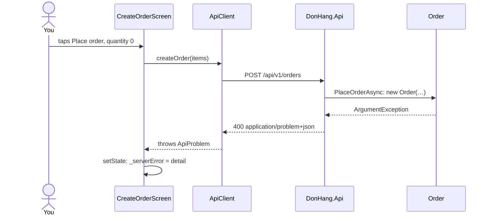

## Bạn cần biết trước

- [[frontend.l2.form-validation]] — bạn biết rằng `CreateOrderScreen` chạy các validator qua `validate()` và chỉ gọi `ApiClient.createOrder` khi tất cả đều qua.
- [[frontend.l2.overriding-providers-in-tests]] — bạn biết rằng một widget test có thể thay thứ mà một provider trả về bằng `ProviderScope(overrides: […])`, nên không cần server.
- [[backend.l2.problem-types]] — bạn biết các trường của Problem Details: `type` xác định loại lỗi, `title` tóm tắt nó, `detail` giải thích lần xảy ra cụ thể này.
- [[backend.l1.validating-input]] — bạn biết rằng `DonHang.Api` kiểm tra request trong code ứng dụng và trả lời `400` kèm `detail` trước khi lưu bất cứ thứ gì.

## Tình huống

Ở stage-2, form đặt hàng đã từ chối số lượng `0` trước khi gửi bất cứ thứ gì. Vậy mà constructor của `Order` trong `DonHang.Domain` vẫn ném lỗi khi số lượng của một dòng hàng nhỏ hơn 1, và một đồng nghiệp hỏi liệu phép kiểm tra đó giờ có phải code chết không. Rồi bạn nhận ra khoảng hở theo chiều ngược lại: form qua, đơn được gửi đi, và API trả lời một thứ khác `201`. Khách đã chọn sản phẩm và gõ số lượng. Họ nên thấy gì, và những gì họ đã nhập nên ra sao?

## Khái niệm cốt lõi

- phép kiểm tra phía server — một quy tắc mà `DonHang.Api` áp cho mọi request nó nhận, bất kể ai gửi. Ở đây là constructor của `Order` từ chối số lượng nhỏ hơn 1.
- `ApiProblem` — một class Dart trong `api_client.dart`, giữ `status`, `type`, `title` và `detail` của một response Problem Details. `createOrder` ném nó ra với mọi câu trả lời khác `201`.
- `_serverError` — một field trong `State` của màn hình đặt hàng, giữ `detail` của lần bị từ chối gần nhất, hoặc `null` khi không có gì để hiện.
- `RejectingApiClient` — một `ApiClient` fake trong widget test, có `createOrder` luôn ném một `ApiProblem` `400`, nhờ đó nhánh lỗi của màn hình chạy được mà không cần server.

## Cơ chế hoạt động



Sơ đồ đi theo một số lượng `0` như thể form thiếu phép kiểm tra số lượng, đúng trường hợp mà widget test bên dưới giả lập.

Validator của form chạy bên trong app, nên chúng chỉ bảo vệ những request do app gửi. Ai đăng nhập với tư cách khách hàng cũng gửi được cùng `POST /api/v1/orders` đó bằng `curl` (một chương trình dòng lệnh gửi một HTTP request) hay một chương trình khác, và khi đó không phép kiểm tra nào của app chạy cả. Vì thế phép kiểm tra phía server phải ở lại. `OrderService.PlaceOrderAsync` gọi `new Order(…)`, và ở stage-2 constructor này ném `ArgumentException` khi số lượng nhỏ hơn 1. Middleware xử lý exception của API đã trả lời mọi `ArgumentException` bằng `400` từ stage-1, với message của exception làm `detail`. Trước khi có phép kiểm tra này, `CHECK` của database từ chối cùng số lượng đó và middleware trả lời một lỗi `500` chung chung. Phép kiểm tra của form chỉ giúp khách đỡ một request và một lần chờ.

Body tới `ApiClient.createOrder` dưới dạng một response có status `400`. Trước stage-2, `createOrder` ném một `Exception` trơn chỉ mang status code. Giờ nó đọc body thành một `ApiProblem`, nên màn hình nhận được chính lời của server trong `detail`.

`_submit` bắt nó bằng `on ApiProblem catch (problem)` và gọi `setState` để đưa `problem.detail` vào `_serverError`. Lần build lại vẽ dòng chữ đó phía trên nút "Place order", bằng màu báo lỗi của theme. Ngoài ra không gì đổi: sản phẩm vẫn được chọn, và `_quantityController`, `TextEditingController` giữ chữ của ô số lượng, vẫn giữ nguyên chữ. Khách chỉ cần sửa một giá trị rồi bấm lại.

Từ app ở stage-2, đường đi này cố ý khó chạm tới, vì form đã chặn số lượng nhỏ hơn 1. Widget test chạm tới nó bằng một fake.

## Trong hệ thống Đơn Hàng

`ApiProblem`, trong `DonHang.App/lib/api_client.dart`. Ngay phía trên nó, `createOrder` kết thúc bằng `throw ApiProblem.fromResponse(response);` với mọi status khác `201`:

```dart file=DonHang.App/lib/api_client.dart tag=stage-2 lines=71-92
// lesson: frontend.l2.server-errors-in-forms
// An RFC 9457 Problem Details body (application/problem+json) as a Dart
// object. A response with no such body, such as a bare 401 or 403, still
// becomes one, with the status code as its detail.
class ApiProblem implements Exception {
  final int status;
  final String type;
  final String title;
  final String detail;

  ApiProblem({required this.status, required this.type, required this.title, required this.detail});

  factory ApiProblem.fromResponse(http.Response response) {
    final body = _jsonObjectOrEmpty(response.body);
    return ApiProblem(
      status: response.statusCode,
      // No `type` means "about:blank": nothing more specific than the status.
      type: body['type'] as String? ?? 'about:blank',
      title: body['title'] as String? ?? 'HTTP ${response.statusCode}',
      detail: body['detail'] as String? ?? body['title'] as String? ?? 'HTTP ${response.statusCode}',
    );
  }
```

`fromResponse` đọc bốn trường từ body JSON. Thiếu `type` thì thành `about:blank`, đúng như quy định của Problem Details. Body rỗng hoặc không phải object JSON vẫn cho ra một `ApiProblem`, với `detail` là `HTTP 401` hay tương tự. Với quy tắc số lượng, API thật trả lời `{"title":"Invalid request","status":400,"detail":"every item needs a quantity of at least 1"}`, không có `type`.

Test đầu tiên trong `DonHang.App/test/create_order_screen_test.dart`:

```dart file=DonHang.App/test/create_order_screen_test.dart tag=stage-2 lines=30-54
  testWidgets('shows the API detail and keeps what was typed', (tester) async {
    await tester.pumpWidget(ProviderScope(
      overrides: [
        apiClientProvider.overrideWithValue(RejectingApiClient()),
        productsProvider.overrideWith((ref) async => [Product(id: 1, name: 'Bàn phím cơ', priceVnd: 1250000)]),
      ],
      child: const MaterialApp(
        locale: Locale('en'),
        localizationsDelegates: AppLocalizations.localizationsDelegates,
        supportedLocales: AppLocalizations.supportedLocales,
        home: CreateOrderScreen(),
      ),
    ));
    await tester.pump();

    await tester.tap(find.byType(DropdownButtonFormField<Product>));
    await tester.pumpAndSettle();
    await tester.tap(find.text('Bàn phím cơ').last);
    await tester.pumpAndSettle();
    await tester.enterText(find.byType(TextFormField), '2');
    await tester.tap(find.text('Place order'));
    await tester.pumpAndSettle();

    expect(find.text('every item needs a quantity of at least 1'), findsOneWidget);
    expect(find.widgetWithText(TextFormField, '2'), findsOneWidget);
```

`apiClientProvider.overrideWithValue(RejectingApiClient())` đặt fake vào chỗ của client thật, nên `_submit` nhận một `ApiProblem` `400` mang câu báo lỗi số lượng của API. `productsProvider.overrideWith` trao cho provider một hàm trả về một sản phẩm, thay vì tải danh sách. Locale được cố định là tiếng Anh để test tìm được nút theo chữ `Place order`. Test mở danh sách thả xuống, bấm vào sản phẩm trong danh sách, gõ `2`, một số lượng mà validator chấp nhận, rồi bấm nút. Nhờ vậy fake từ chối một form hợp lệ đúng như API từ chối số lượng `0`. `pumpAndSettle` chờ mọi lần build lại sau đó chạy xong. `expect` thứ nhất tìm thấy câu detail trên màn hình, còn `expect` thứ hai tìm thấy một `TextFormField` vẫn giữ `2`.

## Người mới hay nghĩ rằng…

- **"Nếu form qua hết validator thì server sẽ nhận đơn."** → Thực ra validator chỉ kiểm tra những gì app biết. API mới là bên quyết định, và nó vẫn có thể từ chối. Bạn sẽ nhận ra khi để màn hình đặt hàng mở đủ lâu cho access token hết hạn: form qua, API trả lời `401` với body rỗng, và `HTTP 401` hiện phía trên nút.
- **"Một khi app đã kiểm tra dữ liệu vào, API có thể bỏ phép kiểm tra của nó."** → Thực ra API là nơi duy nhất mọi đơn đều đi qua, và nhiều bên gọi không hề chạy code của app. Bạn sẽ nhận ra khi một `POST /api/v1/orders` gửi bằng `curl` với số lượng `0` nhận `400` kèm `every item needs a quantity of at least 1`: chỉ phép kiểm tra phía server đứng chặn nó.
- **"Sau một request thất bại, form nên được xóa trắng để khách làm lại từ đầu."** → Thực ra `detail` thường chỉ ra một giá trị, còn xóa trắng bắt khách làm lại mọi thứ, kể cả những giá trị vốn đã ổn. `_submit` chỉ đụng tới `_serverError`, không bao giờ đụng tới controller hay sản phẩm đã chọn. Bạn sẽ nhận ra khi chạy widget test: `expect` thứ hai của nó kiểm tra đúng việc số lượng vẫn là `2`.

## Thử ngay (3 phút)

1. Từ thư mục `DonHang.App`, chạy `flutter test test/create_order_screen_test.dart`. Docker không cần đang chạy.
2. Trong `lib/screens/create_order_screen.dart`, dòng 62, thay `setState(() => _serverError = problem.detail)` bằng `setState(() { _serverError = problem.detail; _quantityController.clear(); })`. Chạy lại đúng lệnh đó, rồi hoàn tác thay đổi bằng `git checkout -- lib/screens/create_order_screen.dart`.

Kết quả mong đợi: lần chạy đầu kết thúc bằng `+2: All tests passed!`. Lần chạy thứ hai chỉ hỏng test `shows the API detail and keeps what was typed`, ở dòng 54, báo `Found 0 widgets with type "TextFormField" that are ancestors of widgets with text "2"`, và kết thúc bằng `+1 -1: Some tests failed.`

Trong test bị hỏng, `expect` ở dòng 53 vẫn qua. Vì sao?

<details><summary>Gợi ý đáp án</summary>

Thay đổi của bạn vẫn đưa `problem.detail` vào `_serverError`, nên câu detail vẫn được vẽ phía trên nút và dòng 53 tìm thấy nó. Nhưng thay đổi đó cũng xóa sạch controller của ô số lượng, nên không còn `TextFormField` nào giữ `2`, và dòng 54 hỏng. Test kiểm tra riêng hai lời hứa: hiện lý do của server, và giữ nguyên những gì khách đã gõ.

</details>

## Liên hệ

- [[frontend.l2.form-validation]] — lớp chặn đầu tiên. Bài này nói về chuyện xảy ra khi request vẫn đi ra và API vẫn nói không.
- [[backend.l1.validating-input]] — mặt bên kia của cùng lỗi `400`: server kiểm tra request và giải thích vấn đề trong `detail`.
- [[backend.l2.problem-types]] — `ApiProblem` giữ `type`, trường mà client sẽ so sánh để phân biệt hai lời từ chối.
- [[frontend.l2.overriding-providers-in-tests]] — cùng kỹ thuật override, ở đây dùng để thay cả `ApiClient` bằng một fake.
- [[frontend.l2.route-guards]] — cùng ý tưởng ở một màn hình trước đó: phép kiểm tra của app chỉ là để tiện, còn API vẫn là bên quyết định.

## Tóm tắt 5 dòng

1. Phép kiểm tra của form chỉ giúp đỡ một request; `DonHang.Api` kiểm tra lại mọi đơn, vì bất kỳ client nào cũng gọi được nó mà không qua app.
2. Ở stage-2, dòng hàng có số lượng nhỏ hơn 1 vẫn nhận `400` từ constructor của `Order`, kèm body Problem Details.
3. `ApiClient.createOrder` biến mọi câu trả lời khác `201` thành một `ApiProblem` giữ `status`, `type`, `title` và `detail`.
4. `CreateOrderScreen` hiện `detail` phía trên nút bằng màu báo lỗi của theme, và giữ mọi ô đúng như khách để lại.
5. Một widget test override `apiClientProvider` bằng một fake ném lỗi `400`, rồi kiểm tra câu detail hiện ra và số lượng vẫn còn.
