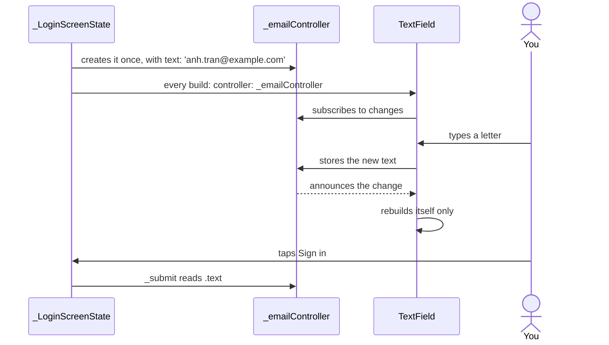

## Before you start

- [[frontend.l1.logging-in-from-the-app]] — you know that `LoginScreen` sends the email and password to `ApiClient.login` and shows the error text in red when sign-in fails.
- [[frontend.l1.setstate-and-rebuilding]] — you know that `setState` makes a `State` build again, and that assigning to a field alone changes nothing on screen.

## The situation

You open the sign-in screen of the stage-1 app. The email and password are already filled in. You clear the email, type a different address, change the password to something wrong and tap "Sign in". The red error appears, so `_submit` called `setState` and the whole screen built again, yet the address you typed is still in the field. Look at `_LoginScreenState`: it has no `String` field for the email, and nothing calls `setState` while you type. Where does the typed text live, and why does it survive the rebuild?

## Core concepts

- `TextField` — the widget that draws an input box and lets the user edit text in it; like every widget, it is a description that each `build` creates anew.
- `TextEditingController` — an object that holds the current text of one field; the field shows its text, typing changes it, and your code reads it through `.text`.
- `text:` — the constructor parameter of `TextEditingController` that sets the text the controller starts with, so the field opens already filled in.
- `dispose` — a method of the controller, called by its owner once nobody needs it, that empties its list of listeners and leaves it unusable; the Flutter docs show that call inside the `State`'s own `dispose` method.

## How it works



Start at the top. When `_LoginScreenState` is created, it creates `_emailController` once, as a field, with `text:` set to the email of a sample customer that the example database starts with (a seeded customer). The `State` lives as long as the screen does, so the controller lives with it.

Every time `build` runs, it creates a new `TextField` and hands it the same controller. The field subscribes to the controller: the widgets inside the field that show the text and the label ask the controller to tell them whenever its text changes. The controller plays the subject's role in the Observer pattern: it keeps a list of listeners and calls each one when its text changes.

When you type a letter, the field stores the new text in the controller. The controller announces the change, and the widgets inside the field build again to show the new letter. They do this by themselves: Flutter's own code for those widgets calls `setState` in their own `State` when told, so your code never has to. `_LoginScreenState.build` does not run. That is why typing needs no `setState`: the screen around the field has nothing new to show.

When you tap "Sign in", `_submit` reads `_emailController.text`. That is the only moment the screen looks at what you typed. The error rebuild in the situation made new `TextField` objects, but it gave them the same controller, which still held your address.

The last question is cleanup. The Flutter docs ask you to call the controller's `dispose` when it is no longer needed, and show it inside the `State`'s `dispose`, which Flutter calls when the `State` is removed from the widget tree for good.

## In the Đơn Hàng system

The fields of `_LoginScreenState` and the start of `_submit`, in `DonHang.App/lib/screens/login_screen.dart`:

```dart file=DonHang.App/lib/screens/login_screen.dart tag=stage-1 lines=17-29
class _LoginScreenState extends State<LoginScreen> {
  final _emailController = TextEditingController(text: 'anh.tran@example.com');
  final _passwordController = TextEditingController(text: 'donhang-dev-password');
  String? _error;
  bool _loading = false;

  Future<void> _submit() async {
    setState(() {
      _loading = true;
      _error = null;
    });
    try {
      await widget.apiClient.login(_emailController.text, _passwordController.text);
```

The two controllers are `final` fields, created once per `State`. `text:` fills in `anh.tran@example.com`, the first seeded customer, and `donhang-dev-password`, the one password every seeded customer shares in the lab, so signing in takes one tap. `_submit` reads `.text` from both only when the button is pressed. `_error` and `_loading` change through `setState`; the typed text never does.

The two fields inside `build`:

```dart file=DonHang.App/lib/screens/login_screen.dart tag=stage-1 lines=47-57
        child: Column(
          crossAxisAlignment: CrossAxisAlignment.stretch,
          children: [
            TextField(controller: _emailController, decoration: const InputDecoration(labelText: 'Email')),
            TextField(
              controller: _passwordController,
              decoration: const InputDecoration(labelText: 'Password'),
              obscureText: true,
            ),
            const SizedBox(height: 16),
            if (_error != null) Text(_error!, style: const TextStyle(color: Colors.red)),
```

Each `TextField` gets its controller through `controller:`; the other arguments only set the label and hide the password, and play no part in keeping the text. When `_error` is set and the screen builds again, these lines run again and make new fields, but they receive the same two controllers. The rest of the file ends at line 67 with no `dispose` method, so at stage-1 these two controllers are never disposed.

## Beginners often think…

- **"Each keystroke needs setState, or the typed text is lost."** → Actually the field and its controller update each other: typing stores the text in the controller, and the controller tells the field to redraw. `setState` is for fields of your own `State` that `build` reads, and `build` here never reads the typed text. You notice this when you read `LoginScreen`: the only `setState` calls are in `_submit`, yet typing works.
- **"The typed text lives in the TextField widget, so it disappears whenever the screen rebuilds."** → Actually each `build` throws away the old `TextField` objects and makes new ones, but the text sits in the controller that the `State` keeps. You notice this when a failed sign-in shows the red error and your typed email is still in the field.
- **"A TextEditingController needs no cleanup, because Dart frees unused objects by itself."** → Actually the garbage collector reclaims memory, but it never calls `dispose` for you, so whatever the controller's `dispose` does is skipped, and the Flutter docs ask for `dispose` whenever a controller is no longer needed. You notice this in a code review, when a `State` creates a controller and has no `dispose` method, as `_LoginScreenState` at stage-1 does.

## Try it (3 minutes)

Predict what the email field shows in each case. Use the two blocks above as the starting point:

1. `LoginScreen` exactly as it is. You replace the email with `x@example.com`, type a wrong password and tap "Sign in".
2. Suppose `build` created `TextEditingController(text: 'anh.tran@example.com')` on every run and gave that new object to the email field instead of `_emailController`. You do the same three steps.

Expected result: 1 — the red error appears and the field still shows `x@example.com`. 2 — the red error appears and the field shows `anh.tran@example.com` again; your typing is gone.

Why does creating the controller inside `build` lose the text?

<details><summary>Suggested answer</summary>

In case 1 the controller is created once, with the `State`, and every build hands the same object to the new `TextField`, so the typed text is still there. In case 2 the rebuild caused by `setState` in `_submit` runs `build` again, which creates a brand-new controller holding only its starting text. The field is given that new controller and shows what it holds. The text you typed was in the controller from the previous build, which nothing uses any more.

</details>

## Connections

- [[frontend.l1.setstate-and-rebuilding]] — the rebuild that this lesson shows the typed text surviving, and why typing does not need it.
- [[frontend.l1.logging-in-from-the-app]] — the `_submit` that reads the two controllers and sends their text to `ApiClient.login`.
- [[design.l2.observer-pattern]] — the same idea in C#: the controller keeps a list of listeners and calls each one on a change.
- [[frontend.l2.form-validation]] — the next step: fields inside a `Form` whose values are checked before an order is sent.

## Five-line summary

1. A `TextField` shows and edits text, but the text lives in a `TextEditingController` that the `State` keeps across rebuilds.
2. Each `build` makes new `TextField` objects and hands them the same controller, so a rebuild keeps what the user typed.
3. `text:` in the constructor starts the field filled in, as `LoginScreen` does with a seeded email and the lab password.
4. Typing needs no `setState`: the field listens to its controller and redraws itself, and nothing else on the screen changes.
5. The Flutter docs ask for `dispose` on a controller no longer needed; `LoginScreen` at stage-1 never disposes its two.
