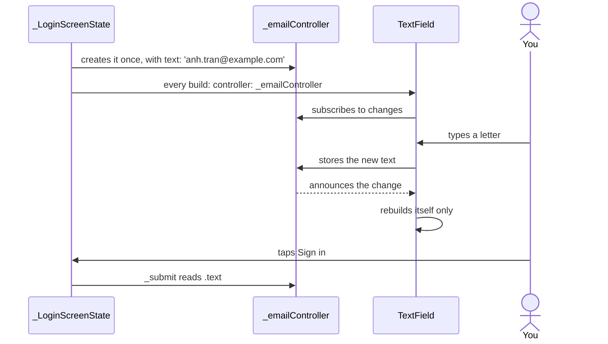

## Bạn cần biết trước

- [[frontend.l1.logging-in-from-the-app]] — bạn biết rằng `LoginScreen` gửi email và mật khẩu cho `ApiClient.login`, và hiện dòng lỗi màu đỏ khi đăng nhập thất bại.
- [[frontend.l1.setstate-and-rebuilding]] — bạn biết rằng `setState` khiến một `State` build lại, và chỉ gán giá trị cho một field thì màn hình không đổi gì.

## Tình huống

Bạn mở màn hình đăng nhập của app ở stage-1. Email và mật khẩu đã được điền sẵn. Bạn xóa email, gõ một địa chỉ khác, đổi mật khẩu thành một chuỗi sai rồi bấm "Sign in". Dòng lỗi đỏ hiện ra, tức là `_submit` đã gọi `setState` và cả màn hình đã build lại, vậy mà địa chỉ bạn vừa gõ vẫn nằm nguyên trong ô. Nhìn vào `_LoginScreenState`: nó không có field `String` nào cho email, và không có gì gọi `setState` trong lúc bạn gõ. Chữ bạn gõ nằm ở đâu, và vì sao nó sống sót qua lần build lại?

## Khái niệm cốt lõi

- `TextField` — widget vẽ một ô nhập và cho người dùng sửa chữ trong đó. Như mọi widget, nó chỉ là một bản mô tả, được tạo mới ở mỗi lần `build`.
- `TextEditingController` — object giữ chữ hiện tại của một ô nhập. Ô nhập hiện chữ của nó, gõ phím làm chữ đổi, và code của bạn đọc chữ qua `.text`.
- `text:` — tham số constructor của `TextEditingController`, đặt chữ ban đầu cho controller, nhờ vậy ô nhập mở ra đã có sẵn chữ.
- `dispose` — method của controller, do bên sở hữu nó gọi khi không còn ai cần tới nó. Method này xóa sạch danh sách listener và khiến controller không dùng được nữa. Tài liệu Flutter đặt lời gọi này bên trong method `dispose` của chính `State`.

## Cơ chế hoạt động



Bắt đầu từ trên cùng. Khi `_LoginScreenState` được tạo, nó tạo `_emailController` đúng một lần, dưới dạng field, với `text:` là email của một khách hàng mẫu có sẵn trong database ví dụ (khách hàng seed). `State` sống bao lâu thì màn hình sống bấy lâu, nên controller cũng sống cùng nó.

Mỗi lần `build` chạy, nó tạo một `TextField` mới và trao cho ô nhập đó cùng một controller. Ô nhập đăng ký theo dõi controller: các widget bên trong ô, những widget hiện chữ và nhãn, nhờ controller báo cho chúng mỗi khi chữ thay đổi. Controller đóng vai subject trong Observer pattern: nó giữ một danh sách listener và gọi từng listener khi chữ của nó đổi.

Khi bạn gõ một chữ, ô nhập lưu chữ mới vào controller. Controller báo có thay đổi, và các widget bên trong ô build lại để hiện chữ vừa gõ. Chúng tự làm việc này: chính code của Flutter cho những widget đó gọi `setState` trong `State` riêng của chúng khi được báo, nên code của bạn không bao giờ phải gọi. `_LoginScreenState.build` không chạy. Vì thế gõ phím không cần `setState`: màn hình bao quanh ô nhập chẳng có gì mới để hiện.

Khi bạn bấm "Sign in", `_submit` đọc `_emailController.text`. Đó là lúc duy nhất màn hình nhìn tới chữ bạn đã gõ. Lần build lại vì lỗi trong tình huống đã tạo ra các object `TextField` mới, nhưng vẫn trao cho chúng đúng controller cũ, nơi địa chỉ của bạn vẫn còn.

Câu hỏi cuối cùng là dọn dẹp. Tài liệu Flutter yêu cầu bạn gọi `dispose` của controller khi không còn cần nó, và minh họa lời gọi đó bên trong `dispose` của `State`, method Flutter gọi khi `State` bị gỡ khỏi widget tree vĩnh viễn.

## Trong hệ thống Đơn Hàng

Các field của `_LoginScreenState` và phần đầu của `_submit`, trong `DonHang.App/lib/screens/login_screen.dart`:

```dart file=DonHang.App/lib/screens/login_screen.dart tag=stage-1 lines=17-29
class _LoginScreenState extends State<LoginScreen> {
  final _emailController = TextEditingController(text: 'anh.tran@example.com');
  final _passwordController = TextEditingController(text: 'donhang-dev-password');
  String? _error;
  bool _loading = false;

  Future<void> _submit() async {
    setState(() {
      _loading = true;
      _error = null;
    });
    try {
      await widget.apiClient.login(_emailController.text, _passwordController.text);
```

Hai controller là field `final`, được tạo một lần cho mỗi `State`. `text:` điền sẵn `anh.tran@example.com`, khách hàng seed đầu tiên, và `donhang-dev-password`, mật khẩu duy nhất mà mọi khách hàng seed dùng chung trong lab, nên đăng nhập chỉ cần một lần bấm. `_submit` chỉ đọc `.text` của cả hai khi nút được bấm. `_error` và `_loading` đổi qua `setState`, còn chữ bạn gõ thì không bao giờ.

Hai ô nhập bên trong `build`:

```dart file=DonHang.App/lib/screens/login_screen.dart tag=stage-1 lines=47-57
        child: Column(
          crossAxisAlignment: CrossAxisAlignment.stretch,
          children: [
            TextField(controller: _emailController, decoration: const InputDecoration(labelText: 'Email')),
            TextField(
              controller: _passwordController,
              decoration: const InputDecoration(labelText: 'Password'),
              obscureText: true,
            ),
            const SizedBox(height: 16),
            if (_error != null) Text(_error!, style: const TextStyle(color: Colors.red)),
```

Mỗi `TextField` nhận controller của nó qua `controller:`. Các tham số còn lại chỉ đặt nhãn và che mật khẩu, không đóng vai trò gì trong việc giữ chữ. Khi `_error` được gán và màn hình build lại, những dòng này chạy lại và tạo ra ô nhập mới, nhưng các ô đó vẫn nhận đúng hai controller cũ. Phần còn lại của file kết thúc ở dòng 67 mà không có method `dispose` nào, nên ở stage-1 hai controller này không bao giờ được dispose.

## Người mới hay nghĩ rằng…

- **"Mỗi lần gõ phím đều cần setState, nếu không chữ vừa gõ sẽ mất."** → Thực ra ô nhập và controller tự cập nhật cho nhau: gõ phím lưu chữ vào controller, rồi controller bảo ô nhập vẽ lại. `setState` dành cho những field trong `State` của bạn mà `build` đọc, còn `build` ở đây không hề đọc chữ bạn gõ. Bạn sẽ nhận ra khi đọc `LoginScreen`: mọi lời gọi `setState` đều nằm trong `_submit`, vậy mà gõ phím vẫn chạy.
- **"Chữ đã gõ nằm trong widget TextField, nên cứ màn hình build lại là nó biến mất."** → Thực ra mỗi lần `build` bỏ các object `TextField` cũ và tạo object mới, nhưng chữ nằm trong controller mà `State` giữ. Bạn sẽ nhận ra khi đăng nhập thất bại, dòng lỗi đỏ hiện ra mà email bạn gõ vẫn còn trong ô.
- **"TextEditingController không cần dọn dẹp, vì Dart tự giải phóng object không dùng tới."** → Thực ra garbage collector thu hồi bộ nhớ nhưng không bao giờ gọi `dispose` giúp bạn, nên mọi việc `dispose` của controller làm đều bị bỏ qua, và tài liệu Flutter yêu cầu gọi `dispose` mỗi khi controller không còn cần nữa. Bạn sẽ nhận ra trong code review, khi một `State` tạo controller mà không có method `dispose`, như `_LoginScreenState` ở stage-1.

## Thử ngay (3 phút)

Hãy đoán ô email hiện gì trong từng trường hợp. Lấy hai đoạn code ở trên làm điểm xuất phát:

1. `LoginScreen` giữ nguyên như hiện tại. Bạn thay email bằng `x@example.com`, gõ một mật khẩu sai rồi bấm "Sign in".
2. Giả sử mỗi lần chạy, `build` tạo `TextEditingController(text: 'anh.tran@example.com')` và trao object mới đó cho ô email thay vì `_emailController`. Bạn làm lại đúng ba bước trên.

Kết quả mong đợi: 1 — dòng lỗi đỏ hiện ra và ô vẫn hiện `x@example.com`. 2 — dòng lỗi đỏ hiện ra và ô lại hiện `anh.tran@example.com`, chữ bạn gõ đã mất.

Vì sao tạo controller bên trong `build` lại làm mất chữ?

<details><summary>Gợi ý đáp án</summary>

Ở trường hợp 1, controller được tạo một lần cùng với `State`, và lần build nào cũng trao đúng object đó cho `TextField` mới, nên chữ đã gõ vẫn còn. Ở trường hợp 2, lần build lại do `setState` trong `_submit` gây ra chạy `build` thêm lần nữa, và `build` tạo một controller hoàn toàn mới chỉ giữ chữ ban đầu. Ô nhập được trao controller mới này và hiện thứ nó đang giữ. Chữ bạn gõ nằm trong controller của lần build trước, thứ giờ không còn ai dùng.

</details>

## Liên hệ

- [[frontend.l1.setstate-and-rebuilding]] — lần build lại mà bài này cho thấy chữ đã gõ vẫn sống sót qua, và vì sao gõ phím không cần tới nó.
- [[frontend.l1.logging-in-from-the-app]] — `_submit` đọc hai controller và gửi chữ của chúng cho `ApiClient.login`.
- [[design.l2.observer-pattern]] — cùng ý tưởng đó trong C#: controller giữ một danh sách listener và gọi từng listener khi có thay đổi.
- [[frontend.l2.form-validation]] — bước tiếp theo: các ô nhập nằm trong một `Form`, giá trị được kiểm tra trước khi gửi đơn.

## Tóm tắt 5 dòng

1. `TextField` hiện và sửa chữ, nhưng chữ nằm trong một `TextEditingController` mà `State` giữ qua các lần build lại.
2. Mỗi lần `build` tạo object `TextField` mới và trao cho chúng cùng một controller, nên build lại vẫn giữ chữ người dùng đã gõ.
3. `text:` trong constructor cho ô nhập mở ra đã có sẵn chữ, như `LoginScreen` làm với một email seed và mật khẩu của lab.
4. Gõ phím không cần `setState`: ô nhập lắng nghe controller của nó và tự vẽ lại, phần còn lại của màn hình không đổi.
5. Tài liệu Flutter yêu cầu `dispose` controller khi không còn cần, còn `LoginScreen` ở stage-1 không bao giờ dispose hai controller của nó.
