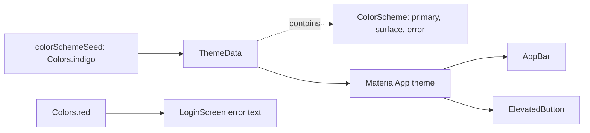

## Before you start

- [[frontend.l1.buildcontext]] — you know that code finds what an ancestor provides by looking upward from a `BuildContext`, as `Navigator.of(context)` finds the navigator from `MaterialApp`.
- [[frontend.l1.composing-widgets]] — you know that each screen of the Đơn Hàng app is its own widget below `MaterialApp`, built from smaller widgets.

## The situation

At stage-1 you open the sign-in screen of DonHang.App, type a wrong password and press `Sign in`. A line appears above the button: `Exception: login failed (401)`, in bright red.

Look at the rest of the screen. The page and its title bar are almost white with a faint violet tint, and the button's label is a muted indigo. The product list looks the same way. Now search the screens' code for color names: the only one you find is `Colors.red`, on that error line. Nobody wrote indigo on the button or white on the title bar. Where do the colors of a screen come from when its code never names them?

## Core concepts

- `ThemeData` — the object that holds the app-wide look, such as colors and text styles; `MaterialApp` takes one as its `theme` and makes it available to every widget below it.
- **color scheme** — the set of named color roles a theme gives its widgets, such as `primary`, `onPrimary`, `surface` and `error`; in Flutter it is a `ColorScheme`, and it can be generated from one seed color.
- `Theme.of(context)` — the call that finds the nearest theme above a widget; it also looks upward from the widget's position, as `Navigator.of(context)` does, and `.colorScheme` on its result gives the roles.
- **design token** — a named design value, such as a color role, used instead of a raw value, so that one change to the theme reaches every screen that names it.

## How it works



Read the top row first. In the situation above, `main.dart` builds one `ThemeData` with `colorSchemeSeed: Colors.indigo`. The seed is not painted anywhere as it is.

Flutter uses it to generate a whole color scheme, stored inside the `ThemeData`: related colors, each under a role. `primary` is the main accent, a toned-down indigo that is not `Colors.indigo` itself. `onPrimary` is for text on a `primary` background. `surface` is the background of pages and bars, an almost white tinted by the seed (the faint violet you saw). `error` is the red for problems.

Next, `MaterialApp` receives that `ThemeData` as `theme` and makes it available to everything below it. Material is the set of ready-made widgets Flutter ships, such as `AppBar`, `ElevatedButton` and `TextField`, and Material 3, the version DonHang.App uses, fixes the role each widget uses by default. These widgets look up the theme when built. The app bar takes `surface` for its background; the elevated button is pale, so its label takes `primary`. That is why no screen names a color for them.

The bottom row is different. The sign-in error line never asks the theme; its style holds `Colors.red`, a fixed value. Asking by role, `Theme.of(context).colorScheme.error`, is the idea of a design token: the code names what the color is for, and the theme decides its value.

So the colors come from one place, the seed in `main.dart`, through roles that each widget looks up.

## In the Đơn Hàng system

The theme, in `DonHang.App/lib/main.dart`:

```dart file=DonHang.App/lib/main.dart tag=stage-1 lines=12-24
class DonHangApp extends StatelessWidget {
  const DonHangApp({super.key});

  @override
  Widget build(BuildContext context) {
    final apiClient = ApiClient();
    return MaterialApp(
      title: 'Đơn Hàng',
      theme: ThemeData(colorSchemeSeed: Colors.indigo, useMaterial3: true),
      home: ProductListScreen(apiClient: apiClient),
    );
  }
}
```

Line 20 is the whole theme of the app. `colorSchemeSeed` is the one color you choose, and the color scheme is generated from it. `useMaterial3: true` asks for the Material 3 look; in Flutter 3.47 that is already the default, so the flag changes nothing here. Because `ProductListScreen`, and every screen it opens, is built below this `MaterialApp`, all of them can read the theme.

The sign-in screen, in `DonHang.App/lib/screens/login_screen.dart`:

```dart file=DonHang.App/lib/screens/login_screen.dart tag=stage-1 lines=43-65
    return Scaffold(
      appBar: AppBar(title: const Text('Sign in')),
      body: Padding(
        padding: const EdgeInsets.all(16),
        child: Column(
          crossAxisAlignment: CrossAxisAlignment.stretch,
          children: [
            TextField(controller: _emailController, decoration: const InputDecoration(labelText: 'Email')),
            TextField(
              controller: _passwordController,
              decoration: const InputDecoration(labelText: 'Password'),
              obscureText: true,
            ),
            const SizedBox(height: 16),
            if (_error != null) Text(_error!, style: const TextStyle(color: Colors.red)),
            ElevatedButton(
              onPressed: _loading ? null : _submit,
              child: _loading ? const CircularProgressIndicator() : const Text('Sign in'),
            ),
          ],
        ),
      ),
    );
```

Compare line 44 with line 57. `AppBar` and `ElevatedButton` are given no color at all, so they follow the theme's roles. Line 57 is the only color written in any screen at stage-1, and it bypasses the theme. The design-token version would read `Theme.of(context).colorScheme.error`, and it could no longer be `const`: in Dart, as in C#, `const` means the value is fixed when the code is compiled, while the theme is found through `context` only when the app runs.

## Beginners often think…

- **"colorSchemeSeed sets the one color every widget is painted with."** → Actually the seed is only the input: Flutter generates a set of roles from it, and even `primary` is a different value from `Colors.indigo`. Most of the screen is `surface`, which is almost white. You notice this when you expect an indigo title bar and get a pale one.
- **"Writing Colors.red is the same as using the theme's error color, since both look red."** → Actually they are two different values, and only one of them is tied to the theme. `colorScheme.error` in DonHang.App's theme is a darker red than `Colors.red`. A `TextField` can show an error message under the field, set through its decoration, and Flutter colors that message with the theme's `error`. You notice this when such a message sits next to a line written with `Colors.red`: two different reds on one screen.

## Try it (3 minutes)

Imagine you change line 20 of `main.dart` to `colorSchemeSeed: Colors.teal`. Without running the app, predict for each item whether it changes:

1. The label of the `Sign in` button.
2. The background of the sign-in screen's title bar.
3. The red `Exception: login failed (401)` line after a wrong password.

Expected result: 1 changes, to a teal-based `primary`. 2 changes too, slightly: `surface` is regenerated from the new seed and gets a faint teal tint instead of a violet one. 3 stays exactly the same, because line 57 names `Colors.red` and never asks the theme.

Why can you tell that the product list screen's title bar changes too, without opening `product_list_screen.dart`?

<details><summary>Suggested answer</summary>

The product list is built below the same `MaterialApp`, and at stage-1 no screen names a color for its `AppBar`. The app bar looks up the theme above it and takes `surface`, so the only place that decides it is the seed in `main.dart`. That is the value of naming roles: one change there reaches every screen.

</details>

## Connections

- [[frontend.l1.buildcontext]] — the mechanism underneath: `Theme.of(context)` looks upward from a position in the tree, as `Navigator.of(context)` also does.
- [[frontend.l1.composing-widgets]] — the same idea for looks: small widgets name roles instead of colors, so they fit any screen that has a theme.
- [[frontend.l2.dark-mode]] — the next step: a second theme generated from the same seed, which only code that names roles follows.

## Five-line summary

1. A theme generates a whole set of named color roles from one seed, and widgets take their colors from those roles.
2. `DonHangApp` sets its `ThemeData` once through `MaterialApp`'s `theme`, and every widget below can read it.
3. `colorSchemeSeed: Colors.indigo` produces roles such as `primary`, `onPrimary`, `surface` and `error`, none of them simply indigo.
4. `AppBar` and `ElevatedButton` take their default colors from the roles, so no screen names a color for them.
5. `Theme.of(context).colorScheme.error` is a design token that follows the theme; `LoginScreen`'s `Colors.red` stays fixed.
