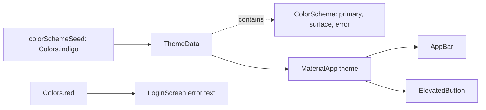

## Bạn cần biết trước

- [[frontend.l1.buildcontext]] — bạn biết code tìm thứ mà một widget tổ tiên cung cấp bằng cách nhìn ngược lên từ một `BuildContext`, như `Navigator.of(context)` tìm navigator do `MaterialApp` tạo.
- [[frontend.l1.composing-widgets]] — bạn biết mỗi màn hình của app Đơn Hàng là một widget riêng nằm dưới `MaterialApp`, ghép từ các widget nhỏ hơn.

## Tình huống

Ở stage-1, bạn mở màn hình đăng nhập của DonHang.App, gõ sai mật khẩu rồi bấm `Sign in`. Một dòng hiện ra phía trên nút: `Exception: login failed (401)`, màu đỏ tươi.

Giờ nhìn phần còn lại của màn hình. Nền trang và thanh tiêu đề gần như trắng, pha chút sắc tím nhạt, còn nhãn của nút là màu chàm dịu. Danh sách sản phẩm cũng trông như vậy. Thử tìm tên màu trong code của các màn hình: bạn chỉ thấy đúng một cái, `Colors.red`, ở dòng báo lỗi kia. Không ai viết màu chàm cho nút hay màu trắng cho thanh tiêu đề. Vậy màu của một màn hình đến từ đâu khi code của nó không hề gọi tên màu nào?

## Khái niệm cốt lõi

- `ThemeData` — object giữ diện mạo chung của cả app, như màu và kiểu chữ. `MaterialApp` nhận một object như vậy làm `theme` và đưa nó cho mọi widget bên dưới dùng.
- **color scheme** (Bộ màu đặt tên theo vai trò (primary, surface, error…) mà theme đưa cho widget, thường sinh từ một màu hạt) — bộ vai trò màu có tên mà theme đưa cho các widget của nó, như `primary`, `onPrimary`, `surface` và `error`. Trong Flutter nó là một `ColorScheme`, và có thể được sinh ra từ một màu hạt.
- `Theme.of(context)` — lời gọi tìm theme gần nhất phía trên một widget. Nó cũng nhìn ngược lên từ vị trí của widget, như `Navigator.of(context)`, và `.colorScheme` trên kết quả cho bạn các vai trò.
- **design token** (Giá trị thiết kế có tên, như một vai trò màu, dùng thay giá trị thô để đổi một chỗ là mọi màn hình theo) — một giá trị thiết kế có tên, như một vai trò màu, dùng thay cho giá trị thô, để một thay đổi ở theme tới được mọi màn hình gọi tên nó.

## Cơ chế hoạt động



Đọc hàng trên trước. Trong tình huống trên, `main.dart` dựng một `ThemeData` với `colorSchemeSeed: Colors.indigo`. Hạt màu này không được tô nguyên dạng ở đâu cả.

Flutter dùng nó để sinh ra cả một color scheme, cất bên trong `ThemeData`: các màu liên quan với nhau, mỗi màu gắn với một vai trò. `primary` là màu nhấn chính, một màu chàm dịu hơn và không phải chính `Colors.indigo`. `onPrimary` dành cho chữ nằm trên nền `primary`. `surface` là nền của trang và các thanh, gần như trắng và pha sắc của hạt màu (chút tím nhạt bạn đã thấy). `error` là màu đỏ dành cho lỗi.

Tiếp theo, `MaterialApp` nhận `ThemeData` đó làm `theme` và đưa nó cho mọi thứ bên dưới. Material là bộ widget dựng sẵn mà Flutter cung cấp, như `AppBar`, `ElevatedButton` và `TextField`. Material 3, phiên bản DonHang.App dùng, quy định mỗi widget mặc định dùng vai trò nào. Các widget này tìm theme khi được build. App bar lấy `surface` làm nền. Nút elevated có nền nhạt, nên nhãn của nó lấy `primary`. Đó là lý do không màn hình nào phải gọi tên màu cho chúng.

Hàng dưới thì khác. Dòng báo lỗi đăng nhập không bao giờ hỏi theme: style của nó giữ `Colors.red`, một giá trị cố định. Hỏi theo vai trò, `Theme.of(context).colorScheme.error`, chính là ý tưởng của design token: code gọi tên màu dùng để làm gì, còn theme quyết định giá trị.

Vậy màu đến từ một chỗ duy nhất, hạt màu trong `main.dart`, qua các vai trò mà từng widget tự tìm.

## Trong hệ thống Đơn Hàng

Theme, trong `DonHang.App/lib/main.dart`:

```dart file=DonHang.App/lib/main.dart tag=stage-1 lines=12-24
class DonHangApp extends StatelessWidget {
  const DonHangApp({super.key});

  @override
  Widget build(BuildContext context) {
    final apiClient = ApiClient();
    return MaterialApp(
      title: 'Đơn Hàng',
      theme: ThemeData(colorSchemeSeed: Colors.indigo, useMaterial3: true),
      home: ProductListScreen(apiClient: apiClient),
    );
  }
}
```

Dòng 20 là toàn bộ theme của app. `colorSchemeSeed` là một màu bạn chọn, và color scheme được sinh ra từ nó. `useMaterial3: true` yêu cầu giao diện Material 3. Ở Flutter 3.47 đó đã là mặc định, nên cờ này không đổi gì ở đây. Vì `ProductListScreen`, cùng mọi màn hình nó mở ra, được build bên dưới `MaterialApp` này, tất cả đều đọc được theme.

Màn hình đăng nhập, trong `DonHang.App/lib/screens/login_screen.dart`:

```dart file=DonHang.App/lib/screens/login_screen.dart tag=stage-1 lines=43-65
    return Scaffold(
      appBar: AppBar(title: const Text('Sign in')),
      body: Padding(
        padding: const EdgeInsets.all(16),
        child: Column(
          crossAxisAlignment: CrossAxisAlignment.stretch,
          children: [
            TextField(controller: _emailController, decoration: const InputDecoration(labelText: 'Email')),
            TextField(
              controller: _passwordController,
              decoration: const InputDecoration(labelText: 'Password'),
              obscureText: true,
            ),
            const SizedBox(height: 16),
            if (_error != null) Text(_error!, style: const TextStyle(color: Colors.red)),
            ElevatedButton(
              onPressed: _loading ? null : _submit,
              child: _loading ? const CircularProgressIndicator() : const Text('Sign in'),
            ),
          ],
        ),
      ),
    );
```

So dòng 44 với dòng 57. `AppBar` và `ElevatedButton` không được cho màu nào, nên chúng theo các vai trò của theme. Dòng 57 là màu duy nhất được viết trong mọi màn hình ở stage-1, và nó đi vòng qua theme. Bản dùng design token sẽ là `Theme.of(context).colorScheme.error`, và khi đó không thể để `const` nữa: trong Dart, cũng như C#, `const` nghĩa là giá trị cố định ngay lúc biên dịch, còn theme chỉ tìm được qua `context` khi app chạy.

## Người mới hay nghĩ rằng…

- **"colorSchemeSeed đặt một màu duy nhất để tô mọi widget."** → Thực ra hạt màu chỉ là đầu vào: Flutter sinh ra một bộ vai trò từ nó, và ngay cả `primary` cũng là giá trị khác với `Colors.indigo`. Phần lớn màn hình là `surface`, gần như trắng. Bạn sẽ nhận ra khi chờ một thanh tiêu đề màu chàm mà lại nhận về một thanh nhạt màu.
- **"Viết Colors.red cũng như dùng màu lỗi của theme, vì cả hai đều đỏ."** → Thực ra đó là hai giá trị khác nhau, và chỉ một cái gắn với theme. `colorScheme.error` trong theme của DonHang.App là màu đỏ đậm hơn `Colors.red`. Một `TextField` có thể hiện thông báo lỗi ngay dưới ô nhập, đặt qua decoration của nó, và Flutter tô thông báo đó bằng `error` của theme. Bạn sẽ nhận ra khi thông báo như vậy nằm cạnh một dòng viết bằng `Colors.red`: hai màu đỏ khác nhau trên cùng một màn hình.

## Thử ngay (3 phút)

Hình dung bạn đổi dòng 20 của `main.dart` thành `colorSchemeSeed: Colors.teal`. Không chạy app, hãy đoán xem từng mục dưới đây có đổi không:

1. Nhãn của nút `Sign in`.
2. Nền thanh tiêu đề của màn hình đăng nhập.
3. Dòng đỏ `Exception: login failed (401)` sau khi gõ sai mật khẩu.

Kết quả mong đợi: mục 1 đổi, thành một `primary` gốc xanh mòng két. Mục 2 cũng đổi, nhưng rất nhẹ: `surface` được sinh lại từ hạt màu mới và pha chút sắc xanh mòng két thay vì tím. Mục 3 giữ nguyên hoàn toàn, vì dòng 57 ghi `Colors.red` và không bao giờ hỏi theme.

Vì sao bạn biết thanh tiêu đề của màn hình danh sách sản phẩm cũng đổi theo, mà không cần mở `product_list_screen.dart`?

<details><summary>Gợi ý đáp án</summary>

Danh sách sản phẩm được build bên dưới cùng `MaterialApp`, và ở stage-1 không màn hình nào gọi tên màu cho `AppBar` của nó. App bar tìm theme phía trên và lấy `surface`, nên chỗ duy nhất quyết định màu của nó là hạt màu trong `main.dart`. Đó là cái lợi khi gọi tên vai trò: đổi một chỗ, mọi màn hình theo.

</details>

## Liên hệ

- [[frontend.l1.buildcontext]] — cơ chế nằm bên dưới: `Theme.of(context)` nhìn ngược lên từ một vị trí trong cây, như `Navigator.of(context)` cũng làm.
- [[frontend.l1.composing-widgets]] — cùng ý tưởng cho phần hình thức: widget nhỏ gọi tên vai trò thay vì màu, nên đặt vào màn hình nào có theme cũng hợp.
- [[frontend.l2.dark-mode]] — bước tiếp theo: một theme thứ hai sinh từ cùng hạt màu, và chỉ code gọi tên vai trò mới đi theo được.

## Tóm tắt 5 dòng

1. Theme sinh cả một bộ vai trò màu có tên từ một hạt màu, và widget lấy màu từ các vai trò đó.
2. `DonHangApp` đặt `ThemeData` một lần qua `theme` của `MaterialApp`, và mọi widget bên dưới đều đọc được.
3. `colorSchemeSeed: Colors.indigo` sinh ra các vai trò như `primary`, `onPrimary`, `surface` và `error`, không cái nào đơn giản là màu chàm.
4. `AppBar` và `ElevatedButton` lấy màu mặc định từ các vai trò, nên không màn hình nào phải gọi tên màu cho chúng.
5. `Theme.of(context).colorScheme.error` là design token đi theo theme, còn `Colors.red` của `LoginScreen` đứng yên.
