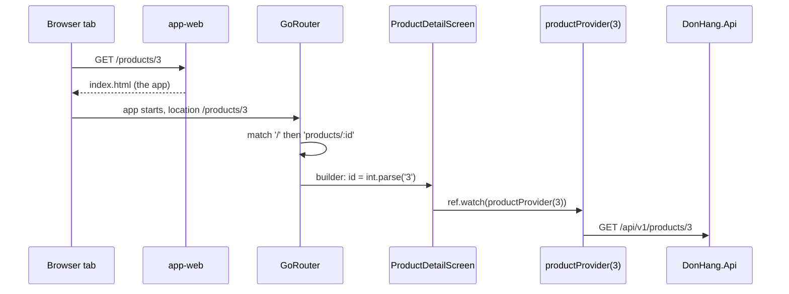

## Before you start

- [[frontend.l2.routes-with-go-router]] — you know that every screen of DonHang.App is a `GoRoute` with a path, and that a child's path is joined to its parent's.
- [[frontend.l2.futureprovider-and-asyncvalue]] — you know that a `FutureProvider` loads a value once, keeps it, and gives the screen an AsyncValue.
- [[backend.l2.authorization-code-flow]] — you know that after sign-in, Keycloak sends the browser back to the redirect URI with a short-lived code.

## The situation

A teammate is looking at the headphones in DonHang.App and pastes you the address from their browser: `http://localhost:8081/products/3`. You paste it into a new browser tab. This tab has never shown the product list, and nobody tapped a product in it. No file called `products/3` exists on the server either; the app is one page. Yet the tab should show `Tai nghe` and its price, and its back arrow should lead somewhere sensible. With no earlier screen to hand it anything, where does the detail screen get the product it shows?

## Core concepts

- **deep link** — a URL that opens one specific screen of an app, such as `/products/3`, even when the app was not running or was showing another screen.
- **path parameter** — a part of a route's path that changes from one address to the next, written with a `:` such as `:id` in `products/:id`; the route reads it as a string.
- `state.pathParameters` — the map of path parameters that go_router gives a route's `builder`, as its `state` argument; `state.pathParameters['id']` is `'3'` for `/products/3`.
- `FutureProvider.family` — a `FutureProvider` that takes an argument and keeps one value per argument, so `productProvider(3)` loads and keeps product 3 only.
- `usePathUrlStrategy()` — a Flutter web call made before `runApp` that makes the address show the route as a plain path instead of after a `#`; `runApp` is the call in `main.dart` that starts the app.

## How it works



In the situation above, the address you pasted is a deep link: it names a screen, not a page file. Follow the diagram from the top.

The browser asks `app-web`, the web server of the Đơn Hàng system that hands out DonHang.App's files on port 8081, for `/products/3`. No such file exists, so the server answers with `index.html`, and the app starts fresh in the new tab. Nothing from your teammate's tab comes along: no list, no tapped `Product`, only the address.

The router reads its first location from the address bar. `/` matches the start and its child `products/:id` matches the rest, with `3` in the place of `:id`. That `3` arrives as the string `'3'`, so the route's builder calls `int.parse` before it creates `ProductDetailScreen(id: 3)`. Because the matched route is a child of `/`, the router also builds the product list and puts the detail screen on top of it, like a stack. The back arrow takes the top screen off, so it leads to `/` and the list, although the list was never on screen in this tab.

`ProductDetailScreen` holds only the number. It watches `productProvider(3)`, which asks `DonHang.Api` for product 3 alone and keeps it. The AsyncValue is loading first and data once the product arrives, exactly as with the list.

That answers the question: the detail screen gets nothing from an earlier screen. It gets the id from the address, and it loads the product itself.

## In the Đơn Hàng system

The routes, in `DonHang.App/lib/router.dart`:

```dart file=DonHang.App/lib/router.dart tag=stage-2 lines=44-67
  GoRoute(
    path: '/',
    builder: (context, state) => const ProductListScreen(),
    routes: [
      GoRoute(
        path: 'products/:id',
        builder: (context, state) => ProductDetailScreen(id: int.parse(state.pathParameters['id']!)),
      ),
      GoRoute(path: 'orders/new', builder: (context, state) => const CreateOrderScreen()),
      GoRoute(
        path: 'orders/:id',
        builder: (context, state) => OrderDetailScreen(id: int.parse(state.pathParameters['id']!)),
      ),
    ],
  ),
  GoRoute(path: '/login', builder: (context, state) => const LoginScreen()),
  // Where Keycloak sends the browser back: /auth/callback?code=…&state=…
  GoRoute(
    path: '/auth/callback',
    builder: (context, state) => AuthCallbackScreen(
      code: state.uri.queryParameters['code'],
      oauthState: state.uri.queryParameters['state'],
    ),
  ),
```

Line 50 is the whole path parameter story: `pathParameters['id']` is a `String`, `!` says it is there (`:id` only matches a non-empty part of the path), and `int.parse` turns it into the `int` that `ProductDetailScreen` asks for. `orders/:id` on line 55 does the same for an order.

Lines 61-66 are a deep link you already met. Keycloak's redirect to `/auth/callback?code=…&state=…` loads the app fresh at that address, like your pasted link. `/auth/callback` is a top-level route, so nothing is built beneath it. Its builder reads `code` and `state` from the query parameters, with `state.uri.queryParameters`, and hands them to `AuthCallbackScreen`. What that screen does with the code is outside this lesson.

The detail screen, in `DonHang.App/lib/screens/product_detail_screen.dart`:

```dart file=DonHang.App/lib/screens/product_detail_screen.dart tag=stage-2 lines=8-24
// lesson: frontend.l2.deep-links
// Gets only the id from the URL and loads the product itself: opened from a
// link, there is no list screen before it to hand over a Product.
class ProductDetailScreen extends ConsumerWidget {
  final int id;

  const ProductDetailScreen({super.key, required this.id});

  @override
  Widget build(BuildContext context, WidgetRef ref) {
    final l10n = AppLocalizations.of(context);
    final product = ref.watch(productProvider(id));
    return Scaffold(
      appBar: AppBar(title: Text(product.value?.name ?? '')),
      body: product.when(
        loading: () => const Center(child: CircularProgressIndicator()),
        error: (error, stackTrace) => Center(child: Text(l10n.productLoadError)),
```

The block stops before the data case, which shows the name, price and order button; `l10n` holds the screen's translated texts. The constructor takes an `int`, not a `Product`. Line 19 watches `productProvider(id)`, declared in `providers.dart` as `FutureProvider.family<Product, int>`: `Product` is the value, `int` is the argument. Its function calls `fetchProduct(id)`, a `GET` of `/api/v1/products/<id>`. `productProvider(3)` and `productProvider(5)` are two separate values, each loaded and kept on its own.

One more piece makes plain paths work. Flutter web shows the route after a `#` by default, as in `/#/products/3`. The browser keeps everything after `#` to itself, so the server only ever sees `/`. `main.dart` calls `usePathUrlStrategy()` before `runApp`, so the address is `/products/3`, and a fresh load now sends that whole path to the server. That is why `deploy/app-web/Caddyfile`, the configuration file of `app-web`, answers every path that is not a real file with `index.html`.

## Beginners often think…

- **"The detail screen can take the Product object from the list screen, since users always arrive from the list."** → Actually a deep link starts the app with nothing but an address, so no list screen ever handed anything over. `ProductDetailScreen` takes only the id and loads its own product. You notice this when a screen that expects an object from the previous screen fails for anyone who opens its link in a new tab.
- **"Deep links only matter for mobile apps opened from another app, not for an app in the browser."** → Actually every address pasted, bookmarked or refreshed in the browser is a deep link, and so is Keycloak's redirect back to `/auth/callback`. You notice this when refreshing the page on a product brings you back to the same product, not to the list.
- **"Path parameters arrive already typed, so id is an int."** → Actually `state.pathParameters` maps names to strings, because a path is text. The route calls `int.parse`. You notice this when passing `state.pathParameters['id']!` straight to `ProductDetailScreen(id: …)` fails to compile: a `String` is not an `int`.

## Try it (3 minutes)

1. With the Đơn Hàng system running on your machine (`scripts/up.sh` from the repository root), open a new browser tab and paste `http://localhost:8081/products/3` into its address bar.
2. Look at the screen, then tap the back arrow in the app bar.

Expected result: the tab opens straight on `Tai nghe` with its price and order button (`890,000 VND` and `Place an order` in an English browser, `890.000 đ` and `Đặt hàng` in a Vietnamese one), and the address still ends in `/products/3`. After the back arrow, the address is `http://localhost:8081/` and the product list is showing.

You never saw the list in this tab. Why was it there when you went back?

<details><summary>Suggested answer</summary>

`products/:id` is declared in the `routes` of `/`, so the location `/products/3` matches `/` and then `products/:id`. The router builds both screens, the product list beneath the detail screen, and the back arrow removes the top one.

</details>

## Connections

- [[frontend.l2.routes-with-go-router]] — builds on it: the same route list, now opened from the address bar instead of from a tap.
- [[frontend.l2.futureprovider-and-asyncvalue]] — the same provider, one value per id: `productProvider` is a `FutureProvider` with an argument.
- [[backend.l2.authorization-code-flow]] — the other end of the redirect: the redirect URI `/auth/callback` is a deep link into DonHang.App.
- [[frontend.l2.route-guards]] — the next step: what a deep link to an order may show to someone who is not signed in.

## Five-line summary

1. A deep link opens one screen from its address alone, so that screen must get everything it needs from the address.
2. `products/:id` declares a path parameter; the builder reads `state.pathParameters['id']` as a string and calls `int.parse`.
3. `ProductDetailScreen` takes only the id and loads its product through `productProvider(id)`, a `FutureProvider.family` with one value per id.
4. A child of `/` is built on top of the product list, so the back arrow of a deep-linked detail screen leads to the list.
5. Keycloak's return to `/auth/callback` is a deep link too; `usePathUrlStrategy()` and an `index.html` fallback make plain paths work.
