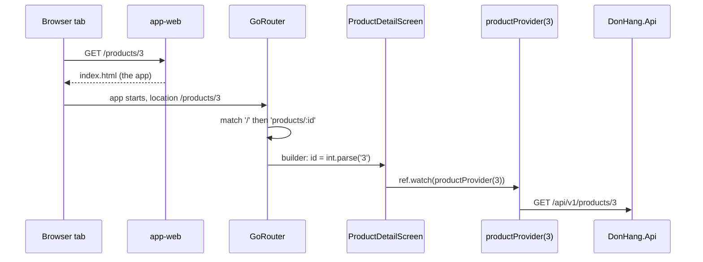

## Bạn cần biết trước

- [[frontend.l2.routes-with-go-router]] — bạn biết mỗi màn hình của DonHang.App là một `GoRoute` có path, và path của route con được nối vào path của route cha.
- [[frontend.l2.futureprovider-and-asyncvalue]] — bạn biết một `FutureProvider` tải một giá trị một lần, giữ lại nó, và đưa cho màn hình một AsyncValue.
- [[backend.l2.authorization-code-flow]] — bạn biết sau khi đăng nhập, Keycloak đưa trình duyệt quay về redirect URI kèm một code sống ngắn.

## Tình huống

Một đồng đội đang xem chiếc tai nghe trong DonHang.App và dán cho bạn địa chỉ trên trình duyệt của họ: `http://localhost:8081/products/3`. Bạn dán nó vào một tab trình duyệt mới. Tab này chưa từng hiện danh sách sản phẩm, và cũng chưa ai chạm vào sản phẩm nào trong đó. Trên server cũng chẳng có file nào tên `products/3`, vì app chỉ là một trang. Vậy mà tab vẫn phải hiện `Tai nghe` cùng giá của nó, và mũi tên quay lại phải dẫn tới một chỗ hợp lý. Không có màn hình nào trước đó để trao gì cho nó, vậy màn hình chi tiết lấy sản phẩm cần hiện từ đâu?

## Khái niệm cốt lõi

- **deep link** (URL mở thẳng một màn hình cụ thể của app, kể cả khi app chưa chạy hay đang ở màn hình khác) — một URL mở đúng một màn hình của app, như `/products/3`, kể cả khi app chưa chạy hoặc đang hiện màn hình khác.
- **path parameter** (Phần thay đổi được trong đường dẫn của route, như id trong /products/:id; luôn đọc ra dưới dạng chuỗi) — phần trong path của route thay đổi theo từng địa chỉ, viết kèm dấu `:` như `:id` trong `products/:id`. Route đọc nó ra dưới dạng chuỗi.
- `state.pathParameters` — map các path parameter mà go_router đưa cho `builder` của route qua tham số `state`. Với `/products/3`, `state.pathParameters['id']` là `'3'`.
- `FutureProvider.family` — một `FutureProvider` nhận thêm một tham số và giữ riêng một giá trị cho mỗi tham số, nên `productProvider(3)` chỉ tải và giữ sản phẩm 3.
- `usePathUrlStrategy()` — lời gọi của Flutter web, đặt trước `runApp`, để địa chỉ hiện route dưới dạng path thường thay vì nằm sau dấu `#`. `runApp` là lời gọi trong `main.dart` khởi động app.

## Cơ chế hoạt động



Trong tình huống trên, địa chỉ bạn dán là một deep link: nó gọi tên một màn hình, không phải một file trang. Hãy theo sơ đồ từ trên xuống.

Trình duyệt xin `/products/3` từ `app-web`, web server của hệ thống Đơn Hàng chuyên phát các file của DonHang.App ở port 8081. Không có file nào như vậy, nên server trả về `index.html`, và app khởi động từ đầu trong tab mới. Không có gì từ tab của đồng đội đi theo: không danh sách, không `Product` nào vừa được chạm, chỉ có địa chỉ.

Router đọc location đầu tiên của nó từ thanh địa chỉ. `/` khớp phần đầu, route con `products/:id` khớp phần còn lại, với `3` nằm ở chỗ của `:id`. Số `3` đó đến dưới dạng chuỗi `'3'`, nên builder của route gọi `int.parse` trước khi tạo `ProductDetailScreen(id: 3)`. Vì route khớp là con của `/`, router còn build danh sách sản phẩm và đặt màn hình chi tiết lên trên nó, như một stack. Mũi tên quay lại gỡ màn hình trên cùng, nên nó dẫn về `/` và danh sách, dù danh sách chưa từng hiện trong tab này.

`ProductDetailScreen` chỉ giữ con số. Nó watch `productProvider(3)`, provider này xin `DonHang.Api` đúng sản phẩm 3 rồi giữ lại. AsyncValue lúc đầu là loading, rồi thành data khi sản phẩm về tới, y như với danh sách.

Câu hỏi ban đầu đã có lời đáp: màn hình chi tiết không nhận gì từ màn hình trước. Nó lấy id từ địa chỉ, rồi tự tải sản phẩm.

## Trong hệ thống Đơn Hàng

Các route, trong `DonHang.App/lib/router.dart`:

```dart file=DonHang.App/lib/router.dart tag=stage-2 lines=44-67
  GoRoute(
    path: '/',
    builder: (context, state) => const ProductListScreen(),
    routes: [
      GoRoute(
        path: 'products/:id',
        builder: (context, state) => ProductDetailScreen(id: int.parse(state.pathParameters['id']!)),
      ),
      GoRoute(path: 'orders/new', builder: (context, state) => const CreateOrderScreen()),
      GoRoute(
        path: 'orders/:id',
        builder: (context, state) => OrderDetailScreen(id: int.parse(state.pathParameters['id']!)),
      ),
    ],
  ),
  GoRoute(path: '/login', builder: (context, state) => const LoginScreen()),
  // Where Keycloak sends the browser back: /auth/callback?code=…&state=…
  GoRoute(
    path: '/auth/callback',
    builder: (context, state) => AuthCallbackScreen(
      code: state.uri.queryParameters['code'],
      oauthState: state.uri.queryParameters['state'],
    ),
  ),
```

Dòng 50 chứa trọn chuyện path parameter: `pathParameters['id']` là một `String`, dấu `!` khẳng định giá trị có mặt (`:id` chỉ khớp một đoạn path không rỗng), và `int.parse` đổi nó thành `int` mà `ProductDetailScreen` cần. `orders/:id` ở dòng 55 làm y như vậy cho đơn hàng.

Dòng 61-66 là một deep link bạn đã gặp. Keycloak chuyển về `/auth/callback?code=…&state=…` và app khởi động từ đầu ở địa chỉ đó, giống link bạn vừa dán. `/auth/callback` là route cấp đầu, nên bên dưới nó không có gì được build. Builder của nó đọc `code` và `state` từ query parameter bằng `state.uri.queryParameters`, rồi trao cho `AuthCallbackScreen`. Màn hình đó làm gì với code thì nằm ngoài bài này.

Màn hình chi tiết, trong `DonHang.App/lib/screens/product_detail_screen.dart`:

```dart file=DonHang.App/lib/screens/product_detail_screen.dart tag=stage-2 lines=8-24
// lesson: frontend.l2.deep-links
// Gets only the id from the URL and loads the product itself: opened from a
// link, there is no list screen before it to hand over a Product.
class ProductDetailScreen extends ConsumerWidget {
  final int id;

  const ProductDetailScreen({super.key, required this.id});

  @override
  Widget build(BuildContext context, WidgetRef ref) {
    final l10n = AppLocalizations.of(context);
    final product = ref.watch(productProvider(id));
    return Scaffold(
      appBar: AppBar(title: Text(product.value?.name ?? '')),
      body: product.when(
        loading: () => const Center(child: CircularProgressIndicator()),
        error: (error, stackTrace) => Center(child: Text(l10n.productLoadError)),
```

Block dừng trước nhánh data, nhánh hiện tên, giá và nút đặt hàng. `l10n` chứa các chuỗi chữ đã dịch của màn hình. Constructor nhận một `int`, không nhận `Product`. Dòng 19 watch `productProvider(id)`, khai báo trong `providers.dart` là `FutureProvider.family<Product, int>`: `Product` là giá trị, `int` là tham số. Hàm của nó gọi `fetchProduct(id)`, tức một `GET` tới `/api/v1/products/<id>`. `productProvider(3)` và `productProvider(5)` là hai giá trị riêng, mỗi cái được tải và giữ độc lập.

Còn một mảnh nữa để path thường chạy được. Mặc định, Flutter web hiện route sau dấu `#`, như `/#/products/3`. Trình duyệt giữ mọi thứ sau `#` cho riêng nó, nên server chỉ luôn thấy `/`. `main.dart` gọi `usePathUrlStrategy()` trước `runApp`, nên địa chỉ là `/products/3`, và giờ mỗi lần tải mới sẽ gửi nguyên path đó lên server. Đó là lý do `deploy/app-web/Caddyfile`, file cấu hình của `app-web`, trả `index.html` cho mọi path không phải file thật.

## Người mới hay nghĩ rằng…

- **"Màn hình chi tiết có thể lấy object Product từ màn hình danh sách, vì người dùng lúc nào cũng đi từ danh sách tới."** → Thực ra deep link khởi động app chỉ với một địa chỉ, nên không có màn hình danh sách nào trao gì cả. `ProductDetailScreen` chỉ nhận id và tự tải sản phẩm của nó. Bạn sẽ nhận ra khi một màn hình chờ object từ màn hình trước bị lỗi với bất kỳ ai mở link của nó trong tab mới.
- **"Deep link chỉ quan trọng với app di động được mở từ một app khác, không liên quan tới app trong trình duyệt."** → Thực ra mọi địa chỉ được dán, lưu bookmark hay tải lại trong trình duyệt đều là deep link, và lần Keycloak chuyển về `/auth/callback` cũng vậy. Bạn sẽ nhận ra khi tải lại trang đang ở một sản phẩm đưa bạn về đúng sản phẩm đó, chứ không về danh sách.
- **"Path parameter đến nơi đã có sẵn kiểu, nên id là int."** → Thực ra `state.pathParameters` ánh xạ tên sang chuỗi, vì path là văn bản. Route phải gọi `int.parse`. Bạn sẽ nhận ra khi truyền thẳng `state.pathParameters['id']!` vào `ProductDetailScreen(id: …)` bị lỗi biên dịch: `String` không phải `int`.

## Thử ngay (3 phút)

1. Khi hệ thống Đơn Hàng đang chạy trên máy bạn (`scripts/up.sh` từ thư mục gốc của repository), mở một tab trình duyệt mới và dán `http://localhost:8081/products/3` vào thanh địa chỉ.
2. Nhìn màn hình, rồi chạm mũi tên quay lại trên app bar.

Kết quả mong đợi: tab mở thẳng vào `Tai nghe` cùng giá và nút đặt hàng (`890,000 VND` và `Place an order` nếu trình duyệt dùng tiếng Anh, `890.000 đ` và `Đặt hàng` nếu dùng tiếng Việt), và địa chỉ vẫn kết thúc bằng `/products/3`. Sau khi bấm mũi tên quay lại, địa chỉ là `http://localhost:8081/` và danh sách sản phẩm hiện ra.

Bạn chưa từng thấy danh sách trong tab này. Vì sao nó lại có ở đó khi bạn quay lại?

<details><summary>Gợi ý đáp án</summary>

`products/:id` được khai báo trong `routes` của `/`, nên location `/products/3` khớp `/` rồi tới `products/:id`. Router build cả hai màn hình, danh sách sản phẩm nằm dưới màn hình chi tiết, và mũi tên quay lại gỡ màn hình trên cùng.

</details>

## Liên hệ

- [[frontend.l2.routes-with-go-router]] — xây tiếp trên bài đó: vẫn danh sách route ấy, nhưng giờ được mở từ thanh địa chỉ thay vì từ một lần chạm.
- [[frontend.l2.futureprovider-and-asyncvalue]] — cùng loại provider, mỗi id một giá trị: `productProvider` là một `FutureProvider` có tham số.
- [[backend.l2.authorization-code-flow]] — đầu bên kia của lần chuyển hướng: redirect URI `/auth/callback` là một deep link vào DonHang.App.
- [[frontend.l2.route-guards]] — bước tiếp theo: một deep link tới đơn hàng được phép hiện gì cho người chưa đăng nhập.

## Tóm tắt 5 dòng

1. Deep link mở một màn hình chỉ từ địa chỉ của nó, nên màn hình đó phải lấy mọi thứ nó cần từ địa chỉ.
2. `products/:id` khai báo một path parameter. Builder đọc `state.pathParameters['id']` dưới dạng chuỗi rồi gọi `int.parse`.
3. `ProductDetailScreen` chỉ nhận id và tải sản phẩm qua `productProvider(id)`, một `FutureProvider.family` giữ mỗi id một giá trị.
4. Route con của `/` được build đè lên danh sách sản phẩm, nên mũi tên quay lại của màn hình chi tiết mở từ deep link dẫn về danh sách.
5. Lần Keycloak trả về `/auth/callback` cũng là deep link. `usePathUrlStrategy()` cùng fallback `index.html` giúp path thường chạy được.
