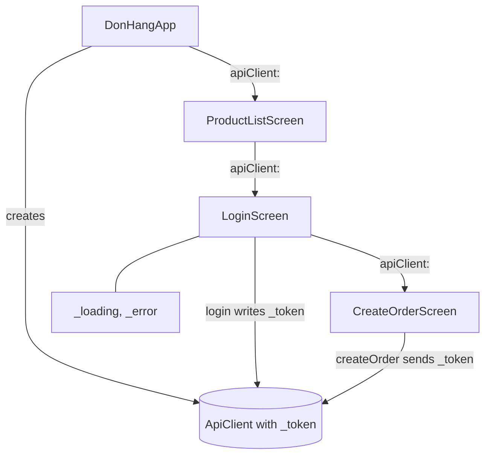

## Before you start

- [[frontend.l1.creating-an-order]] — you know that after sign-in `LoginScreen` opens the "Place an order" screen, and that `createOrder` sends the token kept inside `ApiClient`.
- [[frontend.l1.setstate-and-rebuilding]] — you know that assigning to a field changes only the variable, and that `setState` is what makes a `State` build again.

## The situation

You open the app, tap the sign-in icon, sign in, and land on "Place an order". You order one keyboard, it works, and then you tap the back arrow. The product list comes back with the same sign-in icon at the top right, as if nobody had signed in. Yet the app still holds your token: it sits in the same `ApiClient` the order screen just used, and nothing has cleared it. Some values in this app matter to one screen only; others matter to every screen. Which values are which, and why does the product list not know that you are signed in?

## Core concepts

- **ephemeral state** — state you can keep inside one widget because nothing else needs it, such as `LoginScreen`'s `_loading` and `_error`; calling `setState` in that widget's `State` is enough to show its changes.
- **app state** — state that several parts of the app share, such as whether the customer is signed in; a value that must outlive the screen that set it is a strong sign of app state.
- constructor passing — the way a screen gets the one `ApiClient` at stage-1: the widget that opens the screen hands the object over as a constructor parameter.
- global variable — a variable declared at the top level of a Dart file, outside any class or function; if its name does not start with `_` and it is neither `final` nor `const`, every file that imports that file can read it and assign to it.

## How it works



Follow the diagram from the top. `DonHangApp` creates one `ApiClient` and hands it to `ProductListScreen`. The sign-in icon opens `LoginScreen` with that same object, and after sign-in `LoginScreen` opens `CreateOrderScreen` with it. Three screens share one object, so the token that `login` writes into it is the token that `createOrder` sends.

Now sort the values by who reads them. The Flutter docs say there is no clear-cut rule, so treat this as a first question, not a law. `_loading` and `_error`, the box hanging off `LoginScreen`, are ephemeral state: only `LoginScreen`'s own `build` reads them, and when that screen is replaced they are discarded with its `State`. `setState` inside `LoginScreen` is all they need.

Whether the customer is signed in is app state. `LoginScreen` changes it and is then replaced by the order screen, which needs the token to place the order. The product list needs the same fact to decide whether to offer sign-in at all.

At stage-1 this app state is the field `_token` inside `ApiClient`; its name starts with `_`, so code outside `api_client.dart` cannot read it. Constructor passing covers sending the token, but it has three gaps. No screen can ask whether a token is set. The product list got its constructor arguments when the app started, so a value that appears after sign-in cannot reach it that way. And `login` only assigns a field; nothing calls `setState` in `ProductListScreen`'s `State`, so the product list does not build again.

## In the Đơn Hàng system

`DonHangApp.build`, in `DonHang.App/lib/main.dart`:

```dart file=DonHang.App/lib/main.dart tag=stage-1 lines=16-23
  Widget build(BuildContext context) {
    final apiClient = ApiClient();
    return MaterialApp(
      title: 'Đơn Hàng',
      theme: ThemeData(colorSchemeSeed: Colors.indigo, useMaterial3: true),
      home: ProductListScreen(apiClient: apiClient),
    );
  }
```

This is where the app's `ApiClient` is created; `DonHangApp` builds once in a normal run, so every screen shares this one object. It is also the first place the object is passed on: `home` is the product list, built with `apiClient:` as a constructor argument. Every later screen gets the object the same way, from the screen that opens it.

The sign-in screen's state and its `_submit`, in `DonHang.App/lib/screens/login_screen.dart`:

```dart file=DonHang.App/lib/screens/login_screen.dart tag=stage-1 lines=17-39
class _LoginScreenState extends State<LoginScreen> {
  final _emailController = TextEditingController(text: 'anh.tran@example.com');
  final _passwordController = TextEditingController(text: 'donhang-dev-password');
  String? _error;
  bool _loading = false;

  Future<void> _submit() async {
    setState(() {
      _loading = true;
      _error = null;
    });
    try {
      await widget.apiClient.login(_emailController.text, _passwordController.text);
      if (!mounted) return;
      Navigator.of(context).pushReplacement(
        MaterialPageRoute(builder: (_) => CreateOrderScreen(apiClient: widget.apiClient)),
      );
    } catch (e) {
      setState(() => _error = e.toString());
    } finally {
      if (mounted) setState(() => _loading = false);
    }
  }
```

Two kinds of state sit side by side here. `_error` and `_loading` are fields of `_LoginScreenState`, changed with `setState`, and read only by this screen's `build`, which shows the red message and the spinner. The token is different: `login` stores it inside the shared `ApiClient`, not in this `State`, because the order screen must still have it after `pushReplacement` has removed the sign-in screen.

`pushReplacement` puts the order screen in place of the sign-in screen, so the back arrow on the order screen returns to the product list. That list's sign-in icon, in `product_list_screen.dart` lines 35-40, is an icon button whose tap always pushes a new `LoginScreen` with `widget.apiClient`, with no check on the token; nothing in its `build` depends on the token, so after sign-in it shows exactly what it showed before.

## Beginners often think…

- **"Every piece of state should be app state, so any widget can reach it."** → Actually `_loading` only means something to the screen that shows the spinner. Made app-wide, it would outlive that screen and could be changed by screens that have nothing to do with sign-in, so every reader would have to ask whose request it describes. Keep state ephemeral while one widget is its only reader. You notice this when a flag shared "just in case" is still set after its screen closed, and another screen shows a spinner it did not start.
- **"A global variable is enough for shared state, since every screen can read it."** → Actually reading was never the problem: the shared `ApiClient` already reaches every screen. The problem is change: assigning to a variable does not make any widget build again, because Flutter does not watch variables. Screens that already built keep what they showed. You notice this when the product list still offers sign-in after you have signed in, which is exactly what the stage-1 app does with its token.

## Try it (3 minutes)

1. Open `DonHang.App/lib/` at stage-1 and find five values: `_loading` and `_error` in `login_screen.dart`, `_loading` and `_result` in `create_order_screen.dart`, and `_token` in `api_client.dart`.
2. For each value, write down which screens read it and whether anything still needs it after the screen that set it has closed. Then label it ephemeral state or app state.

Expected result: five rows, four labelled ephemeral state and one labelled app state, each with its readers named.

Which of the five would the product list need to hide its sign-in icon, and what stops it from using that value today?

<details><summary>Suggested answer</summary>

The four `_loading`, `_error` and `_result` fields are ephemeral: each is read only by the `build` of its own screen and dies with it. `_token` is app state: `LoginScreen` sets it, `createOrder` sends it after `LoginScreen` is gone, and the product list would need it too. Two things stop the product list: `_token` is private to `api_client.dart` and `ApiClient` has no method that reports it, and even with one, `login` assigning the field would not make the product list build again.

</details>

## Connections

- [[frontend.l1.setstate-and-rebuilding]] — the tool that is enough for ephemeral state, and why assigning a field alone changes nothing on screen.
- [[frontend.l1.logging-in-from-the-app]] — where the token that is this app's first piece of app state gets written.
- [[frontend.l2.riverpod-providers]] — the next step: a place for app state outside any one screen, which widgets ask for instead of receiving it through constructors.
- [[frontend.l2.notifier-for-app-state]] — where signing in becomes a change that the screens depending on it are told about.

## Five-line summary

1. No hard rule, but ask who reads a value: one widget suggests ephemeral state; several screens, or outliving its screen, suggest app state.
2. `LoginScreen`'s `_loading` and `_error` are ephemeral, and `setState` in its own `State` is enough for them.
3. Whether the customer is signed in is app state: the order screen and the product list both depend on it after sign-in closes.
4. At stage-1 the token sits in one `ApiClient` that each screen receives through its constructor from the screen that opened it.
5. Assigning that field rebuilds nothing, so the product list keeps offering sign-in; a shared variable solves reading, not change.
