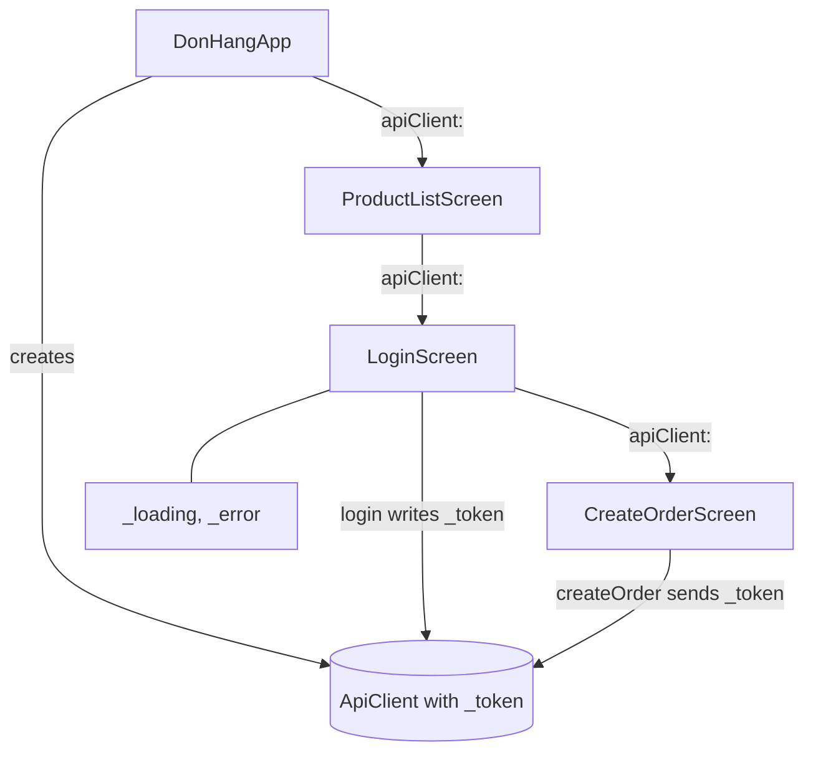

## Bạn cần biết trước

- [[frontend.l1.creating-an-order]] — bạn biết rằng sau khi đăng nhập, `LoginScreen` mở màn hình "Place an order", và `createOrder` gửi token được giữ bên trong `ApiClient`.
- [[frontend.l1.setstate-and-rebuilding]] — bạn biết rằng gán giá trị cho một field chỉ đổi biến đó, và `setState` mới là thứ khiến một `State` build lại.

## Tình huống

Bạn mở app, bấm icon đăng nhập, đăng nhập, rồi tới màn hình "Place an order". Bạn đặt một bàn phím, đơn thành công, rồi bạn bấm mũi tên quay lại. Danh sách sản phẩm hiện ra với đúng icon đăng nhập ở góc trên bên phải, như thể chưa ai đăng nhập. Vậy mà app vẫn đang giữ token: nó nằm trong chính `ApiClient` mà màn hình đặt hàng vừa dùng, và chưa có gì xóa nó. Có giá trị trong app này chỉ quan trọng với một màn hình, có giá trị quan trọng với mọi màn hình. Giá trị nào thuộc loại nào, và vì sao danh sách sản phẩm không biết bạn đã đăng nhập?

## Khái niệm cốt lõi

- **ephemeral state** (State chỉ một widget dùng và không ai khác đọc, như cờ đang tải của một màn hình, setState là đủ) — state bạn giữ gọn trong một widget vì không nơi nào khác cần nó, như `_loading` và `_error` của `LoginScreen`. Gọi `setState` trong `State` của widget đó là đủ để hiện thay đổi của nó.
- **app state** (State nhiều màn hình cùng cần, hoặc phải còn sau khi màn hình đổi nó đóng lại, như khách đã đăng nhập chưa) — state mà nhiều phần của app cùng dùng, như việc khách đã đăng nhập hay chưa. Một giá trị phải sống lâu hơn màn hình đã đặt nó là dấu hiệu rõ của app state.
- truyền qua constructor — cách một màn hình nhận chiếc `ApiClient` duy nhất ở stage-1: widget mở màn hình đó trao object này làm tham số constructor.
- global variable — biến khai báo ở cấp cao nhất của một file Dart, nằm ngoài mọi class và hàm. Nếu tên không bắt đầu bằng `_` và biến không phải `final` hay `const`, mọi file import file đó đều đọc và gán được nó.

## Cơ chế hoạt động



Đi theo sơ đồ từ trên xuống. `DonHangApp` tạo một `ApiClient` và trao nó cho `ProductListScreen`. Icon đăng nhập mở `LoginScreen` kèm đúng object đó, và sau khi đăng nhập, `LoginScreen` mở `CreateOrderScreen` cũng kèm nó. Ba màn hình dùng chung một object, nên token mà `login` ghi vào chính là token mà `createOrder` gửi đi.

Giờ hãy phân loại các giá trị theo ai đọc chúng. Tài liệu Flutter nói không có quy tắc rạch ròi, nên hãy coi đây là câu hỏi đầu tiên, không phải luật. `_loading` và `_error`, ô treo bên cạnh `LoginScreen` trong sơ đồ, là ephemeral state: chỉ `build` của chính `LoginScreen` đọc chúng, và khi màn hình đó bị thay thế thì chúng bị bỏ đi cùng `State` của nó. `setState` bên trong `LoginScreen` là tất cả những gì chúng cần.

Khách đã đăng nhập hay chưa là app state. `LoginScreen` đổi giá trị này rồi bị thay bằng màn hình đặt hàng, nơi cần token để đặt đơn. Danh sách sản phẩm cũng cần đúng thông tin đó để quyết định có hiện nút đăng nhập hay không.

Ở stage-1, app state này là field `_token` bên trong `ApiClient`. Tên của nó bắt đầu bằng `_`, nên code nằm ngoài `api_client.dart` không đọc được. Truyền qua constructor đủ để gửi token đi, nhưng có ba chỗ hở. Không màn hình nào hỏi được là token đã có chưa. Danh sách sản phẩm nhận tham số constructor lúc app khởi động, nên một giá trị chỉ xuất hiện sau khi đăng nhập không thể tới nó theo đường này. Và `login` chỉ gán một field, không ai gọi `setState` trong `State` của `ProductListScreen`, nên danh sách sản phẩm không build lại.

## Trong hệ thống Đơn Hàng

`DonHangApp.build`, trong `DonHang.App/lib/main.dart`:

```dart file=DonHang.App/lib/main.dart tag=stage-1 lines=16-23
  Widget build(BuildContext context) {
    final apiClient = ApiClient();
    return MaterialApp(
      title: 'Đơn Hàng',
      theme: ThemeData(colorSchemeSeed: Colors.indigo, useMaterial3: true),
      home: ProductListScreen(apiClient: apiClient),
    );
  }
```

Đây là nơi `ApiClient` của app được tạo. Trong một lần chạy bình thường, `DonHangApp` chỉ build một lần, nên mọi màn hình dùng chung object này. Đây cũng là chỗ đầu tiên object được truyền đi: `home` là danh sách sản phẩm, được dựng với `apiClient:` làm tham số constructor. Mọi màn hình sau đó nhận object theo cùng cách, từ màn hình mở ra nó.

State của màn hình đăng nhập và hàm `_submit`, trong `DonHang.App/lib/screens/login_screen.dart`:

```dart file=DonHang.App/lib/screens/login_screen.dart tag=stage-1 lines=17-39
class _LoginScreenState extends State<LoginScreen> {
  final _emailController = TextEditingController(text: 'anh.tran@example.com');
  final _passwordController = TextEditingController(text: 'donhang-dev-password');
  String? _error;
  bool _loading = false;

  Future<void> _submit() async {
    setState(() {
      _loading = true;
      _error = null;
    });
    try {
      await widget.apiClient.login(_emailController.text, _passwordController.text);
      if (!mounted) return;
      Navigator.of(context).pushReplacement(
        MaterialPageRoute(builder: (_) => CreateOrderScreen(apiClient: widget.apiClient)),
      );
    } catch (e) {
      setState(() => _error = e.toString());
    } finally {
      if (mounted) setState(() => _loading = false);
    }
  }
```

Hai loại state nằm cạnh nhau ở đây. `_error` và `_loading` là field của `_LoginScreenState`, được đổi bằng `setState`, và chỉ `build` của màn hình này đọc, để hiện dòng báo lỗi màu đỏ và spinner. Token thì khác: `login` lưu nó trong `ApiClient` dùng chung, không lưu trong `State` này, vì màn hình đặt hàng vẫn phải có token sau khi `pushReplacement` đã bỏ màn hình đăng nhập đi.

`pushReplacement` đặt màn hình đặt hàng vào chỗ của màn hình đăng nhập, nên mũi tên quay lại trên màn hình đặt hàng đưa bạn về danh sách sản phẩm. Icon đăng nhập của danh sách này, ở `product_list_screen.dart` dòng 35-40, là một icon button mà mỗi lần bấm luôn push một `LoginScreen` mới kèm `widget.apiClient`, không hề kiểm tra token. Không gì trong `build` của nó phụ thuộc vào token, nên sau khi đăng nhập nó hiện y như trước.

## Người mới hay nghĩ rằng…

- **"State nào cũng nên là app state, để widget nào cũng với tới được."** → Thực ra `_loading` chỉ có nghĩa với màn hình đang hiện spinner. Đưa nó ra toàn app thì nó sẽ sống lâu hơn màn hình đó và có thể bị những màn hình chẳng liên quan gì tới đăng nhập sửa, nên nơi nào đọc cũng phải tự hỏi nó đang nói về request của ai. Hãy giữ state ở dạng ephemeral khi chỉ có một widget đọc nó. Bạn sẽ nhận ra khi một cờ được chia sẻ "cho chắc" vẫn còn bật sau khi màn hình của nó đã đóng, và một màn hình khác hiện spinner mà nó không hề khởi động.
- **"Một global variable là đủ cho state dùng chung, vì màn hình nào cũng đọc được nó."** → Thực ra đọc chưa bao giờ là vấn đề: `ApiClient` dùng chung đã tới được mọi màn hình rồi. Vấn đề là thay đổi: gán giá trị cho một biến không làm widget nào build lại, vì Flutter không theo dõi biến. Màn hình nào đã build thì vẫn giữ những gì nó đang hiện. Bạn sẽ nhận ra khi danh sách sản phẩm vẫn mời bạn đăng nhập dù bạn đã đăng nhập, đúng như app ở stage-1 đang làm với token.

## Thử ngay (3 phút)

1. Mở `DonHang.App/lib/` ở stage-1 và tìm năm giá trị: `_loading` và `_error` trong `login_screen.dart`, `_loading` và `_result` trong `create_order_screen.dart`, và `_token` trong `api_client.dart`.
2. Với từng giá trị, ghi lại những màn hình nào đọc nó, và còn gì cần nó nữa không sau khi màn hình đặt nó đã đóng. Rồi gắn nhãn ephemeral state hoặc app state.

Kết quả mong đợi: năm dòng, bốn dòng gắn nhãn ephemeral state và một dòng gắn nhãn app state, dòng nào cũng ghi rõ nơi đọc.

Trong năm giá trị đó, danh sách sản phẩm cần giá trị nào để ẩn icon đăng nhập, và điều gì đang ngăn nó dùng giá trị đó?

<details><summary>Gợi ý đáp án</summary>

Bốn field `_loading`, `_error` và `_result` là ephemeral: mỗi field chỉ do `build` của chính màn hình chứa nó đọc, và mất đi cùng màn hình đó. `_token` là app state: `LoginScreen` đặt nó, `createOrder` gửi nó sau khi `LoginScreen` đã không còn, và danh sách sản phẩm cũng sẽ cần nó. Có hai điều ngăn danh sách sản phẩm. Một là `_token` private trong `api_client.dart` và `ApiClient` không có method nào cho biết giá trị của nó. Hai là dù có method đó, việc `login` gán field cũng không làm danh sách sản phẩm build lại.

</details>

## Liên hệ

- [[frontend.l1.setstate-and-rebuilding]] — công cụ đủ dùng cho ephemeral state, và lý do chỉ gán một field thì không có gì đổi trên màn hình.
- [[frontend.l1.logging-in-from-the-app]] — nơi ghi ra token, mẩu app state đầu tiên của app này.
- [[frontend.l2.riverpod-providers]] — bước tiếp theo: một chỗ cho app state nằm ngoài mọi màn hình, để widget tự xin thay vì nhận qua constructor.
- [[frontend.l2.notifier-for-app-state]] — nơi việc đăng nhập trở thành một thay đổi được báo cho các màn hình phụ thuộc vào nó.

## Tóm tắt 5 dòng

1. Không có quy tắc cứng, nhưng hãy hỏi ai đọc giá trị: một widget gợi ý ephemeral state, nhiều màn hình hoặc phải sống lâu hơn màn hình gợi ý app state.
2. `_loading` và `_error` của `LoginScreen` là ephemeral, và `setState` trong chính `State` của nó là đủ.
3. Khách đã đăng nhập hay chưa là app state: màn hình đặt hàng và danh sách sản phẩm đều cần nó sau khi màn hình đăng nhập đóng.
4. Ở stage-1, token nằm trong một `ApiClient` mà mỗi màn hình nhận qua constructor từ màn hình đã mở nó.
5. Gán field đó không build lại gì, nên danh sách sản phẩm vẫn mời đăng nhập. Biến dùng chung giải quyết việc đọc, không giải quyết thay đổi.
