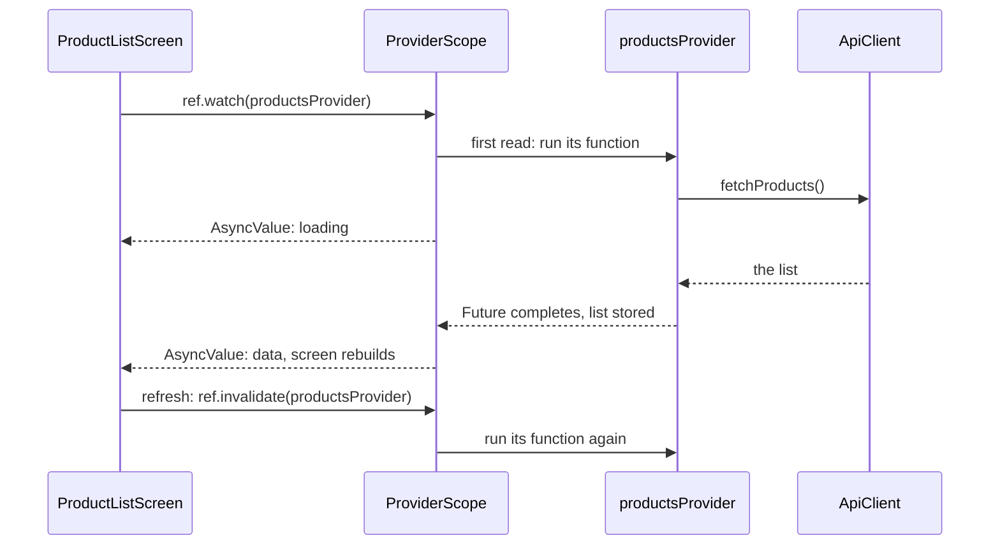

## Before you start

- [[frontend.l2.riverpod-providers]] — you know that `ProviderScope` stores each provider's value, made on the first read, and that `ProductListScreen` watches `productsProvider`.
- [[frontend.l1.futurebuilder-loading-error-empty]] — you know that a screen fetching data must show loading, error, empty and the list, and that at stage-1 a `FutureBuilder` did this with a `Future` made in `initState`.

## The situation

At stage-1, the product list was a `StatefulWidget`. Its `State` kept a `Future` in a field, created it in `initState`, and the refresh button replaced it inside `setState`. A `FutureBuilder` then turned that `Future` into a spinner, an error, an empty message or the list. At stage-2, `ProductListScreen` has no `State` class, no field and no `initState`. Yet it still shows a spinner while the list loads, the list once it arrives, and the refresh button still loads the list again. With no `State` keeping a `Future`, how does the screen know which of those cases it is in, and how does refresh start a new load?

## Core concepts

- `FutureProvider` — a provider whose function returns a `Future`; `productsProvider` is one, and its function calls `ApiClient.fetchProducts`.
- **AsyncValue** — what you get when you watch a `FutureProvider`: a value that says whether the work is still loading, has failed with an error, or has finished with data.
- `AsyncValue.when` — a method that takes one builder for each case, `loading`, `error` and `data`, and calls the one that matches.
- `ref.invalidate` — throws away the value a provider has stored, so the provider runs its function again.

## How it works



In the situation above, the `Future` still exists, but the screen no longer keeps it. Follow the diagram from the top. `ProductListScreen` watches `productsProvider`. On that first read, `ProviderScope` runs the provider's function, which calls `fetchProducts` and returns its `Future`. What the screen gets back is not a list: it is an AsyncValue that says "loading". The screen builds with it and shows the spinner.

When the `Future` completes, `ProviderScope` stores the list as data and rebuilds every widget that watches `productsProvider`. If loading keeps failing, the stored value ends up as an error instead. So the question "which case am I in?" is answered by the value itself, not by fields in a `State`.

The screen turns that value into widgets with `when`. It passes three builders: a spinner for `loading`, the error text for `error`, and, for `data`, the empty message or the list. Empty is not a fourth case of AsyncValue. It is data that happens to be an empty list, so the `data` builder checks it, as the snapshot check did at stage-1.

Because `ProviderScope` stores the list, the load belongs to the provider, not to one screen. `CreateOrderScreen` also watches `productsProvider` to fill its product dropdown. When the list screen has already loaded, the order form gets that same list, and no second request is sent.

The stored list stays until something throws it away. The refresh button calls `ref.invalidate(productsProvider)`. The screen still watches the provider, so the provider runs its function again, a new request goes out, and the screen rebuilds with the new list when it arrives.

## In the Đơn Hàng system

The provider, in `DonHang.App/lib/providers.dart`:

```dart file=DonHang.App/lib/providers.dart tag=stage-2 lines=24-30
// lesson: frontend.l2.futureprovider-and-asyncvalue
// lesson: frontend.l2.overriding-providers-in-tests
// Loads the product list once and keeps it; ref.invalidate(productsProvider)
// throws it away so the next read loads it again.
final productsProvider = FutureProvider<List<Product>>((ref) {
  return ref.watch(apiClientProvider).fetchProducts();
});
```

The type says it all: a `FutureProvider` of `List<Product>`. Its function returns the `Future` from `fetchProducts`, and whoever watches it gets an `AsyncValue<List<Product>>`, never the `Future` itself.

The screen, in `DonHang.App/lib/screens/product_list_screen.dart`:

```dart file=DonHang.App/lib/screens/product_list_screen.dart tag=stage-2 lines=18-40
  @override
  Widget build(BuildContext context, WidgetRef ref) {
    final l10n = AppLocalizations.of(context);
    final products = ref.watch(productsProvider);
    return Scaffold(
      appBar: AppBar(title: Text(l10n.appTitle), actions: _actions(context, ref)),
      body: products.when(
        loading: () => const Center(child: CircularProgressIndicator()),
        error: (error, stackTrace) => Center(child: Text(l10n.productsLoadError)),
        data: (items) => items.isEmpty
            ? Center(child: Text(l10n.noProducts))
            : ProductCatalog(
                products: items,
                onProductTap: (product) => context.go('/products/${product.id}'),
              ),
      ),
      floatingActionButton: FloatingActionButton(
        tooltip: l10n.reload,
        onPressed: () => ref.invalidate(productsProvider),
        child: const Icon(Icons.refresh),
      ),
    );
  }
```

Ignore `l10n`, `_actions` and `onProductTap`; later lessons cover them. Look at `products.when`: three named builders, each returning a widget, and all three must be given. The `data` builder receives the list as `items` and chooses between the empty message and `ProductCatalog`, which lays the products out as tiles. Then look at `onPressed`: one line, `ref.invalidate(productsProvider)`, where stage-1 had a `_reload` method that replaced a `Future` inside `setState`.

## Beginners often think…

- **"Once a provider has loaded the product list, the screen can never show newer products."** → Actually the provider keeps the list only until something throws it away. `ref.invalidate` does that, and because the screen still watches the provider, the provider fetches the list again. You notice this when the browser's network log shows a new request to `/api/v1/products` each time you click refresh, as in the exercise below.
- **"Moving the fetch into a provider removes the need to handle the error and empty cases."** → Actually the request can still fail, and the API can still return an empty list. `when` makes you pass an `error` builder, and an empty list arrives through `data`, so the screen must check it there. You notice this when a screen that shows only a list for `data` stays blank while the API has no products.

## Try it (3 minutes)

1. Start the system with `scripts/up.sh`, open `localhost:8081` in Chrome, press F12, choose the Network tab and type `products` in its filter box. Then reload the page.
2. Click the round refresh button at the bottom right of the product list three times, waiting each time until the new request in the Network tab has finished.

Expected result: one request to `/api/v1/products` when the page loads, then one more for each click, four in total. The list stays on the screen while each new request runs. The screen never created a `Future` of its own: each request came from `productsProvider` running its function again.

Why did the first request go out without any code in the screen starting it?

<details><summary>Suggested answer</summary>

`ProductListScreen` watches `productsProvider` in `build`. That first read makes `ProviderScope` run the provider's function, which calls `fetchProducts`. The screen only describes what to show for each case of the AsyncValue it gets back.

</details>

## Connections

- [[frontend.l1.futurebuilder-loading-error-empty]] — the same four outcomes, now read from an AsyncValue instead of a `FutureBuilder` snapshot.
- [[frontend.l2.riverpod-providers]] — prerequisite: where the stored value lives and why the function runs on the first read.
- [[frontend.l2.overriding-providers-in-tests]] — the next use of this: a test gives `productsProvider` a fixed AsyncValue and checks each case without a server.
- [[frontend.l2.notifier-for-app-state]] — a provider whose value the app changes itself, instead of loading it from the API.

## Five-line summary

1. A `FutureProvider` runs the load and keeps its result, and watching it gives an AsyncValue: loading, error or data.
2. `AsyncValue.when` takes one builder per case, so the screen needs no `State` class holding a `Future`.
3. Empty is not its own case: it is data with an empty list, so the `data` builder checks it.
4. Widgets that watch the same `FutureProvider` share one request and one stored list, such as the product list and order form.
5. `ref.invalidate` throws the stored list away, and because the screen still watches, the provider fetches it again.
