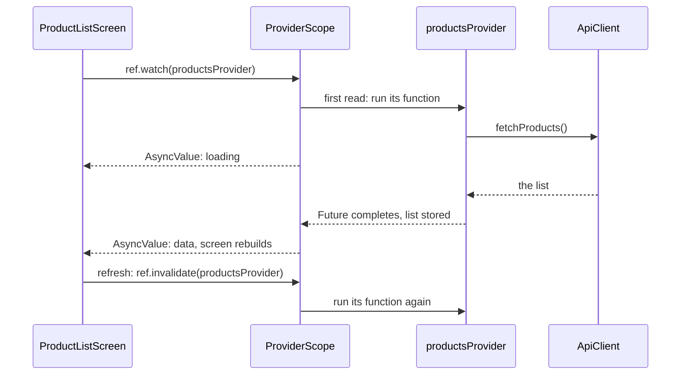

## Bạn cần biết trước

- [[frontend.l2.riverpod-providers]] — bạn biết `ProviderScope` lưu giá trị của từng provider, tạo ra ở lần đọc đầu tiên, và `ProductListScreen` watch `productsProvider`.
- [[frontend.l1.futurebuilder-loading-error-empty]] — bạn biết một màn hình lấy dữ liệu phải hiện được trạng thái đang tải, lỗi, rỗng và danh sách, và ở stage-1 một `FutureBuilder` làm việc này với một `Future` tạo trong `initState`.

## Tình huống

Ở stage-1, danh sách sản phẩm là một `StatefulWidget`. `State` của nó giữ một `Future` trong một field, tạo `Future` đó trong `initState`, còn nút làm mới thay nó bên trong `setState`. Sau đó một `FutureBuilder` biến `Future` ấy thành spinner, thông báo lỗi, thông báo rỗng hoặc danh sách. Ở stage-2, `ProductListScreen` không có class `State`, không có field, cũng không có `initState`. Vậy mà nó vẫn hiện spinner khi danh sách đang tải, hiện danh sách khi dữ liệu về, và nút làm mới vẫn tải lại được. Khi không còn `State` nào giữ `Future`, màn hình biết mình đang ở trường hợp nào bằng cách nào, và nút làm mới bắt đầu một lần tải mới ra sao?

## Khái niệm cốt lõi

- `FutureProvider` — một provider có hàm trả về một `Future`. `productsProvider` là một provider như vậy, và hàm của nó gọi `ApiClient.fetchProducts`.
- **AsyncValue** (Giá trị Riverpod đưa ra cho một việc bất đồng bộ: đang tải, lỗi, hoặc đã có dữ liệu) — thứ bạn nhận được khi watch một `FutureProvider`: một giá trị cho biết công việc vẫn đang tải, đã thất bại với một lỗi, hay đã xong và có dữ liệu.
- `AsyncValue.when` — một method nhận một builder cho mỗi trường hợp, `loading`, `error` và `data`, rồi gọi đúng builder khớp với giá trị.
- `ref.invalidate` — bỏ giá trị mà một provider đã lưu, để provider chạy lại hàm của nó.

## Cơ chế hoạt động



Trong tình huống trên, `Future` vẫn còn đó, chỉ là màn hình không giữ nó nữa. Hãy đi theo sơ đồ từ trên xuống. `ProductListScreen` watch `productsProvider`. Ở lần đọc đầu tiên đó, `ProviderScope` chạy hàm của provider, hàm này gọi `fetchProducts` và trả về `Future` của nó. Thứ màn hình nhận lại không phải một danh sách, mà là một AsyncValue báo "đang tải". Màn hình build với giá trị đó và hiện spinner.

Khi `Future` hoàn tất, `ProviderScope` lưu danh sách dưới dạng data và build lại mọi widget đang watch `productsProvider`. Nếu tải mãi vẫn lỗi, giá trị được lưu cuối cùng sẽ là một lỗi. Vậy câu hỏi "mình đang ở trường hợp nào?" được chính giá trị trả lời, chứ không phải các field trong một `State`.

Màn hình biến giá trị đó thành widget bằng `when`. Nó truyền ba builder: spinner cho `loading`, thông báo lỗi cho `error`, và với `data` thì hoặc thông báo rỗng, hoặc danh sách. Rỗng không phải trường hợp thứ tư của AsyncValue. Đó là data mà list tình cờ rỗng, nên builder `data` phải kiểm tra, giống như phần kiểm tra snapshot ở stage-1.

Vì `ProviderScope` lưu danh sách, lần tải thuộc về provider chứ không thuộc về một màn hình nào. `CreateOrderScreen` cũng watch `productsProvider` để điền dropdown sản phẩm của nó. Khi màn hình danh sách đã tải xong, form đặt hàng nhận đúng danh sách đó, và không có request thứ hai nào được gửi.

Danh sách đã lưu sẽ còn đó cho tới khi có thứ gì bỏ nó đi. Nút làm mới gọi `ref.invalidate(productsProvider)`. Màn hình vẫn đang watch provider, nên provider chạy lại hàm của nó, một request mới được gửi đi, và màn hình build lại với danh sách mới khi dữ liệu về.

## Trong hệ thống Đơn Hàng

Provider, trong `DonHang.App/lib/providers.dart`:

```dart file=DonHang.App/lib/providers.dart tag=stage-2 lines=24-30
// lesson: frontend.l2.futureprovider-and-asyncvalue
// lesson: frontend.l2.overriding-providers-in-tests
// Loads the product list once and keeps it; ref.invalidate(productsProvider)
// throws it away so the next read loads it again.
final productsProvider = FutureProvider<List<Product>>((ref) {
  return ref.watch(apiClientProvider).fetchProducts();
});
```

Chỉ nhìn kiểu là đủ hiểu: một `FutureProvider` của `List<Product>`. Hàm của nó trả về `Future` từ `fetchProducts`, còn ai watch nó sẽ nhận một `AsyncValue<List<Product>>`, không bao giờ nhận chính `Future`.

Màn hình, trong `DonHang.App/lib/screens/product_list_screen.dart`:

```dart file=DonHang.App/lib/screens/product_list_screen.dart tag=stage-2 lines=18-40
  @override
  Widget build(BuildContext context, WidgetRef ref) {
    final l10n = AppLocalizations.of(context);
    final products = ref.watch(productsProvider);
    return Scaffold(
      appBar: AppBar(title: Text(l10n.appTitle), actions: _actions(context, ref)),
      body: products.when(
        loading: () => const Center(child: CircularProgressIndicator()),
        error: (error, stackTrace) => Center(child: Text(l10n.productsLoadError)),
        data: (items) => items.isEmpty
            ? Center(child: Text(l10n.noProducts))
            : ProductCatalog(
                products: items,
                onProductTap: (product) => context.go('/products/${product.id}'),
              ),
      ),
      floatingActionButton: FloatingActionButton(
        tooltip: l10n.reload,
        onPressed: () => ref.invalidate(productsProvider),
        child: const Icon(Icons.refresh),
      ),
    );
  }
```

Tạm bỏ qua `l10n`, `_actions` và `onProductTap`, các bài sau sẽ nói tới. Hãy nhìn `products.when`: ba builder có tên, mỗi builder trả về một widget, và phải truyền đủ cả ba. Builder `data` nhận danh sách qua `items` rồi chọn giữa thông báo rỗng và `ProductCatalog`, widget xếp các sản phẩm thành từng ô. Sau đó nhìn `onPressed`: chỉ một dòng `ref.invalidate(productsProvider)`, trong khi stage-1 có cả một method `_reload` thay `Future` bên trong `setState`.

## Người mới hay nghĩ rằng…

- **"Một khi provider đã tải xong danh sách sản phẩm, màn hình sẽ không bao giờ hiện được sản phẩm mới hơn."** → Thực ra provider chỉ giữ danh sách cho tới khi có thứ gì bỏ nó đi. `ref.invalidate` làm đúng việc đó, và vì màn hình vẫn watch provider, provider sẽ tải lại danh sách. Bạn sẽ nhận ra khi nhật ký network của trình duyệt hiện một request mới tới `/api/v1/products` mỗi lần bạn click nút làm mới, như trong bài tập bên dưới.
- **"Chuyển phần tải dữ liệu vào provider thì không cần xử lý trường hợp lỗi và rỗng nữa."** → Thực ra request vẫn có thể lỗi, và API vẫn có thể trả về một list rỗng. `when` bắt bạn truyền builder `error`, còn list rỗng đi vào qua `data`, nên màn hình phải kiểm tra nó ở đó. Bạn sẽ nhận ra khi một màn hình chỉ vẽ danh sách cho `data` cứ trống trơn trong lúc API không có sản phẩm nào.

## Thử ngay (3 phút)

1. Chạy hệ thống bằng `scripts/up.sh`, mở `localhost:8081` trong Chrome, bấm F12, chọn tab Network và gõ `products` vào ô lọc. Rồi tải lại trang.
2. Click nút làm mới hình tròn ở góc dưới bên phải của danh sách sản phẩm ba lần, mỗi lần chờ cho request mới trong tab Network xong.

Kết quả mong đợi: một request tới `/api/v1/products` khi trang tải, rồi thêm một request cho mỗi lần click, tổng cộng bốn. Danh sách vẫn nằm trên màn hình trong lúc mỗi request mới chạy. Màn hình không tự tạo `Future` nào: mỗi request đến từ một lần `productsProvider` chạy lại hàm của nó.

Vì sao request đầu tiên được gửi đi mà không có dòng code nào trong màn hình khởi động nó?

<details><summary>Gợi ý đáp án</summary>

`ProductListScreen` watch `productsProvider` trong `build`. Lần đọc đầu tiên đó khiến `ProviderScope` chạy hàm của provider, và hàm này gọi `fetchProducts`. Màn hình chỉ mô tả cần hiện gì cho từng trường hợp của AsyncValue mà nó nhận lại.

</details>

## Liên hệ

- [[frontend.l1.futurebuilder-loading-error-empty]] — cùng bốn kết cục đó, giờ đọc từ một AsyncValue thay vì từ snapshot của `FutureBuilder`.
- [[frontend.l2.riverpod-providers]] — bài cần biết trước: giá trị đã lưu nằm ở đâu, và vì sao hàm chạy ở lần đọc đầu tiên.
- [[frontend.l2.overriding-providers-in-tests]] — nơi dùng tiếp ý này: một test đưa cho `productsProvider` một AsyncValue cố định rồi kiểm từng trường hợp mà không cần server.
- [[frontend.l2.notifier-for-app-state]] — một provider mà chính app đổi giá trị của nó, thay vì tải giá trị từ API.

## Tóm tắt 5 dòng

1. Một `FutureProvider` tự tải dữ liệu và giữ kết quả, còn watch nó thì nhận một AsyncValue: đang tải, lỗi hoặc data.
2. `AsyncValue.when` nhận một builder cho mỗi trường hợp, nên màn hình không cần class `State` nào giữ `Future`.
3. Rỗng không phải một trường hợp riêng: đó là data với list rỗng, nên builder `data` phải kiểm tra.
4. Các widget cùng watch một `FutureProvider` dùng chung một request và một danh sách đã lưu, như danh sách sản phẩm và form đặt hàng.
5. `ref.invalidate` bỏ danh sách đã lưu, và vì màn hình vẫn đang watch, provider sẽ tải lại danh sách.
