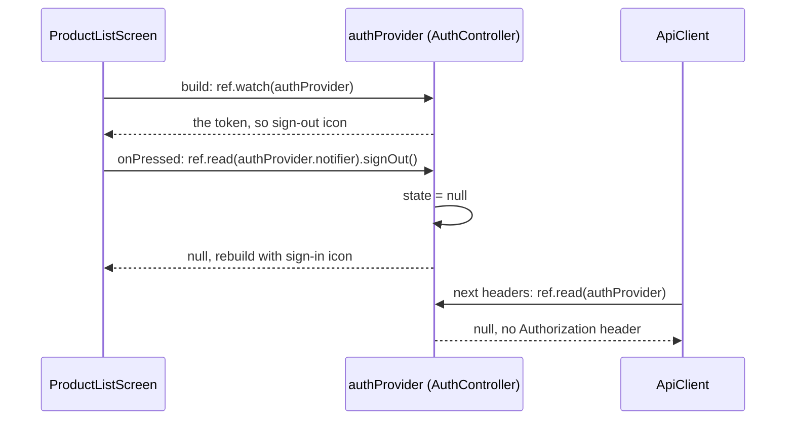

## Before you start

- [[frontend.l2.futureprovider-and-asyncvalue]] — you know that a widget watching a provider rebuilds when the provider's stored value changes, and that `ref.invalidate` throws a value away.
- [[frontend.l1.logging-in-from-the-app]] — you know that at stage-1 the token lived in a field of `ApiClient`, only in memory, and went out in the `Authorization: Bearer` header.
- [[backend.l2.oauth2-roles]] — you know that at stage-2 the customer signs in on Keycloak's page and the app ends up with an access token, never the password.

## The situation

At stage-1, you signed in, placed an order, tapped the back arrow, and the product list still offered the same sign-in icon. The token sat in a field inside `ApiClient`; the list never read it, and changing a field rebuilds no widget. At stage-2, sign in through Keycloak and the app bar, the bar at the top of the product list, shows a sign-out icon instead. Click it, and the sign-in icon is back at once, on the same screen, with no page reload. Nothing passed the token to the product list, and nothing told it that the token was gone. What does the list watch, and what changes it?

## Core concepts

- `Notifier` — a class that holds one value, its `state`, together with the methods allowed to change it; `AuthController extends Notifier<String?>` holds the access token, or `null`.
- `build` of a notifier — returns the first value of `state`; `AuthController.build` returns `null`, which means nobody is signed in.
- `NotifierProvider` — a provider that creates one notifier and gives its `state` to whoever watches it; `authProvider` is the `NotifierProvider` for `AuthController`.
- `ref.read` — returns a provider's current value once, without subscribing the widget to later changes; `ref.read(authProvider.notifier)` returns the `AuthController` object itself, so a button can call one of its methods.

## How it works



In the situation above, the product list watches `authProvider`. In its `build`, `ref.watch(authProvider)` returns the current token, or `null`, and subscribes the screen: from now on, when that value changes, the screen builds again. With a token, it shows the sign-out icon.

The value changes in one place only. `AuthController` keeps the token in `state`, and its own methods assign it: `completeSignIn` stores the token that Keycloak's sign-in produced, and `signOut` sets `state = null`. `state` is meant to be changed only from inside the notifier, so other code calls one of these methods instead.

When you click the sign-out icon, its `onPressed` calls `ref.read(authProvider.notifier).signOut()`. `ref.read` gets the notifier once, at the moment of the click, and subscribes to nothing. `signOut` assigns `null`, and every widget watching `authProvider` rebuilds. The product list is one of them, so its app bar now shows the sign-in icon. This closes the gap stage-1 left: the list now depends on the token, so a change reaches it.

`ApiClient` follows the same token without keeping a copy. It has no `_token` field any more. `apiClientProvider`, the provider that creates the app's one `ApiClient`, hands it a function that calls `ref.read(authProvider)`. Each time `ApiClient` builds the headers of a request, it calls that function. After sign-out, the function returns `null`, so any request built from then on carries no `Authorization` header.

So `watch` and `read` both return the value, but only `watch` subscribes. Use `watch` in `build`, where a change should rebuild the widget. Use `read` in a function such as `onPressed`, which runs once, when the click happens.

## In the Đơn Hàng system

The notifier and its provider, in `DonHang.App/lib/auth/auth_controller.dart`:

```dart file=DonHang.App/lib/auth/auth_controller.dart tag=stage-2 lines=5-26
// lesson: frontend.l2.notifier-for-app-state
// lesson: frontend.l2.route-guards
// The signed-in customer's access token, or null when nobody is signed in.
// Only these methods change it, by assigning `state`; every widget watching
// authProvider then rebuilds. Kept in memory only, as at stage-1: reloading
// the page signs the customer out.
class AuthController extends Notifier<String?> {
  @override
  String? build() => null;

  // Leaves the app for Keycloak's sign-in page; nothing changes here yet.
  void signIn() => KeycloakSignIn.start();

  // Called on /auth/callback with what Keycloak put in the URL.
  Future<void> completeSignIn({required String code, required String? oauthState}) async {
    state = await KeycloakSignIn.finish(code: code, state: oauthState);
  }

  void signOut() => state = null;
}

final authProvider = NotifierProvider<AuthController, String?>(AuthController.new);
```

`Notifier<String?>` says the value is a `String` or `null`. The notifier's `build` gives the first value, `null`. Of the three methods, only `completeSignIn` and `signOut` assign `state`; `signIn` just leaves for Keycloak. How `KeycloakSignIn` turns the code into a token is outside this lesson; what matters is that its result lands in `state`. The last line declares `authProvider`, which creates the one `AuthController`.

The app bar of the product list, in `DonHang.App/lib/screens/product_list_screen.dart`:

```dart file=DonHang.App/lib/screens/product_list_screen.dart tag=stage-2 lines=42-64
  // lesson: frontend.l2.notifier-for-app-state
  // lesson: frontend.l2.routes-with-go-router
  // Watching authProvider rebuilds this screen when the token changes, so the
  // button switches between sign-in and sign-out. onPressed only reads.
  List<Widget> _actions(BuildContext context, WidgetRef ref) {
    final l10n = AppLocalizations.of(context);
    final signedIn = ref.watch(authProvider) != null;
    return [
      IconButton(
        icon: const Icon(Icons.add_shopping_cart),
        tooltip: l10n.placeOrder,
        onPressed: () => context.go('/orders/new'),
      ),
      if (signedIn)
        IconButton(
          icon: const Icon(Icons.logout),
          tooltip: l10n.signOut,
          onPressed: () => ref.read(authProvider.notifier).signOut(),
        )
      else
        IconButton(icon: const Icon(Icons.login), tooltip: l10n.signIn, onPressed: () => context.go('/login')),
    ];
  }
```

`_actions` is called from `build`, so its `ref.watch(authProvider)` subscribes the screen. Ignore `l10n`, the cart icon and `context.go`; later lessons cover them. Compare the two `ref` calls: `watch` decides which icon to show, `read` runs only when the sign-out icon is clicked.

## Beginners often think…

- **"ref.read and ref.watch do the same thing; read is just the shorter name."** → Actually both return the current value, but only `ref.watch` subscribes the widget to later changes. You notice this when a widget that reads the token with `ref.read` in `build` keeps showing the old value after sign-out, while the product list switches its icon.
- **"Using ref.watch inside onPressed is safer, because it always gets the newest value."** → Actually `onPressed` runs at the moment of the click, so `ref.read` there already gets the value as it is then. Subscribing belongs in `build`, and Riverpod's own documentation says not to use `watch` in functions like `onPressed` that run when something happens. You notice this when sign-out works on every click although `onPressed` only reads.
- **"The signed-in token is the login screen's own state, so it belongs in that screen's State."** → Actually the product list, the order screens and `ApiClient` all need it, and at stage-2 the sign-in screen is not even on screen when sign-in finishes: Keycloak sends the browser back to a separate page, `/auth/callback`. You notice this when the product list cannot see a token held somewhere it does not watch, as at stage-1, when the token sat in `ApiClient` and the list kept offering sign-in.

## Try it (3 minutes)

1. With the system running (`scripts/up.sh`), open `localhost:8081` in Chrome and click the sign-in icon at the top right, then the one button on the sign-in page that opens. On Keycloak's page, sign in as `anh.tran@example.com` with the password `donhang-dev-password`.
2. Back on the product list, look at the top right, then click the sign-out icon there.

Expected result: after signing in, the top right shows a sign-out icon where the sign-in icon was. After the click, the sign-in icon is back at once; the address stays `localhost:8081/`, and the product list stays on screen without reloading.

The sign-out click changed a value inside `AuthController`. Why did the app bar of a different widget change?

<details><summary>Suggested answer</summary>

`ProductListScreen` watches `authProvider` in `build` (through `_actions`). `signOut` assigned `state = null`, so every widget watching `authProvider` rebuilt, and the rebuilt app bar chose the sign-in icon.

</details>

## Connections

- [[frontend.l2.ephemeral-vs-app-state]] — the fix for the problem in that lesson: the product list could not see the token; now it watches it.
- [[frontend.l2.futureprovider-and-asyncvalue]] — the other kind of provider: there the value comes from a load, here the app changes it itself.
- [[design.l2.observer-pattern]] — the same idea in object design: watchers subscribe, and one change notifies them all.
- [[frontend.l2.route-guards]] — the next use of `authProvider`: the router checks it before opening the order screens.

## Five-line summary

1. App state that several screens depend on, like the access token, lives in a `Notifier` that every screen can watch.
2. `authProvider` is a `NotifierProvider` whose `AuthController` holds the token or `null`, and `ApiClient` reads it for each request.
3. Only the notifier's methods change the value, by assigning `state`; when the new value differs from the old one, every widget watching `authProvider` rebuilds.
4. `ProductListScreen` watches `authProvider`, so its app bar switches between sign-in and sign-out as soon as the token changes.
5. Use `ref.watch` in `build` to rebuild on changes, and `ref.read` in `onPressed` to call a method once.
