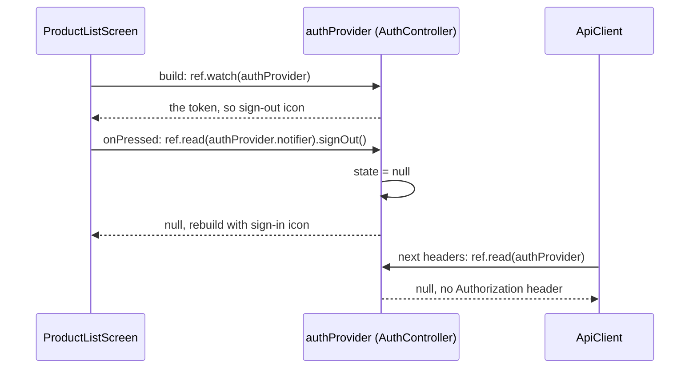

## Bạn cần biết trước

- [[frontend.l2.futureprovider-and-asyncvalue]] — bạn biết một widget watch một provider sẽ build lại khi giá trị provider đó lưu thay đổi, và `ref.invalidate` bỏ một giá trị đi.
- [[frontend.l1.logging-in-from-the-app]] — bạn biết ở stage-1 token nằm trong một field của `ApiClient`, chỉ trong bộ nhớ, và được gửi đi trong header `Authorization: Bearer`.
- [[backend.l2.oauth2-roles]] — bạn biết ở stage-2 khách đăng nhập trên trang của Keycloak và app nhận về một access token, không bao giờ thấy mật khẩu.

## Tình huống

Ở stage-1, bạn đăng nhập, đặt một đơn, bấm mũi tên quay lại, và danh sách sản phẩm vẫn hiện đúng icon đăng nhập cũ. Token nằm trong một field bên trong `ApiClient`. Danh sách chưa bao giờ đọc nó, và đổi một field thì không widget nào build lại. Ở stage-2, hãy đăng nhập qua Keycloak: app bar, thanh ở đầu danh sách sản phẩm, giờ hiện icon đăng xuất. Click vào đó, icon đăng nhập quay lại ngay, vẫn trên màn hình đó, không tải lại trang. Không có gì truyền token cho danh sách sản phẩm, cũng không có gì báo cho nó rằng token đã mất. Vậy danh sách watch cái gì, và cái gì làm thứ đó thay đổi?

## Khái niệm cốt lõi

- `Notifier` — một class giữ đúng một giá trị, gọi là `state`, cùng với các method được phép đổi giá trị đó. `AuthController extends Notifier<String?>` giữ access token, hoặc `null`.
- `build` của một notifier — trả về giá trị đầu tiên của `state`. `AuthController.build` trả về `null`, nghĩa là chưa ai đăng nhập.
- `NotifierProvider` — một provider tạo ra một notifier và đưa `state` của nó cho ai watch nó. `authProvider` là `NotifierProvider` của `AuthController`.
- `ref.read` — trả về giá trị hiện tại của một provider một lần, không đăng ký cho widget theo dõi các thay đổi sau đó. `ref.read(authProvider.notifier)` trả về chính object `AuthController`, để một nút bấm gọi được một method của nó.

## Cơ chế hoạt động



Trong tình huống trên, danh sách sản phẩm watch `authProvider`. Trong `build` của nó, `ref.watch(authProvider)` trả về token hiện tại, hoặc `null`, và đăng ký cho màn hình theo dõi: từ đó trở đi, hễ giá trị này đổi thì màn hình build lại. Có token thì nó hiện icon đăng xuất.

Giá trị chỉ đổi ở một nơi. `AuthController` giữ token trong `state`, và chính các method của nó gán giá trị: `completeSignIn` lưu token mà lần đăng nhập Keycloak tạo ra, còn `signOut` gán `state = null`. `state` chỉ nên được đổi từ bên trong notifier, nên code bên ngoài gọi một trong các method này.

Khi bạn click icon đăng xuất, `onPressed` của nó gọi `ref.read(authProvider.notifier).signOut()`. `ref.read` lấy notifier một lần, ngay lúc click, và không theo dõi gì cả. `signOut` gán `null`, và mọi widget đang watch `authProvider` build lại. Danh sách sản phẩm là một trong số đó, nên app bar của nó giờ hiện icon đăng nhập. Chỗ hở mà stage-1 để lại đã được lấp: danh sách giờ phụ thuộc vào token, nên thay đổi của token tới được nó.

`ApiClient` cũng theo cùng token đó mà không giữ bản sao nào. Nó không còn field `_token`. `apiClientProvider`, provider tạo ra chiếc `ApiClient` duy nhất của app, trao cho nó một hàm gọi `ref.read(authProvider)`. Mỗi lần `ApiClient` dựng header cho một request, nó gọi hàm đó. Sau khi đăng xuất, hàm trả về `null`, nên mọi request dựng từ lúc đó không còn header `Authorization`.

Vậy `watch` và `read` đều trả về giá trị, nhưng chỉ `watch` đăng ký theo dõi. Dùng `watch` trong `build`, nơi một thay đổi cần làm widget build lại. Dùng `read` trong một hàm như `onPressed`, hàm chỉ chạy một lần, đúng lúc click.

## Trong hệ thống Đơn Hàng

Notifier và provider của nó, trong `DonHang.App/lib/auth/auth_controller.dart`:

```dart file=DonHang.App/lib/auth/auth_controller.dart tag=stage-2 lines=5-26
// lesson: frontend.l2.notifier-for-app-state
// lesson: frontend.l2.route-guards
// The signed-in customer's access token, or null when nobody is signed in.
// Only these methods change it, by assigning `state`; every widget watching
// authProvider then rebuilds. Kept in memory only, as at stage-1: reloading
// the page signs the customer out.
class AuthController extends Notifier<String?> {
  @override
  String? build() => null;

  // Leaves the app for Keycloak's sign-in page; nothing changes here yet.
  void signIn() => KeycloakSignIn.start();

  // Called on /auth/callback with what Keycloak put in the URL.
  Future<void> completeSignIn({required String code, required String? oauthState}) async {
    state = await KeycloakSignIn.finish(code: code, state: oauthState);
  }

  void signOut() => state = null;
}

final authProvider = NotifierProvider<AuthController, String?>(AuthController.new);
```

`Notifier<String?>` cho biết giá trị là một `String` hoặc `null`. `build` của notifier cho giá trị đầu tiên là `null`. Trong ba method, chỉ `completeSignIn` và `signOut` gán `state`, còn `signIn` chỉ rời app sang Keycloak. `KeycloakSignIn` đổi code thành token ra sao nằm ngoài bài này, điều quan trọng là kết quả của nó được đặt vào `state`. Dòng cuối khai báo `authProvider`, provider tạo ra chiếc `AuthController` duy nhất.

App bar của danh sách sản phẩm, trong `DonHang.App/lib/screens/product_list_screen.dart`:

```dart file=DonHang.App/lib/screens/product_list_screen.dart tag=stage-2 lines=42-64
  // lesson: frontend.l2.notifier-for-app-state
  // lesson: frontend.l2.routes-with-go-router
  // Watching authProvider rebuilds this screen when the token changes, so the
  // button switches between sign-in and sign-out. onPressed only reads.
  List<Widget> _actions(BuildContext context, WidgetRef ref) {
    final l10n = AppLocalizations.of(context);
    final signedIn = ref.watch(authProvider) != null;
    return [
      IconButton(
        icon: const Icon(Icons.add_shopping_cart),
        tooltip: l10n.placeOrder,
        onPressed: () => context.go('/orders/new'),
      ),
      if (signedIn)
        IconButton(
          icon: const Icon(Icons.logout),
          tooltip: l10n.signOut,
          onPressed: () => ref.read(authProvider.notifier).signOut(),
        )
      else
        IconButton(icon: const Icon(Icons.login), tooltip: l10n.signIn, onPressed: () => context.go('/login')),
    ];
  }
```

`_actions` được gọi từ `build`, nên `ref.watch(authProvider)` trong đó đăng ký cho màn hình theo dõi. Tạm bỏ qua `l10n`, icon giỏ hàng và `context.go`, các bài sau sẽ nói tới. Hãy so hai lời gọi `ref`: `watch` quyết định hiện icon nào, còn `read` chỉ chạy khi icon đăng xuất được click.

## Người mới hay nghĩ rằng…

- **"ref.read và ref.watch làm cùng một việc, read chỉ là tên ngắn hơn."** → Thực ra cả hai đều trả về giá trị hiện tại, nhưng chỉ `ref.watch` đăng ký cho widget theo dõi các thay đổi sau đó. Bạn sẽ nhận ra khi một widget đọc token bằng `ref.read` trong `build` vẫn hiện giá trị cũ sau khi đăng xuất, trong khi danh sách sản phẩm đã đổi icon.
- **"Dùng ref.watch bên trong onPressed thì an toàn hơn, vì lúc nào cũng lấy được giá trị mới nhất."** → Thực ra `onPressed` chạy đúng lúc click, nên `ref.read` ở đó đã lấy được giá trị của đúng lúc ấy. Việc đăng ký theo dõi thuộc về `build`, và chính tài liệu của Riverpod dặn không dùng `watch` trong những hàm như `onPressed`, loại hàm chạy khi có chuyện gì đó xảy ra. Bạn sẽ nhận ra khi đăng xuất chạy đúng ở mọi lần click dù `onPressed` chỉ read.
- **"Token đăng nhập là state riêng của màn hình đăng nhập, nên nó thuộc về State của màn hình đó."** → Thực ra danh sách sản phẩm, các màn hình đơn hàng và `ApiClient` đều cần nó, và ở stage-2 màn hình đăng nhập thậm chí không còn trên màn hình khi đăng nhập xong: Keycloak đưa trình duyệt về một trang riêng, `/auth/callback`. Bạn sẽ nhận ra khi danh sách sản phẩm không thấy được một token nằm ở chỗ nó không watch, như ở stage-1, khi token nằm trong `ApiClient` và danh sách cứ mời bạn đăng nhập.

## Thử ngay (3 phút)

1. Khi hệ thống đang chạy (`scripts/up.sh`), mở `localhost:8081` trong Chrome và click icon đăng nhập ở góc trên bên phải, rồi click nút duy nhất trên trang đăng nhập hiện ra. Trên trang của Keycloak, đăng nhập bằng `anh.tran@example.com` với mật khẩu `donhang-dev-password`.
2. Khi đã quay về danh sách sản phẩm, nhìn góc trên bên phải, rồi click icon đăng xuất ở đó.

Kết quả mong đợi: sau khi đăng nhập, góc trên bên phải hiện icon đăng xuất ở chỗ icon đăng nhập lúc trước. Sau cú click, icon đăng nhập quay lại ngay, địa chỉ vẫn là `localhost:8081/`, và danh sách sản phẩm vẫn nằm trên màn hình, không tải lại.

Cú click đăng xuất đổi một giá trị bên trong `AuthController`. Vì sao app bar của một widget khác lại đổi theo?

<details><summary>Gợi ý đáp án</summary>

`ProductListScreen` watch `authProvider` trong `build` (qua `_actions`). `signOut` đã gán `state = null`, nên mọi widget đang watch `authProvider` build lại, và app bar được build lại đã chọn icon đăng nhập.

</details>

## Liên hệ

- [[frontend.l2.ephemeral-vs-app-state]] — lời giải cho vấn đề trong bài đó: danh sách sản phẩm không thấy được token, giờ thì nó watch token.
- [[frontend.l2.futureprovider-and-asyncvalue]] — loại provider còn lại: ở đó giá trị đến từ một lần tải, ở đây chính app tự đổi giá trị.
- [[design.l2.observer-pattern]] — cùng ý tưởng trong thiết kế object: bên theo dõi đăng ký, và một thay đổi báo cho tất cả.
- [[frontend.l2.route-guards]] — nơi dùng tiếp `authProvider`: router kiểm tra nó trước khi mở các màn hình đơn hàng.

## Tóm tắt 5 dòng

1. App state mà nhiều màn hình cùng phụ thuộc, như access token, nằm trong một `Notifier` mà màn hình nào cũng watch được.
2. `authProvider` là một `NotifierProvider` có `AuthController` giữ token hoặc `null`, và `ApiClient` đọc nó cho mỗi request.
3. Chỉ các method của notifier đổi giá trị, bằng cách gán `state`. Khi giá trị mới khác giá trị cũ, mọi widget đang watch `authProvider` build lại.
4. `ProductListScreen` watch `authProvider`, nên app bar của nó chuyển giữa đăng nhập và đăng xuất ngay khi token đổi.
5. Dùng `ref.watch` trong `build` để build lại khi có thay đổi, và `ref.read` trong `onPressed` để gọi một method một lần.
