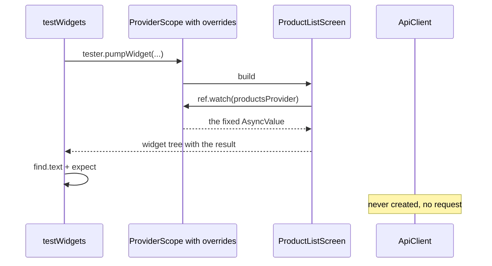

## Before you start

- [[frontend.l2.futureprovider-and-asyncvalue]] — you know that `ProductListScreen` watches `productsProvider` and shows loading, error, empty or the list, depending on the AsyncValue it gets.
- [[design.l1.test-doubles]] — you know that a test can put a simpler stand-in where the real dependency would be, so it does not need a database or a mail server.

## The situation

At stage-1, the only test that touched the product list built the whole app and checked only the title and the spinner. The list, the empty message and the error text were never tested. Checking them by hand needs an API that answers with products, with nothing, or with a failure. The database at stage-2 always starts with eight products, so seeing "No products yet." would mean removing all eight from the database. You want a test for each state that runs anywhere, even with Docker stopped. How can a test put the product list into each state without a server?

## Core concepts

- **widget test** — a test that builds a widget in a test environment with no real screen, then checks what the widget tree shows.
- `testWidgets` and `WidgetTester` — `testWidgets` declares one widget test and hands it a `tester`; `tester.pumpWidget(widget)` builds that widget in the test environment.
- `find` and `expect` — `find.text('…')` looks for widgets showing that text, and `expect(finder, findsOneWidget)` fails the test unless exactly one is found.
- `ProviderScope(overrides: […])` — a `ProviderScope` that, only for the widgets below it, replaces a provider with something else, such as `productsProvider.overrideWithValue(value)`, which gives a fixed value.

## How it works



In the situation above, the test replaces the server with one line: the value `productsProvider` should give. Follow the diagram. `testWidgets` starts one widget test, and `tester.pumpWidget` builds a `ProviderScope` with an override around `ProductListScreen`. Nothing is drawn on a monitor and no browser opens: the test environment builds and lays out the widget tree in memory, and `flutter test` runs it.

The screen is the real one, unchanged. Its `build` still calls `ref.watch(productsProvider)`, exactly as in the app. The difference is the scope above it. This `ProviderScope` was told to override `productsProvider` with a fixed AsyncValue, so it hands the screen that value and never runs the provider's function. That function is the one that reads `apiClientProvider` and calls `fetchProducts`, the method that sends the request. So no `ApiClient` is created, and no HTTP request is sent.

This works because the screen names what it needs instead of fetching it. In the app, the `ProviderScope` in `main.dart` has no overrides, so `productsProvider` gives what its own function loads; in a test, the test's own `ProviderScope` decides.

The screen then builds the case that value describes. With two products, the tree holds their names; with an empty list, the empty message; with an error, the error text. `find.text` looks for that text in the tree, and `expect` fails the test if it is not there exactly once.

Each test builds its own `ProviderScope`, and an override belongs to the scope that declares it. The next test pumps a new scope with its own override, so nothing carries over, and the app itself is untouched.

## In the Đơn Hàng system

The helper that builds the screen for a test, in `DonHang.App/test/product_list_screen_test.dart`:

```dart file=DonHang.App/test/product_list_screen_test.dart tag=stage-2 lines=10-21
// lesson: frontend.l2.overriding-providers-in-tests
// The screen as the app builds it, but productsProvider holds a fixed value
// instead of calling the API: no server, no HTTP request.
Widget screenWith(AsyncValue<List<Product>> products) => ProviderScope(
      overrides: [productsProvider.overrideWithValue(products)],
      child: const MaterialApp(
        locale: Locale('en'),
        localizationsDelegates: AppLocalizations.localizationsDelegates,
        supportedLocales: AppLocalizations.supportedLocales,
        home: ProductListScreen(),
      ),
    );
```

`screenWith` takes the AsyncValue a test wants and returns the screen inside a `ProviderScope` whose `overrides` list holds one entry. The `MaterialApp` around the screen gives it English texts, which it reads for its labels; ignore those three lines.

The three tests, in the same file:

```dart file=DonHang.App/test/product_list_screen_test.dart tag=stage-2 lines=23-46
void main() {
  // lesson: frontend.l2.overriding-providers-in-tests
  // One test per state; each override lives only in its own ProviderScope.
  testWidgets('shows the products the provider holds', (tester) async {
    await tester.pumpWidget(screenWith(AsyncValue.data([
      Product(id: 1, name: 'Bàn phím cơ', priceVnd: 1250000),
      Product(id: 2, name: 'Chuột không dây', priceVnd: 450000),
    ])));

    expect(find.text('Bàn phím cơ'), findsOneWidget);
    expect(find.text('Chuột không dây'), findsOneWidget);
  });

  testWidgets('says so when there are no products', (tester) async {
    await tester.pumpWidget(screenWith(const AsyncValue.data([])));

    expect(find.text('No products yet.'), findsOneWidget);
  });

  testWidgets('shows the error text when loading failed', (tester) async {
    await tester.pumpWidget(screenWith(AsyncValue.error(Exception('offline'), StackTrace.empty)));

    expect(find.text('Could not load products.'), findsOneWidget);
  });
```

Read each test as three lines: choose an AsyncValue, pump the screen with it, look for the text that case should show. `AsyncValue.data` builds the data case, and `AsyncValue.error` builds the error case from an exception and a stack trace; the test never waits for a request, because none is sent.

## Beginners often think…

- **"Testing a screen that shows API data needs the API running."** → Actually the screen gets its data from `productsProvider`, and the test overrides that provider, so the API is never called. You notice this when `flutter test` passes on a machine where Docker is not even running.
- **"A widget test opens the app in a browser or on a phone and taps through it."** → Actually it builds one widget in a test environment without a real screen and reads the resulting widget tree. You notice this when `flutter test` needs no device and no window opens while the three tests run.
- **"Overriding a provider in one test changes it for the tests that run after it."** → Actually each test pumps its own `ProviderScope`, and the override lives only there. You notice this when breaking one test's override makes only that test fail, as in the exercise below.

## Try it (3 minutes)

1. From the `DonHang.App` folder, run `flutter test test/product_list_screen_test.dart`. Docker does not have to be running.
2. In the second test, change `const AsyncValue.data([])` to `const AsyncValue.loading()`, run the same command again, then undo the change with `git checkout -- test/product_list_screen_test.dart`.

Expected result: the first run ends with `+3: All tests passed!`. The second run fails only `says so when there are no products`, reporting `Found 0 widgets with text "No products yet."`, and ends with `+2 -1: Some tests failed.` The test after it still passes.

Why does the third test still pass after you broke the second one?

<details><summary>Suggested answer</summary>

The third test pumps a new `ProviderScope` with its own override, an error. The loading value you put in the second test belonged to the second test's scope only, so it cannot reach the third.

</details>

## Connections

- [[frontend.l2.futureprovider-and-asyncvalue]] — prerequisite: the AsyncValue cases these tests put the screen into, one test per case.
- [[design.l1.test-doubles]] — the same idea on the server: a fixed stand-in replaces the real dependency, here through a provider instead of a constructor.
- [[design.l2.test-pyramid]] — where widget tests sit among the kinds of tests, and how many of each to write.

## Five-line summary

1. A test can check every state of a screen without a server by overriding the provider the screen reads.
2. A widget test builds a widget with `testWidgets` and `tester.pumpWidget`, then checks its tree with `find` and `expect`.
3. `ProviderScope(overrides: […])` makes `productsProvider` give a fixed AsyncValue, so no `ApiClient` is made and no request is sent.
4. The same unchanged `ProductListScreen` is tested with two products, an empty list and an error, one test each.
5. An override lives only in the `ProviderScope` that declares it, so each test has its own values and `main.dart` stays unchanged.
