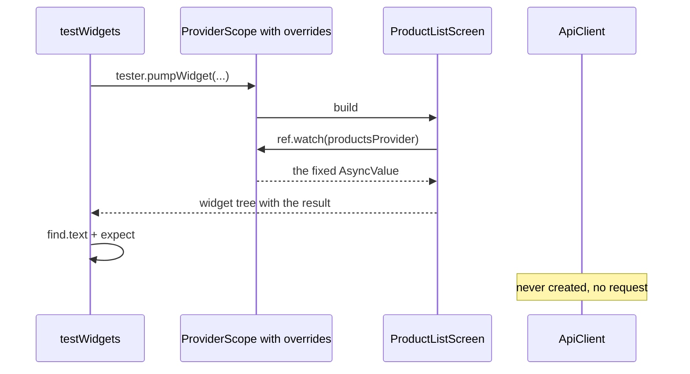

## Bạn cần biết trước

- [[frontend.l2.futureprovider-and-asyncvalue]] — bạn biết `ProductListScreen` watch `productsProvider` và hiện trạng thái đang tải, lỗi, rỗng hoặc danh sách, tùy AsyncValue mà nó nhận được.
- [[design.l1.test-doubles]] — bạn biết một test có thể đặt một vật thay thế đơn giản hơn vào chỗ của phụ thuộc thật, để không cần database hay mail server.

## Tình huống

Ở stage-1, test duy nhất có chạm tới danh sách sản phẩm build cả app và chỉ kiểm tra tiêu đề với spinner. Danh sách, thông báo rỗng và thông báo lỗi chưa bao giờ được test. Muốn kiểm tra chúng bằng tay thì cần một API trả về sản phẩm, trả về rỗng, hoặc trả về lỗi. Database ở stage-2 lúc nào cũng bắt đầu với tám sản phẩm, nên muốn thấy "No products yet." thì phải xóa cả tám sản phẩm khỏi database. Bạn muốn mỗi trạng thái có một test chạy được ở bất cứ đâu, kể cả khi Docker đang tắt. Làm sao để một test đưa danh sách sản phẩm vào từng trạng thái mà không cần server?

## Khái niệm cốt lõi

- **widget test** (Test dựng một widget trong môi trường test không có màn hình thật rồi kiểm cây widget hiện ra gì) — một test build một widget trong môi trường test không có màn hình thật, rồi kiểm tra widget tree hiện ra những gì.
- `testWidgets` và `WidgetTester` — `testWidgets` khai báo một widget test và đưa cho nó một `tester`. `tester.pumpWidget(widget)` build widget đó trong môi trường test.
- `find` và `expect` — `find.text('…')` tìm các widget đang hiện đoạn text đó, còn `expect(finder, findsOneWidget)` làm test fail nếu không tìm thấy đúng một widget.
- `ProviderScope(overrides: […])` — một `ProviderScope` thay một provider bằng thứ khác, chỉ cho các widget nằm bên dưới nó, ví dụ `productsProvider.overrideWithValue(value)` đưa ra một giá trị cố định.

## Cơ chế hoạt động



Trong tình huống trên, test thay cả server bằng đúng một dòng: giá trị mà `productsProvider` nên đưa ra. Hãy đi theo sơ đồ. `testWidgets` bắt đầu một widget test, và `tester.pumpWidget` build một `ProviderScope` có override bọc quanh `ProductListScreen`. Không có gì được vẽ lên màn hình, cũng không trình duyệt nào mở ra: môi trường test dựng và sắp xếp widget tree trong bộ nhớ, và `flutter test` chạy nó.

Màn hình là màn hình thật, không sửa gì. `build` của nó vẫn gọi `ref.watch(productsProvider)`, y như trong app. Khác biệt nằm ở scope phía trên. `ProviderScope` này được dặn override `productsProvider` bằng một AsyncValue cố định, nên nó đưa giá trị đó cho màn hình và không bao giờ chạy hàm của provider. Hàm đó chính là nơi đọc `apiClientProvider` và gọi `fetchProducts`, method gửi request đi. Vậy nên không có `ApiClient` nào được tạo, và không có HTTP request nào được gửi.

Cách này chạy được vì màn hình nêu tên thứ nó cần thay vì tự đi lấy. Trong app, `ProviderScope` ở `main.dart` không có override nào, nên `productsProvider` đưa ra thứ mà chính hàm của nó tải về. Trong test, `ProviderScope` riêng của test quyết định.

Sau đó màn hình build đúng trường hợp mà giá trị kia mô tả. Với hai sản phẩm, cây có tên của chúng. Với list rỗng, cây có thông báo rỗng. Với lỗi, cây có thông báo lỗi. `find.text` tìm đoạn text đó trong cây, và `expect` làm test fail nếu nó không xuất hiện đúng một lần.

Mỗi test build `ProviderScope` riêng của mình, và một override thuộc về scope khai báo nó. Test kế tiếp pump một scope mới với override riêng, nên không có gì bị mang sang, và bản thân app vẫn nguyên vẹn.

## Trong hệ thống Đơn Hàng

Hàm hỗ trợ dựng màn hình cho một test, trong `DonHang.App/test/product_list_screen_test.dart`:

```dart file=DonHang.App/test/product_list_screen_test.dart tag=stage-2 lines=10-21
// lesson: frontend.l2.overriding-providers-in-tests
// The screen as the app builds it, but productsProvider holds a fixed value
// instead of calling the API: no server, no HTTP request.
Widget screenWith(AsyncValue<List<Product>> products) => ProviderScope(
      overrides: [productsProvider.overrideWithValue(products)],
      child: const MaterialApp(
        locale: Locale('en'),
        localizationsDelegates: AppLocalizations.localizationsDelegates,
        supportedLocales: AppLocalizations.supportedLocales,
        home: ProductListScreen(),
      ),
    );
```

`screenWith` nhận AsyncValue mà test muốn và trả về màn hình nằm trong một `ProviderScope` có danh sách `overrides` gồm một phần tử. `MaterialApp` bọc quanh màn hình cho nó các đoạn text tiếng Anh để hiện nhãn, bạn tạm bỏ qua ba dòng đó.

Ba test, trong cùng file:

```dart file=DonHang.App/test/product_list_screen_test.dart tag=stage-2 lines=23-46
void main() {
  // lesson: frontend.l2.overriding-providers-in-tests
  // One test per state; each override lives only in its own ProviderScope.
  testWidgets('shows the products the provider holds', (tester) async {
    await tester.pumpWidget(screenWith(AsyncValue.data([
      Product(id: 1, name: 'Bàn phím cơ', priceVnd: 1250000),
      Product(id: 2, name: 'Chuột không dây', priceVnd: 450000),
    ])));

    expect(find.text('Bàn phím cơ'), findsOneWidget);
    expect(find.text('Chuột không dây'), findsOneWidget);
  });

  testWidgets('says so when there are no products', (tester) async {
    await tester.pumpWidget(screenWith(const AsyncValue.data([])));

    expect(find.text('No products yet.'), findsOneWidget);
  });

  testWidgets('shows the error text when loading failed', (tester) async {
    await tester.pumpWidget(screenWith(AsyncValue.error(Exception('offline'), StackTrace.empty)));

    expect(find.text('Could not load products.'), findsOneWidget);
  });
```

Hãy đọc mỗi test thành ba bước: chọn một AsyncValue, pump màn hình với giá trị đó, tìm đoạn text mà trường hợp đó phải hiện. `AsyncValue.data` tạo trường hợp có dữ liệu, còn `AsyncValue.error` tạo trường hợp lỗi từ một exception và một stack trace. Test không bao giờ phải chờ request nào, vì chẳng có request nào được gửi.

## Người mới hay nghĩ rằng…

- **"Muốn test một màn hình hiện dữ liệu từ API thì API phải đang chạy."** → Thực ra màn hình lấy dữ liệu từ `productsProvider`, và test override provider đó, nên API không bao giờ bị gọi. Bạn sẽ nhận ra khi `flutter test` vẫn pass trên một máy mà Docker còn chưa bật.
- **"Widget test mở app trong trình duyệt hoặc trên điện thoại rồi bấm qua từng màn hình."** → Thực ra nó build một widget trong môi trường test không có màn hình thật rồi đọc widget tree tạo ra. Bạn sẽ nhận ra khi `flutter test` không cần thiết bị nào và không có cửa sổ nào mở ra trong lúc ba test chạy.
- **"Override một provider trong một test sẽ đổi luôn nó cho các test chạy sau."** → Thực ra mỗi test pump `ProviderScope` riêng, và override chỉ sống trong đó. Bạn sẽ nhận ra khi làm hỏng override của một test thì chỉ đúng test đó fail, như trong bài tập bên dưới.

## Thử ngay (3 phút)

1. Từ thư mục `DonHang.App`, chạy `flutter test test/product_list_screen_test.dart`. Docker không cần đang chạy.
2. Trong test thứ hai, đổi `const AsyncValue.data([])` thành `const AsyncValue.loading()`, chạy lại đúng lệnh đó, rồi hoàn tác thay đổi bằng `git checkout -- test/product_list_screen_test.dart`.

Kết quả mong đợi: lần chạy đầu kết thúc bằng `+3: All tests passed!`. Lần chạy thứ hai chỉ fail đúng test `says so when there are no products`, báo `Found 0 widgets with text "No products yet."`, và kết thúc bằng `+2 -1: Some tests failed.` Test đứng sau nó vẫn pass.

Vì sao test thứ ba vẫn pass sau khi bạn làm hỏng test thứ hai?

<details><summary>Gợi ý đáp án</summary>

Test thứ ba pump một `ProviderScope` mới với override riêng của nó, là một lỗi. Giá trị đang tải mà bạn đặt vào test thứ hai chỉ thuộc về scope của test thứ hai, nên không thể lan sang test thứ ba.

</details>

## Liên hệ

- [[frontend.l2.futureprovider-and-asyncvalue]] — bài cần biết trước: các trường hợp của AsyncValue mà những test này đưa màn hình vào, mỗi test một trường hợp.
- [[design.l1.test-doubles]] — cùng ý tưởng ở phía server: một vật thay thế cố định đứng vào chỗ phụ thuộc thật, ở đây qua provider thay vì qua constructor.
- [[design.l2.test-pyramid]] — widget test nằm ở đâu giữa các loại test, và nên viết bao nhiêu test mỗi loại.

## Tóm tắt 5 dòng

1. Một test có thể kiểm mọi trạng thái của một màn hình mà không cần server, bằng cách override provider mà màn hình đọc.
2. Widget test build một widget bằng `testWidgets` và `tester.pumpWidget`, rồi kiểm widget tree bằng `find` và `expect`.
3. `ProviderScope(overrides: […])` khiến `productsProvider` đưa ra một AsyncValue cố định, nên không có `ApiClient` nào được tạo và không request nào được gửi.
4. Cùng một `ProductListScreen` không sửa gì được test với hai sản phẩm, một list rỗng và một lỗi, mỗi trường hợp một test.
5. Override chỉ sống trong `ProviderScope` khai báo nó, nên mỗi test có giá trị riêng và `main.dart` vẫn giữ nguyên.
