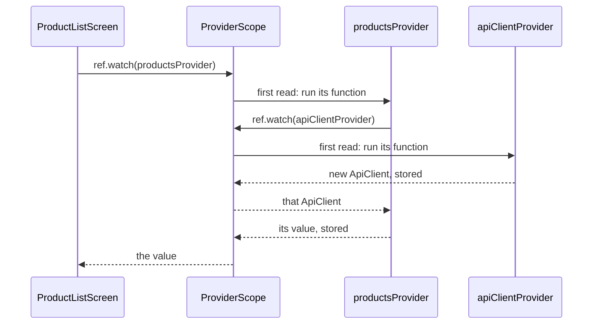

## Before you start

- [[frontend.l2.ephemeral-vs-app-state]] — you know that app state is read by several screens or must outlive its screen, and that at stage-1 the one `ApiClient` travelled from screen to screen through constructors.
- [[design.l1.the-di-container]] — you know that `DonHang.Api` registers its classes once at startup, and that the container hands each controller what its constructor asks for.

## The situation

At stage-1, the one `ApiClient` travelled down through constructors: `DonHangApp` handed it to the product list, which handed it to the sign-in screen, which handed it to the order screen. Stage-2 adds screens that the browser can open straight from an address, such as a product's own page. No earlier screen opened them, so nobody is there to pass anything in. At stage-2 every screen that calls the API, even the product list, gets the `ApiClient` the same new way. Open `product_list_screen.dart` at stage-2: its constructor takes no `ApiClient` at all, yet the product list still loads through one. Where does a widget get the app's `ApiClient` when no parent hands it over?

## Core concepts

- **Riverpod** — a state library for Flutter that keeps app state in providers, outside the widget tree; `ProviderScope` stores their values, and widgets read them through a ref.
- provider — an object declared once as a top-level `final`, which describes how to create one value, such as `apiClientProvider` describing how to create the app's `ApiClient`.
- `ProviderScope` — the widget wrapped around `DonHangApp` in `main.dart`; it stores the value of every provider the app reads.
- `ConsumerWidget` and `WidgetRef` — a widget whose `build` receives a `WidgetRef` as a second parameter, which it uses to ask providers for their values.
- `ref.watch` — returns a provider's value, creating it first if nothing has read it yet; a provider's own function also receives a `ref` and can watch other providers the same way.

## How it works



In the situation above, the product list gets its `ApiClient` without anyone passing it, because it no longer asks a parent: it asks a provider. Start at the top of the diagram. `ProductListScreen` is a `ConsumerWidget`, so its `build` has a `ref`, and it calls `ref.watch(productsProvider)`. The screen does not watch `apiClientProvider` itself; `productsProvider` does, inside its own function.

Neither provider holds a value yet. A provider's declaration is only a description: "to make this value, run this function". The value is kept by `ProviderScope`. On the first read of `productsProvider`, `ProviderScope` runs its function; that function watches `apiClientProvider`, so `ProviderScope` runs that function too, gets a new `ApiClient`, and stores it. It then hands that `ApiClient` back to `productsProvider`'s function, stores what that function returns (a value that carries the product list once it has loaded, as the next lesson shows), and hands it to the screen. So nothing is created when the app starts, only when something first reads it.

The next read of `apiClientProvider`, from any widget or provider under the same `ProviderScope`, does not run the function again. It gets the stored `ApiClient`, the same object every time. So the app still has one `ApiClient`, as at stage-1, but no screen has to carry it. A stored value stays until something throws it away; a later lesson shows how.

This is the job the DI container does in `DonHang.Api`. A controller names what it needs in its constructor and the container supplies it; here a widget or a provider names the provider it needs, and `ProviderScope` supplies the value. In both, the thing that uses a dependency no longer depends on whoever created it.

## In the Đơn Hàng system

The first two providers, in `DonHang.App/lib/providers.dart`:

```dart file=DonHang.App/lib/providers.dart tag=stage-2 lines=16-30
// lesson: frontend.l2.riverpod-providers
// Each provider is declared once, at the top level, and says how to make
// one value. The value itself is kept by the ProviderScope in main.dart,
// made the first time something reads it and shared by every later read.
final apiClientProvider = Provider<ApiClient>((ref) {
  return ApiClient(readToken: () => ref.read(authProvider));
});

// lesson: frontend.l2.futureprovider-and-asyncvalue
// lesson: frontend.l2.overriding-providers-in-tests
// Loads the product list once and keeps it; ref.invalidate(productsProvider)
// throws it away so the next read loads it again.
final productsProvider = FutureProvider<List<Product>>((ref) {
  return ref.watch(apiClientProvider).fetchProducts();
});
```

`apiClientProvider` is a `Provider<ApiClient>`: a top-level `final` whose function returns a new `ApiClient`. The argument `readToken` is how that `ApiClient` gets the current token at stage-2; the token itself lives in another provider, and a later lesson covers it. `ref.read` also returns a provider's value; that lesson explains how it differs from `ref.watch`, so for now read it as "get the token when a request is sent". `productsProvider` is a different kind of provider, the subject of the next lesson. What matters here is its one line of body: `ref.watch(apiClientProvider)` is how one provider asks for another.

The product list, in `DonHang.App/lib/screens/product_list_screen.dart`:

```dart file=DonHang.App/lib/screens/product_list_screen.dart tag=stage-2 lines=13-21
// No State class and no constructor parameters: everything it shows comes
// from providers, and AsyncValue.when gives one builder per case.
class ProductListScreen extends ConsumerWidget {
  const ProductListScreen({super.key});

  @override
  Widget build(BuildContext context, WidgetRef ref) {
    final l10n = AppLocalizations.of(context);
    final products = ref.watch(productsProvider);
```

Ignore `l10n` and the comments about `AsyncValue` and `ref.invalidate`; they belong to later lessons. Compare this with stage-1: the constructor no longer has `apiClient`, and `build` takes a `WidgetRef`. The screen asks for `productsProvider` by name. All of this only works because of line 15 of `main.dart`, `runApp(const ProviderScope(child: DonHangApp()));`: `ProviderScope` sits above every screen, so each `ref` finds the same stored values. `DonHangApp` itself is also a `ConsumerWidget` whose `build` watches a provider, one that does not need the `ApiClient`.

## Beginners often think…

- **"A provider declared as a top-level variable is just a global variable with a new name."** → Actually the top-level `final` holds only the description of how to make a value; the value lives in `ProviderScope`. The variable is never assigned again. You notice this when you search the app for a line that stores an `ApiClient` into `apiClientProvider` and find none.
- **"Every provider is created when the app starts."** → Actually a provider's function runs the first time something reads it, and a provider nothing reads is never created. When the app opens at `/`, the `ApiClient` is made when the product list first watches `productsProvider`. You notice this when a breakpoint inside a provider's function is hit only once the first widget that needs the value builds.
- **"Without ProviderScope, providers simply start out empty."** → Actually without `ProviderScope` there is nowhere to store a value, so the first read fails with an error instead of returning nothing. You notice this when the app shows an error in place of its first screen, as in the exercise below.

## Try it (3 minutes)

1. In `DonHang.App/lib/main.dart`, change line 15 to `runApp(const DonHangApp());`, so that nothing wraps the app in `ProviderScope`.
2. From the `DonHang.App` folder, run `flutter run -d chrome`, look at the page and at the terminal, then stop it and undo the change with `git checkout -- lib/main.dart`.

Expected result: no product list and no spinner. The page shows an error in place of the app, and the terminal reports `Bad state: No ProviderScope found`, naming `DonHangApp` as the widget that was being built.

Why does the error come from `DonHangApp` and not from the product list?

<details><summary>Suggested answer</summary>

`DonHangApp` is itself a `ConsumerWidget`: its `build` watches a provider before any screen exists. That first `ref.watch` looks up the widget tree for a `ProviderScope`, finds none, and fails, so the product list is never built at all.

</details>

## Connections

- [[frontend.l2.ephemeral-vs-app-state]] — the problem this solves: app state that had to travel through constructors and that no screen could read.
- [[design.l1.the-di-container]] — the same idea on the server: name what you need and let one place create and share it.
- [[frontend.l2.futureprovider-and-asyncvalue]] — the next step: what kind of provider `productsProvider` is, and how the screen shows loading, error and data from it.
- [[frontend.l2.notifier-for-app-state]] — where the token becomes a provider of its own, so screens can react when someone signs in.

## Five-line summary

1. Riverpod keeps app state in providers: each is declared once as a top-level `final` and describes how to make one value.
2. `ProviderScope`, wrapped around `DonHangApp` in `main.dart`, stores every provider's value; the declaration itself holds none.
3. A provider's function runs on the first read; later reads under the same scope get the stored value until something throws it away.
4. A `ConsumerWidget` watches providers through `ref`, and `productsProvider` gets the `ApiClient` with `ref.watch(apiClientProvider)`.
5. Like the DI container in `DonHang.Api`, a widget names what it needs instead of every parent passing it down.
