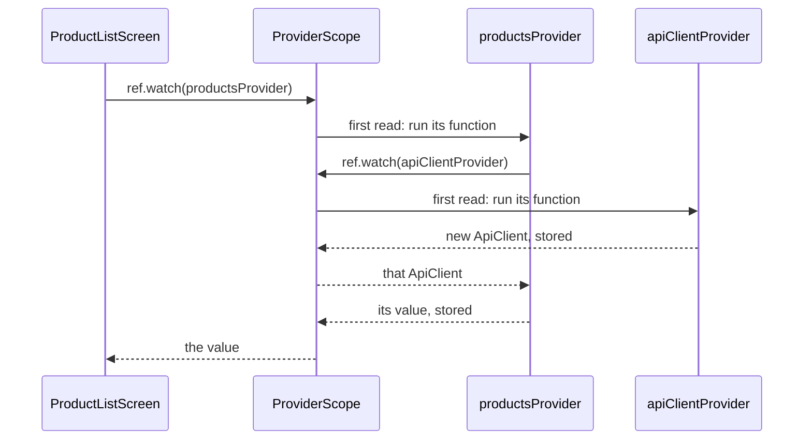

## Bạn cần biết trước

- [[frontend.l2.ephemeral-vs-app-state]] — bạn biết app state là state nhiều màn hình cùng đọc hoặc phải sống lâu hơn màn hình của nó, và ở stage-1 chiếc `ApiClient` duy nhất đi từ màn hình này sang màn hình khác qua constructor.
- [[design.l1.the-di-container]] — bạn biết `DonHang.Api` đăng ký các class của nó một lần lúc khởi động, và container đưa cho mỗi controller những gì constructor của nó yêu cầu.

## Tình huống

Ở stage-1, chiếc `ApiClient` duy nhất đi xuống qua constructor: `DonHangApp` trao nó cho danh sách sản phẩm, danh sách sản phẩm trao cho màn hình đăng nhập, màn hình đăng nhập trao cho màn hình đặt hàng. Stage-2 thêm những màn hình mà trình duyệt mở thẳng từ một địa chỉ, như trang riêng của một sản phẩm. Không màn hình nào mở chúng trước đó, nên chẳng có ai ở đó để truyền gì vào. Ở stage-2, mọi màn hình có gọi API, kể cả danh sách sản phẩm, đều lấy `ApiClient` theo đường mới này. Hãy mở `product_list_screen.dart` ở stage-2: constructor của nó không hề nhận `ApiClient`, vậy mà danh sách sản phẩm vẫn tải dữ liệu qua một `ApiClient`. Khi không có cha nào trao `ApiClient` của app, một widget lấy nó từ đâu?

## Khái niệm cốt lõi

- **Riverpod** (Thư viện quản lý state cho Flutter: app state nằm trong provider, ProviderScope giữ giá trị, widget đọc qua ref) — thư viện state cho Flutter, giữ app state trong các provider nằm ngoài widget tree. `ProviderScope` lưu giá trị của chúng, và widget đọc chúng qua một ref.
- provider — một object được khai báo một lần dưới dạng `final` ở cấp cao nhất, mô tả cách tạo ra một giá trị, như `apiClientProvider` mô tả cách tạo `ApiClient` của app.
- `ProviderScope` — widget bọc quanh `DonHangApp` trong `main.dart`. Nó lưu giá trị của mọi provider mà app đọc.
- `ConsumerWidget` và `WidgetRef` — một widget có `build` nhận thêm `WidgetRef` làm tham số thứ hai, dùng để xin giá trị từ các provider.
- `ref.watch` — trả về giá trị của một provider, tạo giá trị đó trước nếu chưa có ai đọc. Hàm của chính một provider cũng nhận một `ref` và có thể watch provider khác theo cùng cách.

## Cơ chế hoạt động



Trong tình huống trên, danh sách sản phẩm có `ApiClient` mà không cần ai truyền vào, vì nó không còn hỏi cha nữa: nó hỏi một provider. Hãy bắt đầu từ đầu sơ đồ. `ProductListScreen` là một `ConsumerWidget`, nên `build` của nó có `ref`, và nó gọi `ref.watch(productsProvider)`. Màn hình không tự watch `apiClientProvider`, việc đó do `productsProvider` làm bên trong hàm của nó.

Lúc này chưa provider nào giữ giá trị. Khai báo của một provider chỉ là một mô tả: "muốn có giá trị này thì chạy hàm này". Giá trị do `ProviderScope` giữ. Ở lần đọc đầu tiên của `productsProvider`, `ProviderScope` chạy hàm của nó. Hàm đó watch `apiClientProvider`, nên `ProviderScope` chạy luôn hàm của provider này, nhận một `ApiClient` mới và lưu lại. Sau đó nó trao `ApiClient` đó cho hàm của `productsProvider`, lưu thứ hàm này trả về (một giá trị mang danh sách sản phẩm khi đã tải xong, bài sau sẽ nói rõ), rồi trao cho màn hình. Vậy nên không có gì được tạo lúc app khởi động, chỉ khi có thứ gì đó đọc nó lần đầu.

Lần đọc `apiClientProvider` tiếp theo, dù từ widget hay provider nào dưới cùng `ProviderScope`, không chạy lại hàm. Nó nhận `ApiClient` đã lưu, lần nào cũng đúng object đó. Vậy là app vẫn chỉ có một `ApiClient` như ở stage-1, nhưng không màn hình nào phải mang nó theo. Giá trị đã lưu sẽ còn đó cho tới khi có thứ gì bỏ nó đi, bài sau sẽ chỉ cách.

Đây chính là việc DI container làm trong `DonHang.Api`. Một controller nêu thứ nó cần trong constructor và container đưa thứ đó cho nó. Ở đây, một widget hay một provider nêu tên provider nó cần, và `ProviderScope` đưa ra giá trị. Trong cả hai trường hợp, thứ dùng một phụ thuộc không còn phụ thuộc vào nơi đã tạo ra nó.

## Trong hệ thống Đơn Hàng

Hai provider đầu tiên, trong `DonHang.App/lib/providers.dart`:

```dart file=DonHang.App/lib/providers.dart tag=stage-2 lines=16-30
// lesson: frontend.l2.riverpod-providers
// Each provider is declared once, at the top level, and says how to make
// one value. The value itself is kept by the ProviderScope in main.dart,
// made the first time something reads it and shared by every later read.
final apiClientProvider = Provider<ApiClient>((ref) {
  return ApiClient(readToken: () => ref.read(authProvider));
});

// lesson: frontend.l2.futureprovider-and-asyncvalue
// lesson: frontend.l2.overriding-providers-in-tests
// Loads the product list once and keeps it; ref.invalidate(productsProvider)
// throws it away so the next read loads it again.
final productsProvider = FutureProvider<List<Product>>((ref) {
  return ref.watch(apiClientProvider).fetchProducts();
});
```

`apiClientProvider` là một `Provider<ApiClient>`: một `final` ở cấp cao nhất, có hàm trả về một `ApiClient` mới. Tham số `readToken` là cách `ApiClient` đó lấy token hiện tại ở stage-2. Bản thân token nằm trong một provider khác, và một bài sau sẽ nói về nó. `ref.read` cũng trả về giá trị của một provider. Bài đó sẽ giải thích nó khác `ref.watch` ở đâu, còn bây giờ bạn cứ đọc nó là "lấy token lúc gửi request". `productsProvider` là một loại provider khác, chủ đề của bài sau. Điều cần chú ý ở đây là dòng thân duy nhất của nó: `ref.watch(apiClientProvider)` là cách một provider xin một provider khác.

Danh sách sản phẩm, trong `DonHang.App/lib/screens/product_list_screen.dart`:

```dart file=DonHang.App/lib/screens/product_list_screen.dart tag=stage-2 lines=13-21
// No State class and no constructor parameters: everything it shows comes
// from providers, and AsyncValue.when gives one builder per case.
class ProductListScreen extends ConsumerWidget {
  const ProductListScreen({super.key});

  @override
  Widget build(BuildContext context, WidgetRef ref) {
    final l10n = AppLocalizations.of(context);
    final products = ref.watch(productsProvider);
```

Tạm bỏ qua `l10n` và các comment nói về `AsyncValue` và `ref.invalidate`, chúng thuộc về các bài sau. So với stage-1: constructor không còn `apiClient`, và `build` nhận một `WidgetRef`. Màn hình xin `productsProvider` theo tên. Tất cả những điều này chạy được là nhờ dòng 15 của `main.dart`, `runApp(const ProviderScope(child: DonHangApp()));`: `ProviderScope` nằm phía trên mọi màn hình, nên `ref` nào cũng tìm thấy cùng những giá trị đã lưu. Bản thân `DonHangApp` cũng là một `ConsumerWidget` có `build` watch một provider, và provider đó không cần `ApiClient`.

## Người mới hay nghĩ rằng…

- **"Provider khai báo dưới dạng biến cấp cao nhất thì cũng chỉ là global variable đổi tên."** → Thực ra `final` ở cấp cao nhất chỉ giữ phần mô tả cách tạo giá trị, còn giá trị nằm trong `ProviderScope`. Biến đó không bao giờ được gán lại. Bạn sẽ nhận ra khi tìm khắp app một dòng lưu `ApiClient` vào `apiClientProvider` mà không thấy dòng nào.
- **"Mọi provider đều được tạo khi app khởi động."** → Thực ra hàm của một provider chạy vào lần đầu tiên có thứ gì đó đọc nó, và provider không ai đọc thì không bao giờ được tạo. Khi app mở ở `/`, `ApiClient` được tạo lúc danh sách sản phẩm watch `productsProvider` lần đầu. Bạn sẽ nhận ra khi một breakpoint đặt trong hàm của provider chỉ dừng lại lúc widget đầu tiên cần giá trị đó build.
- **"Không có ProviderScope thì provider chỉ đơn giản là bắt đầu rỗng."** → Thực ra không có `ProviderScope` thì chẳng có chỗ nào để lưu giá trị, nên lần đọc đầu tiên báo lỗi chứ không trả về rỗng. Bạn sẽ nhận ra khi app hiện lỗi thay cho màn hình đầu tiên, như trong bài tập bên dưới.

## Thử ngay (3 phút)

1. Trong `DonHang.App/lib/main.dart`, đổi dòng 15 thành `runApp(const DonHangApp());` để không còn gì bọc app trong `ProviderScope`.
2. Từ thư mục `DonHang.App`, chạy `flutter run -d chrome`, xem trang web và terminal, rồi dừng lại và hoàn tác thay đổi bằng `git checkout -- lib/main.dart`.

Kết quả mong đợi: không có danh sách sản phẩm, cũng không có spinner. Trang web hiện lỗi thay cho app, và terminal báo `Bad state: No ProviderScope found`, nêu `DonHangApp` là widget đang được build.

Vì sao lỗi đến từ `DonHangApp` chứ không phải từ danh sách sản phẩm?

<details><summary>Gợi ý đáp án</summary>

Bản thân `DonHangApp` là một `ConsumerWidget`: `build` của nó watch một provider trước khi có màn hình nào. Lần `ref.watch` đầu tiên đó tìm ngược lên widget tree để kiếm một `ProviderScope`, không thấy, và báo lỗi, nên danh sách sản phẩm không bao giờ được build.

</details>

## Liên hệ

- [[frontend.l2.ephemeral-vs-app-state]] — vấn đề mà bài này giải quyết: app state phải đi qua constructor và không màn hình nào đọc được.
- [[design.l1.the-di-container]] — cùng ý tưởng ở phía server: nêu thứ mình cần và để một chỗ duy nhất tạo ra rồi dùng chung.
- [[frontend.l2.futureprovider-and-asyncvalue]] — bước tiếp theo: `productsProvider` là loại provider nào, và màn hình hiện trạng thái đang tải, lỗi và dữ liệu từ nó ra sao.
- [[frontend.l2.notifier-for-app-state]] — nơi token trở thành một provider riêng, để các màn hình phản ứng khi có người đăng nhập.

## Tóm tắt 5 dòng

1. Riverpod giữ app state trong provider: mỗi provider được khai báo một lần dưới dạng `final` ở cấp cao nhất và mô tả cách tạo một giá trị.
2. `ProviderScope`, bọc quanh `DonHangApp` trong `main.dart`, lưu giá trị của mọi provider, bản thân phần khai báo không giữ giá trị nào.
3. Hàm của provider chạy ở lần đọc đầu tiên, các lần đọc sau dưới cùng scope nhận giá trị đã lưu cho tới khi có thứ bỏ nó đi.
4. Một `ConsumerWidget` watch provider qua `ref`, và `productsProvider` lấy `ApiClient` bằng `ref.watch(apiClientProvider)`.
5. Giống DI container trong `DonHang.Api`, widget nêu thứ nó cần thay vì để mọi cha phải truyền xuống.
