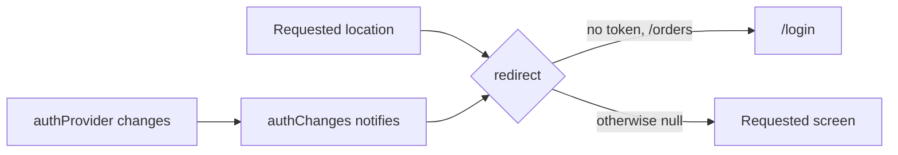

## Before you start

- [[frontend.l2.deep-links]] — you know that an address typed or opened in a new tab starts the app fresh, and the router reads its first location from it.
- [[frontend.l2.notifier-for-app-state]] — you know that `authProvider` holds the access token or `null`, and that `signOut` sets it to `null`.
- [[backend.l2.resource-based-authorization]] — you know that `DonHang.Api` lets only the order's customer, or staff, read an order, and answers `403` to anyone else.

## The situation

After you place an order, DonHang.App shows it at `/orders/1`, and you bookmark that address. The next morning you open the bookmark, and the page loads fresh, and `authProvider` starts again at `null`, because the token lives only in the page's memory. Picture `OrderDetailScreen` being built now. It would ask `DonHang.Api` for order 1 without a token and get `401`. You would see a spinner, then `Could not load this order.`, and nothing would tell you that signing in fixes it. How can the app send you to sign in before it shows a screen that cannot work?

## Core concepts

- **route guard** — a check that runs before a route is shown and sends the user somewhere else when it fails, such as to the sign-in screen when nobody is signed in.
- `redirect` — the function Đơn Hàng passes to `GoRouter` as its route guard: given to the constructor, it runs before every navigation, and returns either a new location or `null`.
- `state.matchedLocation` — the location the router has matched for the requested address, such as `/orders/1`; `redirect` receives it inside its `state` argument, as `state.matchedLocation`.
- `refreshListenable` — an object the `GoRouter` listens to; each time it reports a change, the router runs `redirect` again for the location being shown.

## How it works



In the situation above, the bookmark is a deep link: the router reads `/orders/1` from the address bar as its first location. Before it builds anything for that location, it calls `redirect`. That is the route guard.

Follow the diagram from the left. `redirect` reads `authProvider`. Your token is `null`, and `/orders/1` starts with `/orders`, so `redirect` returns `/login`. The router goes to `/login` instead, and `OrderDetailScreen` is never built, so no request for order 1 is sent. For any other location, such as `/products/3`, `redirect` returns `null`, which means "keep the requested location", and the product opens as usual.

The check does not wait for taps. The router calls `redirect` before every navigation: a typed address, a bookmark, a refresh, or `context.go`, the call a button uses to change location. So at stage-2, every way into `/orders/…` in DonHang.App goes through it.

The lower row of the diagram covers the other direction. Suppose you are signed in and reading `/orders/1` when something calls `signOut`. At stage-2 the sign-out button sits on the product list, but any code that calls it while an order is showing has the same effect. No navigation happens, yet the order screen should not stay. The router's `refreshListenable` is tied to `authProvider`, so a change of token makes the router run `redirect` again for the location being shown, through the `authChanges` link in the diagram (section 5 shows how it is built). It now returns `/login`, and you are moved off the order.

That answers the question: the check sits in the router, in front of every location, and not in each screen.

## In the Đơn Hàng system

The guard, in `DonHang.App/lib/router.dart`:

```dart file=DonHang.App/lib/router.dart tag=stage-2 lines=13-36
final routerProvider = Provider<GoRouter>((ref) {
  // lesson: frontend.l2.route-guards
  // go_router re-runs `redirect` when a Listenable changes; Riverpod tells
  // us when authProvider changes. This ValueNotifier joins the two.
  final authChanges = ValueNotifier<String?>(ref.read(authProvider));
  ref.listen(authProvider, (_, token) => authChanges.value = token);
  ref.onDispose(authChanges.dispose);

  final router = GoRouter(
    refreshListenable: authChanges,
    // Runs before every navigation, a typed URL included. Returning a path
    // sends the user there; returning null keeps the requested location.
    redirect: (context, state) {
      final signedIn = ref.read(authProvider) != null;
      if (!signedIn && state.matchedLocation.startsWith('/orders')) {
        return '/login';
      }
      return null;
    },
    routes: _routes,
  );
  ref.onDispose(router.dispose);
  return router;
});
```

Start at lines 25-31, the whole guard. It asks one question, "signed in?", and one more, "an order location?". Both `/orders/new` and `/orders/1` start with `/orders`, so the order form is guarded too. `redirect` uses `ref.read`: it needs the token at the moment it runs, and running again on changes is the job of `refreshListenable`.

Lines 17-19 build the link for `refreshListenable`. `authChanges` is a `ValueNotifier`, a Flutter object that holds one value and notifies its listeners when that value changes; it is one kind of `Listenable`, the type `refreshListenable` accepts. `ref.listen(authProvider, …)` runs its function every time the token changes and copies the new token into `authChanges`. Line 22 hands `authChanges` to the router, so each sign-in or sign-out makes the router run `redirect` again. Lines 19 and 34 only clean up `authChanges` and the router when the provider is thrown away.

The order screen, in `DonHang.App/lib/screens/order_detail_screen.dart`:

```dart file=DonHang.App/lib/screens/order_detail_screen.dart tag=stage-2 lines=7-19
// lesson: frontend.l2.route-guards
// Reached only through /orders/:id, which the router's redirect guards: a
// signed-out visitor is sent to /login before this screen is built. The API
// still checks the token itself (401) and who owns the order (403).
class OrderDetailScreen extends ConsumerWidget {
  final int id;

  const OrderDetailScreen({super.key, required this.id});

  @override
  Widget build(BuildContext context, WidgetRef ref) {
    final l10n = AppLocalizations.of(context);
    final order = ref.watch(orderProvider(id));
```

`l10n` holds the screen's texts in the user's language and does not matter here. The screen itself contains no sign-in check; the guard in front of it does that work. Read the comment's last sentence. The guard only spares the customer a screen that would fail. `DonHang.Api` still answers `401` to a request without a token and `403` to a signed-in customer asking for someone else's order. The API cannot trust the app, because anyone can call it with `curl`, a command-line program that sends an HTTP request from a terminal, and no app at all.

## Beginners often think…

- **"With a route guard in the app, the API no longer needs to check who is calling."** → Actually the guard runs only inside DonHang.App, and the API is reachable without it. `DonHang.Api` still answers `401` without a token and `403` for another customer's order. You notice this when a `curl` request to `/api/v1/orders/1` without a token gets `401`, whatever the app would have shown.
- **"A route guard only runs when the user taps a button, so typing a URL skips it."** → Actually go_router calls `redirect` before every navigation, and a typed address is one. You notice this when you paste an order address into a new tab while signed out and land on `/login`, with no order request sent.

## Try it (3 minutes)

1. With the Đơn Hàng system running on your machine (`scripts/up.sh` from the repository root), open a new browser tab and paste `http://localhost:8081/orders/1` into its address bar.
2. Look at the address bar and the screen.
3. In the same tab, paste `http://localhost:8081/products/3`.

Expected result: after step 1 the address changes to `http://localhost:8081/login` and the sign-in screen shows its `Sign in with Keycloak` button (`Đăng nhập bằng Keycloak` in a Vietnamese browser). After step 3 the product opens at `/products/3` with no detour.

Even if you were signed in to DonHang.App in another tab, step 1 still ends on `/login`. Why?

<details><summary>Suggested answer</summary>

`AuthController` keeps the token only in the memory of the page that signed in; a new tab, or a reload, starts with `null`. So `redirect` sees nobody signed in and a location starting with `/orders`, and returns `/login`. `/products/3` does not start with `/orders`, so `redirect` returns `null`.

</details>

## Connections

- [[frontend.l2.deep-links]] — builds on it: a deep link to an order location goes through `redirect` before any screen is built.
- [[frontend.l2.notifier-for-app-state]] — where the condition comes from: `redirect` reads `authProvider`, and `refreshListenable` follows its changes.
- [[backend.l2.resource-based-authorization]] — the check that still counts: the API decides who may read an order; the guard only saves a wasted screen.
- [[backend.l2.role-based-access]] — the same idea on the server: a condition checked before a request reaches its code.

## Five-line summary

1. A route guard checks a condition before a route is shown and sends the user elsewhere; Đơn Hàng's guard in go_router is `redirect`.
2. Đơn Hàng's `redirect` returns `/login` when there is no token and the location starts with `/orders`, and `null` otherwise.
3. `redirect` runs before every navigation, so a typed or bookmarked order address lands on sign-in instead of a failing screen.
4. `refreshListenable` follows `authProvider`, so signing out on an order screen runs `redirect` again and moves the user off.
5. The guard only spares the customer a failing screen; `DonHang.Api` still answers `401` and `403` on its own.
