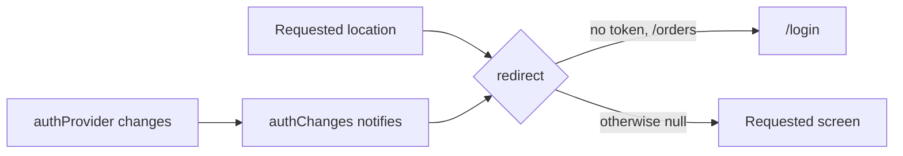

## Bạn cần biết trước

- [[frontend.l2.deep-links]] — bạn biết một địa chỉ được gõ vào hay mở trong tab mới sẽ khởi động app từ đầu, và router đọc location đầu tiên của nó từ địa chỉ đó.
- [[frontend.l2.notifier-for-app-state]] — bạn biết `authProvider` giữ access token hoặc `null`, và `signOut` đặt nó về `null`.
- [[backend.l2.resource-based-authorization]] — bạn biết `DonHang.Api` chỉ cho khách chủ đơn, hoặc staff, đọc một đơn hàng, và trả `403` cho mọi người khác.

## Tình huống

Đặt hàng xong, DonHang.App hiện đơn của bạn ở `/orders/1`, và bạn lưu bookmark địa chỉ đó. Sáng hôm sau bạn mở bookmark, trang tải lại từ đầu, và `authProvider` lại bắt đầu từ `null`, vì token chỉ sống trong bộ nhớ của trang. Thử hình dung `OrderDetailScreen` được build lúc này. Nó sẽ xin `DonHang.Api` đơn 1 mà không có token và nhận `401`. Bạn sẽ thấy một spinner, rồi `Could not load this order.`, và chẳng có gì cho bạn biết rằng đăng nhập là xong. Làm sao để app đưa bạn đi đăng nhập trước khi hiện một màn hình chắc chắn không chạy được?

## Khái niệm cốt lõi

- **route guard** (Kiểm tra chạy trước khi hiện một route, chuyển người dùng đi nơi khác nếu không đạt, như bắt đăng nhập trước) — phép kiểm tra chạy trước khi một route được hiện và đưa người dùng tới chỗ khác nếu không đạt, như tới màn hình đăng nhập khi chưa ai đăng nhập.
- `redirect` — hàm mà Đơn Hàng truyền cho `GoRouter` để làm route guard: truyền vào constructor, nó chạy trước mọi lần điều hướng, và trả về một location mới hoặc `null`.
- `state.matchedLocation` — location mà router đã khớp cho địa chỉ được yêu cầu, như `/orders/1`. `redirect` nhận nó bên trong tham số `state`, dưới dạng `state.matchedLocation`.
- `refreshListenable` — một object mà `GoRouter` lắng nghe. Mỗi lần nó báo có thay đổi, router chạy lại `redirect` cho location đang hiện.

## Cơ chế hoạt động



Trong tình huống trên, bookmark là một deep link: router đọc `/orders/1` từ thanh địa chỉ làm location đầu tiên. Trước khi build bất cứ thứ gì cho location đó, nó gọi `redirect`. Đó chính là route guard.

Hãy theo sơ đồ từ trái sang. `redirect` đọc `authProvider`. Token của bạn là `null`, và `/orders/1` bắt đầu bằng `/orders`, nên `redirect` trả `/login`. Router chuyển sang `/login`, `OrderDetailScreen` không bao giờ được build, nên cũng không có request nào xin đơn 1. Với mọi location khác, như `/products/3`, `redirect` trả `null`, nghĩa là "giữ location được yêu cầu", và sản phẩm mở ra như thường.

Phép kiểm tra không đợi ai chạm gì. Router gọi `redirect` trước mọi lần điều hướng: địa chỉ gõ vào, bookmark, tải lại trang, hay `context.go`, lời gọi mà nút dùng để đổi location. Vì vậy ở stage-2, mọi đường vào `/orders/…` trong DonHang.App đều đi qua nó.

Hàng dưới của sơ đồ lo chiều ngược lại. Giả sử bạn đã đăng nhập và đang đọc `/orders/1` thì có code gọi `signOut`. Ở stage-2 nút đăng xuất nằm trên danh sách sản phẩm, nhưng bất kỳ code nào gọi nó lúc đơn hàng đang hiện cũng cho kết quả như nhau. Không có lần điều hướng nào xảy ra, vậy mà màn hình đơn hàng không nên ở lại. `refreshListenable` của router được nối với `authProvider`, nên khi token đổi, router chạy lại `redirect` cho location đang hiện, qua mắt xích `authChanges` trong sơ đồ (mục 5 cho thấy nó được dựng thế nào). Lần này nó trả `/login`, và bạn được đưa ra khỏi đơn hàng.

Câu hỏi ban đầu đã có lời đáp: phép kiểm tra nằm ở router, đứng trước mọi location, chứ không nằm trong từng màn hình.

## Trong hệ thống Đơn Hàng

Guard, trong `DonHang.App/lib/router.dart`:

```dart file=DonHang.App/lib/router.dart tag=stage-2 lines=13-36
final routerProvider = Provider<GoRouter>((ref) {
  // lesson: frontend.l2.route-guards
  // go_router re-runs `redirect` when a Listenable changes; Riverpod tells
  // us when authProvider changes. This ValueNotifier joins the two.
  final authChanges = ValueNotifier<String?>(ref.read(authProvider));
  ref.listen(authProvider, (_, token) => authChanges.value = token);
  ref.onDispose(authChanges.dispose);

  final router = GoRouter(
    refreshListenable: authChanges,
    // Runs before every navigation, a typed URL included. Returning a path
    // sends the user there; returning null keeps the requested location.
    redirect: (context, state) {
      final signedIn = ref.read(authProvider) != null;
      if (!signedIn && state.matchedLocation.startsWith('/orders')) {
        return '/login';
      }
      return null;
    },
    routes: _routes,
  );
  ref.onDispose(router.dispose);
  return router;
});
```

Bắt đầu từ dòng 25-31, toàn bộ guard. Nó hỏi một câu "đã đăng nhập chưa?", và thêm một câu "có phải location đơn hàng không?". Cả `/orders/new` lẫn `/orders/1` đều bắt đầu bằng `/orders`, nên form đặt hàng cũng được guard. `redirect` dùng `ref.read`: nó cần token ngay lúc nó chạy, còn việc chạy lại khi có thay đổi là của `refreshListenable`.

Dòng 17-19 dựng mắt xích cho `refreshListenable`. `authChanges` là một `ValueNotifier`, một object của Flutter giữ một giá trị và báo cho các listener mỗi khi giá trị đó đổi. Nó là một loại `Listenable`, đúng kiểu mà `refreshListenable` nhận. `ref.listen(authProvider, …)` chạy hàm của nó mỗi lần token đổi và chép token mới vào `authChanges`. Dòng 22 trao `authChanges` cho router, nên mỗi lần đăng nhập hay đăng xuất đều khiến router chạy lại `redirect`. Dòng 19 và 34 chỉ dọn dẹp `authChanges` và router khi provider bị bỏ đi.

Màn hình đơn hàng, trong `DonHang.App/lib/screens/order_detail_screen.dart`:

```dart file=DonHang.App/lib/screens/order_detail_screen.dart tag=stage-2 lines=7-19
// lesson: frontend.l2.route-guards
// Reached only through /orders/:id, which the router's redirect guards: a
// signed-out visitor is sent to /login before this screen is built. The API
// still checks the token itself (401) and who owns the order (403).
class OrderDetailScreen extends ConsumerWidget {
  final int id;

  const OrderDetailScreen({super.key, required this.id});

  @override
  Widget build(BuildContext context, WidgetRef ref) {
    final l10n = AppLocalizations.of(context);
    final order = ref.watch(orderProvider(id));
```

`l10n` chứa các chuỗi chữ của màn hình theo ngôn ngữ người dùng và không liên quan ở đây. Bản thân màn hình không có check đăng nhập nào, guard đứng trước nó đã lo phần đó. Hãy đọc câu cuối của comment. Guard chỉ giúp khách khỏi gặp một màn hình sẽ lỗi. `DonHang.Api` vẫn trả `401` cho request không có token và `403` cho khách đã đăng nhập nhưng xin đơn của người khác. API không thể tin app, vì ai cũng gọi được nó bằng `curl`, một chương trình dòng lệnh gửi HTTP request từ terminal, mà chẳng cần app nào.

## Người mới hay nghĩ rằng…

- **"Có route guard trong app rồi thì API không cần kiểm tra ai đang gọi nữa."** → Thực ra guard chỉ chạy bên trong DonHang.App, còn API vẫn gọi tới được mà không qua nó. `DonHang.Api` vẫn trả `401` khi thiếu token và `403` với đơn của khách khác. Bạn sẽ nhận ra khi một request `curl` tới `/api/v1/orders/1` không kèm token nhận `401`, bất kể app lẽ ra sẽ hiện gì.
- **"Route guard chỉ chạy khi người dùng chạm một nút, nên gõ URL là lọt qua."** → Thực ra go_router gọi `redirect` trước mọi lần điều hướng, và gõ địa chỉ cũng là một lần như thế. Bạn sẽ nhận ra khi dán địa chỉ một đơn hàng vào tab mới lúc chưa đăng nhập và rơi vào `/login`, không có request đơn hàng nào được gửi.

## Thử ngay (3 phút)

1. Khi hệ thống Đơn Hàng đang chạy trên máy bạn (`scripts/up.sh` từ thư mục gốc của repository), mở một tab trình duyệt mới và dán `http://localhost:8081/orders/1` vào thanh địa chỉ.
2. Nhìn thanh địa chỉ và màn hình.
3. Trong cùng tab đó, dán `http://localhost:8081/products/3`.

Kết quả mong đợi: sau bước 1, địa chỉ đổi thành `http://localhost:8081/login` và màn hình đăng nhập hiện nút `Sign in with Keycloak` (`Đăng nhập bằng Keycloak` nếu trình duyệt dùng tiếng Việt). Sau bước 3, sản phẩm mở ở `/products/3` mà không bị chuyển đi đâu.

Kể cả khi bạn đã đăng nhập DonHang.App ở một tab khác, bước 1 vẫn kết thúc ở `/login`. Vì sao?

<details><summary>Gợi ý đáp án</summary>

`AuthController` chỉ giữ token trong bộ nhớ của trang đã đăng nhập. Tab mới, hay một lần tải lại, bắt đầu với `null`. Vì vậy `redirect` thấy chưa ai đăng nhập và location bắt đầu bằng `/orders`, nên trả `/login`. `/products/3` không bắt đầu bằng `/orders`, nên `redirect` trả `null`.

</details>

## Liên hệ

- [[frontend.l2.deep-links]] — xây tiếp trên bài đó: một deep link tới location đơn hàng phải đi qua `redirect` trước khi màn hình nào được build.
- [[frontend.l2.notifier-for-app-state]] — nơi điều kiện bắt nguồn: `redirect` đọc `authProvider`, và `refreshListenable` theo dõi các thay đổi của nó.
- [[backend.l2.resource-based-authorization]] — phép kiểm tra thực sự có giá trị: API quyết định ai được đọc đơn hàng, guard chỉ tránh một màn hình vô ích.
- [[backend.l2.role-based-access]] — cùng ý tưởng ở phía server: một điều kiện được kiểm tra trước khi request tới được code của nó.

## Tóm tắt 5 dòng

1. Route guard kiểm tra một điều kiện trước khi hiện route và đưa người dùng đi nơi khác. Guard của Đơn Hàng trong go_router là `redirect`.
2. `redirect` của Đơn Hàng trả `/login` khi không có token và location bắt đầu bằng `/orders`, còn lại trả `null`.
3. `redirect` chạy trước mọi lần điều hướng, nên địa chỉ đơn hàng gõ vào hay mở từ bookmark sẽ dẫn tới đăng nhập thay vì một màn hình lỗi.
4. `refreshListenable` theo dõi `authProvider`, nên đăng xuất khi đang ở màn hình đơn hàng sẽ chạy lại `redirect` và đưa người dùng ra ngoài.
5. Guard chỉ giúp khách khỏi gặp màn hình lỗi. `DonHang.Api` vẫn tự trả `401` và `403`.
