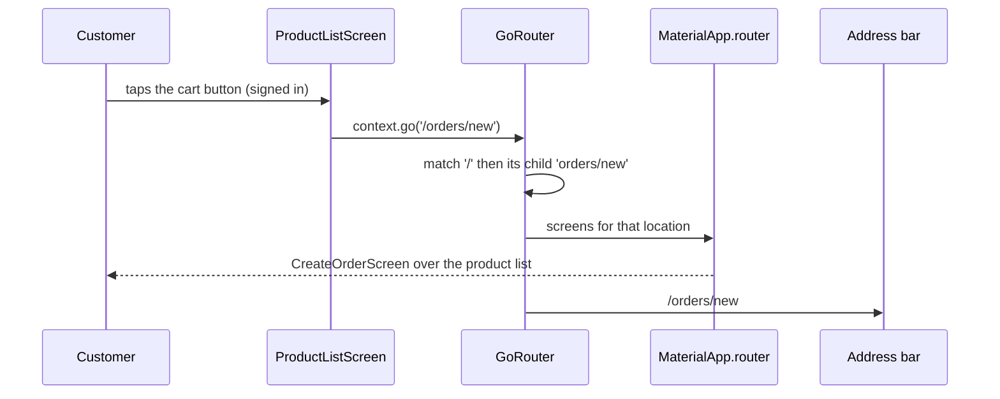

## Before you start

- [[frontend.l2.riverpod-providers]] — you know that a provider describes how to make one value, and that `DonHangApp` is a `ConsumerWidget` whose `build` watches a provider.
- [[frontend.l1.buildcontext]] — you know that `Navigator.of(context)` finds the navigator by looking up the tree from the widget's position.

## The situation

At stage-1, you open the order screen in two steps. The product list's sign-in button calls `Navigator.of(context).push` with a `MaterialPageRoute`, the object `push` takes, holding a function that builds a `LoginScreen`. After you sign in, that screen replaces itself with a `CreateOrderScreen` the same way. Now look at the browser's address bar while the order form is showing: it is the address the app started with. A teammate asks for a link to the order form, and you have nothing to send: the only way there is the taps you just made. How does a screen get an address of its own?

## Core concepts

- **go_router** — a Flutter routing package that declares every screen of the app up front, each with a path, and moves between screens by asking for a location such as `/orders/new`.
- `GoRoute` — one entry in that list: a `path` and a `builder`, the function that creates the screen when its path is shown.
- location — the full path the app is showing; a child route sits in its parent's `routes`, and its path is joined to its parent's, so `orders/new` under `/` has the location `/orders/new`.
- `MaterialApp.router` — the form of `MaterialApp` that takes a router as `routerConfig` and lets it decide which screens are shown.
- `context.go` — asks the router, found from the widget's `BuildContext`, to show one location.

## How it works



In the situation above, the order screen had no address because stage-1 built it on the spot: `push` put a new screen object on top of the current one, and nothing gave that screen a path. Stage-2 reaches the order form differently; follow the diagram from the top.

A signed-in customer taps the cart button on the product list. The button does not build a `CreateOrderScreen`. `MaterialApp.router` received the `GoRouter` as `routerConfig`, so every screen it shows sits below that router. The button calls `context.go('/orders/new')`, which finds the `GoRouter` above it in the tree, just as `Navigator.of(context)` found the navigator, and asks it for that location.

The router then looks through its list of `GoRoute`s. `/` matches the start of the location, and its child `orders/new` matches the rest. So the answer is two screens: the product list from `/`, with the order form on top of it. The router hands that answer to `MaterialApp.router`, which shows it. A `GoRoute`'s `builder` runs only when its path is part of the location being shown, which is why nothing else is built. Signed out, a check in `routerProvider`, the provider that builds the `GoRouter`, sends you to `/login` instead; a later lesson explains it.

Last, the router reports the new location to the browser, and the address bar changes to `/orders/new`. Every later move does the same. The back arrow removes the top screen, and the router reports the location of the screen now showing, `/`. So in DonHang.App the address names the screen you see. That is the answer to the question: the screen's address is its location, declared once in the route list, and the app moves by asking for locations instead of building screens.

## In the Đơn Hàng system

The route list, in `DonHang.App/lib/router.dart`:

```dart file=DonHang.App/lib/router.dart tag=stage-2 lines=43-59
final List<RouteBase> _routes = [
  GoRoute(
    path: '/',
    builder: (context, state) => const ProductListScreen(),
    routes: [
      GoRoute(
        path: 'products/:id',
        builder: (context, state) => ProductDetailScreen(id: int.parse(state.pathParameters['id']!)),
      ),
      GoRoute(path: 'orders/new', builder: (context, state) => const CreateOrderScreen()),
      GoRoute(
        path: 'orders/:id',
        builder: (context, state) => OrderDetailScreen(id: int.parse(state.pathParameters['id']!)),
      ),
    ],
  ),
  GoRoute(path: '/login', builder: (context, state) => const LoginScreen()),
```

`RouteBase` is the type of any entry in the list; in this block, the builder's second parameter, `state`, is only used by the `:id` routes. Look at line 52: `orders/new` sits in the `routes` of `/`, so its path is joined to `/`; like the go_router docs, `router.dart` writes a child path without a leading `/`. Its builder is a function that contains `const CreateOrderScreen()`. Declaring the route stores the function; the router calls it, and the screen is built, only when `/orders/new` is shown.

`/login` is a top-level route, written with its `/`. In `products/:id`, `:id` stands for whatever is written in that place of the address, such as `3`. A later lesson reads it, along with the `/auth/callback` route below this block. Above this list, `routerProvider` is a `Provider<GoRouter>` that builds one `GoRouter` from `_routes`. It also holds a check that a later lesson explains. In `main.dart`, `DonHangApp` returns `MaterialApp.router` with `routerConfig: ref.watch(routerProvider)`, so the whole app asks that one router what to show.

The app bar buttons, in `DonHang.App/lib/screens/product_list_screen.dart`:

```dart file=DonHang.App/lib/screens/product_list_screen.dart tag=stage-2 lines=46-64
  List<Widget> _actions(BuildContext context, WidgetRef ref) {
    final l10n = AppLocalizations.of(context);
    final signedIn = ref.watch(authProvider) != null;
    return [
      IconButton(
        icon: const Icon(Icons.add_shopping_cart),
        tooltip: l10n.placeOrder,
        onPressed: () => context.go('/orders/new'),
      ),
      if (signedIn)
        IconButton(
          icon: const Icon(Icons.logout),
          tooltip: l10n.signOut,
          onPressed: () => ref.read(authProvider.notifier).signOut(),
        )
      else
        IconButton(icon: const Icon(Icons.login), tooltip: l10n.signIn, onPressed: () => context.go('/login')),
    ];
  }
```

Ignore `l10n` and `authProvider`; other lessons cover them. Compare the cart and sign-in `onPressed` lines (53 and 62) with stage-1: no `MaterialPageRoute`, no screen constructor, no `ApiClient` passed along. Each of them names a location as a string. Any code that knows a location can ask for it, not only the one button that used to build the screen. There is no `Navigator.push` left anywhere in `DonHang.App/lib` at stage-2.

## Beginners often think…

- **"Navigator.push and context.go are two spellings of the same thing."** → Actually `push` adds a screen object you built on top of the current ones, and that screen has no path. `context.go` names a location, and the router replaces the screens shown with the ones its route list declares for it. You notice this when the address bar stays the same after `Navigator.of(context).push` but changes after `context.go`.
- **"Declaring every route up front means every screen is built when the app starts."** → Actually the list holds `builder` functions, and the router calls only the builders of the routes that match the location shown. At `/`, only `ProductListScreen` exists. You notice this when a `print` call placed at the top of `ProductDetailScreen`'s `build` writes its line only after you tap a product, not when the list opens.

## Try it (3 minutes)

1. With the Đơn Hàng system running on your machine (`scripts/up.sh` from the repository root), open the app at `http://localhost:8081` and look at the address bar.
2. Tap a product in the list, and look at the address bar again.
3. Tap the back arrow in the app bar.

Expected result: at the start the address shows no path after `localhost:8081`. After the tap it ends in `/products/` followed by that product's number, for example `/products/3` for `Tai nghe`. After the back arrow the path is gone again and the product list is showing.

Which line of `product_list_screen.dart` produced the new address, and what does the product detail screen's address tell you about where it is declared?

<details><summary>Suggested answer</summary>

The product tile's tap handler calls `context.go('/products/${product.id}')` (line 31); the button did not build the detail screen, it asked for a location. The address starts with `/` and continues with `products/…`, so its route is a child of `/` in `router.dart`, like `orders/new`.

</details>

## Connections

- [[frontend.l1.buildcontext]] — the same lookup: `context.go` finds the router up the tree the way `Navigator.of(context)` found the navigator.
- [[frontend.l2.riverpod-providers]] — where the router lives: `routerProvider` makes one `GoRouter`, and `DonHangApp` watches it.
- [[frontend.l2.deep-links]] — the next step: typing a location into the address bar opens its screen, and the `:id` routes read their number.
- [[frontend.l2.route-guards]] — builds on this: the router checks who is signed in before it shows an order location.

## Five-line summary

1. With go_router, every screen is declared once with a path, and the app moves by asking for a location instead of building screens.
2. A `GoRoute` pairs a path with a builder; a child's path joins its parent's, so `orders/new` under `/` is `/orders/new`.
3. `MaterialApp.router` takes the `GoRouter` from `routerProvider` as `routerConfig`, and that router decides which screens are shown.
4. `context.go('/orders/new')` finds the router through `BuildContext`; only the builders matching that location run.
5. On the web the router reports every location it shows to the browser, so in DonHang.App the address bar names the screen shown.
