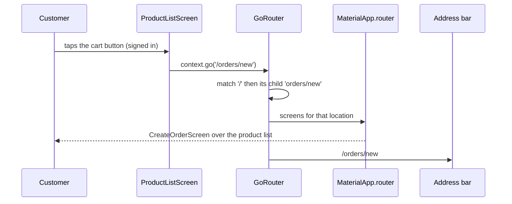

## Bạn cần biết trước

- [[frontend.l2.riverpod-providers]] — bạn biết một provider mô tả cách tạo ra một giá trị, và `DonHangApp` là một `ConsumerWidget` có `build` watch một provider.
- [[frontend.l1.buildcontext]] — bạn biết `Navigator.of(context)` tìm navigator bằng cách tra ngược lên cây, bắt đầu từ vị trí của widget.

## Tình huống

Ở stage-1, bạn mở màn hình đặt hàng qua hai bước. Nút đăng nhập trên danh sách sản phẩm gọi `Navigator.of(context).push` với một `MaterialPageRoute`, tức object mà `push` nhận vào, chứa một hàm build ra `LoginScreen`. Đăng nhập xong, màn hình đó tự thay mình bằng `CreateOrderScreen` theo đúng cách ấy. Giờ hãy nhìn thanh địa chỉ của trình duyệt trong lúc form đặt hàng đang hiện: nó vẫn là địa chỉ lúc app vừa mở. Một đồng đội xin link tới form đặt hàng, và bạn chẳng có gì để gửi: đường duy nhất tới đó là mấy lần chạm bạn vừa làm. Làm sao để một màn hình có địa chỉ của riêng nó?

## Khái niệm cốt lõi

- **go_router** (Package routing cho Flutter: khai báo trước các route theo đường dẫn, điều hướng bằng vị trí như /orders/new) — package routing cho Flutter, khai báo trước mọi màn hình của app, mỗi màn hình kèm một path, và chuyển màn hình bằng cách xin một location như `/orders/new`.
- `GoRoute` — một mục trong danh sách đó: một `path` và một `builder`, tức hàm tạo ra màn hình khi path của nó được hiện.
- location — path đầy đủ mà app đang hiện. Route con nằm trong `routes` của route cha, và path của nó được nối vào path của cha, nên `orders/new` nằm dưới `/` có location là `/orders/new`.
- `MaterialApp.router` — dạng `MaterialApp` nhận một router qua `routerConfig` và để router đó quyết định màn hình nào được hiện.
- `context.go` — xin router, tìm thấy qua `BuildContext` của widget, hiện một location.

## Cơ chế hoạt động



Trong tình huống trên, màn hình đặt hàng không có địa chỉ vì stage-1 dựng nó ngay tại chỗ: `push` đặt một object màn hình mới lên trên màn hình hiện tại, và không có gì cho màn hình đó một path. Stage-2 đi tới form đặt hàng theo cách khác. Hãy theo sơ đồ từ trên xuống.

Một khách đã đăng nhập chạm nút giỏ hàng trên danh sách sản phẩm. Nút này không build `CreateOrderScreen`. `MaterialApp.router` đã nhận `GoRouter` qua `routerConfig`, nên mọi màn hình nó hiện đều nằm dưới router đó. Nút gọi `context.go('/orders/new')`. Lời gọi này tìm `GoRouter` phía trên nó trong cây, giống như `Navigator.of(context)` từng tìm navigator, rồi xin router location đó.

Router lần lượt xét danh sách `GoRoute` của nó. `/` khớp phần đầu của location, và route con `orders/new` của nó khớp phần còn lại. Vậy câu trả lời là hai màn hình: danh sách sản phẩm từ `/`, và form đặt hàng nằm trên nó. Router giao câu trả lời đó cho `MaterialApp.router` để hiện ra. `builder` của một `GoRoute` chỉ chạy khi path của nó là một phần của location đang hiện, nên không màn hình nào khác được build. Nếu chưa đăng nhập, một check trong `routerProvider`, provider dựng nên `GoRouter`, sẽ đưa bạn tới `/login`, bài sau sẽ giải thích.

Cuối cùng, router báo location mới cho trình duyệt, và thanh địa chỉ đổi thành `/orders/new`. Mọi lần chuyển sau cũng vậy. Mũi tên quay lại gỡ màn hình trên cùng, và router báo location của màn hình đang hiện lúc đó là `/`. Nhờ vậy, trong DonHang.App, địa chỉ luôn gọi đúng tên màn hình bạn đang thấy. Đó là câu trả lời cho câu hỏi ban đầu: địa chỉ của một màn hình chính là location của nó, khai báo một lần trong danh sách route, và app chuyển màn hình bằng cách xin location thay vì tự dựng màn hình.

## Trong hệ thống Đơn Hàng

Danh sách route, trong `DonHang.App/lib/router.dart`:

```dart file=DonHang.App/lib/router.dart tag=stage-2 lines=43-59
final List<RouteBase> _routes = [
  GoRoute(
    path: '/',
    builder: (context, state) => const ProductListScreen(),
    routes: [
      GoRoute(
        path: 'products/:id',
        builder: (context, state) => ProductDetailScreen(id: int.parse(state.pathParameters['id']!)),
      ),
      GoRoute(path: 'orders/new', builder: (context, state) => const CreateOrderScreen()),
      GoRoute(
        path: 'orders/:id',
        builder: (context, state) => OrderDetailScreen(id: int.parse(state.pathParameters['id']!)),
      ),
    ],
  ),
  GoRoute(path: '/login', builder: (context, state) => const LoginScreen()),
```

`RouteBase` là kiểu của mọi mục trong danh sách. Trong block này, tham số thứ hai của builder, `state`, chỉ được các route `:id` dùng tới. Hãy nhìn dòng 52: `orders/new` nằm trong `routes` của `/`, nên path của nó được nối vào `/`. Giống docs của go_router, `router.dart` viết path của route con không có `/` ở đầu. Builder của nó là một hàm chứa `const CreateOrderScreen()`. Khai báo route chỉ cất hàm đó lại. Router chỉ gọi hàm, và màn hình chỉ được build, khi `/orders/new` được hiện.

`/login` là route cấp đầu, được viết kèm `/` của nó. Trong `products/:id`, `:id` đại diện cho bất cứ thứ gì nằm ở vị trí đó của địa chỉ, như `3`. Bài sau sẽ đọc nó, cùng với route `/auth/callback` bên dưới block này. Phía trên danh sách, `routerProvider` là một `Provider<GoRouter>` dựng một `GoRouter` từ `_routes`. Nó còn chứa một check mà bài sau sẽ giải thích. Trong `main.dart`, `DonHangApp` trả về `MaterialApp.router` với `routerConfig: ref.watch(routerProvider)`, nên cả app hỏi đúng một router đó xem cần hiện gì.

Các nút trên app bar, trong `DonHang.App/lib/screens/product_list_screen.dart`:

```dart file=DonHang.App/lib/screens/product_list_screen.dart tag=stage-2 lines=46-64
  List<Widget> _actions(BuildContext context, WidgetRef ref) {
    final l10n = AppLocalizations.of(context);
    final signedIn = ref.watch(authProvider) != null;
    return [
      IconButton(
        icon: const Icon(Icons.add_shopping_cart),
        tooltip: l10n.placeOrder,
        onPressed: () => context.go('/orders/new'),
      ),
      if (signedIn)
        IconButton(
          icon: const Icon(Icons.logout),
          tooltip: l10n.signOut,
          onPressed: () => ref.read(authProvider.notifier).signOut(),
        )
      else
        IconButton(icon: const Icon(Icons.login), tooltip: l10n.signIn, onPressed: () => context.go('/login')),
    ];
  }
```

Tạm bỏ qua `l10n` và `authProvider`, các bài khác sẽ nói tới. Hãy so dòng `onPressed` của nút giỏ hàng và nút đăng nhập (dòng 53 và 62) với stage-1: không `MaterialPageRoute`, không gọi constructor màn hình, không truyền `ApiClient` đi theo. Mỗi dòng chỉ nêu tên một location dưới dạng chuỗi. Bất cứ đoạn code nào biết một location đều có thể xin nó, chứ không chỉ cái nút từng dựng màn hình. Ở stage-2, trong `DonHang.App/lib` không còn `Navigator.push` nào.

## Người mới hay nghĩ rằng…

- **"Navigator.push và context.go chỉ là hai cách viết của cùng một thứ."** → Thực ra `push` đặt một object màn hình do bạn dựng lên trên các màn hình hiện có, và màn hình đó không có path. Còn `context.go` nêu tên một location, và router thay các màn hình đang hiện bằng những màn hình mà danh sách route khai báo cho location đó. Bạn sẽ nhận ra khi thanh địa chỉ giữ nguyên sau `Navigator.of(context).push` nhưng đổi sau `context.go`.
- **"Khai báo trước mọi route nghĩa là mọi màn hình đều được build khi app khởi động."** → Thực ra danh sách chỉ giữ các hàm `builder`, và router chỉ gọi builder của những route khớp với location đang hiện. Ở `/`, chỉ có `ProductListScreen` tồn tại. Bạn sẽ nhận ra khi một lệnh `print` đặt ở đầu `build` của `ProductDetailScreen` chỉ in ra dòng của nó sau khi bạn chạm một sản phẩm, chứ không phải lúc danh sách mở ra.

## Thử ngay (3 phút)

1. Khi hệ thống Đơn Hàng đang chạy trên máy bạn (`scripts/up.sh` từ thư mục gốc của repository), mở app ở `http://localhost:8081` và nhìn thanh địa chỉ.
2. Chạm một sản phẩm trong danh sách, rồi nhìn lại thanh địa chỉ.
3. Chạm mũi tên quay lại trên app bar.

Kết quả mong đợi: lúc đầu, địa chỉ không có path nào sau `localhost:8081`. Sau khi chạm, địa chỉ kết thúc bằng `/products/` và số của sản phẩm đó, ví dụ `/products/3` với `Tai nghe`. Sau khi bấm mũi tên quay lại, path biến mất và danh sách sản phẩm hiện ra.

Dòng nào trong `product_list_screen.dart` tạo ra địa chỉ mới, và địa chỉ của màn hình chi tiết sản phẩm cho bạn biết gì về chỗ nó được khai báo?

<details><summary>Gợi ý đáp án</summary>

Hàm xử lý chạm của ô sản phẩm gọi `context.go('/products/${product.id}')` (dòng 31). Nút không build màn hình chi tiết, nó xin một location. Địa chỉ bắt đầu bằng `/` rồi tiếp tục với `products/…`, nên route của nó là route con của `/` trong `router.dart`, giống `orders/new`.

</details>

## Liên hệ

- [[frontend.l1.buildcontext]] — cùng một phép tra: `context.go` tìm router ngược lên cây giống cách `Navigator.of(context)` tìm navigator.
- [[frontend.l2.riverpod-providers]] — nơi router sống: `routerProvider` tạo một `GoRouter` duy nhất, và `DonHangApp` watch nó.
- [[frontend.l2.deep-links]] — bước tiếp theo: gõ một location vào thanh địa chỉ sẽ mở màn hình của nó, và các route `:id` đọc số của chúng.
- [[frontend.l2.route-guards]] — xây tiếp trên bài này: router kiểm tra ai đang đăng nhập trước khi hiện một location của đơn hàng.

## Tóm tắt 5 dòng

1. Với go_router, mỗi màn hình được khai báo một lần kèm một path, và app chuyển màn hình bằng cách xin location thay vì tự dựng màn hình.
2. Một `GoRoute` ghép một path với một builder. Path của route con nối vào path của cha, nên `orders/new` dưới `/` là `/orders/new`.
3. `MaterialApp.router` nhận `GoRouter` từ `routerProvider` qua `routerConfig`, và router đó quyết định màn hình nào được hiện.
4. `context.go('/orders/new')` tìm router qua `BuildContext`, và chỉ những builder khớp location đó mới chạy.
5. Trên web, router báo cho trình duyệt mọi location nó hiện, nên trong DonHang.App thanh địa chỉ gọi đúng tên màn hình đang hiện.
