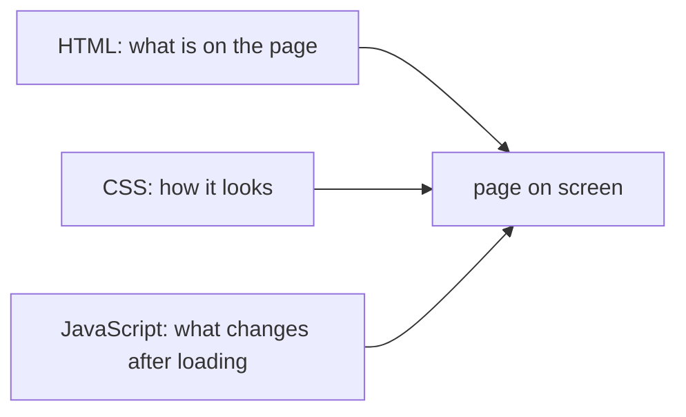

## Before you start

- [[foundation.l1.url-to-page]] — you know the browser requests `http://localhost:8080/index.html` and receives the page's HTML as the response body.
- [[foundation.l1.http-request-response]] — you know a response has a status line, headers and a body.

## The situation

You have opened `http://localhost:8080/index.html` from the lab many times: a heading, a line of text, three links. Clicking a link loads another page from Caddy. Nothing on the page reacts in place: no menu opens, no message appears, nothing updates without a new request. A teammate asks for a small change: "Can the page show a short welcome message when someone clicks the heading, without loading anything new?" Which part of the page would you have to add, and why can the file you have not do it on its own?

## Core concepts

- **HTML** — the markup language that structures a page's content: headings, paragraphs, lists, links.
- **CSS** — the language that describes how that structure looks: color, size, spacing, layout.
- **JavaScript** — the language a browser runs to change a page after it has loaded, for example in answer to a click; often shortened to JS.
- element — one piece of structure in HTML, written as a tag such as `<h1>…</h1>` around its content.

## How it works



A web page is usually built from three languages, each with one job. **HTML** says what is there: this is a heading, this is a paragraph, this is a link to `/login.html`. It is structure and content, nothing more. The browser reads it top to bottom and builds the page from the elements it finds.

**CSS** says how that structure looks: the heading is dark blue, paragraphs have more space between lines, the links sit side by side. The same HTML can look completely different with different CSS attached. A page with no CSS of its own is not unstyled, though: every browser applies default styles, which is why a heading is still bigger and bold, and a link is still blue and underlined.

**JavaScript** is the only one of the three that runs as a program in the browser. HTML and CSS describe a page; JavaScript can change it after it has loaded: react to a click, fetch data, add or remove text on screen, all without asking the server for a whole new page. Without it, a loaded page stays exactly as it arrived until you ask for another page. A link or a form in plain HTML does make something happen, but what happens is a new request and a new page, not a change to the current one.

## In the Đơn Hàng system

The lab's home page, served by Caddy since the HTTP lessons:

```html file=www/index.html tag=stage-0 lines=1-16
<!doctype html>
<html lang="vi">
<head>
<meta charset="utf-8">
<title>Đơn Hàng</title>
</head>
<body>
<h1>Đơn Hàng</h1>
<p>Trang tĩnh của phòng lab stage-0.</p>
<ul>
<li><a href="/login.html">Đăng nhập</a></li>
<li><a href="/cached.html">Trang có cache</a></li>
<li><a href="/redirect">Chuyển hướng</a></li>
</ul>
</body>
</html>
```

Everything here is HTML. `<head>` holds information about the page, such as its `<title>`, the text on the browser tab. `<body>` holds what you see: one `<h1>` heading, one `<p>` paragraph, and a `<ul>` list whose `<li>` items each wrap an `<a>` link. There is no `<style>` element and no `<link>` to a stylesheet, so no CSS of its own. There is no `<script>` element, so no JavaScript.

That is why the page looks the way it does and behaves the way it does. Its look is the browser's defaults. Its only behaviour is the links, and each one asks Caddy for a different address. The teammate's welcome message would need JavaScript: some code, attached to the page with a `<script>` element, that runs when the heading is clicked and adds the message to what is on screen.

## Beginners often think…

- **"HTML alone can make a page interactive, the same way a button click can run code."** → Actually HTML only describes content; it does not run anything. A link in `www/index.html` works, but its "behaviour" is the browser loading a different page, not code changing this one. You notice the difference when you want something to change on the page without a new request, and find there is nowhere in the HTML to say what should happen.
- **"CSS changes what content is there, not just how it looks."** → Actually CSS changes how the content looks: size, color, position, whether it is shown at all. The headings, text and links themselves come from the HTML. You notice this when you remove a page's CSS and the same words and links are still there, only plainer.

## Try it (3 minutes)

With the lab running:

1. Open `http://localhost:8080/index.html` and look at the heading and the links.
2. Open the page source (in most browsers, right-click → View page source, or Ctrl+U).
3. Search the source for `<style`, `<link` and `<script`.

Expected result: the heading is large and bold and the links are blue and underlined, but the source contains none of the three searches — only the HTML shown above.

Where do the heading's size and the links' colour come from, if the page has no CSS of its own?

<details><summary>Suggested answer</summary>

From the browser's default styles. Every browser gives headings, paragraphs and links a basic look when a page brings no CSS, which is why a page with no stylesheet still is not a wall of identical plain text.

</details>

## Connections

- [[foundation.l1.url-to-page]] — how the HTML reaches the browser in the first place.
- [[frontend.l1.the-dom]] — what the browser builds from the HTML, and what JavaScript actually changes.

## Five-line summary

1. HTML structures a page's content: headings, paragraphs, lists and links.
2. CSS describes how that structure looks; without CSS of its own, a page still gets the browser's default styles.
3. JavaScript is the only one of the three that runs as a program, changing a page after it has loaded.
4. `www/index.html` is HTML only: no `<style>`, no stylesheet `<link>`, no `<script>`.
5. A link in plain HTML loads a new page; changing the current page in place needs JavaScript.
