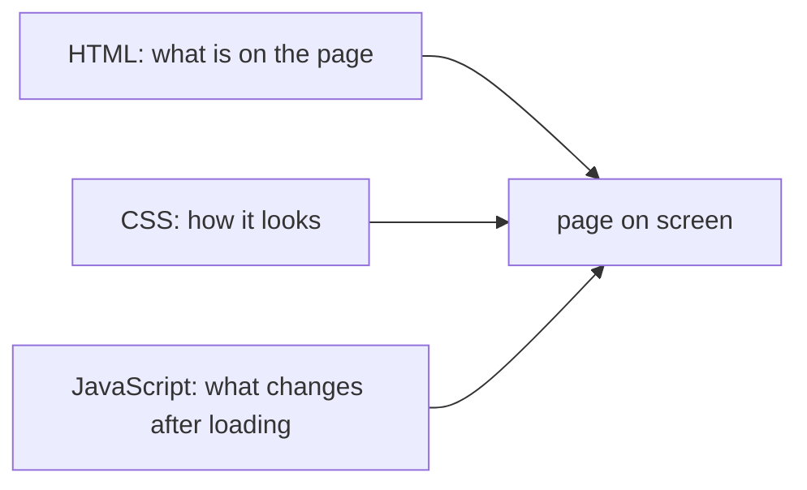

## Bạn cần biết trước

- [[foundation.l1.url-to-page]] — bạn biết trình duyệt request `http://localhost:8080/index.html` và nhận HTML của trang làm body của response.
- [[foundation.l1.http-request-response]] — bạn biết một response có dòng trạng thái, header và body.

## Tình huống

Bạn đã mở `http://localhost:8080/index.html` của lab nhiều lần: một heading, một dòng chữ, ba link. Bấm một link là hỏi Caddy, web server của lab, một địa chỉ khác. Không có gì trên trang phản ứng tại chỗ: không menu nào mở ra, không lời nhắn nào hiện lên, không có gì cập nhật mà không cần request mới. Một đồng nghiệp nhờ sửa nhỏ: "Trang có thể hiện một lời chào ngắn khi ai đó bấm vào heading, mà không tải gì mới không?" Bạn sẽ phải thêm phần nào vào trang, và vì sao file hiện có không tự làm được?

## Khái niệm cốt lõi

- **HTML** — ngôn ngữ cấu trúc nội dung của một trang: heading, đoạn văn, danh sách, link.
- **CSS** — ngôn ngữ mô tả cấu trúc đó trông như thế nào: màu, cỡ chữ, khoảng cách, bố cục.
- **JavaScript** — ngôn ngữ trình duyệt chạy để thay đổi một trang sau khi đã tải xong, chẳng hạn để đáp lại một cú bấm; thường viết tắt là JS.
- phần tử (element) — một mảnh cấu trúc trong HTML, viết bằng một thẻ như `<h1>…</h1>` bao quanh nội dung của nó.
- stylesheet — một file CSS riêng mà trang gắn vào bằng phần tử `<link>`.

## Cơ chế hoạt động



Một trang web thường được dựng từ ba ngôn ngữ, mỗi ngôn ngữ một việc. **HTML** nói trang có gì: đây là heading, đây là đoạn văn, đây là link tới `/login.html`. Nó là cấu trúc và nội dung, không hơn. Trình duyệt đọc nó từ trên xuống và dựng trang từ các phần tử nó gặp.

**CSS** nói cấu trúc đó trông ra sao: heading màu xanh đậm, các đoạn văn giãn dòng hơn, các link nằm cạnh nhau. Cùng một HTML có thể trông khác hẳn khi gắn CSS khác. Tuy vậy, một trang không có CSS riêng không có nghĩa là không có kiểu dáng: trình duyệt áp kiểu mặc định, nên heading vẫn to và đậm, còn link vẫn có màu và gạch chân.

**JavaScript** là thứ duy nhất trong ba ngôn ngữ chạy như một chương trình trong trình duyệt. Không có nó, trang vẫn làm được những gì trình duyệt có sẵn: đi theo link tới địa chỉ khác, đổi màu khi con trỏ nằm trên một thứ gì đó hay chạy một hiệu ứng động, nếu CSS của trang bảo vậy. Điều trang không làm được là chạy logic của riêng bạn để đáp lại một cú bấm: quyết định chuyện gì xảy ra, lấy dữ liệu, thêm một lời nhắn vào trang. Việc đó cần JavaScript, và nó diễn ra trên chính trang đã tải, không cần xin server cả một trang mới.

## Trong hệ thống Đơn Hàng

Trang chủ của lab, do Caddy phục vụ từ các bài HTTP:

```html file=www/index.html tag=stage-0 lines=1-16
<!doctype html>
<html lang="vi">
<head>
<meta charset="utf-8">
<title>Đơn Hàng</title>
</head>
<body>
<h1>Đơn Hàng</h1>
<p>Trang tĩnh của phòng lab stage-0.</p>
<ul>
<li><a href="/login.html">Đăng nhập</a></li>
<li><a href="/cached.html">Trang có cache</a></li>
<li><a href="/redirect">Chuyển hướng</a></li>
</ul>
</body>
</html>
```

Mọi thứ ở đây đều là HTML. Mấy dòng đầu cho biết đây là một trang HTML bằng tiếng Việt, chữ mã hóa UTF-8. `<head>` chứa thông tin về trang, như `<title>` của nó, dòng chữ trên tab trình duyệt. `<body>` chứa những gì bạn thấy: một heading `<h1>`, một đoạn văn `<p>`, và một danh sách `<ul>` có các mục `<li>`, mỗi mục bọc một link `<a>`. Không có phần tử `<style>` và không có `<link>` tới stylesheet, nên trang không có CSS riêng. Không có phần tử `<script>`, nên không có JavaScript.

Đó là lý do trang trông và hoạt động như vậy. Vẻ ngoài của nó là mặc định của trình duyệt. Phản ứng duy nhất của nó là các link, và mỗi link hỏi Caddy một địa chỉ khác. Lời chào mà đồng nghiệp muốn sẽ cần JavaScript: một đoạn code, gắn vào trang bằng phần tử `<script>`, chạy khi heading được bấm và thêm lời chào vào những gì đang hiển thị.

## Người mới hay nghĩ rằng…

- **"Chỉ riêng HTML đã có thể làm trang tương tác, giống như một cú bấm nút chạy code."** → Thực ra HTML chỉ mô tả nội dung, kể cả nút bấm và link; nó không chạy code của riêng bạn khi chúng được bấm. Một link trong `www/index.html` vẫn hoạt động, nhưng "hành vi" của nó là trình duyệt tải một địa chỉ khác, không phải logic thay đổi trang này. Bạn sẽ nhận ra khác biệt khi muốn một thứ trên trang thay đổi để đáp lại cú bấm, và thấy trong HTML không có chỗ nào để nói điều gì phải xảy ra.
- **"CSS thay đổi nội dung có trên trang, không chỉ thay đổi vẻ ngoài."** → Thực ra CSS thay đổi vẻ ngoài của nội dung: cỡ, màu, vị trí, thậm chí có hiện hay không — nhưng nội dung bị ẩn vẫn nằm trong HTML. Bạn sẽ nhận ra điều này ngay trên `www/index.html`: nó không có CSS riêng, vậy mà heading, chữ và link đều có trên màn hình.

## Thử ngay (3 phút)

Khi lab đang chạy:

1. Mở `http://localhost:8080/index.html` và nhìn heading cùng các link.
2. Mở mã nguồn trang (ở hầu hết trình duyệt: chuột phải → View page source, hoặc Ctrl+U).
3. Trong mã nguồn, tìm (Ctrl+F) `<style`, `<link` và `<script`.

Kết quả mong đợi: heading to và đậm, link có màu và gạch chân, nhưng mã nguồn không chứa thứ nào trong ba lần tìm — chỉ có HTML như ở trên.

Nếu trang không có CSS riêng, cỡ chữ của heading và màu của link đến từ đâu?

<details><summary>Gợi ý đáp án</summary>

Từ kiểu mặc định của trình duyệt. Trình duyệt cho heading, đoạn văn và link một vẻ ngoài cơ bản khi trang không mang CSS nào, nên một trang không có stylesheet vẫn không phải một bức tường chữ trơn giống hệt nhau.

</details>

## Liên hệ

- [[foundation.l1.url-to-page]] — HTML tới được trình duyệt bằng cách nào.
- [[frontend.l1.the-dom]] — thứ trình duyệt dựng từ HTML, và thứ JavaScript thực sự thay đổi.

## Tóm tắt 5 dòng

1. HTML cấu trúc nội dung của một trang: heading, đoạn văn, danh sách và link.
2. CSS mô tả cấu trúc đó trông ra sao; không có CSS riêng, trang vẫn nhận kiểu mặc định của trình duyệt.
3. JavaScript là thứ duy nhất trong ba ngôn ngữ chạy như chương trình, thay đổi trang sau khi đã tải xong.
4. `www/index.html` chỉ có HTML: không `<style>`, không `<link>` tới stylesheet, không `<script>`.
5. Link trong HTML thuần tải một địa chỉ khác; chạy logic của riêng bạn khi bấm thì cần JavaScript.
