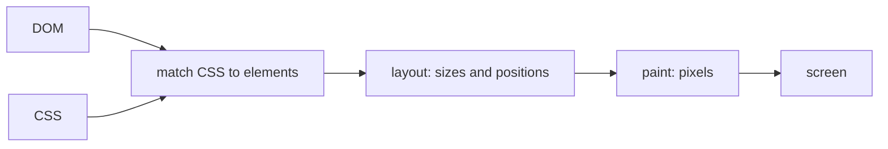

## Before you start

- [[frontend.l1.the-event-loop]] — you know a page's JavaScript runs one task at a time, and the browser can redraw the page only between tasks.

## The situation

In the DOM lesson you changed the heading of `www/index.html` in the developer tools, and the screen changed at once. Something had to turn that new text into pixels: work out how wide the word is, whether the lines below it move, and which pixels to colour. Now imagine a page that changes its DOM sixty times a second, or one that changes a single colour. Does the browser do the same amount of work for both, and when does it do it?

## Core concepts

- **render** — the browser turning the current DOM and CSS into the pixels on screen; it happens again whenever a change affects what is visible.
- layout — the step of rendering that works out where every element goes and how big it is.
- paint — the step of rendering that fills in the pixels: text, colours, borders.

## How it works

To **render** a page, the browser takes the DOM and the CSS and works through a few steps. First it decides which CSS rules apply to each element. Then comes layout: it works out the size and position of every element, from the page's width down to where each word wraps. Then paint: it fills in the pixels for the text, colours and borders in those positions. The result is what you see.

This is not a one-time job. Whenever a script or the developer tools change the DOM or the CSS in a way that affects what is visible, the browser renders again, in one of the gaps between tasks the event loop leaves. It does not have to redo everything each time, though; it redoes the steps the change affects.

That is why changes have different costs. Changing the colour of a heading changes no sizes or positions, so after matching the new style, the browser can skip layout and only paint the heading again. Changing the heading's font size makes it taller, which pushes the paragraph and the list below it down: now layout must run again for the elements that moved, and all of them must be painted. A page that changes its DOM task after task, many times a second — on every timer tick or mouse move — makes the browser render again and again, and the more each change moves other elements, the more work each time. Flutter, the toolkit the Đơn Hàng app is built with and the subject of the next module, faces the same question: which changes cost more work to draw again.

## In the Đơn Hàng system

`www/index.html` has no CSS of its own, so the browser renders it with its default styles: the heading in a large bold font, the paragraph below it, and the list of three links under that. Its layout places each element under the one before, as wide as the window allows. The page has no scripts, so nothing on it changes by itself after that first render; the browser renders again only when something outside the page's own code changes what is visible, such as resizing the window, selecting text, or your edits in the developer tools. Changing `index.html` on the server does nothing until the page is loaded again.

That makes it a clear page to watch rendering on. Change the heading's colour in the developer tools, and only the heading needs repainting. Change its text to something longer, or its size, and the heading may take more room, so the elements below it move and must be laid out and painted again. The lab page stays small either way, but the difference in work is the same one that matters on a page with hundreds of elements.

## Beginners often think…

- **"Rendering only happens once, when the page first loads."** → Actually the browser renders again whenever the visible result of the DOM or CSS changes: a script adds a node, text changes, the window is resized. The first render is just the first of many. You notice this when a page that updates constantly makes the whole browser tab slow, even though it loaded quickly.
- **"Changing CSS is free and never triggers any of the same rendering work a DOM change does."** → Actually CSS decides sizes and positions, so a CSS change can require layout and paint just as a DOM change can. Changing a colour costs a repaint; changing a size can move everything after it. You notice this when a style that only changes a colour feels instant, while one that changes a width makes the page stutter.

## Try it (3 minutes)

In Chrome or Edge, with the lab running, open `http://localhost:8080/index.html` and the developer tools.

1. Open the Rendering panel from the developer tools' own ⋮ menu (not the browser's): ⋮ → More tools → Rendering. Turn on "Paint flashing". Areas the browser repaints now flash green.
2. In the Elements tab, select the `h1`. The Styles pane beside the tree lists its CSS; click inside the empty `element.style { }` block at the top, type `color: red` and press Enter, then watch which area flashes.
3. In the same block, add `font-size: 80px` the same way, and watch again.

Expected result: in step 2, only the heading flashes. In step 3, the heading grows, the paragraph and list move down, and the flashing covers them too.

Why did the colour change repaint less of the page than the size change?

Suggested answer

A new colour changes no sizes or positions, so only the heading's own pixels had to be painted again. A bigger font makes the heading take more room, so layout had to move the elements below it, and everything that moved had to be painted again as well.

## Connections

- [[frontend.l1.the-event-loop]] — rendering happens in the gaps between tasks.
- [[frontend.l1.build-layout-paint]] — Flutter's own steps from its UI description to pixels.

## Five-line summary

1. Rendering turns the current DOM and CSS into pixels: match styles, lay out sizes and positions, then paint.
2. It happens again whenever a change affects what is visible, in the gaps between JavaScript tasks.
3. The browser redoes only the steps a change affects, so changes have different costs.
4. A colour change needs only a repaint; a size change can move other elements and force layout as well.
5. A page that changes its DOM task after task renders again and again, each time paying for what the change moves.
