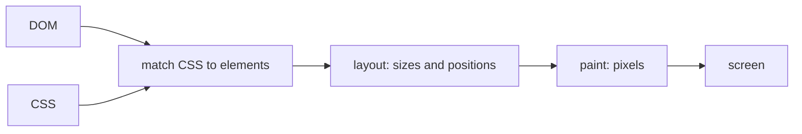

## Bạn cần biết trước

- [[frontend.l1.the-event-loop]] — bạn biết JavaScript của trang chạy từng task một, và trình duyệt chỉ vẽ lại trang được giữa các task.

## Tình huống

Ở bài DOM, bạn đã đổi heading của `www/index.html` trong công cụ dành cho nhà phát triển, và màn hình đổi ngay. Phải có thứ gì đó biến chữ mới thành pixel: tính xem từ đó rộng bao nhiêu, các dòng bên dưới có dịch chuyển không, và tô những pixel nào. Giờ hãy hình dung một trang thay đổi DOM sáu mươi lần mỗi giây, và một trang chỉ đổi đúng một màu. Trình duyệt có làm cùng một lượng việc cho cả hai không, và nó làm việc đó vào lúc nào?

## Khái niệm cốt lõi

- **render** — việc trình duyệt biến DOM và CSS hiện tại thành pixel trên màn hình; nó diễn ra lại mỗi khi có thay đổi ảnh hưởng tới thứ nhìn thấy được.
- layout — bước của render tính xem mỗi phần tử nằm ở đâu và lớn cỡ nào.
- paint — bước của render tô các pixel: chữ, màu, viền.

## Cơ chế hoạt động

Để **render** một trang, trình duyệt lấy DOM và CSS rồi đi qua vài bước. Trước tiên nó quyết định luật CSS nào áp dụng cho từng phần tử. Tiếp theo là layout: nó tính kích thước và vị trí của mọi phần tử, từ bề rộng của trang cho tới chỗ mỗi từ xuống dòng. Rồi tới paint: nó tô pixel cho chữ, màu và viền ở những vị trí đó. Kết quả là những gì bạn thấy.

Đây không phải việc làm một lần. Mỗi khi một script hay công cụ dành cho nhà phát triển thay đổi DOM hoặc CSS theo cách ảnh hưởng tới thứ nhìn thấy được, trình duyệt render lại, trong một khoảng trống giữa các task mà event loop để lại. Tuy vậy, nó không phải làm lại mọi thứ mỗi lần; nó chỉ làm lại những bước mà thay đổi đó ảnh hưởng.

Đó là lý do các thay đổi có cái giá khác nhau. Đổi màu của heading không đổi kích thước hay vị trí nào, nên sau khi ghép kiểu mới, trình duyệt có thể bỏ qua layout và chỉ paint lại heading. Đổi cỡ chữ của heading làm nó cao hơn, đẩy đoạn văn và danh sách bên dưới xuống: lúc này layout phải chạy lại cho các phần tử đã dịch chuyển, và tất cả chúng phải được paint lại. Một trang thay đổi DOM hết task này tới task khác, nhiều lần mỗi giây — mỗi lần bộ hẹn giờ tới hạn hay chuột di chuyển — khiến trình duyệt render lại liên tục, và mỗi thay đổi càng đẩy nhiều phần tử khác, mỗi lần càng tốn việc. Flutter, bộ công cụ mà app Đơn Hàng được xây bằng nó và là chủ đề của module sau, cũng đối mặt với cùng câu hỏi: thay đổi nào tốn nhiều công hơn để vẽ lại.

## Trong hệ thống Đơn Hàng

`www/index.html` không có CSS riêng, nên trình duyệt render nó bằng kiểu mặc định: heading chữ to và đậm, đoạn văn bên dưới, và danh sách ba link dưới đó nữa. Layout của nó đặt mỗi phần tử dưới phần tử trước, rộng hết mức cửa sổ cho phép. Trang không có script, nên không có gì trên đó tự thay đổi sau lần render đầu; trình duyệt chỉ render lại khi có thứ gì bên ngoài code của chính trang làm đổi những gì nhìn thấy được, như đổi cỡ cửa sổ, bôi đen chữ, hay chỉnh sửa của bạn trong công cụ dành cho nhà phát triển. Đổi `index.html` trên server không có tác dụng gì cho tới khi trang được tải lại.

Điều đó khiến đây là trang dễ quan sát việc render. Đổi màu heading trong công cụ dành cho nhà phát triển, và chỉ heading cần paint lại. Đổi chữ của nó thành thứ dài hơn, hoặc đổi cỡ chữ, thì heading có thể chiếm nhiều chỗ hơn, nên các phần tử bên dưới dịch chuyển và phải được layout rồi paint lại. Trang lab dù sao vẫn nhỏ, nhưng khác biệt về lượng việc thì cũng chính là thứ quan trọng trên một trang có hàng trăm phần tử.

## Người mới hay nghĩ rằng…

- **"Render chỉ diễn ra một lần, khi trang tải lần đầu."** → Thực ra trình duyệt render lại mỗi khi kết quả nhìn thấy được của DOM hay CSS thay đổi: một script thêm node, chữ thay đổi, cửa sổ đổi cỡ. Lần render đầu chỉ là lần đầu tiên trong nhiều lần. Bạn sẽ nhận ra khi một trang cập nhật liên tục làm cả tab trình duyệt chậm đi, dù nó tải rất nhanh.
- **"Thay đổi CSS là miễn phí và không bao giờ kéo theo phần việc render nào giống như thay đổi DOM."** → Thực ra CSS quyết định kích thước và vị trí, nên một thay đổi CSS có thể cần layout và paint y như một thay đổi DOM. Đổi màu tốn một lần paint lại; đổi kích thước có thể đẩy mọi thứ phía sau. Bạn sẽ nhận ra khi một kiểu chỉ đổi màu thì thấy tức thì, còn một kiểu đổi độ rộng thì làm trang bị giật.

## Thử ngay (3 phút)

Trong Chrome hoặc Edge, khi lab đang chạy, mở `http://localhost:8080/index.html` và công cụ dành cho nhà phát triển.

1. Mở bảng Rendering từ menu ⋮ của chính công cụ dành cho nhà phát triển (không phải menu của trình duyệt): ⋮ → More tools → Rendering. Bật "Paint flashing". Giờ những vùng trình duyệt paint lại sẽ nháy xanh lá.
2. Trong tab Elements, chọn `h1`. Ô Styles cạnh cây liệt kê CSS của nó; bấm vào khối `element.style { }` còn trống ở trên cùng, gõ `color: red` rồi nhấn Enter, sau đó xem vùng nào nháy.
3. Trong cùng khối đó, thêm `font-size: 80px` theo cách tương tự, và xem lại.

Kết quả mong đợi: ở bước 2, chỉ heading nháy. Ở bước 3, heading to lên, đoạn văn và danh sách dịch xuống, và vùng nháy phủ cả chúng.

Vì sao đổi màu làm trang phải paint lại ít hơn đổi cỡ chữ?

Gợi ý đáp án

Màu mới không đổi kích thước hay vị trí nào, nên chỉ các pixel của chính heading phải paint lại. Chữ to hơn làm heading chiếm nhiều chỗ hơn, nên layout phải dời các phần tử bên dưới, và mọi thứ đã dịch chuyển cũng phải được paint lại.

## Liên hệ

- [[frontend.l1.the-event-loop]] — render diễn ra trong khoảng trống giữa các task.
- [[frontend.l1.build-layout-paint]] — các bước riêng của Flutter, từ phần mô tả giao diện tới pixel.

## Tóm tắt 5 dòng

1. Render biến DOM và CSS hiện tại thành pixel: ghép kiểu, layout kích thước và vị trí, rồi paint.
2. Nó diễn ra lại mỗi khi có thay đổi ảnh hưởng tới thứ nhìn thấy được, trong khoảng trống giữa các task JavaScript.
3. Trình duyệt chỉ làm lại những bước mà thay đổi ảnh hưởng tới, nên các thay đổi có cái giá khác nhau.
4. Đổi màu chỉ cần paint lại; đổi kích thước có thể dời các phần tử khác và buộc phải layout nữa.
5. Một trang thay đổi DOM hết task này tới task khác sẽ render lại liên tục, mỗi lần trả giá cho những gì thay đổi đó dời đi.
