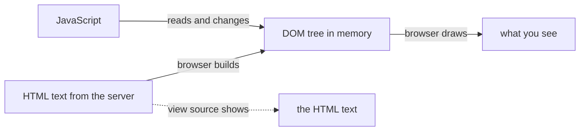

## Before you start

- [[frontend.l1.html-css-js-roles]] — you know HTML structures a page, CSS styles it, and JavaScript changes it after it has loaded.

## The situation

You are on a shop's product page. You click "Add to cart", and a line appears under the button: "1 item in your cart". Curious how it was done, you open the page source to find that sentence in the HTML. It is not there. The file the server sent never contained it, and the server was not asked for a new page either. So where does the sentence on your screen live, and what did the page's JavaScript actually change?

## Core concepts

- **DOM (Document Object Model)** — the browser's live, in-memory tree of a page's elements, built from the HTML it downloaded; JavaScript reads and changes the DOM, not the original HTML text.
- node — one entry in the DOM tree, such as the `h1` element or the text inside it.
- parent and child — how nodes relate in the tree: a list element is the parent of each item in it, and each item is its child.
- developer tools — a panel built into the browser (F12 in most browsers) whose Elements or Inspector tab shows the page's DOM as it is right now.

## How it works

When the HTML arrives, the browser reads it and builds the DOM: a tree of objects in its own memory, one node for each element and each piece of text. The tree follows the HTML's nesting, and the browser tidies the HTML as it builds, for example by closing a paragraph the author left open. From then on, the browser draws the page from this tree, not from the text.

JavaScript works on the same tree. It can find a node, read its text, change it, add new nodes or remove old ones, and what you see follows, without loading a new page. That is the "Add to cart" line: a script created a new node and put it under the button.

The HTML text is not touched. "View page source" shows the HTML as the server sends it, not the tree, so once anything changes the DOM, the two stop matching. Developer tools show the live DOM, and can change it too. Reloading the page throws the tree away and builds a new one from the HTML.

## In the Đơn Hàng system

The lab — the programs `scripts/up.sh` starts, with Caddy, its web server, answering on `http://localhost:8080` — serves `www/index.html`. That page has no JavaScript. Its DOM has `html` at the top, with the elements `head` and `body` under it. `body` holds nine elements: the `h1` heading, the `p` paragraph, the `ul` list, three `li` list items and three `a` links, one inside each item, plus their text.

With no script on the page, nothing changes this DOM after it is built, so it keeps the shape of the HTML. That makes the page a good place to experiment: any change you see in its DOM, you made yourself, with the developer tools.

A welcome message on this page would work like the shop's "Add to cart" line. A `<script>` would find the `h1` node and wait for a click on it. When the click came, the script would create a new `p` node holding the message and add it to `body`, right after the heading. The browser would draw the new paragraph at once, while the file on the server, and its page source, would still contain only the original heading, paragraph and list.

## Beginners often think…

- **"The DOM and the page's HTML source are always the same thing, since the DOM is just built from the HTML."** → Actually they match only until something changes the DOM. The source is the text the server sends; the DOM is a tree in memory that JavaScript, or your developer tools, can change at any time. You notice this when the page shows something, like the "Add to cart" line, that "view page source" does not contain.
- **"JS can only read the DOM, not change it — changing what's on screen needs a new page load."** → Actually a script in the page can add, remove and edit nodes, and each change shows on screen without loading a new page. A new page load is what a plain link does, not what a script needs. You notice this when part of a page updates while the address bar and the rest of the page stay the same.

## Try it (3 minutes)

Start the lab with `scripts/up.sh` if it is not running, and open `http://localhost:8080/index.html`:

1. Open the developer tools and choose the Elements or Inspector tab. Expand `body` and find the `h1`.
2. Double-click the heading's text in that tree, change `Đơn Hàng` to `Xin chào`, and press Enter.
3. Open the page source (in most browsers, Ctrl+U; it opens in a new tab) and look at the heading there.
4. Go back to the page's own tab and reload it.

Expected result: after step 2, the page shows `Xin chào` at once, and the address bar has not changed. The page source still says `Đơn Hàng`. After the reload, the page shows `Đơn Hàng` again.

Why did the reload undo your change?

Suggested answer

Your edit changed only the DOM, the tree in the browser's memory. The HTML file on the server never changed, so reloading made the browser download the same HTML and build a fresh DOM from it, without your edit.

## Connections

- [[frontend.l1.html-css-js-roles]] — the HTML the DOM is built from, and the JavaScript that changes it.
- [[frontend.l1.the-event-loop]] — how the browser decides when a script's changes to the DOM actually run.

## Five-line summary

1. The DOM is the browser's in-memory tree of a page, one node per element and piece of text, built from the HTML.
2. The browser draws the page from the DOM, and JavaScript reads and changes that tree.
3. A change to the DOM shows on screen without loading a new page.
4. "View page source" shows the HTML as the server sends it, which no longer matches the DOM once something has changed it.
5. Reloading throws the DOM away and builds a new one from the same HTML, so in-page changes are lost.
