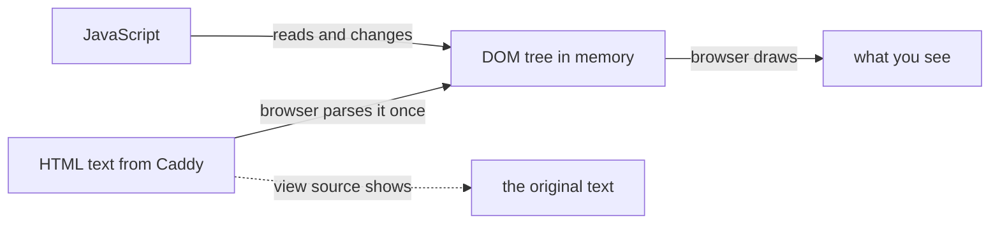

## Before you start

- [[frontend.l1.html-css-js-roles]] — you know HTML structures a page, CSS styles it, and JavaScript changes it after it has loaded.

## The situation

The last lesson ended with a plan: to show a welcome message when the heading of `www/index.html` is clicked, add JavaScript that "adds the message to what is on screen". But the page came from Caddy as a file of HTML text, and that file stays the same on the server. The browser does not rewrite the file when something changes. So what exactly does JavaScript change? And if it changes something, why does viewing the page source afterwards still show the original HTML?

## Core concepts

- **DOM (Document Object Model)** — the browser's live, in-memory tree of a page's elements, built from the HTML it downloaded; JavaScript reads and changes the DOM, not the original HTML text.
- node — one entry in the DOM tree, such as the `h1` element or the text inside it.
- parent and child — how nodes relate in the tree: the `ul` is the parent of each `li`, and each `li` is a child of the `ul`.

## How it works

When the HTML arrives, the browser reads it once and builds the DOM: a tree of objects in its own memory, one node for each element and each piece of text. The tree has the same shape as the HTML's nesting. For `www/index.html`, `html` sits at the top with two children, `head` and `body`; `body` holds `h1`, `p` and `ul`; the `ul` holds three `li` nodes, each holding an `a`.

From then on, the DOM is what the browser shows. It draws the page from the tree, not from the text. JavaScript works on the same tree: it can find a node, read its text, change it, add new nodes or remove old ones. When it changes the tree, what you see changes too, without the browser asking the server for anything.

The original HTML text is not touched. It stays exactly as it arrived, and "view page source" shows that text, not the tree. So the moment JavaScript changes the DOM, the source and the DOM stop matching. To see the tree as it is now, you need the browser's developer tools, which show the live DOM rather than the source. Reloading the page throws the tree away and builds a new one from the HTML again.

## In the Đơn Hàng system

`www/index.html` has no JavaScript, so on the lab's home page the DOM stays the same as the HTML it was built from: nine element nodes under `body` (`h1`, `p`, `ul`, three `li`, three `a`), plus their text, arranged exactly as the tags are nested. That makes it a good page to experiment on. Any change you make to its DOM, you made yourself.

The teammate's welcome message would work like this. A `<script>` on the page would find the `h1` node and wait for a click on it. When the click comes, the script would create a new `p` node holding the message and add it to `body`, right after the heading. The browser would draw the new paragraph at once. The file on the server, and the page source in the browser, would still contain only the original heading, paragraph and list.

The same holds for any page with scripts: the source shows only what the server sent, and the developer tools show what the page has become since. When the two differ, the difference is exactly what the scripts have done.

## Beginners often think…

- **"The DOM and the page's HTML source are always the same thing, since the DOM is just built from the HTML."** → Actually they match only until something changes the DOM. The source is the text the server sent; the DOM is a tree in memory that JavaScript, or your developer tools, can change at any time. You notice this when the page shows something that "view page source" does not contain.
- **"JS can only read the DOM, not change it — changing what's on screen needs a new page load."** → Actually changing the DOM is the main thing JavaScript in a page does: adding, removing and editing nodes, all of which show on screen at once. A new page load is what a plain link does, not what a script needs. You notice this when part of a page updates while the address bar and the rest of the page stay the same.

## Try it (3 minutes)

With the lab running, open `http://localhost:8080/index.html`:

1. Open the developer tools (F12 in most browsers) and choose the Elements or Inspector tab. Expand `body` and find the `h1`.
2. Double-click the heading's text in that tree, change `Đơn Hàng` to `Xin chào`, and press Enter.
3. View the page source (Ctrl+U), then reload the page.

Expected result: after step 2, the page shows `Xin chào` at once, with no new request. The page source still says `Đơn Hàng`. After the reload, the page shows `Đơn Hàng` again.

Why did the reload undo your change?

Suggested answer

Your edit changed only the DOM, the tree in the browser's memory. The HTML file on the server never changed, so reloading made the browser download the same HTML and build a fresh DOM from it, without your edit.

## Connections

- [[frontend.l1.html-css-js-roles]] — the HTML the DOM is built from, and the JavaScript that changes it.
- [[frontend.l1.the-event-loop]] — how the browser decides when a script's changes to the DOM actually run.

## Five-line summary

1. The DOM is the browser's in-memory tree of a page, one node per element and piece of text, built once from the HTML.
2. The browser draws the page from the DOM, and JavaScript reads and changes that tree.
3. A change to the DOM shows on screen at once, without a new request to the server.
4. "View page source" shows the original HTML text, which no longer matches the DOM once something has changed it.
5. Reloading throws the DOM away and builds a new one from the same HTML, so in-page changes are lost.
