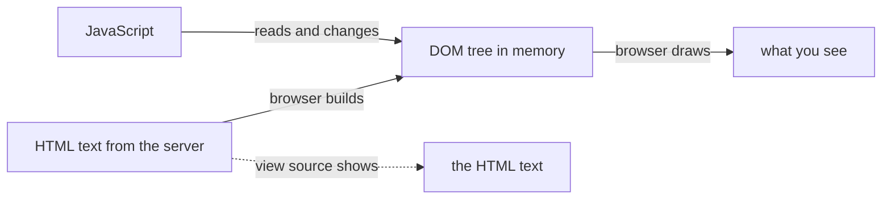

## Bạn cần biết trước

- [[frontend.l1.html-css-js-roles]] — bạn biết HTML cấu trúc trang, CSS tạo kiểu cho nó, và JavaScript thay đổi nó sau khi đã tải xong.

## Tình huống

Bạn đang ở trang một sản phẩm của một cửa hàng. Bạn bấm "Thêm vào giỏ", và một dòng hiện ra dưới nút: "Giỏ hàng có 1 món". Tò mò muốn biết làm thế nào, bạn mở mã nguồn trang để tìm câu đó trong HTML. Nó không có ở đó. File server gửi chưa bao giờ chứa câu đó, và server cũng không bị hỏi một trang mới nào. Vậy câu đang nằm trên màn hình của bạn sống ở đâu, và JavaScript của trang thực ra đã thay đổi cái gì?

## Khái niệm cốt lõi

- **DOM (Document Object Model)** — cây phần tử sống trong bộ nhớ trình duyệt, dựng từ HTML tải về; JavaScript đọc và sửa DOM, không sửa văn bản HTML gốc.
- node — một mục trong cây DOM, như phần tử `h1` hay đoạn chữ bên trong nó.
- cha và con — quan hệ giữa các node trong cây: một phần tử danh sách là cha của từng mục trong nó, và mỗi mục là con của nó.
- công cụ dành cho nhà phát triển (developer tools) — một bảng có sẵn trong trình duyệt (F12 ở hầu hết trình duyệt) mà tab Elements hay Inspector của nó cho thấy DOM của trang đúng như lúc này.

## Cơ chế hoạt động

Khi HTML tới, trình duyệt đọc nó và dựng DOM: một cây object trong bộ nhớ của chính nó, mỗi phần tử và mỗi đoạn chữ là một node. Cây đi theo cách lồng nhau của HTML, và trình duyệt sửa gọn HTML trong lúc dựng, chẳng hạn thêm thẻ đóng `
` mà tác giả quên viết sau một đoạn văn. Từ đó trở đi, trình duyệt vẽ trang từ cây này, không phải từ văn bản.

JavaScript làm việc trên cùng cây đó. Nó có thể tìm một node, đọc chữ của node, sửa nó, thêm node mới hay xóa node cũ, và những gì bạn thấy thay đổi theo, không cần tải trang mới. Dòng "Thêm vào giỏ" chính là vậy: một script đã tạo một node mới và đặt nó dưới nút bấm.

Văn bản HTML không bị đụng tới. "View page source" hiển thị HTML như server gửi, không phải cái cây — mũi tên nét đứt trong sơ đồ — nên một khi có thứ gì thay đổi DOM, hai bên không còn khớp nhau. Công cụ dành cho nhà phát triển cho thấy DOM đang sống, và cũng sửa được nó. Tải lại trang sẽ vứt cây đi và dựng một cây mới từ HTML.

## Trong hệ thống Đơn Hàng

Lab — các chương trình mà `scripts/up.sh` khởi động, trong đó Caddy, web server của nó, trả lời ở `http://localhost:8080` — phục vụ `www/index.html`. Trang đó không có JavaScript. DOM của nó có `html` ở đỉnh, với hai phần tử `head` và `body` bên dưới. `head` chứa thông tin về trang, thứ không được vẽ ra, còn `body` chứa những gì được vẽ: heading `h1`, đoạn văn `p` và danh sách `ul`, có ba mục `li`, mỗi mục chứa một link `a` — tổng cộng chín phần tử, cộng với chữ của chúng.

Không có script trên trang, không có gì thay đổi DOM này sau khi nó được dựng, nên nó giữ đúng hình dạng của HTML. Điều đó khiến trang này là chỗ tốt để thử nghiệm: mọi thay đổi bạn thấy trong DOM của nó là do chính bạn làm, bằng công cụ dành cho nhà phát triển.

Một lời chào trên trang này sẽ hoạt động giống dòng "Thêm vào giỏ" của cửa hàng kia. Một `<script>` sẽ tìm node `h1` và chờ có cú bấm vào nó. Khi cú bấm tới, script sẽ tạo một node `p` mới chứa lời chào và thêm nó vào `body`, ngay sau heading. Trình duyệt sẽ vẽ đoạn văn mới ngay lập tức, trong khi file trên server, và mã nguồn trang, vẫn chỉ chứa heading, đoạn văn và danh sách ban đầu.

## Người mới hay nghĩ rằng…

- **"DOM và mã nguồn HTML của trang luôn là một, vì DOM chỉ là thứ dựng từ HTML."** → Thực ra chúng chỉ khớp cho tới khi có thứ gì đó thay đổi DOM. Mã nguồn là văn bản server gửi; DOM là một cây trong bộ nhớ mà JavaScript, hay công cụ dành cho nhà phát triển, có thể thay đổi bất cứ lúc nào. Bạn sẽ nhận ra khi trang hiển thị một thứ, như dòng "Thêm vào giỏ", mà "view page source" không chứa.
- **"JS chỉ đọc được DOM, không sửa được — muốn đổi thứ trên màn hình thì cần tải trang mới."** → Thực ra script trong trang có thể thêm, xóa và sửa node, và mỗi thay đổi hiện lên màn hình mà không cần tải trang mới. Tải trang mới là việc của đi theo một link tới trang khác, không phải thứ script cần. Bạn sẽ nhận ra khi một phần trang cập nhật trong khi thanh địa chỉ và phần còn lại của trang vẫn giữ nguyên.

## Thử ngay (3 phút)

Từ thư mục gốc của repo ví dụ, khởi động lab bằng `scripts/up.sh` (chạy lại cũng không sao nếu lab đang chạy), rồi mở `http://localhost:8080/index.html`:

1. Mở công cụ dành cho nhà phát triển và chọn tab Elements hoặc Inspector. Mở rộng `body` và tìm `h1`.
2. Nhấp đúp vào chữ của heading trong cây đó, đổi `Đơn Hàng` thành `Xin chào`, rồi nhấn Enter.
3. Mở mã nguồn trang (ở hầu hết trình duyệt là Ctrl+U; nó mở trong tab mới) và xem heading ở đó.
4. Quay lại tab của chính trang đó và tải lại nó.

Kết quả mong đợi: sau bước 2, trang hiện `Xin chào` ngay, và thanh địa chỉ không đổi. Mã nguồn trang vẫn ghi `Đơn Hàng`. Sau khi tải lại, trang lại hiện `Đơn Hàng`.

Vì sao tải lại làm mất thay đổi của bạn?

Gợi ý đáp án

Chỉnh sửa của bạn chỉ thay đổi DOM, cái cây trong bộ nhớ trình duyệt. File HTML trên server chưa hề đổi, nên tải lại khiến trình duyệt tải về đúng HTML đó và dựng một DOM mới từ nó, không có chỉnh sửa của bạn.

## Liên hệ

- [[frontend.l1.html-css-js-roles]] — HTML mà DOM được dựng từ đó, và JavaScript thay đổi nó.
- [[frontend.l1.the-event-loop]] — cách trình duyệt quyết định khi nào những thay đổi của script lên DOM thực sự chạy.

## Tóm tắt 5 dòng

1. DOM là cây trong bộ nhớ trình duyệt của một trang, mỗi phần tử và đoạn chữ là một node, dựng từ HTML.
2. Trình duyệt vẽ trang từ DOM, còn JavaScript đọc và thay đổi cái cây đó.
3. Một thay đổi trên DOM hiện lên màn hình mà không cần tải trang mới.
4. "View page source" hiển thị HTML như server gửi, thứ không còn khớp với DOM khi đã có gì đó thay đổi nó.
5. Tải lại sẽ vứt DOM đi và dựng DOM mới từ cùng HTML, nên các thay đổi trong trang bị mất.
