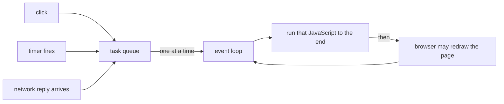

## Before you start

- [[frontend.l1.the-dom]] — you know JavaScript on a page reads and changes the DOM, and the browser draws the page from it.
- [[foundation.l1.threads-and-async-intro]] — you know a thread runs one step at a time, and async/await hands a thread back while waiting for the network.

## The situation

On a shop's page, you click "Calculate total". For three seconds, nothing works: the button stays pressed, the text you try to select does not highlight, a second click seems to vanish. Then everything catches up at once: the total appears, and your second click takes effect. Meanwhile, on another page, a product list is loading from the server, and you can scroll and click freely while it loads. Both pages run JavaScript. Why does one freeze the page completely and the other not at all?

## Core concepts

- **event loop** — the browser's mechanism that takes the next waiting piece of a page's JavaScript from a queue and runs it, one at a time, on a single thread.
- task queue — the line of work waiting to run: a click to handle, a timer that has fired, a network reply that has arrived.
- handler — the piece of JavaScript a page sets to run when something happens, such as a click on a button; that is the click's handler.
- run to completion — once a piece of JavaScript starts, it runs until it finishes; nothing else on the page's thread runs in the middle of it.
- blocking — keeping the thread busy so that nothing else in the queue, including drawing the page, can happen.

## How it works

A page's JavaScript runs on one thread, the page's main thread. That thread can do one thing at a time, exactly like the single C# thread from the threads lesson. Work arrives as tasks: the user clicks, a timer fires, a reply comes back from the server. Each one joins the queue.

The **event loop** is what drives that thread. It takes the next task from the queue, runs its JavaScript to completion, and only then moves on. Between tasks, the browser gets its chance to redraw the page with any DOM changes. Two click handlers never run at the same moment; the second waits in the queue until the first has finished.

That explains the frozen page. A click handler that spends three seconds calculating keeps the thread busy for those three seconds. Your second click is queued, not lost, but it cannot run, and the browser cannot redraw, until the calculation returns. Waiting for the network is different. When a script asks for data, the browser does the waiting itself, outside the page's thread, the same way async/await in C# hands the thread back while it waits for a file or a network reply. The thread is free for clicks and drawing in the meantime; when the reply arrives, the code that handles it joins the queue like any other task.

## In the Đơn Hàng system

The lab's pages in `www/` have no JavaScript of their own, so their thread is idle after the page is built. A click on a link is still handled on that thread, and it takes the browser to the next address at once. Nothing on these pages keeps the thread busy — unless you make it busy yourself, as the Try it below does.

The client later in this track is where the event loop matters. `DonHang.App`, the Đơn Hàng app, is built for the web and runs in the browser, on the page's thread; it loads the product list from `GET /api/v1/products`. While it waits for that reply, the page must stay usable: the user can still scroll and tap. That works only because the request is handed to the browser and the page's thread is free until the reply arrives. If the app instead did heavy work on every product in one go, the whole page would freeze while it ran, exactly like the "Calculate total" button.

The same rule applies to anything you add to a page. Short tasks keep a page quick to react, because the queue keeps moving. Long tasks do not, however fast the rest of the code is.

## Beginners often think…

- **"JavaScript can run two event handlers at the exact same time, since browsers are 'multi-threaded'."** → Actually the browser does some of its own work, such as waiting for the network, outside the page's thread, but a page's JavaScript runs on one thread, one task at a time. A second click waits in the queue until the first handler has returned. You notice this when a slow handler makes every other click on the page wait for it.
- **"Fetching data with JS pauses the whole page until the data arrives, the way a synchronous call would."** → Actually a fetch is not a call that holds the thread until it gets its answer: the browser does the waiting outside the page's thread, and the code that uses the reply runs later, as its own task. Until then, clicks and redrawing carry on. You notice this when a list is still loading but the rest of the page scrolls and responds normally.

## Try it (3 minutes)

With the lab running, open `http://localhost:8080/index.html` and the developer tools' Console tab.

1. Type `const end = Date.now() + 5000; while (Date.now() < end) {}` and press Enter. Code typed in the Console runs on the page's own thread, so this keeps that thread busy for five seconds and does nothing else.
2. Straight away, try to select the heading text with the mouse, and click one of the links.
3. Wait for the five seconds to pass.

Expected result: during the five seconds, the page does not respond: the text does not highlight and the link does not open. Once the loop ends, the queued click is handled and the link opens.

What happened to your click on the link while the loop was running, and why?

Suggested answer

The click could not be handled while the loop held the page's thread. The browser queued it, and it was handled only after the loop ended, so the link opened late. Nothing on the page could run until the long task finished.

## Connections

- [[foundation.l1.threads-and-async-intro]] — the same single thread and the same "hand the thread back while waiting" idea, in C#.
- [[frontend.l1.render]] — what the browser does in the gaps between tasks: turning the DOM into pixels.

## Five-line summary

1. A page's JavaScript runs on one thread, one task at a time.
2. Clicks, timers and network replies wait in a queue; the event loop runs them one by one, each to the end.
3. The browser can redraw the page only between tasks, so a long task freezes clicks and drawing alike.
4. Waiting for the network happens outside the page's thread, so fetching data does not freeze the page.
5. Short tasks keep a page quick to react; one long task blocks everything behind it.
