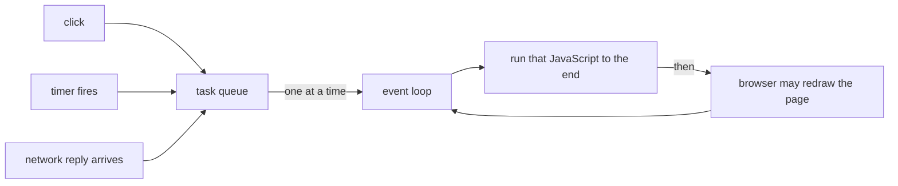

## Bạn cần biết trước

- [[frontend.l1.the-dom]] — bạn biết JavaScript trên trang đọc và thay đổi DOM, và trình duyệt vẽ trang từ DOM.
- [[foundation.l1.threads-and-async-intro]] — bạn biết một thread chạy từng bước một, và async/await trả thread lại trong lúc chờ mạng.

## Tình huống

Trên trang của một cửa hàng, bạn bấm "Tính tổng tiền". Trong ba giây, không gì hoạt động: nút cứ ở trạng thái bị nhấn, đoạn chữ bạn định bôi đen không sáng lên, cú bấm thứ hai như biến mất. Rồi mọi thứ bắt kịp cùng lúc: tổng tiền hiện ra, và cú bấm thứ hai của bạn có tác dụng. Trong khi đó, ở một trang khác, danh sách sản phẩm đang tải từ server, và bạn vẫn cuộn, vẫn bấm thoải mái trong lúc nó tải. Cả hai trang đều chạy JavaScript. Vì sao một trang đơ hoàn toàn còn trang kia thì không hề?

## Khái niệm cốt lõi

- **event loop** — cơ chế của trình duyệt lấy đoạn JavaScript đang chờ tiếp theo của trang ra khỏi một hàng đợi và chạy nó, từng cái một, trên một thread duy nhất.
- hàng đợi task (task queue) — dãy công việc đang chờ chạy: một cú bấm cần xử lý, một bộ hẹn giờ đã tới hạn, một trả lời mạng vừa về.
- handler — đoạn JavaScript mà trang đặt sẵn để chạy khi có chuyện xảy ra, như một cú bấm vào nút; đó là handler của cú bấm.
- chạy tới hết (run to completion) — một khi đoạn JavaScript đã bắt đầu, nó chạy cho tới khi xong; không có gì khác trên thread của trang chạy chen vào giữa.
- chặn (blocking) — giữ thread bận, khiến không gì khác trong hàng đợi, kể cả việc vẽ trang, có thể diễn ra.

## Cơ chế hoạt động

JavaScript của một trang chạy trên một thread, thread chính của trang. Thread đó làm được một việc một lúc, y như thread C# duy nhất trong bài về thread. Công việc tới dưới dạng task: người dùng bấm, một bộ hẹn giờ tới hạn, một trả lời từ server về. Mỗi cái xếp vào hàng đợi.

**Event loop** là thứ điều khiển thread đó. Nó lấy task tiếp theo trong hàng đợi, chạy JavaScript của task tới hết, và chỉ khi đó mới đi tiếp. Giữa các task, trình duyệt có cơ hội vẽ lại trang với những thay đổi DOM. Hai handler của cú bấm không bao giờ chạy cùng một lúc; cái thứ hai chờ trong hàng đợi tới khi cái đầu xong.

Điều đó giải thích trang bị đơ. Một handler dành ba giây để tính toán sẽ giữ thread bận ba giây đó. Cú bấm thứ hai của bạn được xếp hàng, không bị mất, nhưng nó không chạy được, và trình duyệt cũng không vẽ lại được, cho tới khi phép tính trả về. Chờ mạng thì khác. Khi một script xin dữ liệu, trình duyệt tự lo việc chờ, bên ngoài thread của trang, giống như async/await trong C# trả thread lại trong lúc chờ một file hay một trả lời mạng. Trong lúc đó thread rảnh để xử lý cú bấm và vẽ trang; khi trả lời về, đoạn code xử lý nó xếp vào hàng đợi như mọi task khác.

## Trong hệ thống Đơn Hàng

Các trang của lab trong `www/` không có JavaScript riêng, nên thread của chúng rảnh sau khi trang được dựng. Một cú bấm vào link vẫn được xử lý trên thread đó, và nó đưa trình duyệt tới địa chỉ tiếp theo ngay lập tức. Không có gì trên các trang này giữ thread bận — trừ khi chính bạn làm nó bận, như phần Thử ngay bên dưới.

Client ở phần sau của track này mới là nơi event loop thật sự quan trọng. `DonHang.App`, app Đơn Hàng, được build cho web và chạy trong trình duyệt, trên thread của trang; nó tải danh sách sản phẩm từ `GET /api/v1/products`. Trong lúc chờ trả lời đó, trang phải dùng được: người dùng vẫn cuộn và chạm được. Điều đó chỉ làm được vì request được giao cho trình duyệt và thread của trang rảnh cho tới khi trả lời về. Nếu thay vào đó app xử lý nặng trên từng sản phẩm trong một lần, cả trang sẽ đơ trong lúc nó chạy, y như nút "Tính tổng tiền".

Quy tắc đó áp dụng cho mọi thứ bạn thêm vào trang. Task ngắn giữ trang phản ứng nhanh, vì hàng đợi luôn trôi. Task dài thì không, dù phần code còn lại có nhanh đến đâu.

## Người mới hay nghĩ rằng…

- **"JavaScript có thể chạy hai event handler vào đúng cùng một lúc, vì trình duyệt là 'đa luồng'."** → Thực ra trình duyệt làm một số việc của riêng nó, như chờ mạng, bên ngoài thread của trang, nhưng JavaScript của trang chạy trên một thread, mỗi lần một task. Cú bấm thứ hai chờ trong hàng đợi tới khi handler đầu trả về. Bạn sẽ nhận ra khi một handler chậm khiến mọi cú bấm khác trên trang phải chờ nó.
- **"Lấy dữ liệu bằng JS sẽ làm cả trang dừng lại tới khi dữ liệu về, như một lời gọi đồng bộ."** → Thực ra một lần fetch không phải lời gọi giữ thread tới khi có câu trả lời: trình duyệt tự lo việc chờ bên ngoài thread của trang, và đoạn code dùng trả lời sẽ chạy sau, như một task riêng. Trong lúc đó, việc xử lý cú bấm và vẽ lại vẫn tiếp tục. Bạn sẽ nhận ra khi một danh sách vẫn đang tải mà phần còn lại của trang vẫn cuộn và phản hồi bình thường.

## Thử ngay (3 phút)

Khi lab đang chạy, mở `http://localhost:8080/index.html` và tab Console của công cụ dành cho nhà phát triển.

1. Gõ `const end = Date.now() + 5000; while (Date.now() < end) {}` rồi nhấn Enter. Code gõ trong Console chạy trên chính thread của trang, nên dòng này giữ thread đó bận năm giây và không làm gì khác.
2. Ngay lập tức, thử bôi đen chữ của heading bằng chuột, và bấm một trong các link.
3. Chờ năm giây trôi qua.

Kết quả mong đợi: trong năm giây đó, trang không phản hồi: chữ không sáng lên và link không mở. Khi vòng lặp kết thúc, cú bấm đang chờ được xử lý và link mở ra.

Điều gì đã xảy ra với cú bấm vào link của bạn trong lúc vòng lặp chạy, và vì sao?

Gợi ý đáp án

Cú bấm không được xử lý khi vòng lặp đang giữ thread của trang. Trình duyệt xếp nó vào hàng đợi, và nó chỉ được xử lý sau khi vòng lặp kết thúc, nên link mở muộn. Không gì trên trang chạy được cho tới khi task dài đó xong.

## Liên hệ

- [[foundation.l1.threads-and-async-intro]] — cùng một thread duy nhất và cùng ý "trả thread lại trong lúc chờ", trong C#.
- [[frontend.l1.render]] — việc trình duyệt làm trong khoảng trống giữa các task: biến DOM thành pixel.

## Tóm tắt 5 dòng

1. JavaScript của một trang chạy trên một thread, mỗi lần một task.
2. Cú bấm, bộ hẹn giờ và trả lời mạng chờ trong hàng đợi; event loop chạy chúng lần lượt, mỗi cái tới hết.
3. Trình duyệt chỉ vẽ lại trang được giữa các task, nên một task dài làm đơ cả việc xử lý cú bấm lẫn việc vẽ.
4. Việc chờ mạng diễn ra ngoài thread của trang, nên lấy dữ liệu không làm trang đơ.
5. Task ngắn giữ trang phản ứng nhanh; một task dài chặn mọi thứ phía sau nó.
