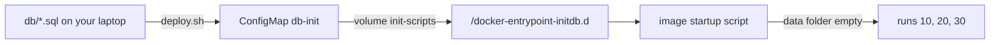

## Before you start

- [[k8s.l1.secrets]] — you know how a ConfigMap and a Secret hand their values to a container as environment variables when it starts.
- [[devops.l1.volumes]] — you know a container sees a volume or a bind mount as a folder, and that `schema.sql` and `seed.sql` run only when PostgreSQL's data folder is empty.

## The situation

In Compose, the `db` container finds its init scripts because three bind mounts show files from the `db/` folder of your repository inside it. PostgreSQL runs them on its first start, and the database has its tables and its eight products. On the cluster, the `db` Pod runs on a worker node, which is a separate machine as far as the Pod is concerned. That node has no copy of your repository, so there is no `db/` folder to mount. An environment variable is no help either: PostgreSQL wants files, not variables. How do three SQL files from your laptop end up as files inside the `db` container?

## Core concepts

- ConfigMap volume — a volume of a Pod, listed under `volumes`, whose content comes from a ConfigMap: each key becomes a file named after the key, holding the key's value.
- `volumeMounts` — the list, under a container, of the volumes it sees and the folder (`mountPath`) where each one appears.
- `/docker-entrypoint-initdb.d` — the folder where the PostgreSQL image looks for scripts to run when its data folder is empty.

## How it works



In the situation above, the files cannot come from a folder on the node, because there is none. They travel through the API server instead: a script on your laptop reads the three SQL files and stores them as one ConfigMap, `db-init`, one key per file. The key is the file name the container will see, and the value is the whole content of the file. A ConfigMap value can be a whole SQL script, not only a short value like a port number.

The `db` Pod then lists a volume built from that ConfigMap, and its container mounts the volume at `/docker-entrypoint-initdb.d`. When the Pod starts on a node, the kubelet there fetches the ConfigMap and writes each key out as a file in that volume. PostgreSQL finds three ordinary files.

From here, the rule you know from Compose applies unchanged. The image's startup script looks at the data folder. If it is empty, it creates the database and runs the scripts in `/docker-entrypoint-initdb.d` in name order; the numbers `10-`, `20-`, `30-` at the start of the file names put the schema first. If the data folder already holds a database, it runs nothing.

One difference from adding files to a folder: a volume mounted on a folder replaces what the container would see there. Inside the container, `ls /docker-entrypoint-initdb.d` lists exactly the ConfigMap's keys. Anything the image itself had in that folder is hidden while the volume is mounted; the PostgreSQL image ships that folder empty, so nothing is lost here.

## In the Đơn Hàng system

`scripts/k8s/deploy.sh` builds the ConfigMap with `kubectl create configmap db-init`, one `--from-file=10-schema.sql=db/schema.sql` per file, the same way `secrets.sh` builds its Secrets: `--dry-run=client -o yaml` only writes the object out, and `kubectl apply` sends it. The three keys are `10-schema.sql`, `20-seed.sql` and `30-migrations-baseline.sql`; the last one records in the database that the first migration is already applied, so the migration step later skips it. Nobody copies SQL into YAML by hand. The `db` container in `deploy/k8s/db.yaml` then mounts it:

```yaml file=deploy/k8s/db.yaml tag=stage-2 lines=44-60
          # lesson: k8s.l1.configmap-files
          # Each key of the ConfigMap db-init (built by scripts/k8s/deploy.sh
          # from the files in db/) appears as a file in
          # /docker-entrypoint-initdb.d, where the PostgreSQL image looks for
          # scripts to run when its data directory is empty. The folder shows
          # only those files.
          volumeMounts:
            - name: init-scripts
              mountPath: /docker-entrypoint-initdb.d
            - name: data
              mountPath: /var/lib/postgresql/data
      volumes:
        - name: init-scripts
          configMap:
            name: db-init
        - name: data
          emptyDir: {}
```

Two lists meet by name. Under the Pod's `volumes`, `init-scripts` is a volume made from the ConfigMap `db-init`. Under the container's `volumeMounts`, the same name puts it at `/docker-entrypoint-initdb.d`. The second volume, `data`, holds the database itself; the next lesson looks at it. `scripts/k8s/configmap-files.sh` shows the result inside the running `db` container:

```bash file=scripts/k8s/configmap-files.sh tag=stage-2 lines=14-24
# lesson: k8s.l1.configmap-files
# One key per file of db/ that deploy.sh read; each key is a file name.
show kubectl get configmap db-init -n donhang
echo
# Mounted on /docker-entrypoint-initdb.d: one file per key, nothing else.
show kubectl exec deployment/db -n donhang -- ls /docker-entrypoint-initdb.d
show kubectl exec deployment/db -n donhang -- head -n 4 /docker-entrypoint-initdb.d/10-schema.sql
echo
# The data directory was empty when this db Pod started, so the image ran them.
echo "\$ kubectl logs deployment/db -n donhang | grep 'running /docker-entrypoint-initdb.d'"
kubectl logs deployment/db -n donhang | grep 'running /docker-entrypoint-initdb.d'
```

`show` prints a command before running it. Its output:

```text output=true
$ kubectl get configmap db-init -n donhang
NAME      DATA   AGE
db-init   3      ...

$ kubectl exec deployment/db -n donhang -- ls /docker-entrypoint-initdb.d
10-schema.sql
20-seed.sql
30-migrations-baseline.sql
$ kubectl exec deployment/db -n donhang -- head -n 4 /docker-entrypoint-initdb.d/10-schema.sql
-- The whole Đơn Hàng database at stage-0. Money is stored in whole đồng, so
-- every amount is an integer. Times are stored with a time zone, always.

CREATE TABLE products (

$ kubectl logs deployment/db -n donhang | grep 'running /docker-entrypoint-initdb.d'
/usr/local/bin/docker-entrypoint.sh: running /docker-entrypoint-initdb.d/10-schema.sql
/usr/local/bin/docker-entrypoint.sh: running /docker-entrypoint-initdb.d/20-seed.sql
/usr/local/bin/docker-entrypoint.sh: running /docker-entrypoint-initdb.d/30-migrations-baseline.sql
```

`DATA 3` counts the ConfigMap's keys. `ls` lists exactly those three names, and the first lines of `10-schema.sql` are the first lines of `db/schema.sql`. The log shows PostgreSQL's startup script running all three, in name order, because the data folder was empty when this container started. If the container has restarted since, its data folder already holds the database, so its log says `Skipping initialization` instead and the grep prints nothing.

## Beginners often think…

- **"Kubernetes can mount a folder from my laptop into a Pod, the way Compose does."** → Actually the Pod runs on a node that has no copy of your repository, so there is no folder to mount; files from your laptop have to be sent through the API server, for example in a ConfigMap. You notice this when `deploy.sh` has to read `db/` on your laptop and build `db-init` before the `db` Pod can start with its scripts.
- **"A ConfigMap can only hold short values like an address, not a whole SQL file."** → Actually a value can be a whole file; `db-init` holds three SQL scripts, one per key. You notice this when `head` inside the container prints the start of `schema.sql`.
- **"Mounting a ConfigMap on a folder adds its files next to the ones already there."** → Actually the folder then shows only the ConfigMap's files; what the image had there is hidden. In this image the folder is empty, so nothing is lost here. You notice the rule when you want one more file there: it appears only if it becomes a key of `db-init`.

## Try it (3 minutes)

With the backend running in `donhang`, in the `don-hang` folder:

1. Run `kubectl exec deployment/db -n donhang -- head -n 3 /docker-entrypoint-initdb.d/20-seed.sql`.
2. Run `head -n 3 db/seed.sql`.

Expected result: both print the same three lines, starting with `-- Fixed data for the lab: 8 products, 5 customers`. The file inside the container is the key `20-seed.sql` of `db-init`, whose value `deploy.sh` read from `db/seed.sql`.

## Connections

- [[k8s.l1.configmaps]] — the same object, handed to a container as environment variables instead of files.
- [[devops.l1.volumes]] — the bind mounts this replaces, and the empty-data-folder rule that still decides whether the scripts run.
- [[k8s.l1.deploying-don-hang]] — next: the whole backend in order, including the `data` volume of `db` and what happens when the `db` Pod is replaced.

## Five-line summary

1. A ConfigMap mounted as a volume shows each of its keys as a file inside the container.
2. A node has no copy of your repository, so files reach a Pod through the API server, for example in a ConfigMap.
3. `deploy.sh` builds `db-init` from three files in `db/`; the `db` Pod mounts it at `/docker-entrypoint-initdb.d`.
4. PostgreSQL runs those scripts only when its data folder is empty, as in Compose.
5. A ConfigMap mounted on a folder shows only its own files; whatever the image had there is hidden.
