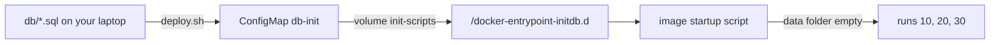

## Bạn cần biết trước

- [[k8s.l1.secrets]] — bạn biết ConfigMap và Secret trao giá trị cho container thành biến môi trường lúc container khởi động ra sao.
- [[devops.l1.volumes]] — bạn biết container thấy volume hay bind mount như một thư mục, và `schema.sql`, `seed.sql` chỉ chạy khi thư mục dữ liệu của PostgreSQL còn trống.

## Tình huống

Trong Compose, container `db` tìm thấy init script nhờ ba bind mount đưa file từ thư mục `db/` trong repository của bạn vào bên trong nó. PostgreSQL chạy chúng ở lần khởi động đầu, và database có đủ bảng cùng tám sản phẩm. Trên cluster, Pod `db` chạy trên một worker node, với Pod thì đó là một máy riêng. Node đó không có bản sao repository của bạn, nên chẳng có thư mục `db/` nào để mount. Biến môi trường cũng không giúp được: PostgreSQL cần file, không cần biến. Vậy làm sao ba file SQL trên laptop của bạn trở thành file bên trong container `db`?

## Khái niệm cốt lõi

- Volume từ ConfigMap — một volume của Pod, khai báo dưới `volumes`, có nội dung lấy từ một ConfigMap: mỗi key thành một file đặt tên theo key, chứa giá trị của key đó.
- `volumeMounts` — danh sách, nằm dưới một container, các volume mà nó thấy và thư mục (`mountPath`) nơi mỗi volume hiện ra.
- `/docker-entrypoint-initdb.d` — thư mục mà image PostgreSQL tìm script để chạy khi thư mục dữ liệu còn trống.

## Cơ chế hoạt động



Trong tình huống trên, file không thể đến từ một thư mục trên node, vì ở đó không có. Thay vào đó chúng đi qua API server: một script trên laptop đọc ba file SQL và cất chúng thành một ConfigMap, `db-init`, mỗi file một key. Key là tên file mà container sẽ thấy, còn giá trị là toàn bộ nội dung file. Giá trị của ConfigMap có thể là cả một script SQL, không chỉ là giá trị ngắn như số port.

Sau đó Pod `db` khai báo một volume dựng từ ConfigMap đó, và container của nó mount volume tại `/docker-entrypoint-initdb.d`. Khi Pod khởi động trên một node, kubelet ở đó lấy ConfigMap về và ghi từng key ra thành file trong volume. PostgreSQL thấy ba file bình thường.

Từ đây, quy tắc bạn biết từ Compose áp dụng y nguyên. Script khởi động của image nhìn vào thư mục dữ liệu. Nếu thư mục trống, nó tạo database và chạy các script trong `/docker-entrypoint-initdb.d` theo thứ tự tên; các số `10-`, `20-`, `30-` ở đầu tên file đưa schema lên trước. Nếu thư mục dữ liệu đã có database, nó không chạy gì.

Có một điểm khác với việc thêm file vào thư mục: volume mount lên một thư mục sẽ thay thứ container thấy ở đó. Bên trong container, `ls /docker-entrypoint-initdb.d` liệt kê đúng các key của ConfigMap. Mọi thứ chính image có trong thư mục đó bị che đi khi volume đang được mount; image PostgreSQL để thư mục này trống, nên ở đây không mất gì.

## Trong hệ thống Đơn Hàng

`scripts/k8s/deploy.sh` dựng ConfigMap bằng `kubectl create configmap db-init`, mỗi file một `--from-file=10-schema.sql=db/schema.sql`, giống cách `secrets.sh` dựng Secret: `--dry-run=client -o yaml` chỉ viết object ra, còn `kubectl apply` gửi nó đi. Ba key là `10-schema.sql`, `20-seed.sql` và `30-migrations-baseline.sql`; file cuối ghi vào database rằng migration đầu tiên đã được áp dụng, nên bước migration về sau bỏ qua nó. Không ai phải chép tay SQL vào YAML. Sau đó container `db` trong `deploy/k8s/db.yaml` mount nó:

```yaml file=deploy/k8s/db.yaml tag=stage-2 lines=44-60
          # lesson: k8s.l1.configmap-files
          # Each key of the ConfigMap db-init (built by scripts/k8s/deploy.sh
          # from the files in db/) appears as a file in
          # /docker-entrypoint-initdb.d, where the PostgreSQL image looks for
          # scripts to run when its data directory is empty. The folder shows
          # only those files.
          volumeMounts:
            - name: init-scripts
              mountPath: /docker-entrypoint-initdb.d
            - name: data
              mountPath: /var/lib/postgresql/data
      volumes:
        - name: init-scripts
          configMap:
            name: db-init
        - name: data
          emptyDir: {}
```

Hai danh sách gặp nhau qua tên. Dưới `volumes` của Pod, `init-scripts` là một volume dựng từ ConfigMap `db-init`. Dưới `volumeMounts` của container, cùng cái tên đó đặt nó tại `/docker-entrypoint-initdb.d`. Volume thứ hai, `data`, chứa chính database; bài sau sẽ xem tới nó. `scripts/k8s/configmap-files.sh` cho thấy kết quả bên trong container `db` đang chạy:

```bash file=scripts/k8s/configmap-files.sh tag=stage-2 lines=14-24
# lesson: k8s.l1.configmap-files
# One key per file of db/ that deploy.sh read; each key is a file name.
show kubectl get configmap db-init -n donhang
echo
# Mounted on /docker-entrypoint-initdb.d: one file per key, nothing else.
show kubectl exec deployment/db -n donhang -- ls /docker-entrypoint-initdb.d
show kubectl exec deployment/db -n donhang -- head -n 4 /docker-entrypoint-initdb.d/10-schema.sql
echo
# The data directory was empty when this db Pod started, so the image ran them.
echo "\$ kubectl logs deployment/db -n donhang | grep 'running /docker-entrypoint-initdb.d'"
kubectl logs deployment/db -n donhang | grep 'running /docker-entrypoint-initdb.d'
```

`show` in lệnh ra trước khi chạy nó. Output:

```text output=true
$ kubectl get configmap db-init -n donhang
NAME      DATA   AGE
db-init   3      ...

$ kubectl exec deployment/db -n donhang -- ls /docker-entrypoint-initdb.d
10-schema.sql
20-seed.sql
30-migrations-baseline.sql
$ kubectl exec deployment/db -n donhang -- head -n 4 /docker-entrypoint-initdb.d/10-schema.sql
-- The whole Đơn Hàng database at stage-0. Money is stored in whole đồng, so
-- every amount is an integer. Times are stored with a time zone, always.

CREATE TABLE products (

$ kubectl logs deployment/db -n donhang | grep 'running /docker-entrypoint-initdb.d'
/usr/local/bin/docker-entrypoint.sh: running /docker-entrypoint-initdb.d/10-schema.sql
/usr/local/bin/docker-entrypoint.sh: running /docker-entrypoint-initdb.d/20-seed.sql
/usr/local/bin/docker-entrypoint.sh: running /docker-entrypoint-initdb.d/30-migrations-baseline.sql
```

`DATA 3` đếm số key của ConfigMap. `ls` liệt kê đúng ba tên đó, và các dòng đầu của `10-schema.sql` chính là các dòng đầu của `db/schema.sql`. Log cho thấy script khởi động của PostgreSQL chạy cả ba, theo thứ tự tên, vì thư mục dữ liệu còn trống khi container này khởi động. Nếu container đã khởi động lại từ đó, thư mục dữ liệu của nó đã có database, nên log ghi `Skipping initialization` và lệnh grep không in gì.

## Người mới hay nghĩ rằng…

- **"Kubernetes mount được thư mục trên laptop vào Pod, như Compose."** → Thực ra Pod chạy trên một node không có bản sao repository của bạn, nên chẳng có thư mục nào để mount; file trên laptop phải được gửi qua API server, chẳng hạn trong một ConfigMap. Bạn sẽ nhận ra khi `deploy.sh` phải đọc `db/` trên laptop và dựng `db-init` trước thì Pod `db` mới khởi động được cùng các script của nó.
- **"ConfigMap chỉ chứa được giá trị ngắn như một địa chỉ, không chứa nổi cả file SQL."** → Thực ra một giá trị có thể là cả một file; `db-init` chứa ba script SQL, mỗi key một script. Bạn sẽ nhận ra khi `head` bên trong container in ra phần đầu của `schema.sql`.
- **"Mount ConfigMap lên một thư mục sẽ thêm file của nó cạnh các file đã có."** → Thực ra thư mục khi đó chỉ hiện file của ConfigMap; thứ image có ở đó bị che đi. Với image này thư mục vốn trống, nên ở đây không mất gì. Bạn sẽ nhận ra quy tắc khi muốn thêm một file nữa vào đó: nó chỉ xuất hiện nếu trở thành một key của `db-init`.

## Thử ngay (3 phút)

Với backend đang chạy trong `donhang`, trong thư mục `don-hang`:

1. Chạy `kubectl exec deployment/db -n donhang -- head -n 3 /docker-entrypoint-initdb.d/20-seed.sql`.
2. Chạy `head -n 3 db/seed.sql`.

Kết quả mong đợi: cả hai in cùng ba dòng, bắt đầu bằng `-- Fixed data for the lab: 8 products, 5 customers`. File bên trong container là key `20-seed.sql` của `db-init`, giá trị mà `deploy.sh` đọc từ `db/seed.sql`.

## Liên hệ

- [[k8s.l1.configmaps]] — vẫn loại object đó, nhưng trao cho container thành biến môi trường thay vì file.
- [[devops.l1.volumes]] — các bind mount mà cách này thay thế, và quy tắc thư mục dữ liệu trống vẫn quyết định script có chạy hay không.
- [[k8s.l1.deploying-don-hang]] — bài tiếp: cả backend theo đúng thứ tự, gồm cả volume `data` của `db` và chuyện gì xảy ra khi Pod `db` bị thay.

## Tóm tắt 5 dòng

1. ConfigMap được mount thành volume sẽ hiện mỗi key của nó thành một file bên trong container.
2. Node không có bản sao repository của bạn, nên file tới Pod qua API server, chẳng hạn trong một ConfigMap.
3. `deploy.sh` dựng `db-init` từ ba file trong `db/`; Pod `db` mount nó tại `/docker-entrypoint-initdb.d`.
4. PostgreSQL chỉ chạy các script đó khi thư mục dữ liệu còn trống, như trong Compose.
5. ConfigMap mount lên một thư mục chỉ hiện file của chính nó; thứ image có ở đó bị che đi.
