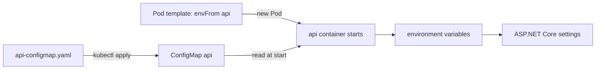

## Before you start

- [[k8s.l1.rolling-updates]] — you know that a change to a Deployment's Pod template replaces its Pods a few at a time, and that nothing else does.
- [[devops.l1.config-and-env]] — you know the api reads its settings from environment variables, where `Smtp__Port` stands for the setting `Smtp:Port`.
- [[devops.l1.twelve-factor-config]] — you know the image holds none of the settings that differ between environments.

## The situation

In k8s/workloads, the api Deployment carried its settings as `env` lines written into the manifest itself. Now the whole backend is moving onto the cluster, and the api also needs Mailpit, the mail server it sends its emails to, next to the Redis and Keycloak addresses it already had. In Compose, those values sat in `docker-compose.yml`, next to the image name, and the image held none of them. You could keep writing them into the Deployment, but then the settings and the description of the Pods would be one file, changed together. Where on the cluster can the api's settings live on their own, and when does a running api see a changed value?

## Core concepts

- **ConfigMap** — a Kubernetes object that stores settings that are not secret as key–value pairs under `data`, apart from any Pod or image.
- `envFrom` — a field of a container in a Pod template; with a `configMapRef`, it turns every key of that ConfigMap into an environment variable of the container.
- `kubectl rollout restart` — a command that makes a Deployment replace all its Pods through a rolling update, without changing their image.

## How it works



In the situation above, the settings move out of the Deployment into a ConfigMap named `api`. `kubectl apply` sends `api-configmap.yaml` to the API server, which stores the ConfigMap like any other object. No image and no Pod contains it.

The api Deployment's Pod template names that ConfigMap under the api container, with `envFrom` and a `configMapRef`. When a new api container starts, the kubelet reads the ConfigMap and gives the container one environment variable per key. ASP.NET Core then reads them exactly as it read Compose's: `Smtp__Port` becomes the setting `Smtp:Port`. The image is the same one, and only the values around it come from the cluster.

The values are copied once, when the container starts. Kubernetes does not update the environment variables of a running container. So when you apply a ConfigMap with a new value, the running api containers keep the old one.

Nothing else happens either. The ConfigMap is a separate object, and the Pod template still says the same thing: it names the ConfigMap, not its values. The Deployment sees no change, so it starts no rolling update.

To make the api use a new value, replace its Pods. `kubectl rollout restart deployment/api` does that, a few Pods at a time, and each new container reads the ConfigMap as it is now. Any other rolling update, such as one for a new image tag, has the same effect.

## In the Đơn Hàng system

The api's ConfigMap, `deploy/k8s/api-configmap.yaml`:

```yaml file=deploy/k8s/api-configmap.yaml tag=stage-2 lines=1-16
# lesson: k8s.l1.configmaps
# The api's settings that are not secret, under the environment variable
# names it already reads in docker-compose.yml. The hosts are the names of
# Services in this namespace. The connection string to PostgreSQL holds a
# password, so it is in the Secret api instead (scripts/k8s/secrets.sh).
apiVersion: v1
kind: ConfigMap
metadata:
  name: api
  namespace: donhang
data:
  ConnectionStrings__Redis: "redis:6379,abortConnect=false"
  Smtp__Host: "mailpit"
  Smtp__Port: "1025"
  Keycloak__Authority: "http://localhost:8180/realms/donhang"
  Keycloak__MetadataAddress: "http://keycloak:8080/realms/donhang/.well-known/openid-configuration"
```

A ConfigMap has no `spec` (the part of most manifests that describes the desired state); its five keys sit under `data`, with the same names and values as in `docker-compose.yml`. Values under `data` must be strings. That is why `"1025"` is quoted: without quotes YAML reads it as a number, and the API server rejects the ConfigMap. The hosts are Service names, with one exception. `Keycloak__Authority` is the issuer address that Keycloak, the authorization server, writes into tokens; the api reaches Keycloak through `Keycloak__MetadataAddress`. The connection string to PostgreSQL is missing on purpose: it holds the password, and the next lesson gives it its own object.

In `deploy/k8s/api.yaml`, the api container brings the ConfigMap in with three lines: `envFrom:`, then `- configMapRef:` with `name: api`. `scripts/k8s/configmap.sh` shows what that does, and what a change does:

```bash file=scripts/k8s/configmap.sh tag=stage-2 lines=13-33
# lesson: k8s.l1.configmaps
# Its data, one key=value per line, keys sorted (a Go template over .data).
echo "\$ kubectl get configmap api -n donhang -o go-template='{{range \$key, \$value := .data}}{{\$key}}={{\$value}}{{\"\\n\"}}{{end}}'"
kubectl get configmap api -n donhang -o go-template='{{range $key, $value := .data}}{{$key}}={{$value}}{{"\n"}}{{end}}'
# envFrom turned each key into an environment variable of the api container.
show kubectl exec deployment/api -n donhang -- printenv Smtp__Host Smtp__Port
echo

# Change one value. The Deployment does not change, so nothing is rolled
# out, and the running containers keep the values they started with.
before=$(generation)
echo "\$ kubectl apply -f - (api-configmap.yaml with Smtp__Port: \"2525\")"
sed 's/Smtp__Port: "1025"/Smtp__Port: "2525"/' deploy/k8s/api-configmap.yaml | kubectl apply -f -
echo "The api Deployment changed: $([ "$(generation)" = "$before" ] && echo no || echo yes)"
show kubectl exec deployment/api -n donhang -- printenv Smtp__Port
echo

# New Pods read the ConfigMap as it is now.
show kubectl rollout restart deployment/api -n donhang
kubectl rollout status deployment/api -n donhang --timeout=300s >/dev/null
show kubectl exec deployment/api -n donhang -- printenv Smtp__Port
```

`show` prints a command before running it. `kubectl exec deployment/api -- printenv` runs `printenv` inside the container of one api Pod; `printenv NAME` prints the value of the environment variable `NAME`. The `echo` lines print commands that `show` cannot print as they are, and `sed` swaps `1025` for `2525` before the file reaches `kubectl apply`. `generation` reads the Deployment's `.metadata.generation`, a number that goes up whenever its spec changes. Its output:

```text output=true
$ kubectl get configmap api -n donhang -o go-template='{{range $key, $value := .data}}{{$key}}={{$value}}{{"\n"}}{{end}}'
ConnectionStrings__Redis=redis:6379,abortConnect=false
Keycloak__Authority=http://localhost:8180/realms/donhang
Keycloak__MetadataAddress=http://keycloak:8080/realms/donhang/.well-known/openid-configuration
Smtp__Host=mailpit
Smtp__Port=1025
$ kubectl exec deployment/api -n donhang -- printenv Smtp__Host Smtp__Port
mailpit
1025

$ kubectl apply -f - (api-configmap.yaml with Smtp__Port: "2525")
configmap/api configured
The api Deployment changed: no
$ kubectl exec deployment/api -n donhang -- printenv Smtp__Port
1025

$ kubectl rollout restart deployment/api -n donhang
deployment.apps/api restarted
$ kubectl exec deployment/api -n donhang -- printenv Smtp__Port
2525

$ kubectl apply -f deploy/k8s/api-configmap.yaml
configmap/api configured
```

After the apply the ConfigMap holds `2525`, yet the running api still prints `1025`, and the Deployment did not change. Only the Pods that `rollout restart` created print `2525`. After the lines shown, the script puts the file from Git back (the last two lines) and restarts the api once more.

## Beginners often think…

- **"Once I apply a new ConfigMap, the running api Pods pick up the new values at once."** → Actually environment variables are set when a container starts, and Kubernetes does not change them afterwards. You notice this when `printenv Smtp__Port` still prints `1025` after the apply.
- **"A ConfigMap is a file that gets copied into the image when it is built."** → Actually it is an object the API server stores, and the kubelet hands its values to each container as it starts. You notice this when a new value reaches the api through `rollout restart` alone, with no build and the same image.
- **"Nobody can read what is in a ConfigMap, so the database password can go there too."** → Actually a ConfigMap offers no secrecy: anyone allowed to read ConfigMaps in `donhang` can print every value, as the script does. You notice this when `kubectl get configmap api -n donhang -o yaml` shows each value in plain text, which is why the connection string is not in it.

## Try it (3 minutes)

In the `don-hang` folder, if `kubectl get deployment api -n donhang` finds nothing, run `scripts/k8s/configmap.sh` once: it deploys the backend first, which can take several minutes, and a later lesson explains how. The 3 minutes start once the backend runs.

1. Run `kubectl get configmap api -n donhang -o yaml`.
2. Run `kubectl exec deployment/api -n donhang -- printenv Keycloak__MetadataAddress`.

Expected result: step 1 prints the ConfigMap with the same five keys under `data` as `api-configmap.yaml`, in plain text. Step 2 prints the same value that step 1 shows for `Keycloak__MetadataAddress`.

## Connections

- [[k8s.l1.deploying-an-image-tag]] — the `env` lines written into the manifest there are what this ConfigMap replaces.
- [[devops.l1.config-and-env]] — the same settings under the same names; here a cluster object holds them instead of `docker-compose.yml`.
- [[k8s.l1.secrets]] — next: the connection string with the password, which this ConfigMap leaves out.

## Five-line summary

1. A ConfigMap keeps settings that are not secret as a cluster object, so the same image runs with the cluster's values.
2. `deploy/k8s/api-configmap.yaml` holds the api's Redis, Mailpit and Keycloak settings under the names it reads in Compose.
3. `envFrom` with a `configMapRef` turns every key into an environment variable when the api container starts.
4. A changed ConfigMap reaches the api only in containers started after the change, such as the new Pods of `kubectl rollout restart`.
5. Applying a ConfigMap leaves the Deployment's Pod template unchanged, so it starts no rolling update.
