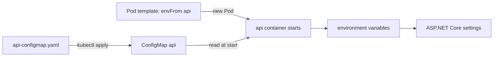

## Bạn cần biết trước

- [[k8s.l1.rolling-updates]] — bạn biết rằng đổi Pod template của một Deployment sẽ thay các Pod của nó từng ít một, và ngoài cách đó thì không gì làm được điều này.
- [[devops.l1.config-and-env]] — bạn biết api đọc setting từ biến môi trường, trong đó `Smtp__Port` ứng với setting `Smtp:Port`.
- [[devops.l1.twelve-factor-config]] — bạn biết image không chứa setting nào thay đổi giữa các môi trường.

## Tình huống

Ở k8s/workloads, Deployment api mang setting của nó dưới dạng các dòng `env` viết thẳng trong manifest. Giờ cả backend chuyển lên cluster, và api cần thêm Mailpit, mail server mà nó gửi email tới, bên cạnh địa chỉ Redis và Keycloak đã có. Trong Compose, các giá trị này nằm trong `docker-compose.yml`, cạnh tên image, còn image không chứa giá trị nào. Bạn có thể tiếp tục viết chúng vào Deployment, nhưng khi đó setting và phần mô tả Pod thành một file, phải sửa cùng nhau. Trên cluster, setting của api có thể nằm riêng ở đâu, và khi nào một api đang chạy thấy được giá trị đã đổi?

## Khái niệm cốt lõi

- **ConfigMap** (Object Kubernetes chứa cấu hình không bí mật dạng key–value, đưa vào Pod thành biến môi trường hoặc file) — object Kubernetes lưu các setting không bí mật thành cặp key–value dưới `data`, tách khỏi mọi Pod và image.
- `envFrom` — một trường của container trong Pod template; đi kèm `configMapRef`, nó biến mọi key của ConfigMap đó thành biến môi trường của container.
- `kubectl rollout restart` — lệnh khiến một Deployment thay toàn bộ Pod của nó qua một rolling update, không đổi image.

## Cơ chế hoạt động



Trong tình huống trên, setting chuyển ra khỏi Deployment, vào một ConfigMap tên `api`. `kubectl apply` gửi `api-configmap.yaml` tới API server, nơi lưu ConfigMap như mọi object khác. Không image hay Pod nào chứa nó.

Pod template của Deployment api nêu tên ConfigMap đó dưới container api, bằng `envFrom` và một `configMapRef`. Khi một container api mới khởi động, kubelet đọc ConfigMap và cho container một biến môi trường ứng với mỗi key. Sau đó ASP.NET Core đọc chúng y như đọc biến của Compose: `Smtp__Port` thành setting `Smtp:Port`. Image vẫn là image cũ, chỉ các giá trị quanh nó đến từ cluster.

Giá trị được chép một lần, lúc container khởi động. Kubernetes không cập nhật biến môi trường của container đang chạy. Nên khi bạn apply một ConfigMap có giá trị mới, các container api đang chạy vẫn giữ giá trị cũ.

Cũng không có gì khác xảy ra. ConfigMap là một object riêng, và Pod template vẫn nói đúng điều cũ: nó nêu tên ConfigMap, không nêu giá trị. Deployment không thấy thay đổi nào, nên không bắt đầu rolling update.

Muốn api dùng giá trị mới, hãy thay các Pod của nó. `kubectl rollout restart deployment/api` làm điều đó, mỗi lần vài Pod, và mỗi container mới đọc ConfigMap như hiện tại. Bất kỳ rolling update nào khác, như khi đổi sang tag image mới, cũng có tác dụng tương tự.

## Trong hệ thống Đơn Hàng

ConfigMap của api, `deploy/k8s/api-configmap.yaml`:

```yaml file=deploy/k8s/api-configmap.yaml tag=stage-2 lines=1-16
# lesson: k8s.l1.configmaps
# The api's settings that are not secret, under the environment variable
# names it already reads in docker-compose.yml. The hosts are the names of
# Services in this namespace. The connection string to PostgreSQL holds a
# password, so it is in the Secret api instead (scripts/k8s/secrets.sh).
apiVersion: v1
kind: ConfigMap
metadata:
  name: api
  namespace: donhang
data:
  ConnectionStrings__Redis: "redis:6379,abortConnect=false"
  Smtp__Host: "mailpit"
  Smtp__Port: "1025"
  Keycloak__Authority: "http://localhost:8180/realms/donhang"
  Keycloak__MetadataAddress: "http://keycloak:8080/realms/donhang/.well-known/openid-configuration"
```

ConfigMap không có `spec` (phần mô tả desired state trong hầu hết manifest); năm key của nó nằm dưới `data`, cùng tên và cùng giá trị như trong `docker-compose.yml`. Giá trị dưới `data` phải là chuỗi. Vì thế `"1025"` có dấu nháy: thiếu nháy, YAML đọc nó thành số, và API server từ chối ConfigMap. Các host là tên Service, trừ một ngoại lệ. `Keycloak__Authority` là địa chỉ issuer mà Keycloak, authorization server, ghi vào token; api tìm tới Keycloak qua `Keycloak__MetadataAddress`. Connection string tới PostgreSQL cố ý bị bỏ ra: nó chứa mật khẩu, và bài sau cho nó một object riêng.

Trong `deploy/k8s/api.yaml`, container api đưa ConfigMap vào bằng ba dòng: `envFrom:`, rồi `- configMapRef:` với `name: api`. `scripts/k8s/configmap.sh` cho thấy chúng làm gì, và khi đổi giá trị thì sao:

```bash file=scripts/k8s/configmap.sh tag=stage-2 lines=13-33
# lesson: k8s.l1.configmaps
# Its data, one key=value per line, keys sorted (a Go template over .data).
echo "\$ kubectl get configmap api -n donhang -o go-template='{{range \$key, \$value := .data}}{{\$key}}={{\$value}}{{\"\\n\"}}{{end}}'"
kubectl get configmap api -n donhang -o go-template='{{range $key, $value := .data}}{{$key}}={{$value}}{{"\n"}}{{end}}'
# envFrom turned each key into an environment variable of the api container.
show kubectl exec deployment/api -n donhang -- printenv Smtp__Host Smtp__Port
echo

# Change one value. The Deployment does not change, so nothing is rolled
# out, and the running containers keep the values they started with.
before=$(generation)
echo "\$ kubectl apply -f - (api-configmap.yaml with Smtp__Port: \"2525\")"
sed 's/Smtp__Port: "1025"/Smtp__Port: "2525"/' deploy/k8s/api-configmap.yaml | kubectl apply -f -
echo "The api Deployment changed: $([ "$(generation)" = "$before" ] && echo no || echo yes)"
show kubectl exec deployment/api -n donhang -- printenv Smtp__Port
echo

# New Pods read the ConfigMap as it is now.
show kubectl rollout restart deployment/api -n donhang
kubectl rollout status deployment/api -n donhang --timeout=300s >/dev/null
show kubectl exec deployment/api -n donhang -- printenv Smtp__Port
```

`show` in lệnh ra trước khi chạy nó. `kubectl exec deployment/api -- printenv` chạy `printenv` bên trong container của một Pod api; `printenv NAME` in giá trị của biến môi trường `NAME`. Các dòng `echo` in những lệnh mà `show` không in nguyên dạng được, còn `sed` đổi `1025` thành `2525` trước khi file tới `kubectl apply`. `generation` đọc `.metadata.generation` của Deployment, con số tăng mỗi khi spec của nó đổi. Output:

```text output=true
$ kubectl get configmap api -n donhang -o go-template='{{range $key, $value := .data}}{{$key}}={{$value}}{{"\n"}}{{end}}'
ConnectionStrings__Redis=redis:6379,abortConnect=false
Keycloak__Authority=http://localhost:8180/realms/donhang
Keycloak__MetadataAddress=http://keycloak:8080/realms/donhang/.well-known/openid-configuration
Smtp__Host=mailpit
Smtp__Port=1025
$ kubectl exec deployment/api -n donhang -- printenv Smtp__Host Smtp__Port
mailpit
1025

$ kubectl apply -f - (api-configmap.yaml with Smtp__Port: "2525")
configmap/api configured
The api Deployment changed: no
$ kubectl exec deployment/api -n donhang -- printenv Smtp__Port
1025

$ kubectl rollout restart deployment/api -n donhang
deployment.apps/api restarted
$ kubectl exec deployment/api -n donhang -- printenv Smtp__Port
2525

$ kubectl apply -f deploy/k8s/api-configmap.yaml
configmap/api configured
```

Sau lệnh apply, ConfigMap giữ `2525`, vậy mà api đang chạy vẫn in `1025`, và Deployment không đổi. Chỉ các Pod do `rollout restart` tạo ra mới in `2525`. Sau các dòng được trích, script đặt lại file trong Git (hai dòng cuối) và restart api thêm một lần.

## Người mới hay nghĩ rằng…

- **"Apply ConfigMap mới xong là các Pod api đang chạy nhận giá trị mới ngay."** → Thực ra biến môi trường được đặt lúc container khởi động, và Kubernetes không đổi chúng sau đó. Bạn sẽ nhận ra khi `printenv Smtp__Port` vẫn in `1025` sau lệnh apply.
- **"ConfigMap là một file được chép vào image lúc build."** → Thực ra nó là object do API server lưu, và kubelet trao giá trị của nó cho từng container lúc container khởi động. Bạn sẽ nhận ra khi giá trị mới tới được api chỉ nhờ `rollout restart`, không build gì và vẫn image cũ.
- **"Không ai đọc được nội dung ConfigMap, nên mật khẩu database cũng để vào đó được."** → Thực ra ConfigMap không giữ bí mật gì: ai được phép đọc ConfigMap trong `donhang` đều in được mọi giá trị, như script đã làm. Bạn sẽ nhận ra khi `kubectl get configmap api -n donhang -o yaml` hiện từng giá trị dạng chữ thường, và đó là lý do connection string không nằm trong nó.

## Thử ngay (3 phút)

Trong thư mục `don-hang`, nếu `kubectl get deployment api -n donhang` không tìm thấy gì, hãy chạy `scripts/k8s/configmap.sh` một lần: nó deploy backend trước, có thể mất vài phút, và một bài sau sẽ giải thích cách làm. 3 phút bắt đầu tính khi backend đã chạy.

1. Chạy `kubectl get configmap api -n donhang -o yaml`.
2. Chạy `kubectl exec deployment/api -n donhang -- printenv Keycloak__MetadataAddress`.

Kết quả mong đợi: bước 1 in ConfigMap với đúng năm key dưới `data` như trong `api-configmap.yaml`, dạng chữ thường. Bước 2 in đúng giá trị mà bước 1 hiện cho `Keycloak__MetadataAddress`.

## Liên hệ

- [[k8s.l1.deploying-an-image-tag]] — các dòng `env` viết trong manifest ở bài đó chính là thứ ConfigMap này thay thế.
- [[devops.l1.config-and-env]] — vẫn những setting đó, cùng tên; ở đây một object của cluster giữ chúng thay cho `docker-compose.yml`.
- [[k8s.l1.secrets]] — bài tiếp: connection string có mật khẩu, thứ ConfigMap này bỏ ra.

## Tóm tắt 5 dòng

1. ConfigMap giữ setting không bí mật thành một object của cluster, nên cùng một image chạy với giá trị của cluster.
2. `deploy/k8s/api-configmap.yaml` giữ setting Redis, Mailpit và Keycloak của api, dưới đúng tên api đọc trong Compose.
3. `envFrom` với `configMapRef` biến mọi key thành biến môi trường khi container api khởi động.
4. ConfigMap đã đổi chỉ tới được api trong các container khởi động sau thay đổi, như Pod mới của `kubectl rollout restart`.
5. Apply một ConfigMap không đổi Pod template của Deployment, nên không bắt đầu rolling update nào.
