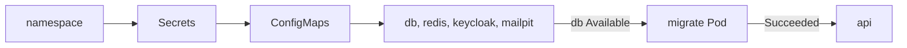

## Before you start

- [[k8s.l1.configmap-files]] — you know the `db` Pod gets its three init scripts from the ConfigMap `db-init`, and runs them only on an empty data folder.
- [[k8s.l1.service-and-dns]] — you know a Pod reaches a Service in its namespace by the Service's name.
- [[devops.l2.migrations-in-the-pipeline]] — you know Compose runs the migration bundle once, in its own `migrate` step, and starts `api` only after it succeeds.

## The situation

The api's ConfigMap and Secrets exist, and `db-init` is ready. What is missing is everything they are for: PostgreSQL, Redis, Keycloak (the authorization server), Mailpit (the mail server the api sends emails to), the migration, and the api itself. In Compose, one `docker compose up` starts them in the right order, runs `migrate` before `api`, and publishes ports so your browser reaches the api through Caddy. On the cluster, nothing knows that order yet, and no port is published. How does the whole backend get onto the cluster in the right order, and how do you check that it answers when nothing outside the cluster can reach it?

## Core concepts

- `restartPolicy: Never` — a Pod setting that makes the kubelet leave a container that has stopped instead of starting it again; the Pod ends `Succeeded` or `Failed`.
- `emptyDir` — a volume that starts empty when its Pod is placed on a node and is deleted with the Pod; a restarted container in the same Pod still sees it.
- `kubectl wait --for=condition=Available` — a command that waits until a Deployment reports enough ready Pods, or gives up after `--timeout`.

## How it works



In the situation above, one script does what `docker compose up` did, as a list of `kubectl apply` steps. Each step can run again: `apply` leaves an object that is already right unchanged. The order follows what each step needs. After the namespace `donhang`, Secrets and ConfigMaps come first, because a container that refers to a missing one cannot start.

Next come the four backing services. Each one runs from the same image Compose uses, as a Deployment with one replica, plus a Service named after the Compose service: `db`, `redis`, `keycloak`, `mailpit`. Since the cluster DNS answers those names, the host names in the api's settings stay the same as in Compose. The script waits until `db` is available.

Then the migration runs, as a Pod that runs the migration bundle at the api's tag. With `restartPolicy: Never`, the kubelet does not start the finished container again, so the bundle runs once per deploy, and the Pod ends `Succeeded` or `Failed`. The script applies the api only after `Succeeded`, as Compose starts `api` only after `migrate` succeeded.

PostgreSQL keeps its data in an `emptyDir` volume. It survives a restart of the `db` container, but when the `db` Pod is replaced, the new Pod gets a new, empty volume. PostgreSQL then runs the three init scripts again, and everything written since, such as orders, is gone.

Finally, the Services are reachable only from inside the cluster. To check the api, a temporary Pod in `donhang` calls it by its Service name.

## In the Đơn Hàng system

The second half of `scripts/k8s/deploy.sh`, after the namespace, the Secrets and the ConfigMaps:

```bash file=scripts/k8s/deploy.sh tag=stage-2 lines=32-56
# lesson: k8s.l1.deploying-don-hang
echo "== PostgreSQL, Redis, Keycloak and Mailpit, each with its Service"
kubectl apply -f deploy/k8s/db.yaml -f deploy/k8s/redis.yaml \
  -f deploy/k8s/keycloak.yaml -f deploy/k8s/mailpit.yaml -o name
kubectl wait --for=condition=Available deployment/db -n donhang --timeout=300s

# The migration runs once per deploy: a new Pod each time, and the api is
# applied only once it has ended Succeeded.
echo "== the migration"
kubectl delete pod migrate -n donhang --ignore-not-found >/dev/null
kubectl apply -f deploy/k8s/migrate/migrate-pod.yaml -o name
phase=Pending
for _ in $(seq 300); do
  phase=$(kubectl get pod migrate -n donhang -o jsonpath='{.status.phase}')
  [ "$phase" = Succeeded ] || [ "$phase" = Failed ] && break
  sleep 1
done
echo "pod/migrate ended: $phase"
if [ "$phase" != Succeeded ]; then
  kubectl logs pod/migrate -n donhang >&2 || true
  exit 1
fi

echo "== the api"
kubectl apply -f deploy/k8s/api.yaml -o name
```

The script deletes the old `migrate` Pod first, so each deploy runs the migration in a new one. It then reads the Pod's `.status.phase` once a second, for up to 300 seconds, until it is `Succeeded` or `Failed`; on `Failed` it prints the Pod's log and stops before the api.

`deploy/k8s/migrate/migrate-pod.yaml` sets `restartPolicy: Never` and the image `ghcr.io/duyan11110/donhang-migrate:1.0.0`, with the same tag, `1.0.0`, as the api image in `api.yaml`. Not shown: the last lines wait up to 300 seconds for the api's rollout, which prints `successfully rolled out`, then up to 600 seconds for every Deployment, because Keycloak starts slowest. Its output:

```text output=true
== namespace
namespace/donhang
== Secrets, from .env (scripts/k8s/secrets.sh)
secret/api
secret/db
secret/keycloak
== ConfigMaps
configmap/db-init
configmap/keycloak-realm
configmap/api
== PostgreSQL, Redis, Keycloak and Mailpit, each with its Service
deployment.apps/db
service/db
deployment.apps/redis
service/redis
deployment.apps/keycloak
service/keycloak
deployment.apps/mailpit
service/mailpit
deployment.apps/db condition met
== the migration
pod/migrate
pod/migrate ended: Succeeded
== the api
deployment.apps/api
service/api
deployment "api" successfully rolled out
deployment.apps/api condition met
deployment.apps/db condition met
deployment.apps/keycloak condition met
deployment.apps/mailpit condition met
deployment.apps/redis condition met
```

`-o name` prints each object once, whether it was created or left unchanged, so a second run prints the same lines. `scripts/k8s/smoke-test.sh` then checks the result:

```bash file=scripts/k8s/smoke-test.sh tag=stage-2 lines=12-25
# lesson: k8s.l1.deploying-don-hang
# migrate shows Completed: it ran once and stopped, as restartPolicy: Never says.
show kubectl get pods -n donhang
echo

# Nothing outside the cluster reaches the api. A Pod inside it asks the
# Service api by name; wget exits non-zero (and so does this script) unless
# the answer is a 2xx.
echo "== GET http://api:8080/api/v1/products, from a temporary Pod in donhang"
# (When the Pod ends before kubectl attaches to it, kubectl warns and reads
# its log instead: the same output, so the warning is dropped.)
kubectl run smoke-test --rm -i --restart=Never --quiet -n donhang --image=caddy:2.10.0 -- \
  wget -q -O - http://api:8080/api/v1/products 2>&1 | sed "/^warning: couldn't attach/d"
echo
```

`kubectl run --rm -i --restart=Never` starts a one-off Pod, prints what it writes, and deletes it afterwards. It uses the Caddy image only because that image contains `wget`. `wget` sends a `GET` request to the URL and prints the response body; `show` prints a command before running it. Its output:

```text output=true
$ kubectl get pods -n donhang
NAME               READY   STATUS      RESTARTS   AGE
api-...-...        1/1     Running     0          ...
api-...-...        1/1     Running     0          ...
db-...-...         1/1     Running     0          ...
keycloak-...-...   1/1     Running     0          ...
mailpit-...-...    1/1     Running     0          ...
migrate            0/1     Completed   0          ...
redis-...-...      1/1     Running     0          ...

== GET http://api:8080/api/v1/products, from a temporary Pod in donhang
[{"id":1,"name":"Bàn phím cơ","priceVnd":1250000},{"id":2,"name":"Chuột không dây","priceVnd":450000},{"id":3,"name":"Tai nghe","priceVnd":890000},{"id":4,"name":"Màn hình 24 inch","priceVnd":3200000},{"id":5,"name":"Giá đỡ laptop","priceVnd":320000},{"id":6,"name":"Ổ cứng SSD 512GB","priceVnd":1450000},{"id":7,"name":"Webcam 720p","priceVnd":560000},{"id":8,"name":"Đèn bàn LED","priceVnd":280000}]
```

`migrate` shows `Completed`, which is how `kubectl get pods` shows the phase `Succeeded`, with `0/1` ready: its container ran and stopped, and nothing restarted it. The eight products come from `seed.sql`, through PostgreSQL, the api and the Service `api`.

## Beginners often think…

- **"Running PostgreSQL as a Deployment keeps its data safe, since the Deployment brings the Pod back."** → Actually the Deployment brings back a new Pod, with a new, empty `emptyDir`. You notice this when a replaced `db` Pod's log shows the three init scripts running again and the orders you created are gone.
- **"Each api replica should apply the migrations when it starts."** → Actually the migration runs once per deploy, in its own Pod, and the script applies the api only after it has succeeded. You notice why when a migration fails: the script stops before the api, and the api Pods already running keep serving, instead of every new api Pod failing at startup.
- **"Once every Pod shows Running, the app is reachable from my browser."** → Actually no Service here is published outside the cluster. You notice this when the only way `smoke-test.sh` reaches the api is from a Pod inside `donhang`.

## Try it (3 minutes)

With the backend running in `donhang`:

1. Run `kubectl get deployments -n donhang`.
2. Run `kubectl get services -n donhang`.

Expected result: step 1 lists five Deployments, `api` with `2/2` ready and `db`, `keycloak`, `mailpit`, `redis` with `1/1`. Step 2 lists five Services with the same names, the host names the api's settings use, each of type `ClusterIP` with `<none>` under `EXTERNAL-IP`: that is how a Service reachable only from inside the cluster shows up.

## Connections

- [[k8s.l1.configmap-files]] — `db-init` and the init scripts that run again whenever `db` starts with an empty `emptyDir`.
- [[devops.l2.migrations-in-the-pipeline]] — the same rule, migrate once and start the api only after success, moved from Compose to the cluster.
- [[k8s.l1.deploying-an-image-tag]] — there the api ran alone and failed every database request; here it runs with everything it needs.
- [[k8s.l1.health-endpoints]] — next: how the running api reports whether it can actually serve.

## Five-line summary

1. `deploy.sh` brings up the backend in order: namespace, Secrets, ConfigMaps, the four backing services, the migration, then the api.
2. PostgreSQL, Redis, Keycloak and Mailpit each run as a one-replica Deployment with a Service named like their Compose service.
3. A `migrate` Pod with `restartPolicy: Never` runs the bundle once per deploy; the api is applied only after it succeeds.
4. `db` keeps its data in an `emptyDir`: it survives container restarts, but a replacement Pod starts empty.
5. Nothing outside the cluster reaches the api; `smoke-test.sh` calls it through its Service from a temporary Pod.
