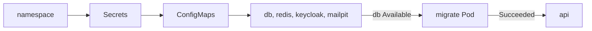

## Bạn cần biết trước

- [[k8s.l1.configmap-files]] — bạn biết Pod `db` lấy ba init script từ ConfigMap `db-init`, và chỉ chạy chúng khi thư mục dữ liệu còn trống.
- [[k8s.l1.service-and-dns]] — bạn biết một Pod tới được Service trong cùng namespace bằng tên của Service.
- [[devops.l2.migrations-in-the-pipeline]] — bạn biết Compose chạy migration bundle một lần, trong bước `migrate` riêng, và chỉ khởi động `api` khi bước đó thành công.

## Tình huống

ConfigMap và các Secret của api đã có, `db-init` cũng sẵn sàng. Thứ còn thiếu là mọi thứ mà chúng phục vụ: PostgreSQL, Redis, Keycloak (authorization server), Mailpit (mail server mà api gửi email tới), bước migration, và chính api. Trong Compose, một lệnh `docker compose up` khởi động chúng đúng thứ tự, chạy `migrate` trước `api`, và publish port để trình duyệt tới được api qua Caddy. Trên cluster, chưa có gì biết thứ tự đó, và không port nào được publish. Làm sao đưa cả backend lên cluster đúng thứ tự, và làm sao kiểm tra nó trả lời được khi không gì ngoài cluster tới được nó?

## Khái niệm cốt lõi

- `restartPolicy: Never` — setting của Pod khiến kubelet để yên một container đã dừng thay vì khởi động lại nó; Pod kết thúc ở `Succeeded` hoặc `Failed`.
- `emptyDir` — một volume bắt đầu trống khi Pod của nó được đặt lên node và bị xóa cùng Pod; container khởi động lại trong cùng Pod vẫn thấy nó.
- `kubectl wait --for=condition=Available` — lệnh chờ tới khi một Deployment báo đủ Pod sẵn sàng, hoặc bỏ cuộc sau `--timeout`.

## Cơ chế hoạt động



Trong tình huống trên, một script làm thay việc của `docker compose up`, dưới dạng một danh sách các bước `kubectl apply`. Bước nào cũng chạy lại được: `apply` để nguyên object đã đúng. Thứ tự đi theo thứ mỗi bước cần. Sau namespace `donhang`, Secret và ConfigMap đi trước, vì container tham chiếu tới một cái chưa có thì không khởi động được.

Kế tiếp là bốn dịch vụ phía sau. Mỗi cái chạy từ đúng image mà Compose dùng, dưới dạng một Deployment một replica, cộng một Service đặt tên theo service trong Compose: `db`, `redis`, `keycloak`, `mailpit`. Vì cluster DNS trả lời các tên đó, host name trong setting của api vẫn giống như trong Compose. Script chờ tới khi `db` available.

Sau đó migration chạy, trong một Pod chạy migration bundle ở đúng tag của api. Với `restartPolicy: Never`, kubelet không khởi động lại container đã chạy xong, nên bundle chạy đúng một lần mỗi lần deploy, và Pod kết thúc ở `Succeeded` hoặc `Failed`. Script chỉ apply api sau `Succeeded`, như Compose chỉ khởi động `api` sau khi `migrate` thành công.

PostgreSQL giữ dữ liệu trong một volume `emptyDir`. Nó sống qua lần khởi động lại của container `db`, nhưng khi Pod `db` bị thay, Pod mới nhận một volume mới, trống. Khi đó PostgreSQL chạy lại ba init script, và mọi thứ ghi vào từ trước, như các đơn hàng, đều mất.

Cuối cùng, các Service chỉ tới được từ bên trong cluster. Để kiểm tra api, một Pod tạm trong `donhang` gọi nó bằng tên Service.

## Trong hệ thống Đơn Hàng

Nửa sau của `scripts/k8s/deploy.sh`, sau namespace, các Secret và các ConfigMap:

```bash file=scripts/k8s/deploy.sh tag=stage-2 lines=32-56
# lesson: k8s.l1.deploying-don-hang
echo "== PostgreSQL, Redis, Keycloak and Mailpit, each with its Service"
kubectl apply -f deploy/k8s/db.yaml -f deploy/k8s/redis.yaml \
  -f deploy/k8s/keycloak.yaml -f deploy/k8s/mailpit.yaml -o name
kubectl wait --for=condition=Available deployment/db -n donhang --timeout=300s

# The migration runs once per deploy: a new Pod each time, and the api is
# applied only once it has ended Succeeded.
echo "== the migration"
kubectl delete pod migrate -n donhang --ignore-not-found >/dev/null
kubectl apply -f deploy/k8s/migrate/migrate-pod.yaml -o name
phase=Pending
for _ in $(seq 300); do
  phase=$(kubectl get pod migrate -n donhang -o jsonpath='{.status.phase}')
  [ "$phase" = Succeeded ] || [ "$phase" = Failed ] && break
  sleep 1
done
echo "pod/migrate ended: $phase"
if [ "$phase" != Succeeded ]; then
  kubectl logs pod/migrate -n donhang >&2 || true
  exit 1
fi

echo "== the api"
kubectl apply -f deploy/k8s/api.yaml -o name
```

Script xóa Pod `migrate` cũ trước, nên mỗi lần deploy chạy migration trong một Pod mới. Sau đó nó đọc `.status.phase` của Pod mỗi giây một lần, tối đa 300 giây, cho tới khi là `Succeeded` hoặc `Failed`; nếu `Failed`, nó in log của Pod và dừng trước api.

`deploy/k8s/migrate/migrate-pod.yaml` đặt `restartPolicy: Never` và image `ghcr.io/duyan11110/donhang-migrate:1.0.0`, cùng tag `1.0.0` với image api trong `api.yaml`. Không hiện ở đây: các dòng cuối chờ tối đa 300 giây cho rollout của api, lệnh in ra `successfully rolled out`, rồi tối đa 600 giây cho mọi Deployment, vì Keycloak khởi động chậm nhất. Output:

```text output=true
== namespace
namespace/donhang
== Secrets, from .env (scripts/k8s/secrets.sh)
secret/api
secret/db
secret/keycloak
== ConfigMaps
configmap/db-init
configmap/keycloak-realm
configmap/api
== PostgreSQL, Redis, Keycloak and Mailpit, each with its Service
deployment.apps/db
service/db
deployment.apps/redis
service/redis
deployment.apps/keycloak
service/keycloak
deployment.apps/mailpit
service/mailpit
deployment.apps/db condition met
== the migration
pod/migrate
pod/migrate ended: Succeeded
== the api
deployment.apps/api
service/api
deployment "api" successfully rolled out
deployment.apps/api condition met
deployment.apps/db condition met
deployment.apps/keycloak condition met
deployment.apps/mailpit condition met
deployment.apps/redis condition met
```

`-o name` in mỗi object một lần, dù nó được tạo mới hay để nguyên, nên lần chạy thứ hai in đúng các dòng đó. Sau đó `scripts/k8s/smoke-test.sh` kiểm tra kết quả:

```bash file=scripts/k8s/smoke-test.sh tag=stage-2 lines=12-25
# lesson: k8s.l1.deploying-don-hang
# migrate shows Completed: it ran once and stopped, as restartPolicy: Never says.
show kubectl get pods -n donhang
echo

# Nothing outside the cluster reaches the api. A Pod inside it asks the
# Service api by name; wget exits non-zero (and so does this script) unless
# the answer is a 2xx.
echo "== GET http://api:8080/api/v1/products, from a temporary Pod in donhang"
# (When the Pod ends before kubectl attaches to it, kubectl warns and reads
# its log instead: the same output, so the warning is dropped.)
kubectl run smoke-test --rm -i --restart=Never --quiet -n donhang --image=caddy:2.10.0 -- \
  wget -q -O - http://api:8080/api/v1/products 2>&1 | sed "/^warning: couldn't attach/d"
echo
```

`kubectl run --rm -i --restart=Never` khởi động một Pod dùng một lần, in ra những gì nó ghi, rồi xóa nó. Lệnh dùng image Caddy chỉ vì image đó có `wget`. `wget` gửi một request `GET` tới URL và in body của response; `show` in lệnh ra trước khi chạy. Output:

```text output=true
$ kubectl get pods -n donhang
NAME               READY   STATUS      RESTARTS   AGE
api-...-...        1/1     Running     0          ...
api-...-...        1/1     Running     0          ...
db-...-...         1/1     Running     0          ...
keycloak-...-...   1/1     Running     0          ...
mailpit-...-...    1/1     Running     0          ...
migrate            0/1     Completed   0          ...
redis-...-...      1/1     Running     0          ...

== GET http://api:8080/api/v1/products, from a temporary Pod in donhang
[{"id":1,"name":"Bàn phím cơ","priceVnd":1250000},{"id":2,"name":"Chuột không dây","priceVnd":450000},{"id":3,"name":"Tai nghe","priceVnd":890000},{"id":4,"name":"Màn hình 24 inch","priceVnd":3200000},{"id":5,"name":"Giá đỡ laptop","priceVnd":320000},{"id":6,"name":"Ổ cứng SSD 512GB","priceVnd":1450000},{"id":7,"name":"Webcam 720p","priceVnd":560000},{"id":8,"name":"Đèn bàn LED","priceVnd":280000}]
```

`migrate` hiện `Completed`, cách `kubectl get pods` hiển thị phase `Succeeded`, với `0/1` sẵn sàng: container của nó đã chạy rồi dừng, và không gì khởi động lại nó. Tám sản phẩm đến từ `seed.sql`, qua PostgreSQL, api và Service `api`.

## Người mới hay nghĩ rằng…

- **"Chạy PostgreSQL bằng Deployment là dữ liệu an toàn, vì Deployment đưa Pod trở lại."** → Thực ra Deployment đưa trở lại một Pod mới, với một `emptyDir` mới, trống. Bạn sẽ nhận ra khi log của Pod `db` thay thế cho thấy ba init script chạy lại và các đơn bạn đã tạo không còn.
- **"Mỗi replica api nên tự áp dụng migration khi nó khởi động."** → Thực ra migration chạy một lần mỗi lần deploy, trong Pod riêng, và script chỉ apply api sau khi nó thành công. Bạn sẽ hiểu vì sao khi một migration lỗi: script dừng trước api, và các Pod api đang chạy vẫn tiếp tục phục vụ, thay vì mọi Pod api mới đều hỏng lúc khởi động.
- **"Mọi Pod đều Running là trình duyệt của tôi tới được app."** → Thực ra không Service nào ở đây được publish ra ngoài cluster. Bạn sẽ nhận ra khi cách duy nhất để `smoke-test.sh` tới được api là từ một Pod bên trong `donhang`.

## Thử ngay (3 phút)

Với backend đang chạy trong `donhang`:

1. Chạy `kubectl get deployments -n donhang`.
2. Chạy `kubectl get services -n donhang`.

Kết quả mong đợi: bước 1 liệt kê năm Deployment, `api` với `2/2` sẵn sàng và `db`, `keycloak`, `mailpit`, `redis` với `1/1`. Bước 2 liệt kê năm Service cùng tên, chính là các host name mà setting của api dùng, đều có type `ClusterIP` và `<none>` ở cột `EXTERNAL-IP`: đó là dáng vẻ của một Service chỉ tới được từ bên trong cluster.

## Liên hệ

- [[k8s.l1.configmap-files]] — `db-init` và các init script chạy lại mỗi khi `db` khởi động với một `emptyDir` trống.
- [[devops.l2.migrations-in-the-pipeline]] — cùng quy tắc, migrate một lần và chỉ khởi động api khi thành công, chuyển từ Compose sang cluster.
- [[k8s.l1.deploying-an-image-tag]] — ở đó api chạy một mình và mọi request cần database đều lỗi; ở đây nó chạy cùng mọi thứ nó cần.
- [[k8s.l1.health-endpoints]] — bài tiếp: api đang chạy báo cho biết nó có thật sự phục vụ được hay không bằng cách nào.

## Tóm tắt 5 dòng

1. `deploy.sh` dựng backend theo thứ tự: namespace, Secret, ConfigMap, bốn dịch vụ phía sau, migration, rồi api.
2. PostgreSQL, Redis, Keycloak và Mailpit mỗi cái chạy thành một Deployment một replica, với Service đặt tên như service trong Compose.
3. Một Pod `migrate` có `restartPolicy: Never` chạy bundle một lần mỗi lần deploy; api chỉ được apply khi nó thành công.
4. `db` giữ dữ liệu trong `emptyDir`: sống qua lần container khởi động lại, nhưng Pod thay thế bắt đầu trống.
5. Không gì ngoài cluster tới được api; `smoke-test.sh` gọi nó qua Service từ một Pod tạm.
