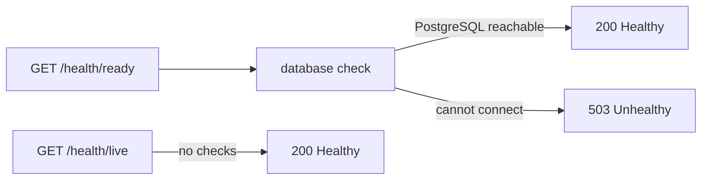

## Before you start

- [[k8s.l1.deploying-don-hang]] — you know `deploy.sh` runs the api as two Pods behind the Service `api`, reachable only from inside the cluster.
- [[backend.l1.middleware-pipeline]] — you know `Program.cs` builds the api's request pipeline and maps the endpoints that answer requests.
- [[backend.l2.cache-aside]] — you know a Redis error counts as a cache miss, so product reads fall back to PostgreSQL.

## The situation

The backend is deployed, and `kubectl get pods` shows both api Pods `Running`. Now imagine PostgreSQL becomes unreachable for the api. The api process keeps running, so the Pods still show `Running`, yet every request that needs the database fails with a `500`. A Pod's `Running` status only says its containers have started and at least one still runs; it says nothing about whether the api can reach its database. The api is the one part that knows whether it can reach its database. How can the api itself report, over HTTP, whether it is alive and whether it can serve?

## Core concepts

- **health check** — a check an app runs on itself and reports over HTTP, for example as `Healthy` or `Unhealthy`; in the situation above, "can I reach PostgreSQL?".
- `MapHealthChecks` — maps a path to an endpoint that runs the registered checks its `Predicate` (a function that says, for each registered check, whether to run it) selects, and answers with their combined result.
- tag — a label given to a check when it is registered, such as `"ready"`, that a `Predicate` can select on.

## How it works



In the situation above, the api gets two extra endpoints, outside `/api/v1`. At startup, `Program.cs` registers the health checks it can run; at stage-2 there is exactly one, tagged `"ready"`. It asks EF Core whether it can open a connection to PostgreSQL.

Each endpoint picks which registered checks to run. A request to it runs them and adds up the result: if every selected check passes, the endpoint answers `200` with the text `Healthy`; if one fails, it answers `503` with `Unhealthy`.

`/health/ready` selects the checks tagged `"ready"`, so it answers whether the api can reach its database. That is the question for "can this api serve requests now?".

Redis is left out on purpose. A Redis error only turns a cache hit into a miss, and the api then answers from PostgreSQL, a bit slower. An api without Redis still serves, so reporting it as unable to would be wrong.

`/health/live` selects no checks at all. With nothing to fail, it answers `Healthy` whenever the process can still take an HTTP request and answer it. A database outage does not change that answer. It answers a narrower question: is the process alive and responding?

Nothing publishes these endpoints outside the cluster. Like the smoke test, they are called from a temporary Pod through the Service `api`.

## In the Đơn Hàng system

At stage-2, `Program.cs` registers the one check with `builder.Services.AddHealthChecks().AddDbContextCheck<DonHangDbContext>(tags: ["ready"]);`, next to a comment that Redis is left out on purpose; `DonHangDbContext` is the api's EF Core class for PostgreSQL. Its last lines map the two endpoints:

```csharp file=DonHang.Api/Program.cs tag=stage-2 lines=120-124
// lesson: k8s.l1.health-endpoints
// /health/live runs no check at all: it answers Healthy while the process can
// still serve HTTP. /health/ready runs the "ready" checks: the database.
app.MapHealthChecks("/health/live", new HealthCheckOptions { Predicate = _ => false });
app.MapHealthChecks("/health/ready", new HealthCheckOptions { Predicate = check => check.Tags.Contains("ready") });
```

The `Predicate` is a function that gets each registered check and says whether to run it. `_ => false` says no to every check; `check => check.Tags.Contains("ready")` says yes to the database check. Neither endpoint asks for a signed-in user. `scripts/k8s/health.sh` calls both, first through the Service `api`, then on an extra api Pod that cannot reach PostgreSQL:

```bash file=scripts/k8s/health.sh tag=stage-2 lines=22-46
# lesson: k8s.l1.health-endpoints
# /health/live runs no check; /health/ready asks EF Core to reach PostgreSQL.
echo "== GET http://api:8080/health/live"
get api /health/live
echo "== GET http://api:8080/health/ready"
get api /health/ready
echo

# The same image in a Pod of its own, given a database host that does not
# exist (db-missing). Its process runs; PostgreSQL cannot be reached.
kubectl delete pod api-no-db -n donhang --ignore-not-found >/dev/null
kubectl run api-no-db -n donhang --image="$image" --restart=Never \
  --env='ConnectionStrings__Default=Host=db-missing;Database=donhang;Username=donhang' \
  --env='ConnectionStrings__Redis=redis:6379,abortConnect=false' \
  --env='Keycloak__Authority=http://localhost:8180/realms/donhang' >/dev/null
kubectl wait --for=condition=Ready pod/api-no-db -n donhang --timeout=120s >/dev/null
ip=$(kubectl get pod api-no-db -n donhang -o jsonpath='{.status.podIP}')
for _ in $(seq 30); do
  get "$ip" /health/live 2>/dev/null | grep -q Healthy && break
  sleep 1
done
echo "== GET http://<IP of api-no-db>:8080/health/live"
get "$ip" /health/live
echo "== GET http://<IP of api-no-db>:8080/health/ready"
get "$ip" /health/ready
```

`get`, defined earlier in the script, sends the request from a temporary Pod with `wget` and prints the status line. It prints the body only for a `2xx` status, because this `wget` keeps no body for any other. The script waits for `api-no-db` to start, then retries `/health/live` until the api inside answers HTTP; that `Ready` is about the Pod, not the `"ready"` tag. `api-no-db` runs the same image as the api, `1.0.0`, with `db-missing` as its database host. No Service points at it, so the script calls it by its Pod IP. Its output:

```text output=true
== GET http://api:8080/health/live
HTTP/1.1 200 OK
Healthy
== GET http://api:8080/health/ready
HTTP/1.1 200 OK
Healthy

== GET http://<IP of api-no-db>:8080/health/live
HTTP/1.1 200 OK
Healthy
== GET http://<IP of api-no-db>:8080/health/ready
HTTP/1.1 503 Service Unavailable
```

The deployed api is healthy on both. `api-no-db` answers `/health/live` with `Healthy`, because its process runs and answers HTTP, and `/health/ready` with `503`: it cannot reach PostgreSQL. The body `Unhealthy` is sent too, but this `wget` does not print it.

## Beginners often think…

- **"If the api process is running, it can serve requests."** → Actually a running process can still fail every request that needs the database. You notice this when `api-no-db` is running and answers `/health/live`, yet `/health/ready` answers `503`.
- **"A health endpoint should check everything the api talks to, Redis included."** → Actually a check belongs in `/health/ready` only if its failure stops the api from serving; without Redis the api still answers from PostgreSQL. You notice this in `Program.cs`, where `/health/ready` runs only the database check.
- **"`/health/live` should also check the database, to be safe."** → Actually `/health/live` answers a different question, whether the process itself responds, and a database outage does not change that answer. You notice this when `api-no-db` answers `/health/live` with `Healthy` while it has no database.

## Try it (3 minutes)

With the backend running in `donhang`, run the command below; the temporary Pod uses the `caddy:2.10.0` image only because it contains `wget`:

`kubectl run health-try --rm -i --restart=Never -n donhang --image=caddy:2.10.0 -- wget -q -O - http://api:8080/health/ready`

Expected result: `Healthy`, followed on the same line by `pod "health-try" deleted from donhang namespace`: the temporary Pod is removed. The answer comes from whichever api Pod the Service `api` picked, after it asked EF Core to reach PostgreSQL.

## Connections

- [[backend.l2.cache-aside]] — why Redis stays out of `/health/ready`: a Redis failure is a slower read, not a failed one.
- [[devops.l1.compose-for-the-api]] — there Compose waited until `db` answered as ready; at stage-2, Compose's check for `api` asks `/health/ready` too.
- [[k8s.l1.liveness-probes]] — next: the kubelet calls `/health/live` and restarts the container when it keeps failing.

## Five-line summary

1. A health check lets the api itself report over HTTP whether it is alive and whether it can serve.
2. `Program.cs` registers one check with `AddDbContextCheck` and maps `/health/live` and `/health/ready` with `MapHealthChecks`.
3. An endpoint answers `200 Healthy` when all its checks pass and `503 Unhealthy` when one fails.
4. `/health/ready` checks PostgreSQL only; Redis stays out, because the api still serves without it.
5. `/health/live` runs no checks, so a database outage does not change it; both are reachable only inside the cluster.
