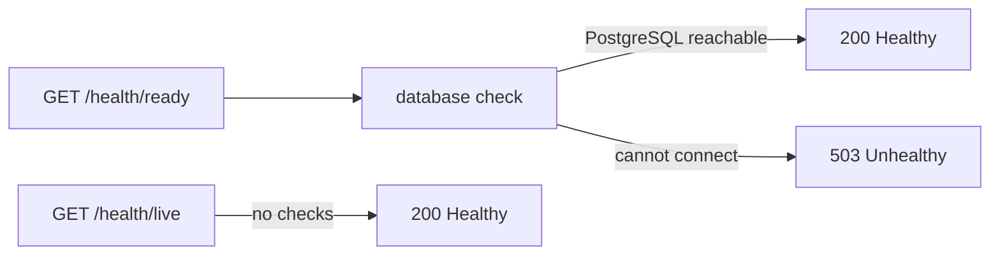

## Bạn cần biết trước

- [[k8s.l1.deploying-don-hang]] — bạn biết `deploy.sh` chạy api thành hai Pod sau Service `api`, chỉ tới được từ bên trong cluster.
- [[backend.l1.middleware-pipeline]] — bạn biết `Program.cs` dựng pipeline xử lý request của api và map các endpoint trả lời request.
- [[backend.l2.cache-aside]] — bạn biết lỗi Redis được tính là cache miss, nên việc đọc sản phẩm quay về PostgreSQL.

## Tình huống

Backend đã được deploy, và `kubectl get pods` hiện cả hai Pod api đều `Running`. Giờ hãy hình dung api không còn tới được PostgreSQL. Process api vẫn chạy, nên các Pod vẫn hiện `Running`, vậy mà mọi request cần database đều hỏng với `500`. Trạng thái `Running` của Pod chỉ nói rằng các container của nó đã khởi động và ít nhất một cái còn chạy; nó không nói gì về việc api có tới được database hay không. Chỉ có api biết nó có tới được database của mình không. Làm sao để chính api báo qua HTTP rằng nó còn sống không, và có phục vụ được không?

## Khái niệm cốt lõi

- **health check** (Phép kiểm tra app tự chạy trên chính nó và báo qua HTTP là Healthy hay Unhealthy) — phép kiểm tra một app tự chạy trên chính nó và báo kết quả qua HTTP, chẳng hạn là `Healthy` hay `Unhealthy`; trong tình huống trên là "tôi có tới được PostgreSQL không?".
- `MapHealthChecks` — map một đường dẫn tới một endpoint chạy các check đã đăng ký mà `Predicate` của nó (một hàm cho biết, với mỗi check đã đăng ký, có chạy check đó hay không) chọn, rồi trả lời bằng kết quả gộp của chúng.
- tag — nhãn gắn cho một check lúc đăng ký, như `"ready"`, để `Predicate` có thể chọn theo.

## Cơ chế hoạt động



Trong tình huống trên, api có thêm hai endpoint, nằm ngoài `/api/v1`. Lúc khởi động, `Program.cs` đăng ký các health check mà nó chạy được; ở stage-2 chỉ có đúng một cái, gắn tag `"ready"`. Nó hỏi EF Core xem có mở được kết nối tới PostgreSQL không.

Mỗi endpoint tự chọn chạy những check đã đăng ký nào. Một request tới endpoint sẽ chạy chúng và gộp kết quả: nếu mọi check được chọn đều qua, endpoint trả `200` với chữ `Healthy`; nếu một cái hỏng, nó trả `503` với `Unhealthy`.

`/health/ready` chọn các check gắn tag `"ready"`, nên nó trả lời việc api có tới được database không. Đó chính là câu hỏi "lúc này api có phục vụ request được không?".

Redis cố ý bị để ngoài. Lỗi Redis chỉ biến một lần cache hit thành miss, và khi đó api trả lời từ PostgreSQL, chậm hơn một chút. Không có Redis api vẫn phục vụ được, nên báo nó là không phục vụ được thì sai.

`/health/live` không chọn check nào. Không có gì để hỏng, nó trả `Healthy` miễn là process còn nhận và trả lời được một request HTTP. Sự cố database không làm đổi câu trả lời đó. Nó trả lời một câu hỏi hẹp hơn: process còn sống và còn phản hồi không?

Không gì publish các endpoint này ra ngoài cluster. Giống smoke test, chúng được gọi từ một Pod tạm qua Service `api`.

## Trong hệ thống Đơn Hàng

Ở stage-2, `Program.cs` đăng ký check duy nhất bằng `builder.Services.AddHealthChecks().AddDbContextCheck<DonHangDbContext>(tags: ["ready"]);`, cạnh một comment nói Redis cố ý bị để ngoài; `DonHangDbContext` là lớp EF Core của api cho PostgreSQL. Các dòng cuối của file map hai endpoint:

```csharp file=DonHang.Api/Program.cs tag=stage-2 lines=120-124
// lesson: k8s.l1.health-endpoints
// /health/live runs no check at all: it answers Healthy while the process can
// still serve HTTP. /health/ready runs the "ready" checks: the database.
app.MapHealthChecks("/health/live", new HealthCheckOptions { Predicate = _ => false });
app.MapHealthChecks("/health/ready", new HealthCheckOptions { Predicate = check => check.Tags.Contains("ready") });
```

`Predicate` là một hàm nhận từng check đã đăng ký và cho biết có chạy nó hay không. `_ => false` từ chối mọi check; `check => check.Tags.Contains("ready")` nhận check database. Không endpoint nào đòi người dùng đã đăng nhập. `scripts/k8s/health.sh` gọi cả hai, trước tiên qua Service `api`, sau đó trên một Pod api phụ không tới được PostgreSQL:

```bash file=scripts/k8s/health.sh tag=stage-2 lines=22-46
# lesson: k8s.l1.health-endpoints
# /health/live runs no check; /health/ready asks EF Core to reach PostgreSQL.
echo "== GET http://api:8080/health/live"
get api /health/live
echo "== GET http://api:8080/health/ready"
get api /health/ready
echo

# The same image in a Pod of its own, given a database host that does not
# exist (db-missing). Its process runs; PostgreSQL cannot be reached.
kubectl delete pod api-no-db -n donhang --ignore-not-found >/dev/null
kubectl run api-no-db -n donhang --image="$image" --restart=Never \
  --env='ConnectionStrings__Default=Host=db-missing;Database=donhang;Username=donhang' \
  --env='ConnectionStrings__Redis=redis:6379,abortConnect=false' \
  --env='Keycloak__Authority=http://localhost:8180/realms/donhang' >/dev/null
kubectl wait --for=condition=Ready pod/api-no-db -n donhang --timeout=120s >/dev/null
ip=$(kubectl get pod api-no-db -n donhang -o jsonpath='{.status.podIP}')
for _ in $(seq 30); do
  get "$ip" /health/live 2>/dev/null | grep -q Healthy && break
  sleep 1
done
echo "== GET http://<IP of api-no-db>:8080/health/live"
get "$ip" /health/live
echo "== GET http://<IP of api-no-db>:8080/health/ready"
get "$ip" /health/ready
```

`get`, định nghĩa ở đầu script, gửi request từ một Pod tạm bằng `wget` và in dòng status. Nó chỉ in body khi status là `2xx`, vì `wget` này không giữ body với status khác. Script chờ `api-no-db` khởi động, rồi thử lại `/health/live` tới khi api bên trong trả lời HTTP; chữ `Ready` đó nói về Pod, không phải tag `"ready"`. `api-no-db` chạy cùng image với api, `1.0.0`, với `db-missing` làm host database. Không Service nào trỏ tới nó, nên script gọi nó bằng IP của Pod. Output:

```text output=true
== GET http://api:8080/health/live
HTTP/1.1 200 OK
Healthy
== GET http://api:8080/health/ready
HTTP/1.1 200 OK
Healthy

== GET http://<IP of api-no-db>:8080/health/live
HTTP/1.1 200 OK
Healthy
== GET http://<IP of api-no-db>:8080/health/ready
HTTP/1.1 503 Service Unavailable
```

api đã deploy khỏe ở cả hai endpoint. `api-no-db` trả `/health/live` là `Healthy`, vì process của nó chạy và trả lời HTTP, còn `/health/ready` là `503`: nó không tới được PostgreSQL. Body `Unhealthy` vẫn được gửi, nhưng `wget` này không in ra.

## Người mới hay nghĩ rằng…

- **"Process api còn chạy là nó phục vụ được request."** → Thực ra process đang chạy vẫn có thể làm hỏng mọi request cần database. Bạn sẽ nhận ra khi `api-no-db` đang chạy và trả lời `/health/live`, mà `/health/ready` lại trả `503`.
- **"Health endpoint nên kiểm mọi thứ api nói chuyện cùng, kể cả Redis."** → Thực ra một check chỉ thuộc `/health/ready` khi nó hỏng thì api không phục vụ được; không có Redis api vẫn trả lời từ PostgreSQL. Bạn sẽ nhận ra trong `Program.cs`, nơi `/health/ready` chỉ chạy check database.
- **"`/health/live` cũng nên kiểm database cho chắc."** → Thực ra `/health/live` trả lời một câu hỏi khác, chính process có còn phản hồi không, và sự cố database không làm đổi câu trả lời đó. Bạn sẽ nhận ra khi `api-no-db` trả `/health/live` là `Healthy` dù nó không có database.

## Thử ngay (3 phút)

Với backend đang chạy trong `donhang`, chạy lệnh dưới đây; Pod tạm dùng image `caddy:2.10.0` chỉ vì image đó có `wget`:

`kubectl run health-try --rm -i --restart=Never -n donhang --image=caddy:2.10.0 -- wget -q -O - http://api:8080/health/ready`

Kết quả mong đợi: `Healthy`, ngay sau nó trên cùng dòng là `pod "health-try" deleted from donhang namespace`: Pod tạm đã bị gỡ. Câu trả lời đến từ Pod api nào mà Service `api` chọn, sau khi Pod đó hỏi EF Core có tới được PostgreSQL không.

## Liên hệ

- [[backend.l2.cache-aside]] — lý do Redis đứng ngoài `/health/ready`: Redis hỏng thì việc đọc chậm hơn, không thất bại.
- [[devops.l1.compose-for-the-api]] — ở đó Compose chờ tới khi `db` báo sẵn sàng; ở stage-2, check của Compose cho `api` cũng hỏi `/health/ready`.
- [[k8s.l1.liveness-probes]] — bài tiếp: kubelet gọi `/health/live` và khởi động lại container khi nó hỏng liên tục.

## Tóm tắt 5 dòng

1. Health check cho chính api báo qua HTTP rằng nó còn sống không và có phục vụ được không.
2. `Program.cs` đăng ký một check bằng `AddDbContextCheck` và map `/health/live`, `/health/ready` bằng `MapHealthChecks`.
3. Endpoint trả `200 Healthy` khi mọi check của nó qua, và `503 Unhealthy` khi một check hỏng.
4. `/health/ready` chỉ kiểm PostgreSQL; Redis đứng ngoài, vì không có nó api vẫn phục vụ được.
5. `/health/live` không chạy check nào, nên sự cố database không đổi được nó; cả hai chỉ tới được từ trong cluster.
