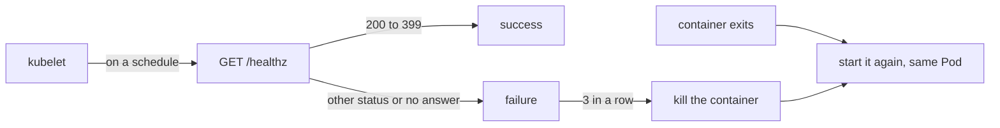

## Before you start

- [[k8s.l1.health-endpoints]] — you know `/health/live` runs no checks and answers `Healthy` while the api process still answers HTTP.
- [[k8s.l1.replicasets]] — you know a ReplicaSet replaces a deleted Pod with a new one, with a new name and a new IP address.

## The situation

The api runs as two Pods. From the ReplicaSet lessons you know what happens when a Pod is deleted: a new one takes its place. But Pods are not usually deleted; the program inside them fails. Sometimes the api process crashes and exits; sometimes it is worse: the process is still there, but stuck, and answers no request at all. A stuck process never exits, so nothing about it looks wrong from outside. What does Kubernetes do when the api's container exits, and how can it notice a container that still runs but no longer works?

## Core concepts

- **probe** — a check the kubelet runs against a container on a schedule, such as an HTTP request, to judge the container's state.
- **liveness probe** — a probe whose repeated failure makes the kubelet kill the container and start it again, in the same Pod.
- `CrashLoopBackOff` — what a Pod shows while the kubelet waits, longer each time, before starting again a container that keeps stopping.

## How it works



In the situation above, the simple case comes first. When a container exits, the kubelet on its node starts it again by default. It does that inside the same Pod: the Pod keeps its name and its IP address, and only its `RESTARTS` count goes up. No new Pod is created, so the ReplicaSet has nothing to do.

If the container keeps stopping, the kubelet no longer starts it again right away. After the first few restarts it waits before starting it again, and the wait grows each time. While it waits, the Pod shows `CrashLoopBackOff`.

A stuck process is the harder case, because it never exits. A liveness probe makes it look like an exit. The kubelet sends the probe on a schedule; an `httpGet` probe is an HTTP `GET` to a path and port of the container, such as `/healthz` in the example below. Any status from `200` to `399` counts as success; any other status, or no answer in time, counts as a failure. After `failureThreshold` failures in a row, 3 by default, the kubelet kills the container. From there it is the simple case: the container is started again in the same Pod.

For the api, the probe calls `/health/live`. That endpoint ignores PostgreSQL on purpose. If it checked the database, an outage would fail the probe in every api container, and the kubelet would restart them all. A restart cannot bring PostgreSQL back, so the api would only lose its running state, and keep failing, without anything getting fixed.

## In the Đơn Hàng system

`deploy/k8s/lessons/web-liveness-pod.yaml` shows a liveness probe that can never pass:

```yaml file=deploy/k8s/lessons/web-liveness-pod.yaml tag=stage-2 lines=1-20
# lesson: k8s.l1.liveness-probes
# Caddy with a liveness probe that can never pass: Caddy's welcome site has
# no /healthz, so every probe gets 404. After 3 failures in a row (the
# default failureThreshold) the kubelet kills the container and starts it
# again, in the same Pod.
apiVersion: v1
kind: Pod
metadata:
  name: web-liveness
  namespace: donhang
spec:
  containers:
    - name: web
      image: caddy:2.10.0
      ports:
        - containerPort: 80
      livenessProbe:
        httpGet:
          path: /healthz
          port: 80
```

Caddy is the web server image the lesson Pods have used since the Pods lesson. The probe sits under the container, next to its ports, and names only a path and a port; everything else keeps its default. Caddy itself runs fine: the only thing wrong is the answer to `/healthz`, `404`. `scripts/k8s/liveness.sh` applies it and watches:

```bash file=scripts/k8s/liveness.sh tag=stage-2 lines=12-35
# lesson: k8s.l1.liveness-probes
show kubectl apply -f deploy/k8s/lessons/web-liveness-pod.yaml
kubectl wait --for=condition=Ready pod/web-liveness -n donhang --timeout=120s >/dev/null
uid=$(pod_field '{.metadata.uid}')
ip=$(pod_field '{.status.podIP}')
# Every 10 s the kubelet asks for /healthz; after 3 failures in a row it
# kills the container and starts it again, in the same Pod.
for _ in $(seq 120); do
  [ "$(pod_field '{.status.containerStatuses[0].restartCount}')" -ge 1 ] && break
  sleep 1
done
show kubectl get pod web-liveness -n donhang
echo "Still the same Pod (same uid): $([ "$(pod_field '{.metadata.uid}')" = "$uid" ] && echo yes || echo no)"
echo "Still the same IP address: $([ "$(pod_field '{.status.podIP}')" = "$ip" ] && echo yes || echo no)"
echo
# It keeps failing, so the kubelet waits longer and longer before each new
# start; while it waits, the Pod's status is CrashLoopBackOff.
for _ in $(seq 300); do
  [ "$(pod_field '{.status.containerStatuses[0].state.waiting.reason}')" = CrashLoopBackOff ] && break
  sleep 1
done
echo "\$ kubectl get pod web-liveness -n donhang -o jsonpath='{.status.containerStatuses[0].state.waiting.reason}'"
pod_field '{.status.containerStatuses[0].state.waiting.reason}'
echo
```

`show` prints a command before running it, and `pod_field` reads one field of the Pod with `-o jsonpath`. `kubectl wait` waits until the Pod's container has started and is ready. The script then stores the Pod's `uid`, a unique id every object gets, and its IP address, waits for the first restart and compares them.

After the lines shown, it prints the Pod's events about the probe (short records Kubernetes keeps of what happened to an object), deletes the Pod, and shows the api's probes as `kubectl describe` sums them up. Its output:

```text output=true
$ kubectl apply -f deploy/k8s/lessons/web-liveness-pod.yaml
pod/web-liveness created
$ kubectl get pod web-liveness -n donhang
NAME           READY   STATUS    RESTARTS      AGE
web-liveness   1/1     Running   1 (... ago)   ...
Still the same Pod (same uid): yes
Still the same IP address: yes

$ kubectl get pod web-liveness -n donhang -o jsonpath='{.status.containerStatuses[0].state.waiting.reason}'
CrashLoopBackOff

== the Pod's events about the probe, each one once
Killing: Container web failed liveness probe, will be restarted
Unhealthy: Liveness probe failed: HTTP probe failed with statuscode: 404

$ kubectl describe deployment api -n donhang | grep -E 'Liveness|Readiness'
Liveness:    http-get http://:8080/health/live delay=0s timeout=1s period=10s #success=1 #failure=3
Readiness:   http-get http://:8080/health/ready delay=0s timeout=1s period=10s #success=1 #failure=3
```

`RESTARTS` is `1` while the uid and the IP address stay the same: the container was restarted, not the Pod replaced. Later the same Pod shows `CrashLoopBackOff`. The events name the cause, `404`, and the action, `Killing`. The `Liveness` line is the api's probe from `deploy/k8s/api.yaml`: an `httpGet` on `/health/live`, port `8080`, with the defaults filled in, including `#failure=3`. The `Readiness` line is the next lesson's.

## Beginners often think…

- **"A failing liveness probe makes Kubernetes create a new Pod, maybe on another node."** → Actually the kubelet restarts the container inside the same Pod, on the same node. You notice this when the script reports the same uid and the same IP address after a restart.
- **"Without a liveness probe, Kubernetes never restarts a crashed container."** → Actually a container that exits is restarted by default; the liveness probe only adds a restart for a container that runs but fails the probe. You notice this when a crashing container's `RESTARTS` climbs even though its Pod has no probe.
- **"The liveness probe should fail whenever the database is down."** → Actually a restart cannot fix the database, so such a probe would restart every api container during an outage for nothing. You notice this in `api.yaml`, whose liveness probe calls `/health/live`, which ignores PostgreSQL.

## Try it (3 minutes)

In the `don-hang` folder, with the cluster running:

1. Run `kubectl apply -f deploy/k8s/lessons/web-liveness-pod.yaml`.
2. Run `kubectl get pod web-liveness -n donhang -w` (`-w` keeps printing a line whenever the Pod changes) and watch for about five minutes (longer than the usual 3, because the waits only grow after a few restarts), then stop it with Ctrl+C.
3. Run `kubectl delete -f deploy/k8s/lessons/web-liveness-pod.yaml`.

Expected result: the Pod's name never changes and `RESTARTS` goes up. The first restarts come about every 30 seconds; after a few of them `STATUS` shows `CrashLoopBackOff` between restarts, and the gaps get longer.

## Connections

- [[k8s.l1.health-endpoints]] — the `/health/live` endpoint this probe calls, and why it ignores PostgreSQL.
- [[k8s.l1.replicasets]] — the opposite level: a ReplicaSet replaces lost Pods; the kubelet restarts containers inside one Pod.
- [[k8s.l1.readiness-probes]] — next: a probe whose failure restarts nothing but takes the Pod out of its Service.

## Five-line summary

1. A liveness probe lets the kubelet restart a container that runs but no longer works.
2. A container that exits is restarted in the same Pod, with the same name and IP; `RESTARTS` goes up.
3. A container that keeps stopping ends up in `CrashLoopBackOff`: after a few restarts the kubelet waits before each new start, longer each time.
4. An `httpGet` probe counts `200`–`399` as success; after 3 failures in a row, by default, the container is killed and restarted.
5. The api's liveness probe calls `/health/live`, so a database outage restarts nothing.
