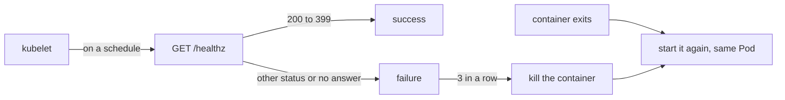

## Bạn cần biết trước

- [[k8s.l1.health-endpoints]] — bạn biết `/health/live` không chạy check nào và trả `Healthy` khi process api còn trả lời HTTP.
- [[k8s.l1.replicasets]] — bạn biết ReplicaSet thay một Pod bị xóa bằng Pod mới, với tên mới và địa chỉ IP mới.

## Tình huống

api chạy thành hai Pod. Từ các bài ReplicaSet, bạn biết chuyện gì xảy ra khi một Pod bị xóa: một Pod mới thế chỗ. Nhưng Pod thường không bị xóa; thứ hỏng là chương trình bên trong. Có lúc process api crash và thoát; có lúc còn tệ hơn: process vẫn còn đó, nhưng bị treo, và không trả lời request nào. Process bị treo không bao giờ thoát, nên nhìn từ ngoài chẳng có gì bất thường. Kubernetes làm gì khi container của api thoát, và làm sao nó nhận ra một container vẫn chạy nhưng không còn hoạt động?

## Khái niệm cốt lõi

- **probe** (Phép kiểm tra kubelet chạy định kỳ với một container, vd gọi HTTP, để đánh giá trạng thái của nó) — phép kiểm tra kubelet chạy định kỳ với một container, chẳng hạn một request HTTP, để đánh giá trạng thái của container đó.
- **liveness probe** (Probe mà khi hỏng liên tiếp đủ số lần thì kubelet giết container và khởi động lại nó) — probe mà khi hỏng lặp lại thì kubelet giết container và khởi động lại nó, ngay trong Pod đó.
- `CrashLoopBackOff` — thứ Pod hiển thị khi kubelet đang chờ, mỗi lần lâu hơn, trước khi khởi động lại một container cứ dừng mãi.

## Cơ chế hoạt động



Trong tình huống trên, trường hợp đơn giản đi trước. Khi một container thoát, mặc định kubelet trên node của nó khởi động lại nó. Việc đó diễn ra ngay trong Pod đó: Pod giữ nguyên tên và địa chỉ IP, chỉ số `RESTARTS` tăng lên. Không Pod mới nào được tạo, nên ReplicaSet chẳng có việc gì để làm.

Nếu container cứ dừng mãi, kubelet không còn khởi động lại nó ngay nữa. Sau vài lần khởi động lại đầu, nó chờ rồi mới khởi động lại, và thời gian chờ tăng dần mỗi lần. Trong lúc chờ, Pod hiện `CrashLoopBackOff`.

Process bị treo là trường hợp khó hơn, vì nó không bao giờ thoát. Liveness probe biến nó thành giống như một lần thoát. kubelet gửi probe theo lịch; `httpGet` probe là một request HTTP `GET` tới một path và port của container, như `/healthz` trong ví dụ bên dưới. Mọi status từ `200` tới `399` tính là thành công; status khác, hoặc không có câu trả lời kịp, tính là hỏng. Sau `failureThreshold` lần hỏng liên tiếp, mặc định là 3, kubelet giết container. Từ đó trở thành trường hợp đơn giản: container được khởi động lại ngay trong Pod đó.

Với api, probe gọi `/health/live`. Endpoint này cố ý bỏ qua PostgreSQL. Nếu nó kiểm database, một sự cố sẽ làm probe hỏng ở mọi container api, và kubelet sẽ khởi động lại tất cả. Khởi động lại không đưa PostgreSQL trở lại được, nên api chỉ mất trạng thái đang chạy, rồi vẫn hỏng tiếp, mà chẳng có gì được sửa.

## Trong hệ thống Đơn Hàng

`deploy/k8s/lessons/web-liveness-pod.yaml` cho thấy một liveness probe không bao giờ qua được:

```yaml file=deploy/k8s/lessons/web-liveness-pod.yaml tag=stage-2 lines=1-20
# lesson: k8s.l1.liveness-probes
# Caddy with a liveness probe that can never pass: Caddy's welcome site has
# no /healthz, so every probe gets 404. After 3 failures in a row (the
# default failureThreshold) the kubelet kills the container and starts it
# again, in the same Pod.
apiVersion: v1
kind: Pod
metadata:
  name: web-liveness
  namespace: donhang
spec:
  containers:
    - name: web
      image: caddy:2.10.0
      ports:
        - containerPort: 80
      livenessProbe:
        httpGet:
          path: /healthz
          port: 80
```

Caddy là image web server mà các Pod trong bài học dùng từ bài Pod. Probe nằm dưới container, cạnh phần port, và chỉ nêu path với port; mọi thứ khác giữ mặc định. Bản thân Caddy chạy bình thường: chỗ sai duy nhất là câu trả lời cho `/healthz`, `404`. `scripts/k8s/liveness.sh` apply nó và theo dõi:

```bash file=scripts/k8s/liveness.sh tag=stage-2 lines=12-35
# lesson: k8s.l1.liveness-probes
show kubectl apply -f deploy/k8s/lessons/web-liveness-pod.yaml
kubectl wait --for=condition=Ready pod/web-liveness -n donhang --timeout=120s >/dev/null
uid=$(pod_field '{.metadata.uid}')
ip=$(pod_field '{.status.podIP}')
# Every 10 s the kubelet asks for /healthz; after 3 failures in a row it
# kills the container and starts it again, in the same Pod.
for _ in $(seq 120); do
  [ "$(pod_field '{.status.containerStatuses[0].restartCount}')" -ge 1 ] && break
  sleep 1
done
show kubectl get pod web-liveness -n donhang
echo "Still the same Pod (same uid): $([ "$(pod_field '{.metadata.uid}')" = "$uid" ] && echo yes || echo no)"
echo "Still the same IP address: $([ "$(pod_field '{.status.podIP}')" = "$ip" ] && echo yes || echo no)"
echo
# It keeps failing, so the kubelet waits longer and longer before each new
# start; while it waits, the Pod's status is CrashLoopBackOff.
for _ in $(seq 300); do
  [ "$(pod_field '{.status.containerStatuses[0].state.waiting.reason}')" = CrashLoopBackOff ] && break
  sleep 1
done
echo "\$ kubectl get pod web-liveness -n donhang -o jsonpath='{.status.containerStatuses[0].state.waiting.reason}'"
pod_field '{.status.containerStatuses[0].state.waiting.reason}'
echo
```

`show` in lệnh ra trước khi chạy, còn `pod_field` đọc một trường của Pod bằng `-o jsonpath`. `kubectl wait` chờ tới khi container của Pod đã khởi động và sẵn sàng. Sau đó script lưu `uid` của Pod, một id duy nhất mà object nào cũng có, cùng địa chỉ IP của nó, chờ lần khởi động lại đầu tiên rồi so sánh.

Sau các dòng được trích, script in các event của Pod liên quan tới probe (bản ghi ngắn Kubernetes giữ về những gì đã xảy ra với một object), xóa Pod, rồi hiện các probe của api theo cách `kubectl describe` tóm tắt. Output:

```text output=true
$ kubectl apply -f deploy/k8s/lessons/web-liveness-pod.yaml
pod/web-liveness created
$ kubectl get pod web-liveness -n donhang
NAME           READY   STATUS    RESTARTS      AGE
web-liveness   1/1     Running   1 (... ago)   ...
Still the same Pod (same uid): yes
Still the same IP address: yes

$ kubectl get pod web-liveness -n donhang -o jsonpath='{.status.containerStatuses[0].state.waiting.reason}'
CrashLoopBackOff

== the Pod's events about the probe, each one once
Killing: Container web failed liveness probe, will be restarted
Unhealthy: Liveness probe failed: HTTP probe failed with statuscode: 404

$ kubectl describe deployment api -n donhang | grep -E 'Liveness|Readiness'
Liveness:    http-get http://:8080/health/live delay=0s timeout=1s period=10s #success=1 #failure=3
Readiness:   http-get http://:8080/health/ready delay=0s timeout=1s period=10s #success=1 #failure=3
```

`RESTARTS` là `1` trong khi uid và địa chỉ IP giữ nguyên: container được khởi động lại, Pod không bị thay. Sau đó cũng chính Pod này hiện `CrashLoopBackOff`. Các event nêu nguyên nhân, `404`, và hành động, `Killing`. Dòng `Liveness` là probe của api trong `deploy/k8s/api.yaml`: một `httpGet` tới `/health/live`, port `8080`, với các giá trị mặc định đã được điền, gồm cả `#failure=3`. Dòng `Readiness` là của bài sau.

## Người mới hay nghĩ rằng…

- **"Liveness probe hỏng thì Kubernetes tạo Pod mới, có khi trên node khác."** → Thực ra kubelet khởi động lại container ngay trong Pod đó, trên chính node đó. Bạn sẽ nhận ra khi script báo vẫn cùng uid và cùng địa chỉ IP sau một lần khởi động lại.
- **"Không có liveness probe thì Kubernetes không bao giờ khởi động lại container bị crash."** → Thực ra container thoát thì mặc định được khởi động lại; liveness probe chỉ thêm việc khởi động lại cho container vẫn chạy mà hỏng probe. Bạn sẽ nhận ra khi `RESTARTS` của một container hay crash cứ tăng dù Pod của nó không có probe nào.
- **"Liveness probe nên hỏng mỗi khi database sập."** → Thực ra khởi động lại không sửa được database, nên probe như vậy sẽ khởi động lại mọi container api trong lúc sự cố mà chẳng được gì. Bạn sẽ nhận ra trong `api.yaml`, nơi liveness probe gọi `/health/live`, endpoint bỏ qua PostgreSQL.

## Thử ngay (3 phút)

Trong thư mục `don-hang`, với cluster đang chạy:

1. Chạy `kubectl apply -f deploy/k8s/lessons/web-liveness-pod.yaml`.
2. Chạy `kubectl get pod web-liveness -n donhang -w` (`-w` in thêm một dòng mỗi khi Pod thay đổi) và theo dõi khoảng năm phút (lâu hơn 3 phút thường lệ, vì thời gian chờ chỉ tăng sau vài lần khởi động lại), rồi dừng bằng Ctrl+C.
3. Chạy `kubectl delete -f deploy/k8s/lessons/web-liveness-pod.yaml`.

Kết quả mong đợi: tên Pod không đổi và `RESTARTS` tăng dần. Mấy lần khởi động lại đầu cách nhau khoảng 30 giây; sau vài lần như vậy, `STATUS` hiện `CrashLoopBackOff` giữa các lần khởi động lại, và khoảng cách dài dần ra.

## Liên hệ

- [[k8s.l1.health-endpoints]] — endpoint `/health/live` mà probe này gọi, và lý do nó bỏ qua PostgreSQL.
- [[k8s.l1.replicasets]] — tầng ngược lại: ReplicaSet thay Pod bị mất; kubelet khởi động lại container bên trong một Pod.
- [[k8s.l1.readiness-probes]] — bài tiếp: một probe mà khi hỏng không khởi động lại gì, nhưng rút Pod khỏi Service của nó.

## Tóm tắt 5 dòng

1. Liveness probe cho kubelet khởi động lại một container vẫn chạy nhưng không còn hoạt động.
2. Container thoát được khởi động lại trong cùng Pod, cùng tên và IP; `RESTARTS` tăng lên.
3. Container cứ dừng mãi sẽ rơi vào `CrashLoopBackOff`: sau vài lần, kubelet chờ trước mỗi lần khởi động, mỗi lần lâu hơn.
4. `httpGet` probe tính `200`–`399` là thành công; mặc định sau 3 lần hỏng liên tiếp, container bị giết và khởi động lại.
5. Liveness probe của api gọi `/health/live`, nên sự cố database không khởi động lại gì.
