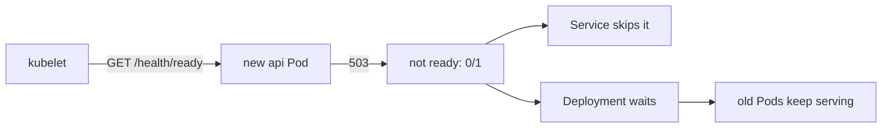

## Before you start

- [[k8s.l1.liveness-probes]] — you know a liveness probe that keeps failing gets the container restarted, and that the api's calls `/health/live`.
- [[k8s.l1.services]] — you know a Service spreads connections across the Pods its selector matches.
- [[k8s.l1.rolling-updates]] — you know a rolling update adds a new Pod and removes an old one once the new one is available.

## The situation

You are about to apply a new version of the api's manifest, and it has a mistake: its connection string, the setting that tells the api where PostgreSQL is, names a database host that does not exist. In k8s/workloads, a new Pod counted as available as soon as its container ran, and the rolling update then removed an old Pod. Here that would replace two working api Pods with two that fail every database request, while the Service keeps sending them traffic. A liveness probe does not help: `/health/live` passes, because the process answers. What keeps a Pod that runs but cannot serve from getting requests, and from replacing the Pods that can?

## Core concepts

- **readiness probe** — a probe that decides whether a Pod may receive traffic: while it fails, its Services send the Pod no new connections, and nothing is restarted.
- `READY` — the column of `kubectl get pods` that shows how many of a Pod's containers are ready, such as `0/1`.
- available — a Pod of a Deployment counts as available once it is ready; a rolling update waits for that before it removes an old Pod.

## How it works



In the situation above, the readiness probe answers the question the liveness probe does not ask: can this Pod serve now? The kubelet runs it on a schedule, like any probe. While it fails, the Pod's container is not ready, and the Pod shows `0/1` under `READY`. Every Service that selects the Pod leaves it out, so no new connection reaches it. Nothing is killed or restarted: the container keeps running, and once the probe passes again, the Pod gets traffic again.

A container with no readiness probe counts as ready as soon as it runs. That is why the rolling update in k8s/workloads moved on before the new api could actually serve.

The api's readiness probe calls `/health/ready`, the endpoint that checks PostgreSQL. An api Pod that cannot reach the database answers `503` there, so it stops getting requests, while its liveness probe on `/health/live` keeps passing and its restart count stays at 0.

The rolling update uses the same signal. A new Pod counts as available only once it is ready. With two replicas, the default limits come to one extra Pod and none missing, as in the rolling-update lesson: the Deployment adds one new Pod and waits for it before removing an old one. A new Pod that never becomes ready keeps it waiting: the update never finishes, and both old Pods keep serving.

## In the Đơn Hàng system

The api container's two probes in `deploy/k8s/api.yaml`:

```yaml file=deploy/k8s/api.yaml tag=stage-2 lines=39-52
          # lesson: k8s.l1.liveness-probes
          # lesson: k8s.l1.readiness-probes
          # Alive: the process still answers HTTP (/health/live checks nothing
          # else, so a database outage restarts nothing). Ready: it can reach
          # PostgreSQL (/health/ready); until then the Service api sends it
          # no requests.
          livenessProbe:
            httpGet:
              path: /health/live
              port: 8080
          readinessProbe:
            httpGet:
              path: /health/ready
              port: 8080
```

The two probes look alike and differ in their path and in what their failure does. `deploy/k8s/lessons/api-unready.yaml` is the same Deployment with one change: `ConnectionStrings__Default`, the api's connection string, is a value written in the manifest itself, instead of a key of the Secret, and names the host `db-missing`. `scripts/k8s/readiness.sh` first makes sure `api.yaml` is applied, then:

```bash file=scripts/k8s/readiness.sh tag=stage-2 lines=15-37
# lesson: k8s.l1.readiness-probes
show kubectl apply -f deploy/k8s/lessons/api-unready.yaml
# Give the new Pod time to start and to fail its readiness probe a few times.
for _ in $(seq 120); do
  [ "$(kubectl get pods -n donhang -l app=api --no-headers | wc -l)" -eq 3 ] && break
  sleep 1
done
sleep 40
# Newest last: running, not ready, never restarted.
show kubectl get pods -n donhang -l app=api --sort-by=.metadata.creationTimestamp
echo
# The Service sends requests only to the two ready Pods.
echo "\$ kubectl describe service api -n donhang | grep Endpoints"
kubectl describe service api -n donhang | grep Endpoints
echo "== GET http://api:8080/api/v1/products, from a temporary Pod in donhang"
# (When the Pod ends before kubectl attaches to it, kubectl warns and reads
# its log instead: the same output, so the warning is dropped.)
kubectl run readiness-test --rm -i --restart=Never --quiet -n donhang --image=caddy:2.10.0 -- \
  sh -c 'wget -q -O /dev/null http://api:8080/api/v1/products && echo "answered 2xx"' 2>&1 | sed "/^warning: couldn't attach/d"
echo
# A Pod counts as available only once it is ready: the update never finishes.
show kubectl rollout status deployment/api -n donhang --timeout=10s || true
echo
```

`show` prints a command before running it. The script waits until a third api Pod exists, then 40 more seconds. `Endpoints` in `kubectl describe service` lists the Pod addresses the Service sends connections to. The temporary Pod calls the api through the Service and prints `answered 2xx` only for a successful answer. After the lines shown, the script applies `api.yaml` again. Its output:

```text output=true
$ kubectl apply -f deploy/k8s/lessons/api-unready.yaml
deployment.apps/api configured
$ kubectl get pods -n donhang -l app=api --sort-by=.metadata.creationTimestamp
NAME          READY   STATUS    RESTARTS   AGE
api-...-...   1/1     Running   0          ...
api-...-...   1/1     Running   0          ...
api-...-...   0/1     Running   0          ...

$ kubectl describe service api -n donhang | grep Endpoints
Endpoints:   ...:8080,...:8080
== GET http://api:8080/api/v1/products, from a temporary Pod in donhang
answered 2xx

$ kubectl rollout status deployment/api -n donhang --timeout=10s
Waiting for deployment "api" rollout to finish: 1 out of 2 new replicas have been updated...
error: timed out waiting for the condition

$ kubectl apply -f deploy/k8s/api.yaml
deployment.apps/api configured
service/api unchanged
```

The newest Pod is `Running` with `0/1` ready and `0` restarts. The Service lists two addresses, the two old Pods, and a request through it succeeds. `rollout status` gives up after 10 seconds with one new replica out of two: the update is stuck, not broken. Applying `api.yaml` again puts the Deployment back on the template its two ready Pods already run, and the unready Pod is removed.

## Beginners often think…

- **"A failing readiness probe restarts the container, just like a liveness probe."** → Actually it only keeps the Pod out of its Services; the container keeps running. You notice this when the unready api Pod shows `0` under `RESTARTS` long after its probe started failing.
- **"A Pod whose container is running is ready to receive requests."** → Actually `Running` and ready are separate: a Pod can run and show `0/1`. You notice this when the new api Pod is `Running` while the Service lists only the two old Pods.
- **"Liveness and readiness probes should call the same endpoint."** → Actually they answer different questions; if both called `/health/ready`, a database outage would restart every api container instead of only holding back traffic. You notice this in `api.yaml`, where the two probes call `/health/live` and `/health/ready`.

## Try it (3 minutes)

With the backend running in `donhang`:

1. Run `kubectl get pods -n donhang -l app=api -o wide`.
2. Run `kubectl describe service api -n donhang | grep Endpoints`.

Expected result: step 1 shows two api Pods with `1/1` under `READY`, each with its address in the `IP` column. Step 2 lists exactly those two addresses, each with port `8080`: the Service sends connections only to ready Pods.

## Connections

- [[k8s.l1.liveness-probes]] — the other probe: it restarts a container; this one only holds traffic back.
- [[k8s.l1.rolling-updates]] — the gap left there, a new Pod counted as available before it could serve, closed here.
- [[k8s.l1.rollbacks]] — a stuck update like this one is what `kubectl rollout undo` gets you out of.
- [[k8s.l1.requests-and-limits]] — next: the CPU and memory each api Pod reserves and may use.

## Five-line summary

1. A readiness probe decides whether a Pod gets traffic; failing it takes the Pod out of its Services and restarts nothing.
2. A container without a readiness probe counts as ready as soon as it runs.
3. The api's readiness probe calls `/health/ready`, so an api that cannot reach PostgreSQL gets no requests.
4. `api-unready.yaml`'s new Pod keeps running at `0/1` with no restarts, and the Service lists only the old Pods.
5. A rolling update waits for new Pods to be ready, so the bad update never finishes and the old Pods keep serving.
