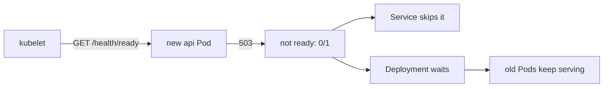

## Bạn cần biết trước

- [[k8s.l1.liveness-probes]] — bạn biết liveness probe hỏng liên tục thì container bị khởi động lại, và probe của api gọi `/health/live`.
- [[k8s.l1.services]] — bạn biết Service chia kết nối cho các Pod mà selector của nó khớp.
- [[k8s.l1.rolling-updates]] — bạn biết rolling update thêm một Pod mới và gỡ một Pod cũ khi Pod mới đã available.

## Tình huống

Bạn sắp apply một phiên bản mới của manifest api, và nó có lỗi: connection string của nó, setting cho api biết PostgreSQL ở đâu, ghi một host database không tồn tại. Ở k8s/workloads, Pod mới được tính là available ngay khi container của nó chạy, và rolling update khi đó gỡ một Pod cũ. Ở đây, điều đó sẽ thay hai Pod api đang chạy tốt bằng hai Pod hỏng mọi request cần database, trong khi Service vẫn gửi traffic tới chúng. Liveness probe không giúp được: `/health/live` vẫn qua, vì process vẫn trả lời. Cái gì giữ cho một Pod đang chạy nhưng không phục vụ được khỏi nhận request, và khỏi thay thế các Pod phục vụ được?

## Khái niệm cốt lõi

- **readiness probe** (Probe quyết định Pod có nhận traffic từ Service hay không; hỏng thì không khởi động lại gì) — probe quyết định một Pod có được nhận traffic hay không: khi nó hỏng, các Service của Pod không gửi kết nối mới nào tới Pod, và không gì bị khởi động lại.
- `READY` — cột của `kubectl get pods` cho biết bao nhiêu container của Pod đã sẵn sàng, như `0/1`.
- available — một Pod của Deployment được tính là available khi nó đã sẵn sàng; rolling update chờ điều đó rồi mới gỡ một Pod cũ.

## Cơ chế hoạt động



Trong tình huống trên, readiness probe trả lời câu hỏi mà liveness probe không hỏi: Pod này lúc này có phục vụ được không? kubelet chạy nó theo lịch, như mọi probe. Khi nó hỏng, container của Pod chưa sẵn sàng, và Pod hiện `0/1` ở cột `READY`. Mọi Service chọn Pod này đều bỏ qua nó, nên không kết nối mới nào tới được nó. Không gì bị giết hay khởi động lại: container vẫn chạy, và khi probe qua trở lại, Pod lại nhận traffic.

Container không có readiness probe được tính là sẵn sàng ngay khi nó chạy. Đó là lý do rolling update ở k8s/workloads đi tiếp trước khi api mới thật sự phục vụ được.

Readiness probe của api gọi `/health/ready`, endpoint kiểm PostgreSQL. Một Pod api không tới được database sẽ trả `503` ở đó, nên nó thôi nhận request, trong khi liveness probe gọi `/health/live` vẫn qua và số lần khởi động lại giữ ở 0.

Rolling update dùng chính tín hiệu đó. Pod mới chỉ được tính là available khi đã sẵn sàng. Với hai replica, các giới hạn mặc định quy ra thêm một Pod và không thiếu Pod nào, như trong bài rolling update: Deployment thêm một Pod mới và chờ nó rồi mới gỡ một Pod cũ. Pod mới không bao giờ sẵn sàng thì cứ bắt nó chờ: cập nhật không bao giờ xong, và cả hai Pod cũ vẫn phục vụ.

## Trong hệ thống Đơn Hàng

Hai probe của container api trong `deploy/k8s/api.yaml`:

```yaml file=deploy/k8s/api.yaml tag=stage-2 lines=39-52
          # lesson: k8s.l1.liveness-probes
          # lesson: k8s.l1.readiness-probes
          # Alive: the process still answers HTTP (/health/live checks nothing
          # else, so a database outage restarts nothing). Ready: it can reach
          # PostgreSQL (/health/ready); until then the Service api sends it
          # no requests.
          livenessProbe:
            httpGet:
              path: /health/live
              port: 8080
          readinessProbe:
            httpGet:
              path: /health/ready
              port: 8080
```

Hai probe trông giống nhau, chỉ khác path và hậu quả khi hỏng. `deploy/k8s/lessons/api-unready.yaml` là cùng Deployment đó với một thay đổi: `ConnectionStrings__Default`, connection string của api, là giá trị ghi thẳng trong manifest thay vì lấy từ một key của Secret, và trỏ tới host `db-missing`. `scripts/k8s/readiness.sh` trước hết bảo đảm `api.yaml` đã được apply, rồi:

```bash file=scripts/k8s/readiness.sh tag=stage-2 lines=15-37
# lesson: k8s.l1.readiness-probes
show kubectl apply -f deploy/k8s/lessons/api-unready.yaml
# Give the new Pod time to start and to fail its readiness probe a few times.
for _ in $(seq 120); do
  [ "$(kubectl get pods -n donhang -l app=api --no-headers | wc -l)" -eq 3 ] && break
  sleep 1
done
sleep 40
# Newest last: running, not ready, never restarted.
show kubectl get pods -n donhang -l app=api --sort-by=.metadata.creationTimestamp
echo
# The Service sends requests only to the two ready Pods.
echo "\$ kubectl describe service api -n donhang | grep Endpoints"
kubectl describe service api -n donhang | grep Endpoints
echo "== GET http://api:8080/api/v1/products, from a temporary Pod in donhang"
# (When the Pod ends before kubectl attaches to it, kubectl warns and reads
# its log instead: the same output, so the warning is dropped.)
kubectl run readiness-test --rm -i --restart=Never --quiet -n donhang --image=caddy:2.10.0 -- \
  sh -c 'wget -q -O /dev/null http://api:8080/api/v1/products && echo "answered 2xx"' 2>&1 | sed "/^warning: couldn't attach/d"
echo
# A Pod counts as available only once it is ready: the update never finishes.
show kubectl rollout status deployment/api -n donhang --timeout=10s || true
echo
```

`show` in lệnh ra trước khi chạy. Script chờ tới khi có Pod api thứ ba, rồi thêm 40 giây. `Endpoints` trong `kubectl describe service` liệt kê các địa chỉ Pod mà Service gửi kết nối tới. Pod tạm gọi api qua Service và chỉ in `answered 2xx` khi câu trả lời thành công. Sau các dòng được trích, script apply lại `api.yaml`. Output:

```text output=true
$ kubectl apply -f deploy/k8s/lessons/api-unready.yaml
deployment.apps/api configured
$ kubectl get pods -n donhang -l app=api --sort-by=.metadata.creationTimestamp
NAME          READY   STATUS    RESTARTS   AGE
api-...-...   1/1     Running   0          ...
api-...-...   1/1     Running   0          ...
api-...-...   0/1     Running   0          ...

$ kubectl describe service api -n donhang | grep Endpoints
Endpoints:   ...:8080,...:8080
== GET http://api:8080/api/v1/products, from a temporary Pod in donhang
answered 2xx

$ kubectl rollout status deployment/api -n donhang --timeout=10s
Waiting for deployment "api" rollout to finish: 1 out of 2 new replicas have been updated...
error: timed out waiting for the condition

$ kubectl apply -f deploy/k8s/api.yaml
deployment.apps/api configured
service/api unchanged
```

Pod mới nhất đang `Running` với `0/1` sẵn sàng và `0` lần khởi động lại. Service liệt kê hai địa chỉ, của hai Pod cũ, và request qua nó vẫn thành công. `rollout status` bỏ cuộc sau 10 giây với một trên hai replica mới: cập nhật bị kẹt, chứ không hỏng. Apply lại `api.yaml` đưa Deployment về đúng template mà hai Pod sẵn sàng đang chạy, và Pod chưa sẵn sàng bị gỡ.

## Người mới hay nghĩ rằng…

- **"Readiness probe hỏng thì khởi động lại container, giống liveness probe."** → Thực ra nó chỉ giữ Pod ở ngoài các Service; container vẫn chạy. Bạn sẽ nhận ra khi Pod api chưa sẵn sàng vẫn hiện `0` ở cột `RESTARTS` dù probe đã hỏng từ lâu.
- **"Pod có container đang chạy là đã sẵn sàng nhận request."** → Thực ra `Running` và sẵn sàng là hai chuyện khác nhau: một Pod có thể đang chạy mà hiện `0/1`. Bạn sẽ nhận ra khi Pod api mới đang `Running` trong lúc Service chỉ liệt kê hai Pod cũ.
- **"Liveness và readiness probe nên gọi cùng một endpoint."** → Thực ra chúng trả lời hai câu hỏi khác nhau; nếu cả hai gọi `/health/ready`, một sự cố database sẽ khởi động lại mọi container api thay vì chỉ chặn traffic. Bạn sẽ nhận ra trong `api.yaml`, nơi hai probe gọi `/health/live` và `/health/ready`.

## Thử ngay (3 phút)

Với backend đang chạy trong `donhang`:

1. Chạy `kubectl get pods -n donhang -l app=api -o wide`.
2. Chạy `kubectl describe service api -n donhang | grep Endpoints`.

Kết quả mong đợi: bước 1 hiện hai Pod api với `1/1` ở cột `READY`, mỗi Pod có địa chỉ ở cột `IP`. Bước 2 liệt kê đúng hai địa chỉ đó, mỗi cái kèm port `8080`: Service chỉ gửi kết nối tới Pod đã sẵn sàng.

## Liên hệ

- [[k8s.l1.liveness-probes]] — probe còn lại: nó khởi động lại container; probe này chỉ chặn traffic.
- [[k8s.l1.rolling-updates]] — khoảng trống để lại ở bài đó, Pod mới được tính available trước khi phục vụ được, được lấp ở đây.
- [[k8s.l1.rollbacks]] — một lần cập nhật kẹt như thế này là thứ `kubectl rollout undo` giúp bạn thoát ra.
- [[k8s.l1.requests-and-limits]] — bài tiếp: lượng CPU và bộ nhớ mỗi Pod api giữ chỗ và được phép dùng.

## Tóm tắt 5 dòng

1. Readiness probe quyết định Pod có nhận traffic không; hỏng thì Pod bị rút khỏi các Service và không gì bị khởi động lại.
2. Container không có readiness probe được tính là sẵn sàng ngay khi nó chạy.
3. Readiness probe của api gọi `/health/ready`, nên api không tới được PostgreSQL thì không nhận request.
4. Pod mới của `api-unready.yaml` vẫn chạy ở `0/1`, không khởi động lại, và Service chỉ liệt kê các Pod cũ.
5. Rolling update chờ Pod mới sẵn sàng, nên lần cập nhật hỏng không bao giờ xong và các Pod cũ vẫn phục vụ.
